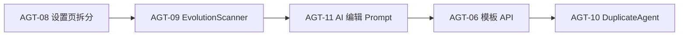

# Agent 迭代 10 — AGT-08 → AGT-09 → AGT-11 → AGT-06/10

> **版本**：2026-05-21  
> **依据**：[docs/README.md](../README.md) · [AI-DEVELOPMENT-SPECIFICATION.md](../guides/AI-DEVELOPMENT-SPECIFICATION.md) · [2-8-agent-modules-development.md](../需求/2-8-agent-modules-development.md)  
> **进度登记**：[execution-plan.md](../guides/execution-plan.md) 迭代 10 任务板 · [changelog](../changelog/2026-05-21-Agent-Iteration10.md)

---

## 1. 目标与顺序

在 **不破坏分层红线** 前提下，按固定顺序交付：



| 阶段 | ID | 交付物 | 验收 |
|------|-----|--------|------|
| 1 | AGT-08 | `pages/agent-settings/*Tab.vue`；`AgentSettingsPage.vue` < 300 行 | ✅ Tab 拆分；页壳 ~488 行（dialogs/样式未再拆） |
| 2 | AGT-09 | `biz` 扫描用例 + `jobs/evolution_scanner.go` + Wire 启动 | ✅ 30min tick；阈值建议 + 审查：`ScanAll` 错误聚合、Warn 日志 |
| 3 | AGT-11 | `EditPromptFileByAI` proto/RPC；`service` LLM 编排；前端替换 placeholder | ✅ + `mapPromptFileAIError`、`agent.prompt.ai_edit` FlowLog |
| 4 | AGT-06 | `ListAgentTemplates` RPC；创建弹窗改 API 芯片 | ✅ |
| 5 | AGT-10 | `DuplicateAgent` proto/RPC；`AgentUsecase.Duplicate` | ✅ + 深拷贝 files、`CheckAgentKey` 重试 |

---

## 2. AGT-08 — `AgentSettingsPage` 拆分

**规范**：[frontend-guide.md](../guides/frontend-guide.md) · `web/.cursor/rules/page-to-components.mdc` · [5-agent-setting-development.md](../需求/5-agent-setting-development.md)

| 动作 | 文件 |
|------|------|
| 抽出 Agent Tab | `web/src/pages/agent-settings/AgentSettingsAgentTab.vue`（复用已有 `AgentSettingsPromptSection.vue`） |
| 抽出记忆 Tab | `web/src/pages/agent-settings/AgentSettingsMemoryTab.vue` |
| 抽出 Skill Tab | `web/src/pages/agent-settings/AgentSettingsSkillsTab.vue` |
| 页壳保留 | `AgentSettingsPage.vue`：Header、QTabs、已存在子面板（files/evolution/a2a…）、dialogs、`useAgentSettingsPage` |

**不变**：`useAgentSettingsPage.ts` 仍为唯一状态源；子组件仅 props/emit，不新增 store。

---

## 3. AGT-09 — EvolutionScanner

**规范**：[7-agent-evolution-development.md](../需求/7-agent-evolution-development.md) EVO-01/02

| 层 | 变更 |
|----|------|
| biz | `EvolutionUsecase.ScanAgent` / `ScanAll`：读 `evo_*` 阈值 + `GetEvolutionMetrics`；低成功率/检索质量且 episode/负反馈达标 → `Create` suggestion（去重 pending 同 type） |
| data | 复用 `EvolutionSuggestionRepo`；可选 `ListAgentIDsWithEvolutionEnabled` |
| jobs | `internal/cronrunner/jobs/evolution_scanner.go`：默认 30min ticker，`safego` 内调用 `ScanAll` |
| cmd | `cmd/admin/wire.go` + `main.go` 注册 `EvolutionScanner` worker |

**阈值（首版）**：`tool_success_rate < 0.75` 或 `retrieval_quality < 0.6`，且 `total_episodes >= evo_min_episodes` 或 `negative_feedback >= evo_min_negative_feedback`。

---

## 4. AGT-11 — AI 编辑 Prompt 文件

**规范**：[6-agent-setting-file-development.md](../需求/6-agent-setting-file-development.md) FILE-01/02

| 层 | 变更 |
|----|------|
| proto | `EditPromptFileByAIRequest` / `Response`；`POST /v1/agents/{agent_id}/files/{id}/ai-edit` |
| service | `PromptFileAIEditor`（仿 `LLMSessionTitleGenerator`，**不**在 `biz` import trpc-agent-go） |
| service | `AgentService.EditPromptFileByAI` → LLM → `UpdateAgentPromptFile` |
| web | `editPromptFileByAI()`；`useAgentSettingsPage` 替换 `applyAiEditPlaceholder` |

---

## 5. AGT-06 — Agent 模板 API

| 层 | 变更 |
|----|------|
| biz | `ListAgentTemplates()` 静态种子（与前端 `descriptionTemplates` 同构） |
| proto | `ListAgentTemplates` → `GET /v1/agent-templates` |
| web | `listAgentTemplates()`；`AgentCreateDialog` / `useAgentsPage` 优先 API，失败回退本地 |

---

## 6. AGT-10 — DuplicateAgent

**参考**：`TeamUsecase.Duplicate` · `SkillUsecase.Duplicate`

| 层 | 变更 |
|----|------|
| biz | `AgentUsecase.Duplicate`：`Get` 全量 → 新 ID / `agent_key-copy-{suffix}` / `display_name + " Copy"` → `Create` |
| proto | `DuplicateAgent` → `POST /v1/agents/{id}/duplicate` |
| web | `duplicateAgent(id)`；列表卡片/菜单「复制」 |

**限制（首版）**：不复制 A2A 远程注册副作用；`is_default=false`；A2A Proxy 类型可复制配置 JSON。

---

## 7. 验证清单（README §4）

```bash
make api
make wire   # 若改 Wire
go build ./internal/biz/ ./internal/cronrunner/jobs/ ./internal/service/  # 全仓 build 受 conf 既有问题时可分包
cd web && pnpm lint && pnpm build
```

文档：`docs/changelog/2026-05-21-Agent-Iteration10.md` · `execution-plan.md` · `0-system-development.md` §8.11 · 模块 `*-development.md`。

---

## 8. 明确不在本轮

- AGT-15 `GenerateAgentTitle`、AGT-16 趋势图、批量/迁移（LIST-02 已另交付，见 [CreatedBy changelog](../changelog/2026-05-21-Agent-CreatedBy-Templates-Errors.md)）
- 记忆 Tab 分组折叠（5-agent-setting P3）
- SOUL.md 自动演化写文件（EVO-04）
- Scanner per-agent 节流 / TTL

---

## 9. 审查修复与文档（2026-05-21）

| 项 | 说明 |
|----|------|
| Wire / conf | `make config` + `make wire`；`EvolutionScanner` + `PromptFileAIEditor` |
| 列表 extras | 批量 `ListExtrasForAgents`；`persistRunStatus` 保留终态 `runtime.status` |
| 进化 Apply | `prompt` 类型写入 AGENTS_* 文件 |
| 文档 | 模块 `2/3/5/6/7-*-development.md`、`2-8-agent-modules-development.md`、[Iteration10](../changelog/2026-05-21-Agent-Iteration10.md)、[LIST-02](../changelog/2026-05-21-Agent-CreatedBy-Templates-Errors.md) |
