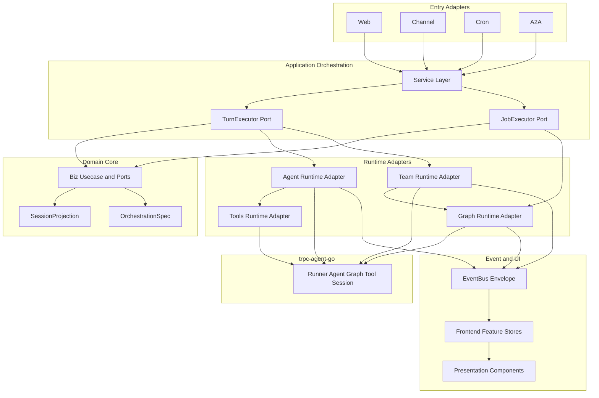

# 模块解耦架构指导

> **定位**：面向后续 AI 编码代理与架构治理的跨模块解耦指南。  
> **适用范围**：Chat、Channel、Agent、Team、Graph，以及它们在前后端中的共享运行时、事件、状态与 UI 编排。  
> **前置阅读**：任何代码改动前先读 [`docs/README.md`](../README.md)，后端读 [`AI-DEVELOPMENT-SPECIFICATION.md`](./AI-DEVELOPMENT-SPECIFICATION.md)，前端读 [`frontend-guide.md`](./frontend-guide.md)。

---

## 1. 本文目标

本项目已经形成可运行主链路，但 Chat / Channel / Agent / Team / Graph 在持续扩展后会自然产生聚合点。本文的目标不是要求一次性重构，而是给后续 AI 做功能开发和模块优化时提供稳定判断：

1. 新能力应该落在哪个模块。
2. 模块之间应该通过什么端口交互。
3. 哪些依赖方向不能继续扩大。
4. 旧路径如何分阶段迁移，不破坏现有业务。

本文优先约束**新增代码**。存量代码迁移应小步执行，每次只拆一个边界或一个入口路径。

---

## 2. 架构红线

### 2.1 后端红线

| 红线 | 说明 |
|------|------|
| `internal/server` 只做传输注册 | 不直接调用 Runner、Agent、LLM、Graph runtime；不写业务路由状态机 |
| `internal/service` 是运行时桥点 | 可装配 Agent / Team / Graph runtime，但不得无限承载业务规则 |
| `internal/biz` 不 import `pkg/trpc-agent-go` | biz 只放领域模型、Usecase、Repo 接口和运行时端口 |
| `internal/biz` 不 import `api/*/v1` | proto 只在 service/server 边界转换 |
| `internal/data` 只实现 Repo / Store | 不新增运行时装配逻辑，不绕过 `NewData` 另开 SQLite |
| `internal/channel/*` 不感知 Chat 私有实现 | Channel 通过端口请求 Turn / Job，不持有完整 ChatService 能力 |
| `internal/team` 不新增 chat proto 依赖 | Team runtime 接收 biz 级 `TurnInput`，proto 映射在 service |
| Graph 运行时类型不泄漏到 biz | biz 暴露 `GraphBuildConfig` / `GraphRuntime` 等端口，trpc graph 留在 adapter/trpc |

### 2.2 前端红线

| 红线 | 说明 |
|------|------|
| 展示组件不 import Store / API | `components/**` 只接收 props、发 emits |
| Page 不直接 import `features/*/api` | Page 通过 Store 或域内 composable 间接触发 action |
| 网络请求只写在 `features/<域>/api.ts` | Store action 调 API，Composable 默认只组合 Store |
| Chat 不再扩大 `useAppStore` | 新 Chat 状态进入 session/chat runtime 等专用 Store |
| Envelope / WS 不绑死 Chat feature | 共享实时协议应作为 runtime/transport 模块供 Chat、Team、Graph、Monitor 使用 |
| 跨域路由跳转不上沉到展示组件 | 组件 emit 意图，Page 或 composable 决定跳转 |

---

## 3. 目标依赖方向



核心原则：

- 入口层只表达“来自哪里”和“要做什么”，不关心 Agent / Team / Graph 如何执行。
- 应用编排层统一接 Turn / Job 请求，选择运行时并投影事件。
- 领域层定义业务真相源和端口，不持有框架类型。
- 运行时适配层负责把 biz 配置翻译为 `trpc-agent-go` 对象。
- 前端只消费 API / Envelope / Store，不把后端运行时细节写进组件。

---

## 4. 模块职责边界

### 4.1 Chat

**职责**

- 管理用户 Turn 生命周期：admission、pending queue、cancel、await reply、usage、assistant message。
- 维护 Session / Messages 的真相源和增量同步游标。
- 将 Agent / Team / Graph runtime 事件投影为 Chat UI 可消费的 Envelope。

**不应承担**

- 不解析 Channel 平台协议、消息卡片、机器人凭据。
- 不直接内置 Graph 长任务 Job 监听策略。
- 不继续把 Agent、Team、Session、Message、Channel Job 全部塞进一个前端全局 Store。

**目标端口**

| 端口 | 用途 |
|------|------|
| `TurnExecutor` | Web / WS / Channel / Cron 共用的同步 turn 执行入口 |
| `TurnGateway` | cancel、status、enqueue、await reply 等运行控制 |
| `SessionProjection` | 消息、revision、activity、artifact 的会话投影 |

### 4.2 Channel

**职责**

- 接入飞书、企业微信、钉钉、Telegram、Slack 等平台协议。
- 标准化入站事件为 `port.InboundEvent`。
- 完成访问控制、路由、幂等、ACK、出站投递。
- 按配置选择 Turn 平面或 Job 平面。

**不应承担**

- 不持有 `*ChatService` 的完整具体类型。
- 不构造 proto chat request 作为内部业务对象。
- 不把异步 Graph / Cron completion watch 散落在平台适配器中。

**目标端口**

| 端口 | 用途 |
|------|------|
| `NativeTurnGateway` | Channel 同步 Turn 只依赖窄接口 |
| `ChannelJobGateway` | Channel async 只依赖 Job 创建、查询、取消、完成通知 |
| `OutboundDeliveryPort` | 平台无关的投递队列和状态记录 |

### 4.3 Agent

**职责**

- 定义单 Agent 的配置、模型、工具、Skill、Memory、Planner、Plugin 输入。
- 在 `internal/agent` 将 biz Agent 转成 `trpc-agent-go` LLMAgent / Runner。

**不应承担**

- 不感知 Channel、Cron、A2A 入口细节。
- 不反向依赖 Team 或 Graph 产品视图。
- 不让前端 Agent 页面复用 Chat 全局状态。

**目标端口**

| 端口 | 用途 |
|------|------|
| `AgentRuntimeBuilder` | 构建单 Agent runtime |
| `ToolsetAssembler` | 统一工具挂载与覆盖策略 |
| `ModelResolver` | 将 biz provider/model 配置解析为 runtime model |

### 4.4 Team

**职责**

- 以 `OrchestrationSpec` 作为唯一团队编排真相源。
- 将 Team Definition 编译为 `GraphBuildConfig`。
- 维护 TeamRun、成员步骤、summary、activity timeline。

**不应承担**

- 不接收 proto chat request。
- 不复制单 Agent turn 的整套生命周期代码。
- Native Team runtime 不作为长期主路径；仅保留应急开关。

**目标端口**

| 端口 | 用途 |
|------|------|
| `TeamCompiler` | `OrchestrationSpec` 到 `GraphBuildConfig` |
| `TeamTurnRuntime` | Team turn 执行端口，内部优先 GraphAgent |
| `TeamRunObserver` | TeamRun / steps / activity timeline 投影 |

### 4.5 Graph

**职责**

- 作为确定性工作流执行引擎，支持 DAG/BSP、checkpoint、HITL、retry、cache、router、agent/tool 节点。
- 通过 `biz.GraphRuntime` 暴露 Run / Resume / Cancel / TimeTravel。
- 通过 adapter 将 `GraphBuildConfig` 转为 `trpc-agent-go` GraphAgent。

**不应承担**

- 不直接感知 Channel 平台。
- 不将 trpc graph 类型传入 biz。
- 不让前端 Graph 页面直接理解 Team 内部临时字段；Team->Graph 转换集中在 orchestration bridge。

**目标端口**

| 端口 | 用途 |
|------|------|
| `GraphBuilderFactory` | biz config 到 GraphRuntime |
| `GraphExecutionObserver` | execution 状态、事件、trace 投影 |
| `GraphNodeResolverSet` | Agent / Tool / Model / Function / Subgraph resolver 分离注入 |

---

## 5. 当前耦合点与治理方向

| 耦合点 | 风险 | 治理方向 |
|--------|------|----------|
| `internal/service/chat.go` 依赖聚合过宽 | ChatService 变成入口总线，改动半径大 | 按 `TurnGateway`、`SessionProjection`、`JobGateway` 拆窄接口 |
| `ChannelIngress` 直接调用 Chat 私有 turn | Channel 与 Chat 执行细节绑定 | Channel 只依赖 biz DTO + `NativeTurnGateway` |
| Agent turn 与 Team turn 生命周期重复 | timeout、trace、usage、pending 行为漂移 | 抽 `TurnExecutor` 共享生命周期，Agent/Team 只提供 build hook |
| `internal/team` import chat proto | transport 合同进入 runtime 层 | service 做 proto -> biz `TurnInput` 映射 |
| `internal/team/runner_team_trpc.go` 同时编译、执行、观测 | 文件持续膨胀，Graph 单链迁移困难 | 拆 `compiler`、`runtime`、`observer`、`fallback_policy` |
| `graph/adapter` resolver 汇聚 Agent/Tool/Provider | 每新增节点都扩大依赖集合 | Resolver ports 独立注入，adapter 只组装 |
| 前端 `useAppStore` 是 Chat 真相源 | Chat、Agent、Session 类型和状态混杂 | 迁移到 `session` store + `chatRuntime` store |
| 前端 Chat composable 直调 API | Page/composable 承担业务过程 | API 调用进入 Store action，composable 只组合状态和事件 |
| Envelope / WS 位于 Chat feature | Team/Graph/Monitor 复用时形成反向依赖 | 抽 shared realtime runtime，Chat 只是消费者 |

---

## 6. 后端解耦路线

### Phase B1：端口先行

目标：新增代码先用端口，不扩大具体类型依赖。

- 在 `internal/runtime` 或 `internal/turn` 定义 `TurnInput`、`TurnOptions`、`TurnOutcome`、`TurnExecutor`。
- 为 Channel 定义窄接口：`RunNativeTurn(ctx, input) (TurnOutcome, error)`。
- 为 Job 定义窄接口：`StartJob`、`GetJob`、`CancelJob`、`NotifyJobDone`。
- 将跨层 timeout、turn/job 判定、first byte timeout 等策略集中为 policy 类型。

验收：

- Channel 新增入口不直接调用 `ChatService` 私有方法。
- Team 新增执行入口不接收 proto request。
- `make runtime-boundary` 应通过。

### Phase B2：Turn 生命周期收敛

目标：Agent 与 Team 共享 turn 生命周期。

- 把 admission、session lock、pending queue、run registry、trace、usage、await hook 注入抽入 `TurnExecutor`。
- Agent runtime 和 Team runtime 只实现 `BuildRunner` / `PersistTurnRecord` / `ProjectRuntimeEvent` hook。
- Channel、Web、WS、Cron 统一进入 `TurnExecutor`。

验收：

- Agent turn 和 Team turn 的 cancel/status/enqueue 行为一致。
- 一条 trace 可以串起入口、turn、runtime、tool、message persistence。
- 原有 Chat / Team 单测保留，并新增共享 executor 测试。

### Phase B3：Team -> Graph 单链

目标：Team 默认编译到 GraphAgent。

- `OrchestrationSpec` v2 成为 Team Definition 的稳定格式。
- `TeamCompiler` 只产出 `GraphBuildConfig`。
- Native Team runtime 仅保留 `ARANEA_TEAM_NATIVE=1` 应急开关。
- TeamRun observer 只消费 GraphAgent 和 Team runtime 的统一事件。

验收：

- Team Chat、Team RunTest、Channel async team、Cron team 走同一 GraphAgent 执行链。
- Native fallback 使用有明确日志、metrics 和开关。

### Phase B4：Graph resolver 拆分

目标：Graph adapter 不再是所有运行时依赖的汇聚文件。

- 将 AgentResolver、ToolResolver、ModelResolver、FunctionResolver、SubgraphResolver 分离。
- Wire 中按 resolver 组装 `GraphNodeResolverSet`。
- `graph/trpc` 只依赖 resolver 接口，不直接知道业务 Usecase 细节。

验收：

- 新增一种 Graph 节点只新增对应 resolver 和 node wiring。
- 不需要同时修改 Agent、Provider、Tools 多个无关模块。

---

## 7. 前端解耦路线

### Phase F1：Chat 状态拆分

目标：逐步退出 `useAppStore` 的 Chat 真相源职责。

- `stores/session` 管理 sessions、messages、revision。
- 新建或扩展 `stores/chat-runtime` 管理 run status、pending queue、await reply、WS replay、jobs refresh。
- `features/chat/composables/useChatWorkspace.ts` 只组合 Store 和路由，不再直接持有跨域业务状态。

验收：

- Chat 消息加载、增量同步、发送、停止、pending 操作均由 Store action 发起。
- `useAppStore` 不再新增 Chat 字段。

### Phase F2：Realtime runtime 抽离

目标：Envelope / WS 成为共享基础设施。

- 将 `globalWsHub`、`useEnvelopeStream`、Envelope parser 中的跨域部分移到共享 runtime 目录。
- Chat、Team、Graph、Monitor 通过显式订阅配置使用它。
- Team API 不再从 Chat feature import WS 工具。

验收：

- `features/teams`、`features/graph` 不 import `features/chat/useEnvelopeStream`。
- Envelope 类型、run status、team event mapper 分别放在对应 domain 或 shared realtime。

### Phase F3：Composable -> Store action

目标：Composable 从业务执行者变成页面编排层。

- `useChatSender`、`useAwaitReply`、`useChatRunStatus`、`useFollowUpQueue` 等 API 调用迁入 Store action。
- Composable 暴露 `storeToRefs` 和事件处理函数。
- 展示组件中涉及跳转的动作改为 emit，由 Page / composable 执行 router push。

验收：

- `components/**` 无 Store/API import。
- Page 不直接 import `features/*/api`。
- Composable 直调 API 必须带 `TECH-DEBT` 注释和迁移任务 ID。

### Phase F4：类型边界收敛

目标：消除 `components/chat/types.ts` 作为跨域类型桶。

- Chat 视图模型放 `features/chat/types.ts` 或 `features/chat/viewModels.ts`。
- Session、Agent、Team、Graph 类型从各自 feature 导出。
- 组件只 type-only import 所需展示类型。

验收：

- 展示组件不作为业务类型 barrel。
- 跨域类型只通过 feature public types 或 shared view model 暴露。

---

## 8. AI 改代码前决策树

```text
我要改的是入口协议吗？
  是 -> internal/server 或 internal/service 的入口适配；不得调用 runtime 私有实现
  否 -> 继续

我要改的是业务规则 / 数据真相源吗？
  是 -> internal/biz + Repo 接口；不得 import proto / trpc-agent-go
  否 -> 继续

我要改的是 Agent / Team / Graph 执行吗？
  Agent -> internal/agent 或 TurnExecutor hook
  Team -> internal/team compiler/runtime/observer；输入用 biz DTO
  Graph -> internal/graph/adapter 或 graph/trpc；biz 只见端口
  否 -> 继续

我要改的是 Channel 平台行为吗？
  是 -> internal/channel/port + service ingress；通过 Turn/Job 端口执行
  否 -> 继续

我要改的是前端 UI 吗？
  请求/状态 -> feature api + store action
  页面编排 -> composable
  展示 -> components props/emits
```

---

## 9. 禁止新增耦合清单

后续 PR 中出现以下情况应立即停止并重设方案：

- `internal/biz` 新增 `trpc-agent-go`、`api/*/v1`、`internal/tools/*` 运行时依赖。
- `internal/server` 新增 `internal/agent`、`internal/team`、`internal/graph/trpc` 依赖。
- `internal/channel` 平台适配器直接调用 Chat / Graph concrete service。
- `internal/team` 新增 chat proto request / response 依赖。
- `internal/service.ChatServiceDeps` 继续新增非 Chat turn 必需依赖。
- `graph/adapter` 新增无关业务 Usecase 只是为了某个节点查数据。
- `web/src/components/**` 新增 Store、API、router 业务跳转。
- `web/src/pages/**` 新增直接 `features/*/api` 调用。
- `features/chat` 继续作为 Team / Graph / Monitor 的共享实时依赖入口。

---

## 10. 迁移任务模板

每个解耦 PR 应在描述或任务文档中包含：

```markdown
## 目标边界
- 从：<当前具体依赖>
- 到：<目标端口 / Store / Composable>

## 改动范围
- 后端：
- 前端：
- 文档：

## 旧路径策略
- 保留多久：
- 如何降级：
- 删除条件：

## 验收
- 单测：
- 集成 / 手测：
- 边界脚本：

## 回滚
- 回滚开关：
- 数据兼容：
- 风险：
```

---

## 11. 验收清单

### 11.1 后端

- [ ] `make runtime-boundary`
- [ ] 涉及 Wire 时：`make wire && make wire-clean`
- [ ] 涉及 Proto 时：`make api`
- [ ] 涉及 Agent / Team / Graph turn 时：相关单测覆盖 cancel、timeout、error、usage、event 投影
- [ ] 涉及 Channel 时：同步 Turn、异步 Job、ACK、幂等、出站投递路径可回归
- [ ] 涉及 Graph 时：Run / Resume / Cancel / Checkpoint / EventBridge 至少覆盖核心路径

### 11.2 前端

- [ ] `cd web && pnpm lint`
- [ ] 涉及 Store / Composable 时补或更新 focused test
- [ ] `/chat` 验证 Agent 和 Team 会话切换、发送、停止、pending、revision 同步
- [ ] `/teams` 验证 Team 编辑、运行观测、Graph 编排入口
- [ ] `/graphs` 验证编辑、执行、节点状态、HITL / task 面板
- [ ] 展示组件无 Store/API import，Dialog 只 emit submit

### 11.3 文档

- [ ] 更新 `docs/README.md` 索引。
- [ ] 若改变模块边界，更新对应 `docs/需求/*-development.md` 或 review 文档。
- [ ] Mermaid 图使用无空格节点 ID，不写显式颜色。

---

## 12. 参考锚点

| 主题 | 文档 |
|------|------|
| 项目文档入口 | [`docs/README.md`](../README.md) |
| 后端唯一行为准则 | [`AI-DEVELOPMENT-SPECIFICATION.md`](./AI-DEVELOPMENT-SPECIFICATION.md) |
| 前端唯一行为准则 | [`frontend-guide.md`](./frontend-guide.md) |
| Kratos 分层 | [`kratos-framework-guide.md`](./kratos-framework-guide.md) |
| trpc-agent-go 映射 | [`trpc-agent-go-framework.md`](./trpc-agent-go-framework.md) |
| Chat × Channel 蓝图 | [`m55-chat-channel-enterprise-blueprint.md`](./m55-chat-channel-enterprise-blueprint.md) |
| Team × Graph 蓝图 | [`m53-graph-team-multiagent-enterprise-blueprint.md`](./m53-graph-team-multiagent-enterprise-blueprint.md) |
| 系统架构总览 | [`../需求/0 系统框图.md`](../需求/0%20系统框图.md) |
| Review 总览 | [`../review/README.md`](../review/README.md) |

