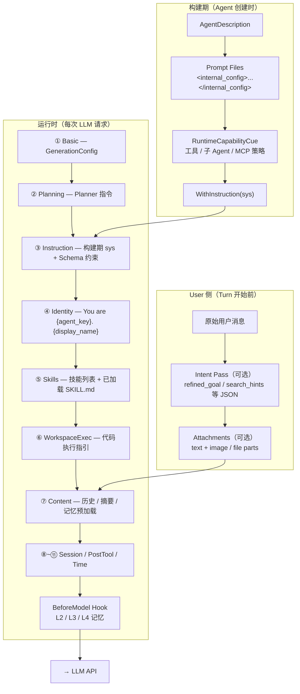
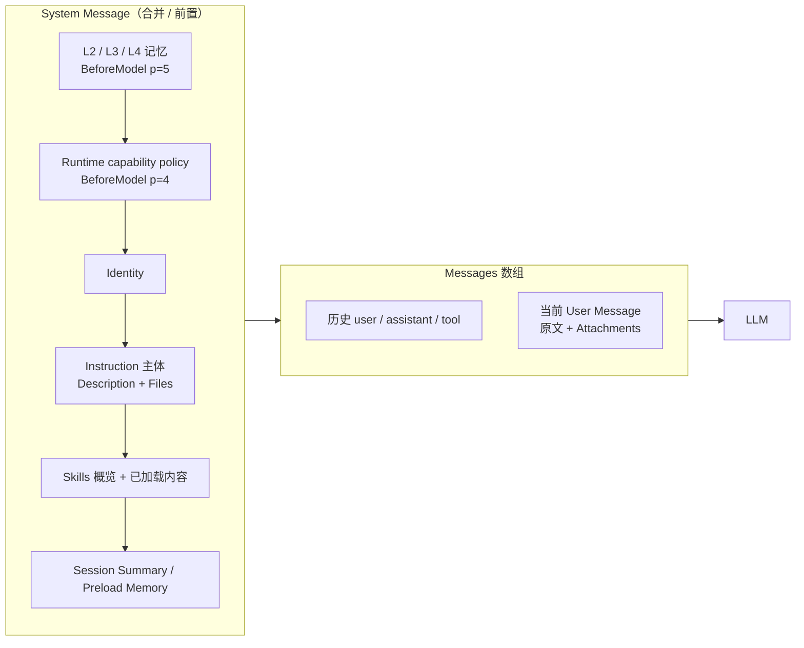

# Prompt 组装全流程

> **权威代码入口**：`internal/agent/trpc_build.go`（构建期）、`pkg/trpc-agent-go/agent/llmagent/llm_agent.go`（运行时 Processor 链）、`internal/agent/memory_inject.go`（L2/L3 BeforeModel）。

Aranea 的 Prompt 拼接分 **两层**：

- **构建期（Agent 创建）**：把相对静态的 System Instruction 拼好，挂到 `LLMAgent.WithInstruction`。
- **运行时（每次 LLM 调用）**：框架 Processor 链 + 产品 Callback，按请求动态追加 Identity、Skills、历史、记忆等。

---

## 总览图



---

## 一、构建期 System Instruction 拼接

**入口**：`BuildTRPCLLMAgent` → `internal/agent/trpc_build.go`

```go
sys := BuildSystemPrompt(ag, files, ag.SystemPromptMode)
trpcllmagent.WithInstruction(sys)
// RuntimeCapabilityCue：每轮 BeforeModel p=4 注入，见 runtime_cue_inject.go
```

### 1.1 BuildSystemPrompt

**源码**：`internal/agent/prompt.go`

| 顺序 | 内容 | 来源 |
|------|------|------|
| 1 | `AgentDescription` | Agent 表字段 |
| 2 | Prompt 文件正文 | `agent_prompt_file`，按 `SystemPromptMode` 过滤 |
| — | 每个文件包裹为 | `<internal_config name="文件名">\n...\n</internal_config>` |

**Prompt 文件过滤**（`internal/biz/agent_settings_helpers.go` → `FilesForMode`）：

| `SystemPromptMode` | 包含的文件 |
|--------------------|-----------|
| `complete` 或空 | 全部 prompt 文件 |
| `none` | 无文件，仅 Description |
| `minimized` | `AGENTS_CORE.md`、`RULE.md` |
| `task` | `AGENTS_CORE.md`、`IDENTITY.md`、`RULE.md`、`AGENTS_TASK.md`、`CAPABILITIES.md`、`HEARTBEAT.md` |

常见文件名与用途见 [6 agent-setting-file.md](../../需求/6%20agent-setting-file.md)。

### 1.2 RuntimeCapabilityCue

**源码**：`internal/agent/prompt.go`；**注入**：`internal/agent/runtime_cue_inject.go`（BeforeModel priority **4**）

每轮 LLM 调用前 prepend **Runtime capability policy** System Message；**有效工具列表实时解析**（`GetEffectiveTools`），不写入 BuildCache。

冗长度随 `system_prompt_mode` 递减（complete → task → minimized → none）。存在 **`CAPABILITIES.md`** 时省略工具 key 枚举与 MCP 长说明。

内容包括（按模式裁剪）：

- 工作区根目录、`exec_command` / `list_files` / `search_content` 使用纪律（complete / task 为主）
- 子 Agent 开关与并发/深度限制（`transfer_to_agent` / `spawn_subagent`）
- 有效工具列表（`GetEffectiveTools`）、工具名映射（standard 及以上）
- 记忆工具 / MCP 说明（standard 及以上）
- 工具 deny list、工具名 prefix strip

### 1.3 L4MemoryCue

**源码**：`internal/agent/l4_prompt.go`

当 Agent 设置 **`L4Enabled` + `L0InjectL4`** 时，在 **运行时 BeforeModel**（与 L2/L3 同一 Hook）注入：

- `## L4 knowledge graph (session memory)` 标题
- 按当前 user 关键词召回实体（`ListEntityRows` keyword），最多 8 条
- 可选：`L4GraphInjectNeighbors` 时追加 Neighborhood JSON

> L4 **不再**在构建期写入 Instruction，避免 Agent BuildCache 导致图谱陈旧。

---

## 二、运行时每次 LLM 调用的拼接流水线

**Processor 注册顺序**：`pkg/trpc-agent-go/agent/llmagent/llm_agent.go` → `buildRequestProcessorsWithAgent`

### 2.1 Processor 顺序与职责

| 序号 | Processor | 注入内容 | 写入位置 |
|------|-----------|----------|----------|
| 1 | Basic | `GenerationConfig`（stream 等） | Request 元数据 |
| 2 | Planning | Planner 规划指令（若配置 Planner） | Request / thinking |
| 3 | **Instruction** | 构建期 `sys` + 占位符渲染 + JSON Schema 约束 | System Message |
| 4 | **Identity** | `You are {agent_key}. {DisplayName}`（若已有 `IDENTITY.md` 则省略 DisplayName） | System 前置 |
| 5 | **Skills** | 可用技能概览、已加载 SKILL.md、目录提示 | System 追加 |
| 6 | WorkspaceExec | 工作区 / 代码执行能力说明 | System 追加 |
| 7 | **Content** | 注入上下文、Few-shot、Session Summary、Preload Memory、历史、当前 User | Messages 数组 |
| 8 | OnDemandSession | session_search / session_load 概览 | System / User |
| 9 | PostTool | 工具结果后的动态 prompt | System / User |
| 10 | SkillsToolResult | 技能内容 materialize 到 tool result | Tool Message |
| 11 | Time | 当前时间（放最后以利于 prompt cache） | System 追加 |

### 2.2 Instruction Processor 细节

**源码**：`pkg/trpc-agent-go/internal/flow/processor/instruction.go`

解析优先级（`instructionForInvocation`）：

1. Root surface patch（插件/守卫改写）
2. `RunOptions.Instruction`（单次 Turn 覆盖）
3. `ModelInstructionsJSON` 中按**当前模型名**的条目
4. 构建期 `WithInstruction(sys)` 静态值

额外追加：

- `{{state.xxx}}` 占位符 → `promptstate.Render`
- `OutputSchemaJSON` / StructuredOutput → JSON 输出格式约束段落

`SystemPrompt` 与 `Instruction` 在 Aranea 中通常合并：产品层把主要内容放在 `Instruction`，`GlobalInstruction` / `systemPrompt` 多为空或插件覆盖。

### 2.3 Identity Processor

**源码**：`pkg/trpc-agent-go/internal/flow/processor/identity.go`

```text
You are {AgentKey}. {DisplayName}
```

拼到已有 System Message **最前面**（若无 System Message 则新建）。

### 2.4 Skills Processor

**源码**：`pkg/trpc-agent-go/internal/flow/processor/skills.go`

Aranea 在 `trpc_build.go` 中启用：

- `WithSkills(repo)` + `WithSkillFilter`（Layer A/B 可见性）
- **`complete` 模式**：默认 `SkillToolProfileFull`；`tools_profile` 为 `spirit` / `chat_only` 时强制 `SkillToolProfileKnowledgeOnly` 且 `WithAllowedSkillTools(skill_load)`（编排者不常驻 `skill_exec` / `skill_run` / stdin+poll，也不常驻 `skill_select_docs` / `skill_list_docs`）
- **spirit 闲聊 tools 块**：常驻 `plan_and_execute` / `datetime` / `memory_search` / `memory_remember` / `skill_load` / `tool_load`；其余已映射工具（含 `working_memory_*`、记忆写、编排收口、会话考古）走 deferred + `tool_load`
- **`task` / `minimized` / `none`**：`SkillToolProfileKnowledgeOnly` + 目录提示关闭
- `SkillLoadMode`：`once` / `turn`（默认）/ `session`

注入块包括：

- `Available skills:` — 名称与描述列表
- 已加载技能的 `SKILL.md` 正文（按 load mode 保留时长）
- `Skill dir:` / `Skill file:` 路径提示（directory hints）

### 2.5 Content Processor

**源码**：`pkg/trpc-agent-go/internal/flow/processor/content.go`

按顺序处理：

1. `RunOptions.InjectedContextMessages` — 单次运行注入的上下文
2. Few-shot 示例
3. **Session Summary**（`SessionSummaryEnabled`）— 合并进 System 或 User（由 `SessionSummaryInjectionMode` 决定）
4. **Preload Memory**（框架 `MemoryService`，`PreloadMemory != 0`）— `## User Memories` 块
5. **Preload Session Recall**
6. 会话历史（user / assistant / tool），含上下文压缩
7. **当前 User Message**（含 multimodal parts）

User Message 来自 Turn 入口：`RunTRPCUserTurnMsg` / `BuildUserMessageFromArtifacts`。

### 2.6 BeforeModel Hook（Aranea 产品层）

**源码**：`internal/agent/memory_inject.go` → `newMemoryInjectBeforeHook`

在 Processor 链完成之后、真正调用 LLM 之前，**prepend System Message**（按 priority 从大到小执行，数字越小越先 prepend，故最终顺序为 **记忆 → RuntimeCue → Processor 合并块**）：

| Hook priority | 块 | 函数 | 开关 |
|---------------|-----|------|------|
| 4 | Runtime 能力策略 | `RuntimeCapabilityCue` | 见 §1.2 |
| 5 | L2 / L3 / L4 记忆 | `buildRuntimeMemoryCue` | `ResolveMemoryRuntimePolicy` |

**记忆策略（Phase 2+）**：`internal/biz/agent_memory_runtime_policy.go` → `ResolveMemoryRuntimePolicy(settings)` 是读/写/工具的唯一真相源。`memory_enabled=false` 或 settings 缺失时 **fail-closed**（不注入、不写、不挂 memory 工具）。

| 策略字段 | 读（BeforeModel） | 写（AutoMemory Cron） |
|----------|-------------------|------------------------|
| `InjectL1` | L1 task + pinned fields | — |
| `RecallL2` | L2 episode 召回块 | — |
| `InjectL3` | L3 fused multi-scope 召回 | `WriteL3Facts` |
| `InjectL4` | L4 identity/strategy/graph | `WriteL4Graph` |
| — | — | `WriteL2Episode` |

L3 注入走 `RecallFactsFused`：多 scope 合并排序去重；**仅在有 query 时** 应用 `l3_recall_min_score`，被动召回（空 query）不过滤。

当 **L2 召回与 L3 注入同时开启** 时，BeforeModel 使用 **L2+L3 融合块**（`CompositeMemoryCue` → `CompositeSearchMemories`），替代原先独立的 L2 / L3 两段。

Legacy memory 工具（`memory_search` / `memory_load`）的 `memory_max_results` / `memory_min_score` 由 `internal/memory/trpc/sqlite_adapter.go` 按 agent settings 解析（`MemoryToolMaxResults` / `MemoryToolMinScore`）。

后台维护 Cron（`internal/cronrunner/jobs/memory_l2_decay.go`、`memory_l3_decay.go`）按 agent 配置执行：`l2_retention_days` 软删过期 episode；`l3_decay_interval_hours` 作为 fact 衰减最小间隔。

召回关键词：`RecallKeywordFromMessages` — 优先 Intent Pass 的 `search_hints`，否则取最后 User 消息前 120 字符。

格式示例：

```text
## L2 episodic memory (recent sessions)
- {title}: {outcome_summary}

## L3 semantic memory (user facts)
- {statement}
```

### 2.7 其他运行时选项（buildTRPCRuntimeOptions）

**源码**：`internal/agent/trpc_build.go` → `buildTRPCRuntimeOptions`

| 设置 | 框架 Option | 对 Prompt 的影响 |
|------|-------------|------------------|
| `ModelInstructionsJSON` | `WithModelInstructions` | 按模型名覆盖 Instruction |
| `ContextCompactionEnabled` | `WithEnableContextCompaction` | 历史压缩/摘要 |
| `L0SummaryKeepTurns` / `L0RecentWindowTurns` | `WithContextCompactionKeepRecentRequests` | 压缩后保留最近 N 轮（`keep_turns` 优先，否则 `recent_window_turns`） |
| `L0SummaryThreshold` | `WithContextCompactionThresholdRatio` | 触发压缩的上下文占比 |
| `memory_max_results`（memory 开启） | `WithPreloadMemory` | 框架 Content Processor 预加载 User Memories |
| `ContextCompactionEnabled` | `internal/session/compressor.go` | **会话压缩**主开关；为 true 时始终启用 native 压缩 |
| `l0_snapshot_mode` | `internal/agent/l0_snapshot_persist.go` | **L0 快照落库**门控：`off` / `on_warning`（≥60% 估算用量）/ `always`；与压缩解耦（legacy：`l0_snapshot_mode=off` 在未开 `ContextCompactionEnabled` 时仍禁用压缩） |
| `evolution_metrics_enabled` | `internal/agent/l0_snapshot_persist.go` | 为 true 时才写 `memory_l0_assembly_snapshots`（`ARANEA_L0_SNAPSHOT=force` 可调试强制写） |
| `l0_truncate_strategy` | `internal/session/compressor.go` | `summary`（LLM 摘要）/ `drop_oldest` / `drop_tool_results` / `hybrid` |
| `SessionSummaryEnabled` | `WithAddSessionSummary` | Session 分支摘要注入 |
| `SkillLoadMode` | `WithSkillLoadMode` | 技能正文保留策略 |
| `OutputSchemaJSON` | `WithOutputSchema` | JSON 输出 Schema |

---

## 三、User Message 侧（Turn 开始前）

发生在 Chat / Team Runner 调用 `RunTRPCUserTurnMsg` **之前**。

### 3.1 Intent Pass

**源码**：`internal/agent/intent/pass.go`、`internal/service/chat_orchestrator_turn.go`

条件：

- Agent **`IntentPassEnabled`**（**新 Agent 默认 true**；可用 `ARANEA_INTENT_PASS` 环境变量覆盖，也可在 agent setting 中显式关闭）
- 非 A2A Proxy Agent
- User 文本非空（2026-07-23 起取消 20 字符下限：短歧义消息如"帮我做个应用"正是澄清门的目标场景）

模板：

- **Coding**（tools 开启且 profile 为 full/coding/developer）：`code_change / debug / search_hints` 等
- **General**（其余）：`task / question / analysis` 等

流程：

1. 单独 LLM 调用，system = Coding / General 模板（见 `IntentSystemForAgent`）
2. 解析 `refined_goal`、`intent_kind`、`search_hints` 等
3. **`RunOptionInject`** 将意图 JSON 作为 **System 上下文** 注入（`InjectedContextMessages`），User Message **保持原文**
4. `intent_artifact` 写入 user message options JSON（审计回放）

注入示例（system 上下文）：

```text
Derived intent (align your plan and tools to this JSON):
{"refined_goal":"...", "intent_kind":"debug", ...}
```

> `WrapUserMessage` 仍保留供兼容，主路径已不再膨胀 User Message。

RuntimeCapabilityCue 中提示：若 session metadata 含 `intent_artifact`，应对齐 `refined_goal` 并用 `search_hints` 做 `search_content`。

### 3.2 Prompt 组成快照（Monitor）

**源码**：`internal/agent/prompt_snapshot.go` → BeforeModel Hook（priority 10）

每次 LLM 调用前（含 ReAct 多步）写入 FlowLog step **`chat.prompt.compose`**，字段包括：

| 字段 | 含义 |
|------|------|
| `est_tokens` | 整包 messages 字符估算 token（chars/4） |
| `section_*` | identity / instruction / runtime_cue / skills / l2 / l3 / l4 / intent 等段估算 |
| `model_call_index` | 本 invocation 内第几次 LLM 调用 |

关闭：`ARANEA_PROMPT_SNAPSHOT=0`

### 3.3 Attachments（Artifact）

**源码**：`internal/agent/attachments.go` → `BuildUserMessageFromArtifacts`

| MIME | ContentPart 类型 |
|------|------------------|
| `image/*` | `ContentTypeImage` |
| 其他 | `ContentTypeFile` |

与文本 content 组成 multimodal User Message，进入 Content Processor 的「当前轮 User」。

---

## 四、最终发给 LLM 的消息结构



> 实际合并方式：L2/L3/L4 与 RuntimeCue 各为独立 System prepend；Instruction 块不含 RuntimeCue（已运行时注入）。Monitor `chat.prompt.compose` 可观测各段 token。

### 4.1 Agent BuildCache 失效

修改 Agent 配置、Prompt 文件或工具策略后，`internal/service` 调用 `InvalidateAgentCache(agentID)` 逐出 LRU 缓存（`internal/agent/cache.go`）。避免 Instruction / Skills 选项长期陈旧。

---

## 五、内容对照表

| 内容 | 何时拼 | 写入位置 | 主要源码 |
|------|--------|----------|----------|
| AgentDescription | 构建期 | Instruction | `prompt.go` |
| Prompt 文件 (AGENTS_*.md 等) | 构建期 | Instruction | `prompt.go` |
| 工具 / 子 Agent / MCP 策略 | **每请求** BeforeModel p=4 | System prepend | `runtime_cue_inject.go`, `prompt.go` |
| L4 知识图谱 | 每请求 | System 最前 | `memory_inject.go`, `l4_prompt.go` |
| Agent 身份 | 每请求 | System 前置 | `identity.go` |
| Skills 列表 + 正文 | 每请求 | System 追加 | `skills.go` |
| L2 情节记忆 | 每请求 | System 最前 | `memory_inject.go`, `l2_prompt.go` |
| L3 语义记忆 | 每请求 | System 最前 | `memory_inject.go`, `l3_prompt.go` |
| Session Summary | 每请求 | System 或 User | `content.go` |
| Framework Memory Preload | 每请求 | System 追加 | `content.go` |
| 对话历史 | 每请求 | Messages | `content.go` |
| Intent JSON | Turn 前 | System 注入（InjectedContext） | `intent/inject.go` |
| 附件 image/file | Turn 前 | User parts | `attachments.go` |
| JSON 输出 Schema | 每请求 | Instruction 追加 | `instruction.go` |
| Prompt 快照 | 每 LLM 调用 | Monitor FlowLog | `prompt_snapshot.go` |
| Planner 指令 | 每请求 | Request | `planning.go` |

---

## 六、源码入口速查

| 职责 | 路径 |
|------|------|
| 构建期 Instruction 拼接 | `internal/agent/trpc_build.go` |
| Description + Prompt 文件 | `internal/agent/prompt.go` |
| 运行时工具/子 Agent 策略 | `internal/agent/prompt.go` → `RuntimeCapabilityCue` |
| L2 / L3 / L4 记忆块 | `internal/agent/l1_prompt.go`, `l2_prompt.go`, `l3_prompt.go`, `l4_prompt.go` |
| 记忆运行时策略 | `internal/biz/agent_memory_runtime_policy.go` |
| L2/L3 BeforeModel 注入 | `internal/agent/memory_inject.go` |
| User 附件 multimodal | `internal/agent/attachments.go` |
| Intent Pass | `internal/agent/intent/pass.go` |
| Chat Turn 编排 | `internal/service/chat_orchestrator_turn.go` |
| Processor 链注册 | `pkg/trpc-agent-go/agent/llmagent/llm_agent.go` |
| Instruction / Content / Skills Processor | `pkg/trpc-agent-go/internal/flow/processor/` |

---

## 七、配置与排障建议

### 7.1 预览 System Prompt

Agent 设置页「系统提示词」对话框调用 `GET /v1/agents/{id}/system-prompt/preview`（`GetAgentPromptPreview`），由 `internal/agent/prompt_preview.go` 的 `BuildPreviewReport` 组装：

| 响应字段 | 含义 |
|----------|------|
| `preview` | 人类可读摘要（`BuildPreviewReport.Summary`） |
| `instruction` | **构建期**静态 system instruction（Description + 按 mode 过滤的 Prompt 文件 + `RuntimeCapabilityCue`） |
| `sections[]` | 各区块 token 估算；`source=build` 已含于 instruction，`source=runtime` 为每轮 LLM 调用可能追加 |
| `static_total_tokens` | instruction 字符估算 |
| `runtime_overlay_est_tokens` | 运行时区块估算合计（Skills、L2/L3/L4、Intent、Session 摘要等） |
| `runtime_note` | 说明动态内容与 Monitor `chat.prompt.compose` 的关系 |

对话框分 **Prompt 模式**（完整/任务/最小化/无）与单一正文区：展示构建期 **Instruction**，底部可展开 **Token 分解**；实际每轮 token 以运行时 FlowLog `chat.prompt.compose` 为准。

### 7.2 常见问题

| 现象 | 可能原因 | 排查 |
|------|----------|------|
| 模型看不到某 prompt 文件 | `SystemPromptMode=task` 且文件名不在 allow list | 检查 mode 与文件名 |
| 工具说明重复或过长 | `RuntimeCapabilityCue` 随有效工具变化 | 调整 Tools allow/deny 或 profile |
| 记忆未出现 | L2/L3 开关或 Recall 为空 | 查 `ResolveMemoryRuntimePolicy`：`memory_enabled`、`l0_inject_l3`、`l2_recall_enabled` |
| memory 工具无结果 | legacy `memory_max_results` / `memory_min_score` | Agent 设置 → Memory 区块；或确认 `memory_enabled` |
| User 消息变长 | Intent Pass 开启 | `IntentPassEnabled` 或 `ARANEA_INTENT_PASS` |
| 图片未进模型 | 附件 MIME / Artifact 解析失败 | `BuildUserMessageFromArtifacts` 日志 |

### 7.3 相关 Agent 设置字段

详见 [5 agent-setting.md](../../需求/5%20agent-setting.md) 与 [memory/README.md](../../需求/memory/README.md)：

- `system_prompt_mode` — 文件过滤
- `intent_pass_enabled` — Intent Pass
- `memory_enabled` — 总开关（fail-closed）；对称控制注入、AutoMemory 写入、memory 工具
- `l2_recall_enabled`, `l3_enabled`, `l0_inject_l3`, `l4_enabled`, `l0_inject_l4` — 各层读门控
- `l2_retention_days`, `l3_decay_interval_hours` — 后台 episode/fact 维护
- `memory_max_results`, `memory_min_score` — legacy memory 工具默认 top-K / 过滤
- `session_summary_enabled`, `context_compaction_enabled` — 历史与摘要
- `skill_load_mode` — 技能正文保留
- `output_schema_json`, `model_instructions_json` — 结构化输出与 per-model 覆盖

---

## 八、与框架边界的关系

- **产品层**（`internal/agent`）：拼静态 Instruction、L2/L3/L4 记忆块、Intent Pass、附件。
- **框架层**（`pkg/trpc-agent-go`）：Processor 链、Session/Memory Preload、Skills、Planner、Compaction。
- **禁止**：`internal/biz` 不得 import `pkg/trpc-agent-go`；Prompt 组装逻辑保持在 `internal/agent` + `internal/service`。

边界说明见 [AI-DEVELOPMENT-SPECIFICATION.md](../AI-DEVELOPMENT-SPECIFICATION.md) 与 `.cursor/rules/trpc-agent-framework-first.mdc`。
