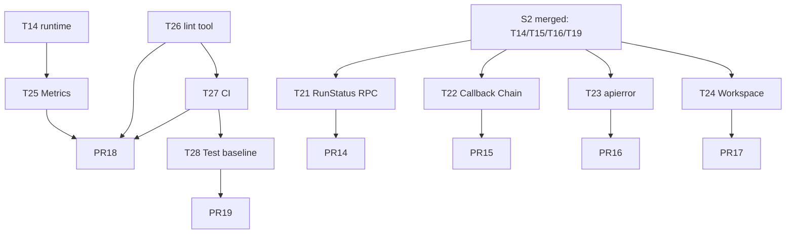

# S3 — P1 业务可观测 + 测试基线

> 时窗：第 5~6 周 | 任务：T21~T28（8 任务） | PR：6 | 依据：[master-plan §6.3](../master-plan.md) [§3.3](../master-plan.md)

---

## 1. Sprint 目标与范围

完善业务可观测性（Gateway RPC / Callback Chain / Metrics）、统一错误模型、多租户中间件，把 lint / runtime-boundary / test 派发到 CI，建立 30% 覆盖率门槛。结束后所有 PR 必须经过 CI 才允许合并。

**范围内**：RunStatus / AwaitUserReply RPC、Callback Chain、`pkg/apierror`、Workspace 中间件、Metrics endpoint、跨平台 lint 工具、CI workflows、测试基线（30%）。
**范围外**：Plugin/Skill/Planner 接入（S4）、Artifact（S5）、60% 覆盖率门槛（S5）。

---

## 2. 任务清单

### T21 — RunStatus / AwaitUserReply RPC（M-10）

- **动作**：
  - [api/kratos/chat/v1/chat.proto](../../../api/kratos/chat/v1/chat.proto) 新增：
    - `rpc GetRunStatus(GetRunStatusRequest) returns (RunStatus)`
    - `rpc AwaitUserReply(AwaitUserReplyRequest) returns (AwaitUserReplyResponse)`
    - `rpc StopGeneration(...)` 若已存在则保持，否则补齐
  - 在 [internal/service/chat.go](../../../internal/service/chat.go) 实现，路由到 `pkg/trpc-agent-go/server/gateway/{ManagedRunner, SteerableRunner}`（通过 S2 引入的 RuntimeKernel 接口暴露）。
  - 同步生成 Go + TS 客户端；`web/src/services/index.ts` 导出。
  - 前端 features/chat：增加"暂停 / 继续 / 等待用户回复"按钮（最小骨架，UX 细节 S5 完善）。
- **依赖**：T14（S2 RuntimeKernel）。
- **预计 PR**：1（PR14）。
- **工时**：2.0 人日。
- **验收**：手测 RunStatus 在 pending/running/completed/failed 之间正确转移；AwaitUserReply 触发后 turn 暂停，提交后继续。

### T22 — Callback Chain（M-12）

- **动作**：
  - 新建 `internal/agent/callbacks/`：定义 `CallbackPoint`（BeforeAgent / AfterAgent / BeforeModel / AfterModel / BeforeTool / AfterTool / OnError）。
  - `Chain` 类型：`[]Callback`，按 `Priority` 排序；同优先级按注册顺序。
  - 把现有 [internal/agent/trpc_callbacks.go](../../../internal/agent/trpc_callbacks.go) 中的 ToolCallback 改为 `Chain` 的一种实现。
  - 注入到 trpc-agent-go 的 `agent.WithCallbacks(...)` / `model.WithCallbacks(...)`（适配层位于 `internal/agent/callbacks/adapter.go`）。
  - 留出 `PluginCallback` 占位接口，S4 T29 接入 PluginManager 时实现。
  - 单测：Chain 顺序、短路（callback 返回 stop）、并发安全。
- **依赖**：T14。
- **预计 PR**：1（PR15）。
- **工时**：2.0 人日。
- **验收**：单测通过；手测 BeforeTool callback 能阻断高风险 tool 调用。

### T23 — `pkg/apierror` 错误模型（Q-11）

- **动作**：
  - 新建 `pkg/apierror/`：
    ```go
    package apierror

    type Code string

    const (
        CodeNotFound      Code = "NOT_FOUND"
        CodeBadRequest    Code = "BAD_REQUEST"
        CodeUnauthorized  Code = "UNAUTHORIZED"
        CodeForbidden     Code = "FORBIDDEN"
        CodeConflict      Code = "CONFLICT"
        CodeInternal      Code = "INTERNAL"
        CodeUnavailable   Code = "UNAVAILABLE"
    )

    type Error struct { Code Code; Domain string; Message string; Cause error; Meta map[string]string }

    func NotFound(domain, msg string, args ...any) *Error { ... }
    func BadRequest(domain, msg string, args ...any) *Error { ... }
    // ... etc

    func From(err error) (*Error, bool) { ... } // unwrap chain
    func ToKratos(err error) error { ... }      // 转 kerrors
    ```
  - biz 层全部返回 `*apierror.Error`；data 层用 `apierror.Wrap` 包装 Ent 错误；service 层把 apierror 转 `kerrors`。
  - 移除 [internal/biz/errros.go](../../../internal/biz/errros.go)（S2 T19 已重命名为 errors.go）中的散装 `errors.New`。
  - 单测：错误 unwrap / code 映射 / 多层 wrap。
- **依赖**：T19（S2）。
- **预计 PR**：1（PR16）。
- **工时**：2.5 人日。
- **验收**：`grep -rn "fmt.Errorf\|errors.New" internal/biz internal/data | wc -l` ≤ 既有数量 -50%；前端收到的错误结构统一。

### T24 — Workspace middleware

- **动作**：
  - 新建 `internal/server/middleware/workspace.go`：从 Header / JWT 提取 `workspace_id`，注入 ctx；缺失时返回 `apierror.Unauthorized`。
  - Ent hook（`internal/data/ent/hook/workspace.go`）：所有带 `workspace_id` 字段的查询自动注入谓词 `workspace_id = ctx.WorkspaceID()`。
  - 影响表：agents、sessions、runs、tool_calls、skills、plugins、channels、teams、usage、cron_jobs 等。
  - 提供 `runtime.WithSystemWorkspace(ctx)` 旁路用于 cron / admin 任务。
- **依赖**：T14。
- **预计 PR**：1（PR17）。
- **工时**：2.0 人日。
- **验收**：跨 workspace 越权请求返回 403；cron 后台任务正常读 system workspace 数据。

### T25 — Metrics endpoint

- **动作**：
  - 新建 `internal/server/metrics.go`：基于 `github.com/prometheus/client_golang/prometheus`，挂在 Kratos HTTP `/metrics`（独立 path，不走 middleware auth）。
  - 注册 metrics：
    - `aranea_chat_turn_duration_seconds`（histogram，labels：agent_id, status）
    - `aranea_agent_build_cache_*`（S2 T16 已埋点，此处暴露）
    - `aranea_event_bus_*`（S2 T15 已埋点）
    - `aranea_graph_active_executions`
    - `aranea_tool_invocation_total{tool,status}`
    - `aranea_provider_request_*{provider,model,status}`
  - 提供示例 Grafana JSON 模板放 `docs/observability/grafana-aranea.json`。
- **依赖**：T14（RuntimeKernel 暴露 metrics hooks）。
- **预计 PR**：与 T26 + T27 合并到 PR18。
- **工时**：1.5 人日。
- **验收**：`curl localhost:8000/metrics` 输出 Prometheus 格式；指标可在 Grafana dashboard 展示。

### T26 — 跨平台 lint 工具

- **动作**：
  - 把 [scripts/check-runtime-boundary.ps1](../../../scripts/check-runtime-boundary.ps1) 重写为 Go 程序 `cmd/araneactl/lint/main.go`。
  - 规则（与 master-plan §7.1 R1~R10 一一对应）：
    - R1: `internal/server/*` 不得 `runner.Runner{}` / `llmagent.New`
    - R2: `internal/biz/*` 不得 import `pkg/trpc-agent-go/*` / `internal/*/trpc/`
    - R3: `internal/data/*` 不得 import `internal/biz/*`
    - R4: `internal/service/*` 不得直接读 Ent client
    - R5: proto 生成文件 diff 检查
    - R6: 不得多余 `http.Server{`（白名单 metrics）
    - R7: 不得 `mux.HandleFunc`（白名单 metrics）
    - R8: `sql.Open` 仅允许 `internal/data/data.go`
    - R9: 业务包不得 `log.Default()`
    - R10: `cmd/admin/main.go` 行数 ≤ 200
  - Makefile 加：
    ```
    .PHONY: lint
    lint:
    	go build -o bin/araneactl ./cmd/araneactl
    	./bin/araneactl lint
    	go vet ./...
    ```
  - 删除 `scripts/check-runtime-boundary.ps1`（保留过渡 1 个 Sprint）。
- **依赖**：S1 / S2 全部合并（红线已清零，工具运行 0 违反）。
- **预计 PR**：PR18（与 T25 + T27）。
- **工时**：1.5 人日。
- **验收**：`make lint` 退出 0；在 PR2 / PR3 历史 commit 上回测可正确报红。

### T27 — CI workflows

- **动作**：
  - 新建 `.github/workflows/ci.yml`：
    - matrix：ubuntu-latest + windows-latest
    - jobs：
      1. `lint`：`make init && make lint && make runtime-boundary`
      2. `test-go`：`go test -race -cover ./...`，覆盖率门槛 30%（`go tool cover -func`）
      3. `test-web`：`pnpm -C web install --frozen-lockfile && pnpm -C web build && pnpm -C web test`
      4. `smoke`：`make smoke`（如 smoke 目标缺失，本任务同时补齐）
      5. `proto-clean`：`make api && git diff --exit-code`（确保提交者已运行生成）
      6. `wire-clean`：`make wire-admin && git diff --exit-code`
  - 新建 `.github/workflows/codeql.yml`（基础安全扫描）。
  - 新建 `.github/PULL_REQUEST_TEMPLATE.md`：内嵌 PR commit footer 模板。
  - Makefile 补 `.PHONY: smoke test ci`：
    ```
    smoke:
    	./scripts/smoke.sh
    test:
    	go test -race -cover ./...
    ci:
    	$(MAKE) lint && $(MAKE) test && $(MAKE) smoke
    ```
  - `scripts/smoke.sh`：启动 admin → curl chat 一条 → 检查 envelope → kill。
- **依赖**：T26。
- **预计 PR**：PR18（与 T25 + T26 合并；CI 与 lint 工具一同生效）。
- **工时**：2.0 人日。
- **验收**：在 GitHub 上能看到 ci.yml 跑过 / 失败状态；PR 必须 CI 全绿才能合并（分支保护规则配置）。

### T28 — 测试基线（30% 覆盖率）

- **动作**：
  - 为以下文件补 unit test：
    - [internal/service/chat.go](../../../internal/service/chat.go) — SendMessage happy / 队列满 / 鉴权失败 / RunStatus 路由
    - [internal/biz/session_usecase.go](../../../internal/biz/session_usecase.go) — Create / List / UpdateMeta / EnqueueAutoMemoryJob stub 验证（实际实现在 S4）
    - [internal/data/sessions.go](../../../internal/data/sessions.go) — Ent CRUD + workspace 谓词命中
    - [internal/agent/trpc_build.go](../../../internal/agent/trpc_build.go) — BuildTRPCLLMAgent 输入合法性
    - [internal/event/bus.go](../../../internal/event/bus.go) — 已在 S2 T15 覆盖，验证覆盖率包含
    - [internal/runtime/kernel.go](../../../internal/runtime/kernel.go) — RuntimeKernel mock 验证 wire
  - 测试 helper：`internal/testutil/`（启动内存 SQLite + 最小 Data + 最小 RuntimeKernel）。
  - 覆盖率门槛在 CI `test-go` job 设为 30%；S5 提至 60%。
- **依赖**：T27（CI 已派发）。
- **预计 PR**：1（PR19）。
- **工时**：3.0 人日。
- **验收**：`go test -cover ./...` 总覆盖率 ≥ 30%；CI 在覆盖率 <30% 时 fail。

---

## 3. PR 切分建议

| PR | 任务 | Reviewer | 标题 |
|----|------|----------|------|
| PR14 | T21 | Backend + Tech Lead | `[S3-T21] chat: expose RunStatus and AwaitUserReply RPCs` |
| PR15 | T22 | Tech Lead + Backend | `[S3-T22] agent: callback chain for agent/model/tool/plugin points` |
| PR16 | T23 | Tech Lead × 2 | `[S3-T23] apierror: unified error model for biz/data/service` |
| PR17 | T24 | Tech Lead + Backend | `[S3-T24] server: workspace middleware + ent hook` |
| PR18 | T25 + T26 + T27 | Tech Lead + QA | `[S3-T25+T26+T27] obs: metrics endpoint, cross-platform lint, CI workflows` |
| PR19 | T28 | Backend × 2 + QA | `[S3-T28] tests: baseline coverage 30% for service/biz/data` |

每 PR 必须更新：
```
Doc: docs/changelog/2026-MM-DD-S3-Observability.md
Tracker: docs/guides/task-tracker.md (T{m} -> done)
```

---

## 4. 依赖关系图



---

## 5. 验收点

代码：
- [ ] `make lint` 通过；`make runtime-boundary` 通过
- [ ] `go test -race -cover ./...` 通过且覆盖率 ≥ 30%
- [ ] `grep -rn "fmt.Errorf\|errors.New" internal/biz internal/data` 显著下降
- [ ] CI `lint` / `test-go` / `test-web` / `smoke` / `proto-clean` / `wire-clean` 全部通过

可观测：
- [ ] `curl localhost:8000/metrics` 返回 6 类 metrics
- [ ] Grafana 模板可加载（`docs/observability/grafana-aranea.json`）
- [ ] RunStatus / AwaitUserReply 在前端可观察并触发

多租户：
- [ ] 跨 workspace 调用返回 `apierror.Forbidden`
- [ ] cron 后台用 system workspace 正常工作

文档：
- [ ] `docs/changelog/2026-MM-DD-S3-Observability.md` 合并
- [ ] [docs/guides/master-plan.md](../master-plan.md) §5 度量指标章节确认
- [ ] PR template 默认渲染并被新 PR 使用

---

## 6. 回滚策略

| PR | 回滚方式 | 风险点 | 缓解 |
|----|----------|--------|------|
| PR14 | revert；proto 字段保留为 deprecated 一个 Sprint | 前端调用新增 RPC | feature flag `chat.run_status.enable` |
| PR15 | revert；保留旧 ToolCallback API 一个 Sprint | callback 注册点改变 | 提供 `RegisterLegacyToolCallback` 兼容 |
| PR16 | 渐进 revert：仅 biz 层先用 apierror，data 层后续 | 错误结构改变影响前端 | 同时更新前端错误解析；feature flag `apierror.strict` |
| PR17 | revert；移除 middleware 注册 | 越权访问可能恢复 | 增加单测在 CI 阻断 |
| PR18 | 子项独立 revert（metrics / lint / CI） | CI 中断阻塞所有 PR | CI 失败时可临时跳过 `lint` job（不删 workflow） |
| PR19 | revert 测试 | 覆盖率门槛下调 | CI 阈值通过 env 控制，紧急可下调 |

---

## 7. 时间表

| 天 | 内容 |
|----|------|
| D1 | T21/T22/T23/T24 并行启动；T26 设计 |
| D2 | PR14/PR15/PR16/PR17 提交 review；T25 启动 |
| D3 | T26 完成；T27 启动 |
| D4 | PR14-PR17 review 中；T28 启动 |
| D5 | PR18 提交（T25+T26+T27） |
| D6 | PR14-PR17 合并；PR18 review |
| D7 | PR18 合并；CI 接入生效 |
| D8 | PR19 提交；覆盖率 ≥ 30% |
| D9 | PR19 合并；retro |
| D10 | S4 启动准备；changelog 收尾 |
