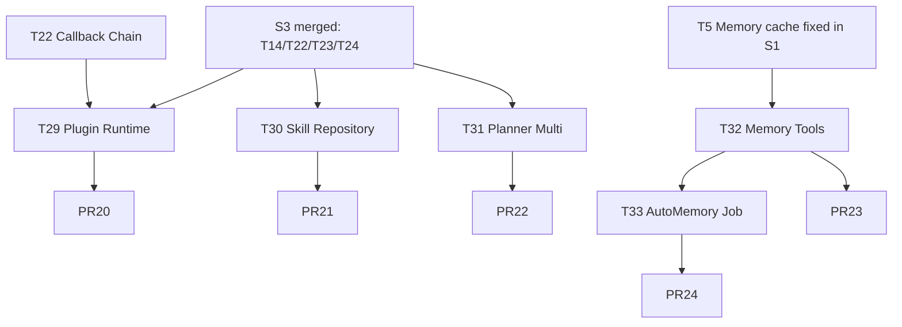

# S4 — P2 功能补全（一）：Plugin / Skill / Planner / Memory Tools

> 时窗：第 7~8 周 | 任务：T29~T33（5 任务） | PR：5 | 依据：[master-plan §6.4](../master-plan.md) [§4](../master-plan.md)

---

## 1. Sprint 目标与范围

把 trpc-agent-go 的 Plugin / Skill repository / Planner / Memory 工具能力真正接入项目，把 `AutoMemory` 闭环落地。Sprint 结束后，M-1 / M-2 / M-3 / M-4 / M-5 状态由 ❌/🟡 转为 ✅。

**范围内**：Plugin 运行时（PluginManager + Callback Points）、Skill repository 适配、Planner 多策略（ReAct / A2UI）、Memory 五件套工具、AutoMemory cron 闭环。
**范围外**：Artifact（S5）、Cron 重试（S5）、AgentRuntimeSettings 拆分（S5）、Knowledge / Evaluation（S6）。

---

## 2. 任务清单

### T29 — Plugin 运行时接入（M-4）

- **动作**：
  - 新建 `internal/plugin/trpc/`：
    - `manager.go`：`type Manager struct { plugins []Plugin; bus *event.Bus }`，实现 `pkg/trpc-agent-go/plugin.PluginManager` 兼容接口。
    - `adapter.go`：把 biz.Plugin（DB 行）转换为 trpc-agent-go Plugin 实例（按 `CallbackPoints` 字段挂接到 Callback Chain）。
    - `permissions.go`：实现 `PluginPermissions` 的 CanView/CanToggle/CanEditConfig/CanViewLogs 检查（与 [internal/biz/plugin.go](../../../internal/biz/plugin.go) 同步）。
  - 扩展 [internal/biz/plugin.go](../../../internal/biz/plugin.go)：新增 `type Runtime interface { Apply(ctx, []Plugin) error; CallbackPoints() []string }`；保持现有 CRUD 接口不变。
  - 在 [internal/agent/trpc_build.go](../../../internal/agent/trpc_build.go) `BuildTRPCLLMAgent` 注入 PluginManager（通过 S3 T22 的 Callback Chain）。
  - 接 `internal/service/plugin.go`：Toggle / UpdateConfig 时调用 `Runtime.Apply` 热加载。
  - metrics：`plugin_invoke_total{plugin,point,status}`、`plugin_block_total{plugin,reason}`。
  - 提供 1 个内置示例 plugin：`AuditLogPlugin`（记录所有 tool 调用到 audit_log 表）。
- **依赖**：T14（S2）、T22（S3 Callback Chain）。
- **预计 PR**：1（PR20）。
- **工时**：4.0 人日。
- **验收**：通过 admin UI 启用 AuditLogPlugin 后，audit_log 表有新记录；禁用后立即停止。

### T30 — Skill repository 适配（M-3）

- **动作**：
  - 新建 `internal/skill/trpc/`：
    - `repository.go`：实现 `pkg/trpc-agent-go/skill.Repository` 接口（List / Get / Match / Build）。
    - `loader.go`：从 [internal/data/skills.go](../../../internal/data/skills.go) 加载技能定义，转换为 trpc skill.Skill 对象。
    - `cache.go`：进程内 LRU + reload 通知（与 S2 T16 风格一致）。
  - 改造 `internal/skill/watch`：从"文件 watcher"扩展为"数据库 + 文件双源 reload 通知器"，通过 EventBus 广播 `skill.reload` 事件。
  - 在 [internal/agent/trpc_build.go](../../../internal/agent/trpc_build.go) 注入 Skill Repository，替代当前手动 `AppendEffectiveToolSkills`。
  - 前端：features/skills 接收 reload 事件实时刷新列表。
- **依赖**：T14（S2）。
- **预计 PR**：1（PR21）。
- **工时**：3.0 人日。
- **验收**：admin 修改 skill 启用状态后，无需重启进程，新 turn 立即生效；skill 命中率 metrics 出现。

### T31 — Planner 多策略（M-5）

- **动作**：
  - 新建 `internal/agent/planner/`：
    - `selector.go`：`func Select(dialogMode, plannerKind string) Planner { ... }`
    - `builtin.go`：现有 BuiltinPlanner 提取到此
    - `react.go`：包装 `pkg/trpc-agent-go/planner/react.New(...)`
    - `a2ui.go`：包装 `pkg/trpc-agent-go/planner/a2ui.New(...)`
  - 改 [internal/agent/trpc_build.go](../../../internal/agent/trpc_build.go) `buildPlanner` 调用 `planner.Select(...)`。
  - [internal/biz/agent.go](../../../internal/biz/agent.go) AgentRuntimeSettings 新增字段 `PlannerKind string`（值：`""` / `builtin` / `react` / `a2ui`）；空值兼容旧行为。
  - proto 同步：`api/kratos/agent/v1/agent.proto` 增 `planner_kind`。
  - 前端：features/agents 设置面板新增 Planner 选择器。
- **依赖**：T14。
- **预计 PR**：1（PR22）。
- **工时**：2.5 人日。
- **验收**：手测 3 种 planner 在 chat 输出可区分（thought / action 结构）。

### T32 — Memory 五件套工具（M-2）

- **动作**：
  - 新建 `internal/tools/memory/`：
    - `add.go`：`add_memory(content, tags?)` 工具，调用 sessionmemory.Store.Insert
    - `update.go`：`update_memory(id, content?, tags?)`
    - `load.go`：`load_memory(top_k?)`，按时间倒序
    - `search.go`：`search_memory(query, top_k?)`，按关键词 / 嵌入相似度
    - `delete.go`：`delete_memory(id)`
  - 五个工具按 `internal/tools/registry/` 注册接口暴露；标 `RiskLevel: low / medium`。
  - 在 [internal/agent/trpc_build.go](../../../internal/agent/trpc_build.go) 默认注入（受 `agent.tools.memory.enable` 配置开关控制，默认 on）。
  - 单测：每个工具 happy + 边界（empty / not found / 权限）。
- **依赖**：T5（S1 Memory cache 修复）、T22（S3 Callback Chain 用于审计）。
- **预计 PR**：1（PR23）。
- **工时**：2.5 人日。
- **验收**：模型在 turn 中调用 add_memory，下一 turn 通过 load_memory 可读到。

### T33 — EnqueueAutoMemoryJob 闭环（M-1）

- **动作**：
  - [internal/biz/session_usecase.go](../../../internal/biz/session_usecase.go) `EnqueueAutoMemoryJob` 实现：
    ```go
    func (uc *SessionUsecase) EnqueueAutoMemoryJob(ctx, sessionID, runID, kind string) error {
        return uc.repo.InsertAutoMemoryJob(ctx, AutoMemoryJob{...})
    }
    ```
    在 ChatService SendMessage / RunCompleted 钩子触发。
  - 数据层：补 [internal/data/sessionmemory/store.go](../../../internal/data/sessionmemory/store.go) `InsertAutoMemoryJob` / `ClaimNextAutoMemoryJob` / `CompleteAutoMemoryJob`。
  - 新建 `internal/cronrunner/jobs/auto_memory.go`：每 10s 轮询 `auto_memory_jobs` 表，对每个 pending job：
    1. 调用 `pkg/trpc-agent-go/memory/extraction` 从 session 历史抽取语义记忆
    2. 写入 sessionmemory store（L1/L2/L3 层）
    3. 标记 job done / failed，记录失败原因
  - 失败重试：3 次退避（指数 30s/2m/10m），3 次仍失败则置 dead。
  - metrics：`auto_memory_job_total{status}`、`auto_memory_extraction_duration_seconds`。
- **依赖**：T5（S1）、T32（Memory 工具共享 store）。
- **预计 PR**：1（PR24）。
- **工时**：3.0 人日。
- **验收**：一次 10-turn 会话结束后，30s 内 auto_memory_jobs 全部 done；sessionmemory 表新增 ≥ 1 行语义记忆。

---

## 3. PR 切分建议

| PR | 任务 | Reviewer | 标题 |
|----|------|----------|------|
| PR20 | T29 | Tech Lead + Backend | `[S4-T29] plugin: runtime + manager + AuditLogPlugin sample` |
| PR21 | T30 | Backend × 2 | `[S4-T30] skill: trpc repository + db/file reload` |
| PR22 | T31 | Backend + Frontend | `[S4-T31] planner: builtin/react/a2ui selector` |
| PR23 | T32 | Backend + Tech Lead | `[S4-T32] tools/memory: add/update/load/search/delete` |
| PR24 | T33 | Backend × 2 + QA | `[S4-T33] cron: auto_memory job worker with retry` |

每 PR commit footer：
```
Doc: docs/changelog/2026-MM-DD-S4-Plugin-Skill-Planner.md
Tracker: docs/guides/task-tracker.md (T{m} -> done)
```

---

## 4. 依赖关系图



PR20 / PR21 / PR22 / PR23 完全并行；PR24 在 PR23 合并后开工。

---

## 5. 验收点

代码：
- [ ] CI 通过（含 S3 引入的 lint / runtime-boundary / test / smoke）
- [ ] `go test -cover ./...` 覆盖率 ≥ 45%
- [ ] `make runtime-boundary` 通过（新代码不引新违规）

功能：
- [ ] 启用 AuditLogPlugin 后 tool 调用全部入 audit_log
- [ ] 修改 skill 启用状态无需重启即时生效
- [ ] 三种 planner 在 chat 中可切换
- [ ] add_memory / load_memory / search_memory / update_memory / delete_memory 五个工具均可被模型调用
- [ ] 10 turn 会话后 30s 内 AutoMemory job 完成
- [ ] master-plan §4 状态表 M-1 / M-2 / M-3 / M-4 / M-5 ✅

文档：
- [ ] `docs/changelog/2026-MM-DD-S4-Plugin-Skill-Planner.md` 合并
- [ ] [docs/guides/master-plan.md](../master-plan.md) §4 状态表更新
- [ ] task-tracker T29~T33 done
- [ ] 新增 `docs/guides/extension-points.md`（Callback Point + Plugin 编写指南）

---

## 6. 回滚策略

| PR | 回滚方式 | 风险点 | 缓解 |
|----|----------|--------|------|
| PR20 | revert；保留 biz/plugin.go CRUD | Plugin 错误 callback 影响 turn | feature flag `plugin.runtime.enable=false`；初期所有 plugin 默认 disabled |
| PR21 | revert；技能回退到内存列表 | DB 加载失败导致技能丢失 | reload 失败回退使用上次缓存；监控 reload error rate |
| PR22 | revert；删除 `planner_kind` 字段保留 nullable | proto 字段新增不影响旧客户端 | 默认 `""` 等价 builtin |
| PR23 | revert；移除 memory tools 注册 | 工具调用错误导致 turn 失败 | feature flag `agent.tools.memory.enable=false` |
| PR24 | revert；保留 EnqueueAutoMemoryJob stub | cron 任务连接失败 | 失败 3 次置 dead，不阻塞主流程；可手动 retry |

---

## 7. 时间表

| 天 | 内容 |
|----|------|
| D1 | T29/T30/T31/T32 并行设计；分配 owner |
| D2 | 4 个任务各自启动；PR 设计稿 review |
| D3 | T31 完成（最小）；T32 完成（前 3 个工具） |
| D4 | T30 完成；PR22/PR23 提交 |
| D5 | T29 完成；PR20/PR21 提交 |
| D6 | PR20~PR23 review；T33 启动 |
| D7 | PR20~PR23 合并 |
| D8 | T33 完成；PR24 提交 |
| D9 | PR24 review；smoke 复测 |
| D10 | PR24 合并；retro；S5 启动准备 |
