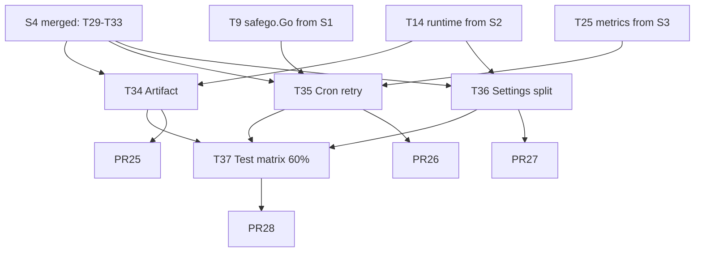

# S5 — P2 功能补全（二）：Artifact / Cron / Settings 拆分 / 测试矩阵 60%

> 时窗：第 9~10 周 | 任务：T34~T37（4 任务） | PR：4 | 依据：[master-plan §6.4](../master-plan.md)

---

## 1. Sprint 目标与范围

落地 Artifact（M-6）；为 Cron 加重试与 metrics（B-14 / M-18）；把 AgentRuntimeSettings 100+ 字段拆为 8 个 sub-struct（Q-22）；把测试覆盖率从 S3 的 30% 提升到 60%。

**范围内**：Artifact 最小实现、Cron 重试、Settings 拆分、测试矩阵 60% + e2e。
**范围外**：Knowledge / Evaluation / A2A / CodeExecutor 沙箱（S6）。

---

## 2. 任务清单

### T34 — Artifact 最小实现（M-6）

- **动作**：
  - 新建 proto：`api/kratos/artifact/v1/artifact.proto`
    - `Artifact { id, session_id, run_id, name, mime, size, sha256, storage_kind, storage_uri, created_at, ... }`
    - `rpc Upload`（stream）/ `rpc Download`（stream）/ `rpc List` / `rpc Delete` / `rpc GetMetadata`
  - 新建 `internal/biz/artifact.go`：`ArtifactUsecase`、`ArtifactRepo` 接口。
  - 新建 `internal/data/artifacts.go`：Ent schema `Artifact` + 仓储实现；二进制存储默认本地文件系统（`data.artifact.dir`），可选 inmemory（测试用）。
  - 新建 `internal/artifact/trpc/`：实现 `pkg/trpc-agent-go/artifact.Service`，让 Agent 可通过 `artifact_service` 上下文上传/下载。
  - 新建 `internal/service/artifact.go`：RPC 实现 + chunk streaming（限流 / size limit / mime 白名单）。
  - 前端：features/chat 显示 turn 内产出的 artifact，点击可下载；features/sessions 新增 artifacts 标签页。
  - metrics：`artifact_upload_bytes_total`、`artifact_download_bytes_total`、`artifact_storage_bytes`。
- **依赖**：T14（S2 RuntimeKernel 暴露 Artifact 接口）。
- **预计 PR**：1（PR25）。
- **工时**：4.0 人日。
- **验收**：模型 turn 中产出 artifact，前端可下载；DB + 文件系统一致。

### T35 — Cron 失败重试 + metrics（B-14 / M-18）

- **动作**：
  - [internal/cronrunner/schedule.go](../../../internal/cronrunner/schedule.go) 增加：
    - `RetryPolicy { MaxAttempts int; Backoff []time.Duration }`，每个 job 可独立配置（默认 3 次：30s/2m/10m）。
    - 失败计数 → DB `cron_jobs.failure_count`、`cron_jobs.last_error`。
    - dead-letter：连续失败超阈值置 `status=dead`，触发 admin 告警事件。
  - 增加 metrics：
    - `cron_job_runs_total{job_id,status}`
    - `cron_job_duration_seconds{job_id}`
    - `cron_job_dead_total{job_id}`
  - [internal/cronrunner/runner.go](../../../internal/cronrunner/runner.go) 添加 panic recover（统一用 S1 T9 引入的 `pkg/safego.Go`）。
  - 前端 features/cron：显示重试次数 + 最后错误，提供"重置失败计数"按钮。
- **依赖**：T9（S1 safego.Go）、T25（S3 metrics）、T33（S4 AutoMemory 已使用 cron）。
- **预计 PR**：1（PR26）。
- **工时**：2.0 人日。
- **验收**：人为让 job 抛错，观察重试时间表与最终 dead 状态；metrics 数据正确。

### T36 — AgentRuntimeSettings 拆分（Q-22）

- **动作**：
  - [internal/biz/agent.go](../../../internal/biz/agent.go) 把现 100+ 平铺字段拆为 8 个 sub-struct：
    ```go
    type AgentRuntimeSettings struct {
        Identity  IdentityCfg
        Reasoning ReasoningCfg
        Memory    MemoryCfg
        Tools     ToolsCfg
        Skills    SkillsCfg
        Plugins   PluginsCfg
        Evolution EvolutionCfg
        Context   ContextCfg
    }
    ```
  - 保持 JSON 持久化字段名兼容（用 `json:"..."` 标签），DB 列不变；前端 / proto 字段名不变。
  - 重写 [internal/service/agent.go](../../../internal/service/agent.go) `fromProtoRuntime` / `toProtoRuntime`：用反射 + tag 或代码生成（建议代码生成：`go:generate` + `cmd/araneactl/codegen/runtime_mapper`），把 220+ 行手写映射删除。
  - 单测：旧 JSON 持久化数据可正确反序列化为新结构（兼容性测试）。
- **依赖**：T14（S2）。
- **预计 PR**：1（PR27）。
- **工时**：3.0 人日。
- **验收**：现有 agent 数据无需 migration 即可读写；`service/agent.go` 行数减少 ≥ 50%。

### T37 — 测试矩阵 60% + e2e（M-17 测试基线升级）

- **动作**：
  - 后端：
    - 覆盖率门槛在 CI 改为 60%（CI matrix env `COVERAGE_THRESHOLD=60`）。
    - 补 `internal/service/team.go`、`internal/service/memory.go`、`internal/service/plugin.go`、`internal/service/skill.go`、`internal/service/cron.go` 单测。
    - 补 `internal/biz/agent.go`、`internal/biz/team.go`、`internal/biz/plugin.go`、`internal/biz/skill.go` 用例。
    - 补 `internal/data/agents.go`、`internal/data/teams.go`、`internal/data/plugins.go`、`internal/data/skills.go` 集成测试（用 `testutil.NewTestData`）。
    - 关键 trpc 适配器：`internal/agent/trpc_build_test.go` 增强场景；`internal/graph/trpc/builder_test.go` 增强。
  - 前端：
    - 增加 `web/src/features/<域>/__tests__/store.spec.ts` 每域 1 个 store 单测（Vitest）。
    - 增加 e2e：`web/cypress/e2e/chat-flow.cy.ts`（启动后端 → 创建 agent → 发起 chat → 收到流式响应 → tool 调用 → memory 写入 → 关闭 session）。
    - `pnpm -C web test:e2e` 接入 CI。
  - CI：新增 nightly job 跑 e2e（main 分支每晚一次）。
- **依赖**：T28（S3 测试基线）、T33（S4 AutoMemory 完整）、T34（S5 Artifact）。
- **预计 PR**：1（PR28；测试代码可拆为 PR28a 后端 + PR28b 前端）。
- **工时**：5.0 人日。
- **验收**：CI 覆盖率 ≥ 60%；e2e 在 CI nightly 稳定通过 ≥ 5 次。

---

## 3. PR 切分建议

| PR | 任务 | Reviewer | 标题 |
|----|------|----------|------|
| PR25 | T34 | Tech Lead + Backend + Frontend | `[S5-T34] artifact: minimum service + storage + UI` |
| PR26 | T35 | Backend + QA | `[S5-T35] cron: retry policy + metrics + dead-letter` |
| PR27 | T36 | Tech Lead + Backend | `[S5-T36] biz: split AgentRuntimeSettings into 8 sub-structs` |
| PR28 | T37 | Backend × 2 + Frontend + QA | `[S5-T37] tests: coverage to 60% + cypress e2e nightly` |

每 PR commit footer：
```
Doc: docs/changelog/2026-MM-DD-S5-Artifact-Cron-Tests.md
Tracker: docs/guides/task-tracker.md (T{m} -> done)
```

---

## 4. 依赖关系图



PR25 / PR26 / PR27 并行；PR28 在前三者合并后启动。

---

## 5. 验收点

代码：
- [ ] CI 全绿（含 lint / test-go / test-web / smoke / proto-clean / wire-clean）
- [ ] `go test -cover ./...` 覆盖率 ≥ 60%
- [ ] cypress nightly 连续 5 次通过
- [ ] `make runtime-boundary` 通过

功能：
- [ ] turn 产出 artifact 可在前端下载，hash 校验一致
- [ ] cron 任务失败后按 30s/2m/10m 退避重试，3 次失败置 dead
- [ ] AgentRuntimeSettings sub-struct 在前端展示分组（可选 UI 优化）；旧 JSON 数据兼容
- [ ] master-plan §4 状态表 M-6 / M-18 ✅

文档：
- [ ] `docs/changelog/2026-MM-DD-S5-Artifact-Cron-Tests.md` 合并
- [ ] 新增 `docs/guides/artifact.md`（使用与存储说明）
- [ ] 新增 `docs/guides/cron.md`（重试策略与 metrics）
- [ ] task-tracker T34~T37 done

---

## 6. 回滚策略

| PR | 回滚方式 | 风险点 | 缓解 |
|----|----------|--------|------|
| PR25 | revert；保留 proto 但不实现 stream | 大文件上传内存峰值 | chunk 大小限制 + size 限制（默认 50MB）；feature flag `artifact.enable` |
| PR26 | revert；恢复旧调度 | 重试可能放大下游负载 | 默认指数退避；提供"全局禁用重试"开关 |
| PR27 | revert；重新使用平铺字段 | JSON 字段名变化导致兼容问题 | 单测覆盖兼容；保留 `// +legacy` 标签字段 1 个 Sprint |
| PR28 | revert 测试代码 | 覆盖率门槛阻塞合并 | 用 env 调阈值；nightly e2e 失败仅告警不阻塞 |

---

## 7. 时间表

| 天 | 内容 |
|----|------|
| D1 | T34/T35/T36 并行启动 |
| D2 | T35 完成；T36 完成（最小） |
| D3 | T34 完成（后端）；PR26/PR27 提交 |
| D4 | T34 前端完成；PR25 提交 |
| D5 | PR25/PR26/PR27 review |
| D6 | PR25/PR26/PR27 合并；T37 启动 |
| D7 | T37 后端单测补齐；覆盖率 50% |
| D8 | T37 前端单测 + e2e 启动 |
| D9 | PR28 提交；覆盖率达 60% |
| D10 | PR28 合并；nightly 接入；retro；S6 启动准备 |
