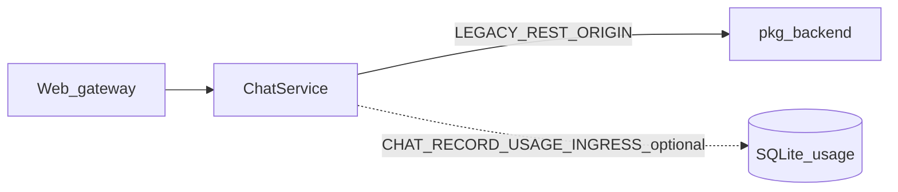

# Legacy → Kratos（cmd/admin）Phase 逐项状态

与 [pkg-backend-to-kratos.md](pkg-backend-to-kratos.md) 及既定迁移计划对齐；标记含义：**✅** 基本完成 · **⚠️** 部分完成 / 过渡期 · **❌** 未达成计划目标 · **📄** 仅文档收口。

本文应随里程碑更新；源码以 `api/kratos/**`、`cmd/admin`、`internal/service`、`internal/biz`、`docs/migration/` 为准。

| Phase | 主题 | 状态 | 代码 / 运维要点 |
|-------|------|------|----------------|
| **0** | 基线与运维（对账、双进程 SQLite、Cron 源、用量双写、环境变量） | ⚠️ | [runbook-operational-baseline.md](runbook-operational-baseline.md) 已有；需在部署侧持续勾选 Helm/Runbook。 |
| **1** | Admin / catalog / session 读 / agent·team HTTP / integrations / cron CRUD / memory 读 / usage·monitor 读 | ✅ | Proto + `Register*HTTPServer` + Wire；以 checklist-catalog Mechanical 验收。 |
| **2** | **原生 Chat**（不依赖外挂进程 ADK、`chat/v1` 全契约、`LEGACY` 可退役、用量服务端单写） | ❌ / ⚠️ | **❌**：执行仍在 **`pkg/backend`**；[**`internal/service/chat.go`**](../../internal/service/chat.go) 仅 HTTP 转发 **`LEGACY_REST_ORIGIN`**。**⚠️**：已有 [`api/kratos/chat/v1/chat.proto`](../../api/kratos/chat/v1/chat.proto)；可选 **`CHAT_RECORD_USAGE_INGRESS=1`** 在 unary 成功后从 **`agent_message` JSON** 写入 `UsageUsecase`（见 runbook）。流式仍为透传。**后续**：迁入 `biz`/`data` ADK generate 才是真「原生」。 |
| **3** | Team 运行 SSE（started/finished/step 全量对齐） | ⚠️ | **`biz.HintTeamRunSSE`**：cron + unary team 后发 **`run_finished`**（基于 `ListTeamRuns`）。**未完**：started/step 与编排栈对齐。 |
| **4** | Cron 去 **`/api/v1/chat/messages`** | ⚠️ | **`CRON_CHAT_DISPATCH_ORIGIN`** → **`POST …/v1/chat/messages`**。**注意**：`/v1` 仍可能依赖 **`LEGACY_REST_ORIGIN`**；本进程派发需 Phase 2 或 usecase 直调。 |
| **5** | SyncBuiltins / 运行时装配 | 📄 | [plugin-runtime-remnants.md](plugin-runtime-remnants.md)：刻意保留 **`pkg/backend`**。 |
| **6** | Memory / Evolution **写** | ✅ / ⚠️ | **`UpsertMemoryFact`**、**`AppendEvolutionEvent`** 已 proto + SQLite + [**`memory` service**](../../internal/service/memory.go)；Web facade。**余量**：更广 L4/版本写、PR 分拆、pgvector 边界文档。 |
| **7** | Monitor 与其它写入收口 | 📄 | [monitor-writes-audit.md](monitor-writes-audit.md)：遗留 monitor HTTP GET；若需 ingest 再在 admin proto 显性化。 |
| **8** | 前端分层与 UX（Playbook B/C） | ⚠️ | [frontend-migration-wave.md](frontend-migration-wave.md)；`/v1/chat/*`、memory 写入已对；全域组件/token 仍需独立 PR。 |

## Mermaid（当前 unary 摘要）

## 下一刀顺序

1. Phase **2**（原生 chat）  
2. Phase **3** + **4**（事件全量 + cron 直达 usecase，随 **2**）  
3. Phase **6** 增补、Phase **8** UX 并行
