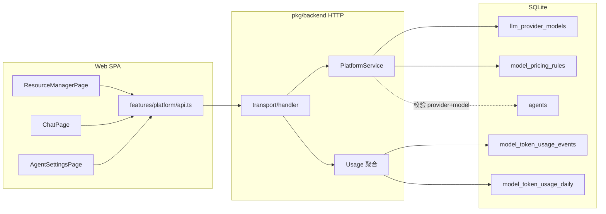

# 模型与供应商模块概要设计

## 1. 文档目的与范围

本文档描述 **Aranea Agents** 仓库内与 **LLM Provider / 模型配置** 相关的概要设计：前端 `web` 如何调用接口、后端 `pkg/backend` 如何落库与扩展、以及与 **`docs/model/model.md`**（功能需求）、**`docs/model/sql.md`**（表结构）的对齐关系。

**不在本文展开**：表字段级 DDL（见 `sql.md`）、交互线稿级 UI 细节（见 `pkg/docs/9 provider.md`）。

---

## 2. 模型模块：API 目录与数据库目录设计

本节只描述 **模型 / 供应商（llm-provider-models）** 与 **用量 / 计价** 相关的代码落位与库表落位，不展开全仓库树。

### 2.1 后端 API 目录（`pkg/backend`）

HTTP 路径在 **`internal/transport`** 注册，通用平台资源与模型专有逻辑分文件承载；业务在 **`internal/service`**，契约与持久化在 **`domain` / `repository`**。

```text
pkg/backend/internal/
├── transport/
│   ├── handler.go           # 注册 /api/v1/llm-provider-models*、/model-usage/*、/agents/validate-model
│   ├── platform.go        # handlePlatformCollection/Item（含 llm-provider-models）、handleValidateModel、handleInspectProviderModel
│   └── usage.go           # handleModelUsageOverview/Trends/TopModels/TopAgents/Events
├── service/
│   └── platform.go        # 平台资源 CRUD；InspectProviderModel；syncProviderModelPricing → model_pricing_rules
├── domain/
│   └── models.go          # PlatformResource、ModelTokenUsageEvent、ModelPricingRule、InspectProviderModel* 等
├── kernel/contracts/
│   └── store.go           # Store 接口：GetProviderModel、ValidateProviderModel、用量与平台资源方法（实现见 repository）
├── repository/
│   ├── sqlite_platforms.go    # llm_provider_models 映射为 resource「llm-provider-models」；Get/ValidateProviderModel
│   ├── sqlite_usage.go        # model_token_usage_* 查询（overview/trends/top/events）
│   ├── sqlite_usage_updates.go # 写入 model_token_usage_events、会话累计等
│   ├── sqlite.go              # ensureLegacyColumns 含 llm_provider_models 追加列
│   └── migrations/
│       └── 0001_init.sql      # 模型相关表 DDL；字段说明见 docs/model/sql.md 与 §2.3
├── catalog/adapters/sqlite/
│   └── seeds.go             # 默认 llm-provider-models 种子行
└── capability/adapters/sqlite/
    └── seeds.go             # CLI 工具元数据（声明同上 REST 路径，非实现）
```

**运行时消费（非 REST，但与模型行相关）**：`internal/conversation/application/run_turn_handler.go`、`adkruntime/*` 等通过 **`GetProviderModel`** 取 `config_json` 连接信息；用量写入走 **`sqlite_usage_updates`** 链路。

### 2.2 前端 API 目录（`web`）

```text
web/src/
├── features/platform/
│   └── api.ts               # list/create/update/deletePlatformResource("llm-provider-models")；inspectProviderModel；validateModel
├── api/
│   └── http.ts              # axios 基址（/api/v1）
├── config/
│   ├── runtime.ts           # 后端 origin
│   └── providerPresets.ts   # 厂商 URL 等表单辅助（非协议本体）
├── pages/
│   ├── ResourceManagerPage.vue   # /models，resource = llm-provider-models
│   ├── ChatPage.vue              # 拉取模型列表、发消息
│   └── AgentSettingsPage.vue     # 选模、校验
└── router/
    └── routes.ts            # path models → ResourceManagerPage
```

### 2.3 数据库目录设计（Schema 文件与逻辑表分组）

权威 DDL 集中在 **`pkg/backend/internal/repository/migrations/0001_init.sql`**。与 **模型模块** 直接相关的表分组如下（字段级说明见 `docs/model/sql.md`）。

| 逻辑分组 | 表名 | 用途 |
|----------|------|------|
| **Provider / 模型配置** | `llm_provider_models` | 一行一 provider+model；连接与扩展在 `config_json` |
| **计价规则** | `model_pricing_rules` | 单价规则；保存模型时从 `config_json` 同步 |
| **用量明细** | `model_token_usage_events` | 单次调用明细，支撑趋势与成本 |
| **用量聚合** | `model_token_usage_daily` | 按日汇总 |
| **关联引用** | `agents`（`provider`,`model`） | 智能体绑定；校验依赖 `llm_provider_models` |

**访问代码对应（repository）**：

| 表 / 资源 | 主要访问文件 |
|-----------|----------------|
| `llm_provider_models` | `sqlite_platforms.go` + 通用平台资源 CRUD（`sqlite_*` 平台资源路径） |
| `model_pricing_rules` | `sqlite_usage.go`（`UpsertModelPricingRule`；由 `service/platform.go` 触发） |
| `model_token_usage_events`、`model_token_usage_daily` | `sqlite_usage.go`（读）、`sqlite_usage_updates.go`（事件写入） |

**索引**：同迁移文件尾部 `idx_provider_models_*`、`idx_usage_*`、`idx_usage_daily_*`（详见 `sql.md`）。

---

**说明**：根目录 **`cmd/agent-service`** 不包含上述 API 实现；浏览器与集成测试应以 **`pkg/backend`** 的 `/api/v1` 为准（见 §8）。

---

## 3. 系统上下文

| 组件 | 路径 / 说明 |
|------|-------------|
| Web 控制台 | `web/`（Vue + Quasar，axios `baseURL` 见 `web/src/config/runtime.ts`，默认指向 `{backend}/api/v1`） |
| 业务后端 | `pkg/backend/`（嵌入式 SQLite、`PlatformService`、用量聚合与 HTTP 路由） |
| 编排服务（脚手架） | 根目录 `cmd/agent-service`、`internal/api`（当前与模型管理弱耦合，可后续代理或合并网关） |
| 产品需求 | `docs/model/model.md` |
| 数据库契约 | `docs/model/sql.md`（与 `pkg/backend/internal/repository/migrations/0001_init.sql` 一致） |

用户通过 **`/models`** 进入「模型管理」页（`ResourceManagerPage`，资源元数据 `llm-provider-models`），与聊天页、智能体设置页共享同一套 **Provider + Model** 清单与校验接口。

---

## 4. 逻辑架构



**分层含义**

- **表现层**：通用资源管理表单 + Provider 专用分支（`isProviderResource`）；类型定义与 `PlatformResource` 对齐。
- **应用层**：`PlatformService` 负责 CRUD、树形资源（本资源一般为扁平列表）、**自检后写回计价**（`syncProviderModelPricing`）。
- **数据层**：模型行存于 `llm_provider_models`；连接与价格等多数字段落在 **`config_json`**；用量明细与日汇总支撑统计与后续热度回写。

---

## 5. 核心领域对象

### 5.1 平台资源（与 Web 一致）

后端 `domain.PlatformResource` 与前端 `web/src/features/platform/api.ts` 中 `PlatformResource` 字段一一对应，其中 **模型模块关心**：

| 字段 | 用途 |
|------|------|
| `id` | 行主键，PATCH/DELETE |
| `key` | 业务唯一键（如 `openrouter:gpt-4.1-mini`），对应表 `model_key` |
| `name` / `description` | 展示名与说明 |
| `provider` | 供应商代码（`provider_code`） |
| `model` | 模型 API ID（`model_api_id`） |
| `enabled` | 是否启用 |
| `sort_order` | 排序 |
| `config_json` | `provider_type`、`api_base_url`、`api_key`、价格与扩展展示字段（见 `sql.md` §2） |
| `metadata_json` | 自检结果、健康状态等 |
| `deleted_at` | 软删 |

### 5.2 用量与计价

- **`model_token_usage_events`**：单次调用明细（含 `provider_code`、`model_api_id`、token、成本、延迟、`tokens_per_second`、`usage_kind` 等）。
- **`model_token_usage_daily`**：按日 + 维度聚合。
- **`model_pricing_rules`**：单价规则；在 `config_json` 中填写非零价格并保存 Provider 模型行时 **Upsert**。

---

## 6. HTTP 接口（与 Web 对齐）

基路径：**`/api/v1`**（与 `web` 中 axios 的 `baseURL` 一致）。

| 方法 | 路径 | 用途 | Web 调用方 |
|------|------|------|------------|
| GET | `/llm-provider-models` | 列表 | `listPlatformResources` |
| POST | `/llm-provider-models` | 创建 | `createPlatformResource` |
| PATCH | `/llm-provider-models/{id}` | 更新 | `updatePlatformResource` |
| DELETE | `/llm-provider-models/{id}` | 删除 | `deletePlatformResource` |
| POST | `/llm-provider-models/inspect` | 连接/模型元数据自检 | `inspectProviderModel` |
| POST | `/agents/validate-model` | 校验 `provider`+`model` 是否在启用清单中 | `validateModel` |
| GET | `/model-usage/overview` | 用量概览 | 前端用量相关功能（参数见实现） |
| GET | `/model-usage/trends` | 趋势 | 同上 |
| GET | `/model-usage/top-models` | Top 模型 | 同上 |
| GET | `/model-usage/top-agents` | Top Agent | 同上 |
| GET | `/model-usage/events` | 事件明细 | 同上 |

自检请求体与响应类型见前端 **`InspectProviderModelInput` / `InspectProviderModelResult`**；后端按 `provider_type` 分流 OpenRouter、Anthropic、OpenAI Compatible 等（`PlatformService.InspectProviderModel`）。

---

## 7. 关键业务流程

### 7.1 维护模型行

1. 用户在「模型管理」新建或编辑：提交 `key`、`name`、`provider`、`model`、`enabled`、`sort_order` 及解析后的 `config_json`。
2. 后端写入 `llm_provider_models`；若 `config_json` 含有效价格字段，同步 **`model_pricing_rules`**。
3. 同一 `provider` 下多行共享 URL/密钥时，**应在 PATCH 服务层批量更新** `config_json`（需求见 `model.md` §1.5；实现为后续增强点）。

### 7.2 自检与回填

1. 前端收集 `provider_code`、`provider_type`、`model_api_id`、`api_base_url`、可选 `api_key`，可带 `resource_id` 从已保存行补全连接信息。
2. `POST .../inspect` 返回展示名、上下文、最大输出、建议单价等；UI 可将结果合并进表单再 **PATCH** 保存。

### 7.3 Agent 选模校验

1. `agents` 表存 `provider`、`model`。
2. `POST /agents/validate-model` 与库内 `llm_provider_models` 启用且未删除行比对，保证聊天与设置页选用模型在清单内。

### 7.4 用量与趋势

1. 运行时写入 **`model_token_usage_events`**（及会话侧累计字段，见 `sql.md` / 迁移中 `sessions`）。
2. 聚合服务维护 **`model_token_usage_daily`**；`/model-usage/*` 对外提供概览与趋势。
3. 产品要求的 **近 30 天统计、热度 `model_hotness_score`** 可由定时任务读 events/daily **回写** `config_json` 或 `metadata_json`（当前为设计预留，见 `sql.md` §2 建议字段）。

---

## 8. 与 `aranea-agents` 根工程的关系

- 根目录 **`cmd/agent-service`** 当前为轻量 HTTP 脚手架，**不承担** `llm-provider-models` 业务；生产部署可二选一：
  - **并列部署**：浏览器直连 `pkg/backend` 暴露的 `/api/v1`；
  - **BFF 聚合**：在 `internal/api` 反向代理到 backend，统一域名。
- **`internal/trpcagent`** 与模型清单的关系：**执行对话/编排** 时应解析 Agent 的 `provider`+`model`，从同一 SQLite 或同步后的配置读取 `api_base_url` 与密钥（与 backend 数据源一致性需在集成阶段约定）。

---

## 9. 需求与实现差距（迭代 backlog）

| 需求（`model.md`） | 当前状态（概要） |
|--------------------|------------------|
| 列表搜索、分页、分组展示 | 依赖通用 `ResourceManagerPage`；高级筛选 / 按 provider 折叠可加强 |
| 行内启用 Toggle、统计列、热度条 | 部分字段需在 UI 解析 `config_json` 或接入回写列 |
| 趋势看板 | 后端已有 `/model-usage/*`；前端可接图表与 `9 provider.md` §3.2 |
| 密钥脱敏、加密存储 | 安全加固项；当前 `sql.md` 已提示明文风险 |
| `(provider, model)` 唯一（除软删） | 表级当前以 `model_key` UNIQUE 为主；可追加部分索引 |
| Embedding `usage_kind` 与记忆配置 | 事件表已支持 `usage_kind`；与 `agent_runtime_settings` 嵌入模型字段联动需端到端联调 |

---

## 10. 文档索引

| 文档 | 内容 |
|------|------|
| `docs/model/model-design.md` | 概要设计（目录结构、架构、接口、流程） |
| `docs/model/model.md` | 功能需求 |
| `docs/model/sql.md` | 表结构、`config_json` 约定 |
| `pkg/docs/9 provider.md` | 产品级 UI 与字段说明 |
| `web/src/features/platform/api.ts` | 前端 API 类型与封装 |
| `pkg/backend/internal/transport/handler.go` | 路由注册 |
| `pkg/backend/internal/service/platform.go` | CRUD、自检、计价同步 |

---

*版本说明：随 `pkg/backend` 迁移与 `web` 模型页迭代更新本文「目录结构」「接口表」与「差距」各节即可。*
