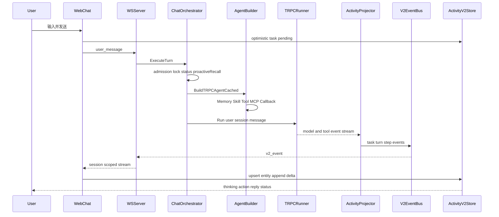

# Agent 对话端到端业务逻辑专项审查

> 日期：2026-07-15  
> 范围：用户输入 → Chat/Runner → Memory/Skill/Tool/MCP/Plugin 装配 → LLM 与工具事件 → Activity v2 → Web 前端展示与状态收敛  
> 方法：当前代码静态调用链复核 + 定向 Go/Vitest/TypeScript 验证  
> 边界：本报告只审查并给出整改与验收建议，不修改业务实现；与同日全系统审计同源的问题在本文重新按对话主链组织。

## 1. 执行结论

当前 Web 单 Agent 对话的主干是闭合的：

1. 前端创建乐观 Task，经会话级 WebSocket 发送 `user_message`。
2. `WSServer` 适配为 `biz.TurnInput`，进入 `ChatService`/`ChatOrchestrator`。
3. Orchestrator 完成准入、Session 锁、Provider/Model 解析、主动记忆召回、Agent/Runner 构建。
4. Runner 装载 Memory、Skill、Tool、MCP 与 Plugin，执行 LLM/工具循环。
5. `ActivityProjector` 将框架事件投影为 Task/Turn/Step，`Sequencer` 发布至 v2 EventBus。
6. `WSV2Subscriber` 推送 `v2_event`，前端写入 `activityV2Store`，由 v2 组件树展示。

实现中值得保留的部分包括：统一 Turn 入口、Early ACK、Run FSM、取消时继续 drain 关键事件、按 Version 合并 v2 实体、工具结果预算、Skill 渐进加载骨架、L0-L4 记忆注入以及 REST 历史水合。

但该链路目前不能认定为业务语义正确或多用户安全。最严重的断点是：

- WS/异步 Turn 丢失认证用户上下文，主 Turn 又不校验 Session owner。
- Runner 的 `AppName` 固定为 `aranea`，框架记忆工具/预加载与产品记忆的 agent scope 分裂。
- MCP 用户凭据在 Agent 构建期、Invocation 建立前解析，无法得到用户身份。
- 取消会提前释放 RunRegistry active entry，且 Activity v2 仍把取消的 Turn 投影为 completed。
- v2 实时事件没有 replay、ack 或 delta 去重，Global `session_id=*` 又收不到 v2 事件。
- Agent 缓存中的工具结果缓存不含 user/session/workspace，存在跨会话复用结果的风险。

综合判断：

| 维度 | 判断 |
|---|---|
| 主流程完整性 | B：会话级 Web 对话主路径可运行 |
| 身份与作用域 | D：用户、Session、Memory、MCP 的 scope 未统一 |
| 能力装配正确性 | C：框架完整，但缓存、确认、渐进加载存在语义分叉 |
| 终态一致性 | C-：Run/Session/Turn/Task 多状态源不完全一致 |
| 实时可靠性 | D+：无 replay/ack，持久化晚于广播，关键终态可形成只在前端见过的状态 |
| 前端状态收敛 | C-：会话级 v2 主链闭合，global/reconnect/error 路径未闭合 |
| 测试可信度 | C-：定向单测多数通过，但 TypeScript 门禁失败，Sequencer 测试存在时序不稳定与 race 门禁失败 |

## 2. 当前真实端到端链路

### 2.1 用户输入与命令通道

- 前端在 `web/src/features/chat/composables/useChatSender.ts:434-451` 构造 Agent WS payload，在 `474-491` 构造 Team payload。
- 发送前创建 `pending-user-*` 乐观 Task，真实 `task.created` 到达后按 Session 清理乐观 Task：`useChatSender.ts:536-559`、`activityV2Store.ts:49-69`。
- WS 未 OPEN 时业务消息进入不可静默丢弃的 business queue：`web/src/realtime/ws-transport.ts:304-347`。
- 后端在 `internal/server/ws_message_handler.go:94-147` 校验 payload/content，转换为 `WSTurnInput` 后异步执行。

### 2.2 Turn 与 Runner

- `internal/service/chat_orchestrator_turn.go:110-191` 获取 Session、解析 owner、加载 Agent、检查配额并登记可取消 Run。
- `chat_orchestrator_turn.go:251-263` 在 BUILD 前发布 `running`，避免前端长时间停留在未确认状态。
- `chat_orchestrator_turn.go:335-390` 并行执行 Runner BUILD、Intent Pass，并在 BUILD 前执行主动记忆召回。
- `internal/service/chat_orchestrator_turn_phases.go:530-566` 消费模型事件流，交给 v2 Projector。

### 2.3 响应投影与展示

- Tool call/result 被投影为 action Step：`internal/agent/v2/projector.go:618-670`。
- 非 streaming 事件由 Sequencer 异步入持久化队列、同步发布 EventBus：`internal/agent/v2/sequencer.go:303-345`。
- v2 WS 只按事件的 `SpiritSessionID` 精确广播：`internal/server/ws_v2_subscriber.go:84-99`、`internal/server/ws_conn.go:237-245`。
- 前端在 `useChatWorkspace.ts:127-165` 分流 system/bridge/entity 事件，在 `useChatEventRouter.ts:19-123` 写入 v2 Store。
- `ChatMessageList.vue:35-82` 优先显示 v2 活动树，只有 v2 为空时回退 legacy messages。

## 3. 状态与内容矩阵

| 业务对象 | 权威写入点 | 前端来源 | 当前问题 |
|---|---|---|---|
| Run status | `chatRunStatusTracker` + RunRegistry + Session state | `system.run_status` | cancel 后失败 defer 仍可发 failed 通知；Registry 提前释放 active |
| Session status | `SessionStatusTransitioner` | session sync/badge | 与 Activity Turn 终态可能不一致 |
| Task | ActivityProjector/Sequencer | `activityV2Store.tasks` | error bridge 不一定生成 v2 failed Task |
| Turn | ActivityProjector | `activityV2Store.turns` | cancel 仍无条件 `turn.completed` |
| Step | ActivityProjector | `activityV2Store.steps` | delta 无 event id/seq/dedup；未知 Step 的 delta 直接丢弃 |
| Tool call/result | action Step | ActionBlock | streaming tool result 不受统一预算；分类部分依赖 tool name 推断 |
| Thinking/reply | thinking/reply Step | ThinkingBlock/ReplyBlock | 重复 delta 会重复内容；断线期间 delta 无法 replay |
| Memory 注入 | BeforeModel system cue | 仅 context breakdown 间接可见 | 用户看不到召回来源和 auto-memory 回写结果 |

## 4. 关键问题登记

### 4.1 P0：身份、授权与记忆作用域

#### E2E-P0-01 主 Turn 未校验 Session owner

**证据**

- WS 鉴权后的连接持有 user，但 `handleUserMessage` 只取 `wc.sessionID`，没有 Session ownership 校验：`internal/server/ws_message_handler.go:109-139`。
- 主 Turn 只执行 `Sessions.Get(ctx, sessionID)`，未比较认证用户与 `sess.UserID`：`internal/service/chat_orchestrator_turn.go:119-134`。
- 对照路径 `ConfirmActivity`、Plan 查询已有显式 ownership 校验，说明该检查不是 Repo 的普遍保证。

**后果**

已登录用户如果获得其他 Session ID，可能向该 Session 发消息、排队或取消执行。Session ID 不应被视为授权凭据。

**验收**

- 用户 A 对用户 B Session 的 send/enqueue/cancel/get-status 全部返回 Forbidden。
- WebSocket 建连和每个上行命令都执行相同对象级授权。

#### E2E-P0-02 WS/异步 Turn 丢失认证用户，tRPC user scope 回退为 `default_user`

**证据**

- WS Turn 使用 `safego.Go(appctx.Ctx(), ...)`，不继承连接认证 context：`ws_message_handler.go:134-141`。
- `chatagent.UserIDFromCtx` 只调用 `ctxuser.TRPCUserKey`：`internal/agent/user_ctx.go:9-15`。
- `TRPCUserKey` 明确忽略 auth，未显式 `WithUserID` 时返回 `default_user`：`pkg/ctxuser/ctxuser.go:28-50`。
- 配额检查和 Runner 调用均使用该 user key：`chat_orchestrator_turn.go:168`、`chat_orchestrator_turn_phases.go` 的 LLM 调用链。

**后果**

多用户 Turn 可能共享 tRPC Session/Memory user scope，配额也可能记到默认用户；该问题与 P0-01 叠加后风险更高。

**验收**

- WS/HTTP/Channel/Cron/A2A 每个入口都有明确 principal-to-runtime-user 映射。
- Runner session key 的 UserID 与业务 Session.UserID 一致，禁止生产环境出现 `default_user`。

#### E2E-P0-03 Memory 的 AppName/Agent scope 分裂

**证据**

- Runner 未提供 `TRPCRunnerDeps.AppName` 时固定使用 `trpcscope.DefaultAppName`：`internal/agent/trpc_runtime.go:20-41`。
- tRPC Runner 以该 AppName 创建 Session key：`pkg/trpc-agent-go/runner/runner.go:480-495`。
- 框架 memory tool 用 `UserKey.AppName` 写 `ScopeID`/`AgentID`：`internal/memory/trpc/sqlite_adapter.go:548-567`。
- memory tool 查询策略以 AppName 查 Agent settings；查不到时默认策略 `MasterEnabled=false`，返回 topK=0：`internal/memory/trpc/settings_loader.go:39-66`。
- 产品主动召回却显式使用真实 agentID：`sqlite_adapter.go:770-779`；auto-memory worker也从业务 Session 重新读取真实 AgentID。

**后果**

Prompt inject/主动召回/auto-memory 与 framework memory tools/PreloadMemory 不在同一 scope。工具写入可能落入 `agent_id=aranea`，工具搜索可能直接 no-op；若同时使用 `default_user`，还可能混淆用户边界。

**验收**

- 同一 Turn 的 Runner Session、memory tool、preload、proactive recall、auto-memory 全部使用同一 `(workspace, agent, user, session)` scope。
- 集成测试覆盖“memory_add → 下一 Turn recall/inject 可见”，并断言其他 Agent/用户不可见。

### 4.2 P1：运行控制与终态一致性

#### E2E-P1-01 Cancel 提前释放 active run

`RunRegistry.Cancel` 调用 cancel 后立即删除 `activeRuns`：`internal/runtime/run_registry.go:185-230`。旧 Runner 尚未 drain/退出时，新的 Turn 可通过 active 检查进入，破坏每 Session 单活跃 Run 的约束。

应改为 `cancelling` + lease/fencing，只有旧执行确认终止后才能释放 active entry。

#### E2E-P1-02 取消 Turn 被 Activity v2 标记 completed

`OnTurnEndEnhanced` 仅把剩余 Step 标为 cancelled，随后仍调用 `OnTurnEnd`；后者无条件把 Turn 和普通根 Task标为 completed：`internal/agent/v2/projector.go:507-535,688-749`。

这会形成：

- Run = cancelled
- Session = interrupted/user_cancelled
- Step = cancelled
- Turn/Task = completed

前端刷新后基于 v2 实体可能展示“已完成”，与实时取消状态冲突。

#### E2E-P1-03 失败 defer 可发布与 cancelled 冲突的 failed 通知

执行 defer 在 `turnStatus != ok` 时直接 `publishRunStatus(... failed ...)`：`chat_orchestrator_turn.go:436-452`。该方法只发布、不走 FSM；即使 `SetRunStatus(cancelled)` 已成功，前端仍可能随后收到 failed 通知。

终态应由单一 finalize 函数根据 cancel cause、timeout、tool deny、provider error 决定一次，并以 CAS/版本号发布。

### 4.3 P1：事件可靠性与前端收敛

#### E2E-P1-04 WS 广播早于持久化完成

Sequencer 将事件非阻塞写入 `persistChan` 后立即同步发布 Bus；channel 满时事件进内存 dead-letter，但仍发给前端：`internal/agent/v2/sequencer.go:303-345`。

结果是用户可能实时看到状态，但刷新后数据库没有该状态。Critical 终态应采用 write-before-publish/outbox；内存 dead-letter 不足以跨进程恢复。

#### E2E-P1-05 v2 无 replay/ack/dedup

- 后端明确删除 WS replay，要求客户端自行调用 REST：`internal/server/ws_event.go:26-34`。
- 前端仍发送 `last_event_id`，但服务端只在 connected 回显该值。
- v2 router 明确“无 dedup”：`web/src/features/chat/composables/useChatEventRouter.ts:7-12`。
- `step.streaming` 只按到达顺序追加；Step 尚未创建时直接丢弃：`activityV2Store.ts:160-167`。

网络重连、重复投递和乱序时，可能出现缺字、重复字或永久 running Step。需要 per-session sequence、resume cursor、gap detection，以及 snapshot reconciliation。

#### E2E-P1-06 Global WS 与 v2-only 后端不闭合

- v2 subscriber 只向 `conns[exactSessionID]` 广播，不会向 `session_id=*` 广播。
- 后端 v1 ActivityEvent WS pump 已删除。
- `useChatInboundSync` 的 global consumer 只注册 `onActivityEvent`，没有 `onV2Event`：`web/src/features/chat/composables/useChatInboundSync.ts:411-416`。

因此非当前 Session 的 Channel/后台 Turn 完成通知、Session 列表刷新和自动聚焦不能依赖当前 global 链路。

#### E2E-P1-07 HTTP 回退清除乐观 Task，却依赖不存在的 replay

HTTP ACK 成功后前端删除 pending Task，注释认为重连 `event_replay` 会补回：`useChatSender.ts:618-627`，但后端 replay 已移除。WS 迟连或漏掉 `task.created` 时，用户输入会暂时或永久从当前视图消失，直到主动 REST 水合。

### 4.4 P1：Tool、MCP 与 Plugin

#### E2E-P1-08 MCP 用户凭据解析时机错误

- MCP server 在 Agent build 阶段组装：`internal/agent/tool_assembly.go:324-363`。
- `sessionUserID` 只从 Invocation.Session 读取：`tool_assembly.go:406-410`。
- Agent build 时 Invocation 尚未由 Runner 创建，因此 `RequireUserCredentials` 通常得到空 userID；失败后虽正确地不回退静态凭据，但最终 MCP 无认证：`tool_assembly.go:413-438`。

用户凭据必须在 Invocation/工具调用时解析，连接池和 ToolSet 也必须按身份分区。

#### E2E-P1-09 工具结果缓存缺少调用作用域

ToolDecorator 缓存键只有 `toolName + jsonArgs`：`internal/tools/decorator.go:315-342`。Decorator 挂在全局缓存 Agent 上，可能跨 Session/用户复用只读工具结果。

缓存键至少应包含 workspace/user/session/agent 与权限版本；对文件、知识、MCP 等身份相关工具默认禁用共享缓存。

#### E2E-P1-10 工具确认存在两条不等价路径

- 产品 callback 会发 Confirm Step、等待用户并继续/拒绝：`internal/agent/tool_confirmation.go:47-163`。
- `confirmation_guard` Runner Plugin 匹配后直接返回 blocked `CustomResult`，不进入用户确认：`internal/plugin/trpc/confirmation_guard.go:35-59`。

两者同时配置时，执行顺序决定用户看到确认卡还是直接失败。应统一为一个确认状态机和一个 UI 协议。

#### E2E-P1-11 Plugin 与 Cost Guard 不是租户级权威策略

Plugin runtime 用进程级 `active` 快照，scope 仅支持 global 或 agentID：`internal/plugin/trpc/runtime.go:143-199`。缺少 workspace/user 维度，多实例配置版本与预算计数也不是单一原子真源。Cost Guard 持久化失败的 fail-open 问题应按财务/配额策略改为 reservation + ledger。

### 4.5 P2：功能语义与可观测性

#### E2E-P2-01 Progressive Skill 模式跨层语义不一致

Aranea 将 `progressive` 传给框架 `WithSkillLoadMode`：`internal/agent/trpc_build.go:184-198,403-405`；框架归一化只识别 `once|turn|session`，未知值回退默认 `turn`：`pkg/trpc-agent-go/internal/flow/processor/skills.go:302-313`。

当前额外 guidance hook 能列出 routed skills，但 loaded-state 生命周期实际按 turn 处理。应在框架层显式支持 progressive，或由 Aranea 不再传递伪枚举并明确组合语义。

#### E2E-P2-02 Streaming Tool 绕过统一 timeout/result budget/cache

`streamableToolDecorator.StreamableCall` 直接透传 inner tool：`internal/tools/decorator.go:149-179`。普通 Call 的 60s、10KB 与缓存不适用于 streaming。长流、无限输出和敏感数据流必须在 StreamReader 层实施 deadline、byte/token budget 与取消。

#### E2E-P2-03 Auto-memory 不是耐久闭环

- MemoryJobQueue 为进程内 channel：`internal/memory/trpc/auto_memory_queue.go:67-119`。
- normal job 在 debounce 窗口直接返回，不写 dead-letter：`auto_memory_queue.go:181-191`。
- worker 重试耗尽只记指标/日志，不写持久化 DLQ：`internal/cronrunner/jobs/auto_memory.go:133-165`。
- tenant key 默认 AppName，而当前 AppName 常为 `aranea`。

进程崩溃、突发 Turn 或持续提取失败时，用户不会知道记忆未写入。应使用 durable inbox/lease/DLQ，并在对话/管理面提供 pending/failed 状态。

#### E2E-P2-04 Memory Prompt 缺统一预算与 provenance

L1/L2/L3/L4 各自有数量或字符限制，但 MemoryInject、PreloadMemory、SessionSummary 叠加没有统一 token ceiling。Prompt 中的 L3/composite 命中主要是裸文本，未携带 fact ID、source session、confidence/version，模型和用户无法判断来源。

#### E2E-P2-05 错误桥接没有形成 v2 失败实体

WS send 失败发布 `activity.bridge` 包装 v1 Task failed：`internal/server/ws_message_handler.go:250-283`。前端只把 bridge 送入 v1 system/side-effect 路径，不写 v2 Task/Step；当页面已使用 v2 时间线时，错误可能只出现通知而没有稳定 ErrorBlock。

#### E2E-P2-06 v2 delta 字段契约不完整

前端 router 把 `DeltaField` 强制收窄为 `content|reasoning`：`useChatEventRouter.ts:41-44`。若后端发 `tool_args` 等增量，Store 不具备对应字段和合并策略。

#### E2E-P2-07 历史水合吞掉子资源错误

`activityV2Store.fetchSessionHistory` 对 Turn、TeamStage、Plan、Graph 子请求统一 `.catch(() => [])`：`activityV2Store.ts:357-427`。页面会把“加载失败”显示为“没有数据”，不能标识 partial/stale/gap。

## 5. 已正确实现、建议保留

1. **统一入口**：Web/WS/Channel/Cron/A2A 最终复用 Turn gateway 和 ChatOrchestrator。
2. **Early ACK**：准入后、BUILD 前发布 running，减少用户误判卡死。
3. **取消 drain**：Stream consumer 在取消后继续读取 RunnerCompletion 等关键事件。
4. **v2 结构化展示**：Task/Turn/Step 分层比字符串消息更适合展示 thinking/action/reply。
5. **实体 Version 防旧快照覆盖**：Task/Turn/Step upsert 有版本保护。
6. **业务消息队列不静默丢弃**：前端 WS business queue 满时通知调用方回退。
7. **Tool deny 解析 fail-closed**：deny JSON 损坏时阻断全部工具。
8. **MCP required-user-credential 不回退静态凭据**：失败行为安全，但解析时机需修复。
9. **Memory Hook 顺序**：L0 压缩 → L1-L4 注入 → snapshot 的顺序合理。
10. **Auto-memory 单点触发**：RunnerCompletion 入队，业务 Worker 避免重复入队。
11. **Skill progressive UX 骨架**：routed slug、skill_load capture 和 tool-result mode 已具备。
12. **REST 历史水合**：无 replay 条件下已有 snapshot 基础，只需把它升级为明确的 reconnect reconciliation 协议。

## 6. 验证结果

### 6.1 本轮命令

| 命令 | 结果 |
|---|---|
| `go test ./internal/agent ./internal/agent/v2 ./internal/memory/trpc ./internal/plugin/trpc ./internal/server ./internal/service -count=1` | 失败：`internal/agent` 的 model registry sync 测试失败；`internal/agent/v2` 的 streaming batch merge 首次得到 0 事件；其余四包通过 |
| `go test ./internal/agent/v2 -run \"TestSequencer_StreamingBatchMerge|TestActivityProjector|Test.*Projector\" -count=3` | 通过；说明首次失败具有时序/稳定性问题，不能视为稳定门禁 |
| `go test ./internal/agent -run \"Test.*Memory|Test.*Skill|Test.*Tool|Test.*MCP|TestTRPC\" -count=1` | 通过 |
| 定向 Vitest：WS v2、event router、activityV2 store | 3 文件、15 用例全部通过 |
| `npx vue-tsc --noEmit` | 失败，约 20 个错误；包括 ChatPage 缺失 `activityTimeline`、v2Types 契约断言、状态 enum 漂移、ChatMessageList Timeout 类型错误 |

### 6.2 并行 race 门禁观察

会话开始前已有 `go test -race ./... -count=1` 在运行。本轮读取其最终结果：

- `internal/agent/v2` 测试的 `fakeBus.events` 读写发生 data race，多项 Sequencer/端到端测试因此失败。
- 多个包又因系统盘空间不足无法链接，不能据此判断生产代码 race 状态。

该结果证明当前 race 门禁不可信/不通过，但测试 race 发生在测试 fakeBus，不能直接表述为生产 Sequencer 已确认存在同一 race。

## 7. 缺失的关键验收测试

| 优先级 | 应新增测试 |
|---|---|
| P0 | 用户 A 不能 send/cancel/subscribe 用户 B 的 Session |
| P0 | WS/HTTP Turn 的 runtime UserID 与 Session.UserID 一致，生产路径不出现 `default_user` |
| P0 | memory_add 后下一 Turn 可 recall；跨 Agent/用户不可见 |
| P0 | `RequireUserCredentials` MCP 在 Invocation 时解析正确用户，连接与缓存不串用户 |
| P1 | cancel 后 Run/Session/Task/Turn/Step 全部收敛为一致终态，旧 Run 未退出前新 Turn 不可进入 |
| P1 | persist 失败、WS 断线、重连、重复和乱序 delta 的 snapshot/replay 收敛 |
| P1 | global WS 能接收 v2 后台 Session 事件并触发列表刷新 |
| P1 | confirmation_guard 与产品确认不会双重拦截，approve/deny/timeout 均有稳定 UI 状态 |
| P1 | Tool cache 在 user/session/workspace 间隔离 |
| P2 | progressive skill 的 routed → load → run → result 全链 |
| P2 | auto-memory restart/retry-exhausted/DLQ 与用户可见状态 |
| P2 | HTTP 回退后即使 WS 漏事件也能由 REST reconciliation 恢复乐观 Task |

## 8. 整改顺序

### 第一批：阻断身份与数据串扰

1. 建立统一 `ExecutionPrincipal`，从入口显式传播 user/workspace/session owner。
2. 所有 Turn/Cancel/Subscribe 先做 Session ownership/capability 检查。
3. 统一 Runner AppName、Memory agent scope 与 user scope。
4. MCP 凭据改为 Invocation/tool-call 时解析，缓存按身份分区。
5. 禁用或重新设计跨 Session 的 ToolDecorator 结果缓存。

### 第二批：统一终态和可靠事件

1. RunRegistry 引入 cancelling/lease，不在 cancel 请求时立即释放。
2. 用一个 finalize 状态机一次性写 Run/Session/Task/Turn/Step 终态。
3. Critical 事件 write-before-publish/outbox；建立 sequence、resume cursor、snapshot reconciliation。
4. Global hub 支持 v2，移除失效的 v1/replay 假设。

### 第三批：能力语义与前端可信状态

1. 合并工具确认双轨；streaming tool 实施统一预算。
2. 明确 progressive skill 在框架层的正式枚举/组合语义。
3. Auto-memory 改为耐久队列并暴露 pending/failed。
4. 前端显示 live/snapshot/gap/partial/stale/cancelling/retrying 状态。
5. 修复 TypeScript、Sequencer 稳定性与 race 测试，再将全链 E2E 设为发布门禁。

## 9. 最终判断

当前实现不是“缺少端到端链路”，而是链路已经形成后，身份、scope、终态和可靠性协议没有收敛到单一事实源。会话级 Web 对话在理想网络和单用户条件下可工作；一旦进入多用户、取消、断线、后台 Channel、MCP 用户凭据、跨 Agent 记忆或进程故障场景，就可能出现越权、数据串扰、状态矛盾或前端无法恢复。

在 E2E-P0-01～03、E2E-P1-01～11 完成前，不应把该链路标记为多租户生产就绪。
