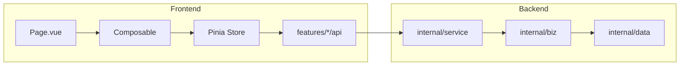

# 全导航页功能与架构评审报告

> 日期：2026-07-16  
> 范围：侧边栏全部 26 个导航页（[`web/src/config/sideNav.ts`](../../web/src/config/sideNav.ts)）  
> 方法：前端展示元素 → Composable/Store/API → 后端 RPC/biz/data 对照；核对 KPI 语义、计算路径、设计与架构合理性  
> 结论优先级：P0 功能错误/高风险 → P1 指标语义误导 → P2 架构/产品设计债  
> 本报告为评审交付物；**不默认改业务代码**。P0 修复需另开实现任务。

---

## 1. 总览结论

| 维度 | 结论 |
|------|------|
| 整体架构 | 多数页遵循 Page → Composable → Store → Kratos API，分层清晰；Chat / Memory / Overview 偏重 |
| 职责划分 | `/overview` 管用量成本，`/monitor/logs` 管运行时运维，分工基本正确；`/observability` 大半是跳转壳 |
| 正确性 | 多处「当前页/采样样本」被展示成全局 KPI；若干 RPC 错绑、假分页、本地排序不落库 |
| 扩展性 | 大量「全量拉取 + 前端分页」页在规模上来后会失真或卡顿 |

**产品建议优先级**

1. 先修会写坏数据 / 会误删 / 会看不见资源的 P0。  
2. 概览与会话/记忆的文案与采样范围一次改清（成本低、信任度高）。  
3. 中期收敛可观测壳、双配置源、taxonomy 双树、假分页。  
4. Chat 拆分与 countOnly API 作为结构性改进，勿与 P0 混在同一 PR。

---

## 2. P0 — 功能错误 / 高风险（优先修）

| ID | 问题 | 位置 | 说明与建议 | 状态 |
|----|------|------|------------|------|
| P0-1 | 组织职位排序打错服务 | [`useTaxonomyPage`](../../web/src/features/platform/useTaxonomyPage.ts) | 已改绑 `OrganizationService.ReorderOrganization` | **已修** |
| P0-2 | 用量事件 Purge 与筛选 range 耦合 | [`useUsageEventsPage`](../../web/src/features/usage/useUsageEventsPage.ts) | 独立 `retainDays` 控件（默认 30），确认文案与视图 range 解耦 | **已修** |
| P0-3 | 进化建议「全部」分页不可信 | [`features/skills/api.ts`](../../web/src/features/skills/api.ts) | 默认单类型（skill）；移除双源合并分页；API 缺省按 skill | **已修** |
| P0-4 | Tools 批量启停吞错 + 高风险无确认 | Tools 批量路径 | 汇总成功/失败；高风险批量启用二次确认 + `confirmIntent` | **已修** |
| P0-5 | Graphs 列表硬顶 50 无翻页 | [`graph` store](../../web/src/stores/graph/index.ts) | `nextPageToken` +「加载更多」追加加载 | **已修** |

---

## 3. P1 — 指标语义错误 / 误导性展示

### 3.1 概览页（深度）

锚点：[`OverviewPage.vue`](../../web/src/pages/OverviewPage.vue) ← [`useOverviewPage.ts`](../../web/src/features/usage/useOverviewPage.ts) ← `GET /v1/usage/overview`（[`internal/biz/usage/usage.go`](../../internal/biz/usage/usage.go) `Overview()`）+ Monitor / Agent / Team / Platform。

| 元素 | 现状 | 建议 | 状态 |
|------|------|------|------|
| Hero「今日调用」 | `overview.today.call_count`（模型调用，billable 已排除 `team_turn`） | 文案改为「今日模型调用」；链到 `/usage/events` | **已修** |
| Provider 费用饼图 | 由 `top_models`（最多 8）再聚合 | UI 标明 Top 模型样本 / 非全量 rollup | **已修**（文案） |
| All-models 表 | 只吃 `range`+`provider`，忽略 filter 的 model/status | 字幕说明筛选适用范围 | **已修** |
| Sparkline「今日/近期」 | 取 filtered trends 末 24 点 | 按 hour/day 粒度改标签 | **已修** |
| Provider「连通性」 | `llm-provider-models.status` 目录态 | 文案改为目录 status、非实时探测 | **已修** |
| Team 数量 O-9 | `listTeams()` 全量取 length | `ListTeams?count_only=true` + SQL `CountTeamsByWorkspace` | **已修** |
| Agent 数量 O-8 | 直调 API 绕过 Store | Overview 已用 `listAgentsPaged(limit=1)` 取服务端 `total` | **已修**（语义正确；无需 Store 绕行） |
| Fallback 列表 | 从 anomalies 客户端再筛 | 改名「异常重试事件」并说明来源 | **已修** |
| 分类数 | `organization` 树根节点数 | 标明「顶级组织」 | **已修** |

后端聚合本身（today 实时 / 历史 daily rollup、`billableOnly`）设计合理；前端语义边界与 O-8/O-9 count 路径已补齐。

### 3.2 其他页 KPI 误导

| 页面 | 问题 | 建议 | 状态 |
|------|------|------|------|
| 会话历史 | Summary 卡片除 total 外均为**当前页**统计；「活跃/运行」实为非归档行 | 标题强制「本页」+ 语义澄清 | **已修** |
| 记忆中心 | 会话 limit 30、实体 cap 50 算 KPI；冲突 API 未调却有占位文案 | 采样说明 + 冲突文案改为样本合计 | **已修** |
| Chat Spirit Token | 跨 store 内**全部 team**求和 | 限定 activeTeam，否则会话 snapshot | **已修** |
| Skills 空态 | 写「上传后续启用」但 Hero 已有上传 | 删除矛盾文案 | **已修** |

---

## 4. P2 — 架构 / 产品设计问题

| 主题 | 涉及页 | 建议 | 状态 |
|------|--------|------|------|
| 可观测壳页面 | `/observability` 4/5 tab 仅为跳转 | 收成「任务计划」单页 + 快捷跳转 | **已修**（假 Tab 移除） |
| 双仪表盘 | Overview ↔ Monitor（runner metrics 重复） | 保留 Overview 快捷条即可；Monitor 为权威运行时面（现状方向对） | 接受现状 |
| 双 embedder 配置 | `/knowledge` 与 `/settings` | Settings 热加载 + Knowledge 标明同一写入源 | **已修**（后端热加载 + FE 说明） |
| Taxonomy 树混用 | Teams 用 `taxonomy`，Agents/Org 用 `organization` | Teams 改为 `organization` 树（department_id） | **已修** |
| 本地排序不落库 | Agents、Teams | 无 sort_order 字段：禁用拖拽 | **已修**（禁用） |
| 假分页 / 硬上限 | Usage events 200、Channels/MCP/Hooks/Webhooks/Models 全量、Eval runs、A2A audit | A2A/Eval 接服务端分页；登记册标明全量切片；Usage 标明上限 | **部分**（A2A/Eval **已修**；登记册文案 **已修**；服务端分页仍待） |
| Chat 过重 | `useChatWorkspace` + 多 store | 按发送/活动/侧栏拆边界；修复 pause sessionId | **部分**（pause sessionId **已修**；拆分仍属中期） |
| 商城 vs 预设 | `/shop` vs Settings catalog | 文案区分「生态商城」与「行业预设」 | **已修** |
| 未完成入口 | Agents「迁移」即将推出 | 隐藏假 CTA | **已修** |
| 记忆冲突 API | Memory 中心 | 接线 `ListConflictingFacts` | **已修** |
| i18n 不均 | MCP/部分 Tools vs Channels/Hooks | 逐步统一 `t()` |

---

## 5. 分頁明细（26 页）

每页按：A UI / B 前端数据路径 / C 后端 / D 正确性 / E 架构 / F 技术债。

### 5.1 Workspace 组

#### 5.1.1 `/overview` — OverviewPage

| 项 | 内容 |
|----|------|
| **A UI** | CommandCenterHero、QuickActions、StatusPanels、Filter、UsageMetricCards、Trend/Pie/Rankings、AllModelsBreakdown、RunnerMetrics、Inefficient/Anomaly/Fallback |
| **B 路径** | `useOverviewPage` → `useUsageStore` + `usePlatformStore` + `useMonitorStore` + 直调 `listAgentsPaged(limit=1)` / `countTeams()` |
| **C 后端** | `UsageService.GetUsageOverview` / `ListUsageTrends` / `ListAllModelsBreakdown`；`MonitorService.GetRunnerMetrics`；`AgentService.ListAgents`；`TeamService.ListTeams`；`LlmProviderModelService`；`OrganizationService` tree |
| **D 正确性** | 见 §3.1；用量聚合 billable 过滤合理；Hero/饼图/表/sparkline 语义易误导 |
| **E 架构** | 多源并行无统一 loading/error；非单一 Dashboard RPC（可接受，但需文案边界清晰） |
| **F 债** | O-8/O-9 已修；OPT-1～4（Uptime/WS/死代码等，见 `62-overview-command-center.development.md`） |

#### 5.1.2 `/usage/events` — UsageEventsPage

| 项 | 内容 |
|----|------|
| **A UI** | Hero、筛选、事件表、本地分页、导出 CSV、Purge |
| **B 路径** | `useUsageEventsPage` → `useUsageStore` → `features/usage/api.ts` |
| **C 后端** | `ListUsageEvents` / `ExportUsageEvents` / `PurgeUsageEvents` |
| **D 正确性** | 默认 limit 200 + 本地分页 → 静默截断；Purge 已独立 retainDays（P0-2 已修） |
| **E 架构** | 账本页与 Overview 聚合面职责清晰 |
| **F 债** | `USAGE_EVENTS_LIMIT` 常量未统一引用 |

#### 5.1.3 `/chat` — ChatPage

| 项 | 内容 |
|----|------|
| **A UI** | Agent/Team 侧栏、消息区、Composer、会话树、Spirit 状态、多种 Dialog |
| **B 路径** | `useChatWorkspace` + 多 chat stores + spirit/session/knowledge/artifact |
| **C 后端** | `ChatService`、`SessionService`/`SessionV2Service`、`TeamService`、`AgentService` |
| **D 正确性** | Spirit token 限 activeTeam（P1 已修）；侧栏 pause 参数可能用 agentId 而非 sessionId；乐观 pause/resume 回滚不完整 |
| **E 架构** | 页面过重；与 Sessions/Memory/Teams 表面重叠；WS send 绕 Store |
| **F 债** | TECH-DEBT：WS bypass Store；sessionSync 模块级状态 |

#### 5.1.4 `/sessions` — SessionsPage

| 项 | 内容 |
|----|------|
| **A UI** | Summary 卡片、筛选、批量归档删除、详情、表格 |
| **B 路径** | `useSessionsPage` → `useSessionStore` → Session API |
| **C 后端** | `SearchSessions`、批量归档/删除、Export 等 |
| **D 正确性** | Summary 卡片已标明「本页」语义（P1 已修） |
| **E 架构** | 分层清晰；与 Chat 会话列表双 Store |
| **F 债** | 无标记 TECH-DEBT |

#### 5.1.5 `/memory` — MemoryCenterPage

| 项 | 内容 |
|----|------|
| **A UI** | Agent 选择、KPI 卡、6 Tabs（总览/知识/Cascade/会话/进化/设置） |
| **B 路径** | `useMemoryCenterPage` → memory + agents catalog + session stores |
| **C 后端** | `MemoryService` 多 RPC；会话经 `SearchSessions`；设计中的 `GetMemoryOverview` **未落地** |
| **D 正确性** | KPI 标明采样范围；冲突 KPI 已接 `ListConflictingFacts.total`（无全量冲突列表 Tab） |
| **E 架构** | Dashboard-of-dashboards；单 composable 过重 |
| **F 债** | 可选：冲突列表 Tab + 服务端分页 |

---

### 5.2 Agents 组

#### 5.2.1 `/agents` — AgentsPage

| 项 | 内容 |
|----|------|
| **A UI** | Hero、筛选、网格/表、分页、创建/删除 Dialog |
| **B 路径** | `useAgentsPage` → `useAgentsPageStore` |
| **C 后端** | `AgentService` CRUD/Favorite/Templates；组织树 |
| **D 正确性** | 拖拽已禁用（无 sort_order）；迁移假 CTA 已隐藏 |
| **E 架构** | Page/Composable/Store 分离良好 |
| **F 债** | 迁移未实装 |

#### 5.2.2 `/settings/organization` — OrganizationPage

| 项 | 内容 |
|----|------|
| **A UI** | 树/卡片、公司/部门/职位统计、CRUD Dialog |
| **B 路径** | `useTaxonomyPage` → `usePlatformStore`（resource=`organization`） |
| **C 后端** | `OrganizationService`；**Reorder 误走 TaxonomyService = P0-1** |
| **D 正确性** | 统计为全树、列表可过滤 → 数字与可见节点不一致；成功 toast「分类」用词不当 |
| **E 架构** | 复用 Taxonomy UI 组件可接受，但服务边界必须分清 |
| **F 债** | 错绑 RPC 未标注 TECH-DEBT |

#### 5.2.3 `/team` — TeamsPage

| 项 | 内容 |
|----|------|
| **A UI** | 行业分组卡片、编辑/Runs/Test Dialog、客户端分页 |
| **B 路径** | `useTeamsPage` → `useTeamsStore`；dead letter 直调 API |
| **C 后端** | `TeamService`；taxonomy 树（非 organization） |
| **D 正确性** | `findActiveTeamRun` 前端扫最多 200 runs；排序本地；industry 树可能与 Org 不一致 → 大量「未分类」 |
| **E 架构** | 与 Chat Spirit / Observatory 路由重叠合理 |
| **F 债** | TECH-DEBT：reorder local-only；findActiveTeamRun 应后端 RPC |

#### 5.2.4 `/graphs` — GraphsPage

| 项 | 内容 |
|----|------|
| **A UI** | 卡片列表、详情侧栏、运行 Dialog、模板创建 |
| **B 路径** | `useGraphsPage` → `useGraphStore`；`useGraphExecute` |
| **C 后端** | `GraphService`（含 `ReorderGraphs` — 已落库） |
| **D 正确性** | **列表硬顶 50 无翻页 = P0-5**；运行 sessionId 合成 `graph-${Date.now()}` |
| **E 架构** | Reorder 正确（Agents/Teams 应对齐此模式） |
| **F 债** | 无分页 UI 消费 `GRAPH_LIST_PAGE_SIZE` |

---

### 5.3 Models 组

#### 5.3.1 `/models` — ResourceManagerPage

| 项 | 内容 |
|----|------|
| **A UI** | Provider 表、向导、趋势 Dialog、加密告警 |
| **B 路径** | `useResourceManagerPage` → platform store；catalog 直调 API |
| **C 后端** | `LlmProviderModelService`；趋势走 Usage events |
| **D 正确性** | 全量拉取 + 客户端分页；筛选不重置 page |
| **E 架构** | Generic ResourceManager 可扩展；向导耦合高 |
| **F 债** | TECH-DEBT catalog-bypass |

#### 5.3.2 `/channels` — ChannelsPage

| 项 | 内容 |
|----|------|
| **A UI** | 表、启用/测连、Ops（TurnJobs/Deliveries）、编辑器 |
| **B 路径** | `useChannelsPage` → `useChannelsStore` |
| **C 后端** | `ChannelService` 全套 |
| **D 正确性** | 筛选不重置 page；status 与 enabled 双维度易混 |
| **E 架构** | Store 拉 agents/teams 做路由选项（跨模块） |
| **F 债** | TECH-DEBT channel-store-catalog；locale defaults |

---

### 5.4 Tools 组

#### 5.4.1 `/mcp-servers` — McpServersPage

| 项 | 内容 |
|----|------|
| **A UI** | 服务器表、健康态、凭证 Dialog |
| **B 路径** | `useMcpServersPage` 本地 `rows` 副本 + mcp store |
| **C 后端** | `MCPServerService` |
| **D 正确性** | 本地 rows 与 store 可能漂移；health 依赖 metadata 刷新 |
| **E 架构** | 缺 i18n / route meta.title |
| **F 债** | 无标记 TECH-DEBT |

#### 5.4.2 `/tools` — ToolsPage

| 项 | 内容 |
|----|------|
| **A UI** | Metric strip（后端 summary）、筛选、表、详情/编辑、批量栏 |
| **B 路径** | `useToolsPage` → tools / detail / editor stores |
| **C 后端** | `ToolService`（`ListTools` 含 `ToolSummary`） |
| **D 正确性** | **批量吞错 + 高风险无确认 = P0-4**；关闭编辑器可能重开陈旧详情 |
| **E 架构** | 本组最成熟（服务端分页 + 后端 summary）；三 store 协调略脆 |
| **F 债** | 无 |

#### 5.4.3 `/skills` — SkillsPage

| 项 | 内容 |
|----|------|
| **A UI** | 上传、文件系统健康、表、编辑器、runs 链接 |
| **B 路径** | `useSkillsPage` → skills store；文件 ops 直调；import 走 admin REST |
| **C 后端** | `SkillService` + `/v1/skills/filesystem-health` / import REST |
| **D 正确性** | 空态文案与上传按钮矛盾 |
| **E 架构** | 混合 Kratos + REST |
| **F 债** | TECH-DEBT(FD5) file ops bypass store |

#### 5.4.4 `/skills/evolution-suggestions` — EvolutionSuggestionListPage

| 项 | 内容 |
|----|------|
| **A UI** | 筛选、表、Approve/Reject、Curator 触发 |
| **B 路径** | `useEvolutionSuggestionListPage` → skillEvolution store → unified API |
| **C 后端** | `skill_evolution_suggestion/v1` + `skill_evolution/v1` 双源合并 |
| **D 正确性** | **「全部」分页不可信 = P0-3**；skill 名空；sandbox 三态压成 bool |
| **E 架构** | 统一视图脆弱；应后端统一 list |
| **F 债** | TODO skill_name lookup；trigger_source 硬编码 |

#### 5.4.5 `/skills/experience-reports` — ExperienceReportListPage

| 项 | 内容 |
|----|------|
| **A UI** | FailureTags 图、RootCause 卡、报表表 |
| **B 路径** | `useExperienceReportListPage` → skillIntelligence store |
| **C 后端** | `SkillIntelligenceService.ListExperienceReports`（含聚合字段） |
| **D 正确性** | 日期按 UTC 午夜；空表时隐藏仍可能有意义的聚合图 |
| **E 架构** | 后端聚合正确，边界清晰 |
| **F 债** | 无 |

#### 5.4.6 `/plugins` — PluginsPage

| 项 | 内容 |
|----|------|
| **A UI** | 表、scope/config Dialog、runs 链接 |
| **B 路径** | `usePluginsPage` → plugins store；agent 选项直拉 catalog limit 200 |
| **C 后端** | `PluginService` |
| **D 正确性** | Agent 选择器可能截断；sort bump 客户端竞态 |
| **E 架构** | 只读注册表 + 配置，合理 |
| **F 债** | 无 |

#### 5.4.7 `/hooks` — HooksPage

| 项 | 内容 |
|----|------|
| **A UI** | 表、编辑器、deliveries 链接 |
| **B 路径** | `useHooksPage` → hooks store |
| **C 后端** | `HookService` |
| **D 正确性** | Update 前 Get+merge，竞态窗口 |
| **E 架构** | i18n 较好；与 plugin callback 常量共享 |
| **F 债** | TECH-DEBT：Get+merge，需 field_mask |

#### 5.4.8 `/webhooks` — WebhooksPage

| 项 | 内容 |
|----|------|
| **A UI** | 表、Dialog（URL/secret） |
| **B 路径** | `useWebhooksPage` → webhooks store |
| **C 后端** | `GatewayService` Webhook RPCs（工厂名 `createWebhookService`） |
| **D 正确性** | Update 部分字段依赖后端 merge 不擦 secret |
| **E 架构** | 无投递日志入口（对比 Hooks deliveries） |
| **F 债** | 无 |

#### 5.4.9 `/a2a` — A2APage

| 项 | 内容 |
|----|------|
| **A UI** | Discover / Gateway / Remote / Audit / Invoke 五 Tab |
| **B 路径** | `useA2APage` → a2a store |
| **C 后端** | `A2AService` |
| **D 正确性** | 共享 error 跨 Tab；audit 已接 `limit/offset/total` 服务端分页；runtime config 失败静默 |
| **E 架构** | 管理调试面完整；mount 急切加载偏重 |
| **F 债** | 无 |

---

### 5.5 Knowledge 组

#### 5.5.1 `/knowledge` — KnowledgePage

| 项 | 内容 |
|----|------|
| **A UI** | Embedder 面板、集合列表、文档/搜索、摄取 Dialog |
| **B 路径** | `useKnowledgePage` → knowledge store + ingest WS |
| **C 后端** | `KnowledgeService`（依赖 Postgres + pgvector） |
| **D 正确性** | 集合 limit 100；与 Settings 双 embedder 配置源 |
| **E 架构** | 分层正确 |
| **F 债** | 文档缓存无 TTL；部分搜索 proto 字段未暴露 UI |

#### 5.5.2 `/artifacts` — ArtifactsPage

| 项 | 内容 |
|----|------|
| **A UI** | 表、上传、签名下载、版本 Dialog |
| **B 路径** | `useArtifactsPage` → artifact store |
| **C 后端** | `ArtifactService` |
| **D 正确性** | 上传强制 sessionId；存储后端（S3/COS）未成熟 EP-RT-08 |
| **E 架构** | 分页映射清晰 |
| **F 债** | EP-RT-08 storage |

#### 5.5.3 `/evaluation` — EvaluationPage

| 项 | 内容 |
|----|------|
| **A UI** | Dataset 列表、Runs、Analytics、结果/标注 Dialog |
| **B 路径** | `useEvaluationPage` → evaluation store |
| **C 后端** | `EvaluationService`（含 trend/compare） |
| **D 正确性** | Runs / case results 已接 `limit/offset/total` 服务端分页；无自动轮询长任务 |
| **E 架构** | Analytics 专用 RPC 正确；对比面板仅见当前页 runs |
| **F 债** | Service IDOR 日志 TECH-DEBT(P2-B) |

---

### 5.6 Ops 组

#### 5.6.1 `/observability` — ObservabilityDashboardPage

| 项 | 内容 |
|----|------|
| **A UI** | 任务计划主区 + 快捷跳转（Team/Graph/Monitor） |
| **B 路径** | `useObservabilityDashboard` → Chat `ListPlans` / `GetPlan` |
| **C 后端** | Chat task-plan RPCs |
| **D 正确性** | 需手填 sessionId；不再用假 Tab 伪装完整仪表盘 |
| **E 架构** | 计划查询页 + 外链；运行时权威面仍在 Monitor |
| **F 债** | 可选嵌入 Monitor 组件 |

#### 5.6.2 `/cron` — CronTasksPage

| 项 | 内容 |
|----|------|
| **A UI** | 任务表、编辑器、运行历史、Trigger/Reset |
| **B 路径** | `useCronTasksPage` → cron store |
| **C 后端** | `CronService` |
| **D 正确性** | 状态筛选客户端；enabled 与 dead 语义需注意 |
| **E 架构** | 登记册 UX 清晰 |
| **F 债** | Service IDOR 日志 TECH-DEBT(P2-B) |

#### 5.6.3 `/monitor/logs` — MonitorPage

| 项 | 内容 |
|----|------|
| **A UI** | Usage（自检+Runner+链 Overview）、Alerts、Audit、Events、Traces、Logs |
| **B 路径** | `useMonitorPage` → monitor store + WS |
| **C 后端** | `MonitorService`（runner metrics 读 `runner.completion`，非 usage 表） |
| **D 正确性** | 30s 刷新仅部分 Tab；路由名暗示「仅日志」 |
| **E 架构** | **运行时运维权威面**；与 Overview 分工正确 |
| **F 债** | Usage Tab 刻意镂空，依赖跨链纪律 |

#### 5.6.4 `/shop` — EcosystemPage

| 项 | 内容 |
|----|------|
| **A UI** | 预览 Banner、产品网格、安装/发布 |
| **B 路径** | `useEcosystemPage` → ecosystem store |
| **C 后端** | `EcosystemService`（≠ Settings 行业预设 admin API） |
| **D 正确性** | 技术预览 SLA；安装态非生产级 |
| **E 架构** | 与 Settings catalog「生态」概念易混 |
| **F 债** | 预览标记 |

#### 5.6.5 `/settings` — SystemSettingsPage

| 项 | 内容 |
|----|------|
| **A UI** | 路径/A2A/加密/预算/MCP/Embedder/Eval LLM/WebResearch；Catalog 预设 |
| **B 路径** | `useSystemSettingsPage` → system settings store + A2A runtime；preset 走 raw kratosApi |
| **C 后端** | `SystemSettingService`；preset 非 proto admin 路由 |
| **D 正确性** | Embedder 双入口；全局预算 ≠ Overview 配额看板 |
| **E 架构** | 通用设置扎实；preset 客户端债 |
| **F 债** | TODO migrate ecosystem preset to protobuf client |

---

## 6. Overview ↔ Observability ↔ Monitor 职责对照

| 关注点 | `/overview` | `/observability` | `/monitor/logs` |
|--------|-------------|------------------|-----------------|
| 角色 | 指挥中心 + 用量/成本 | 任务计划检查器 + 链接枢纽 | 完整运维控制台 |
| Runner metrics | Overview 快捷条 | Stub → Monitor | 权威面板 |
| 用量/成本 | 主表面 | Stub → Monitor → Overview 链 | Usage Tab 仅链接 Overview |
| Logs/Traces | 快捷链 | Stub | 真数据 |
| Task plans | 无 | **唯一实装能力** | 无 |

**结论**：不是三套重复仪表盘。Overview 管用量；Monitor 管运行时；Observability 应瘦身或实装，避免侧栏占位误导。

---

## 7. Overview 数据链路（计算正确性摘要）

| 指标族 | 计算位置 | 要点 |
|--------|----------|------|
| today/yesterday/month/range | `UsageUsecase.Overview` → events 或 daily rollup | today 始终实时；历史日可用 daily；`team_id` 过滤禁用 daily |
| trends | `Trends()`；hour 时前端二次 `ListUsageTrends` | Overview 默认日趋势可被替换 |
| top_models/agents | Top-8，按 cost 排序 | Provider 饼图再聚合会丢尾部 |
| anomalies | 强制 `status=abnormal`，limit 12 | 忽略 filter bar status |
| quota_dashboard | 活跃配额 + BatchSumScopeCost | 缺价模型 → 花费可能为 0 |
| inefficient_models | 启发式（调用≥3、费用门槛、低 TPS/高失败） | 业务启发式，非故障检测 |
| billable | `usage_kind <> 'team_turn'` | 避免 Team 双计费，正确 |
| runner | `GetRunnerMetrics` 数 `runner.completion` | 与 usage 表无关 |

---

## 8. 交叉主题矩阵

| 主题 | 涉及页面 |
|------|----------|
| 客户端聚合冒充全局 KPI | Sessions、Memory、Overview（部分）、Chat Spirit tokens |
| 本地排序不落库 | Agents、Teams（Graphs 已落库） |
| Taxonomy 双树 | Teams(`taxonomy`) vs Agents/Org(`organization`) |
| 假分页 / 硬上限 | Usage events、Graphs、Models、Channels、MCP、Hooks、Webhooks、Eval、A2A audit、Memory samples |
| 双配置源 | Knowledge embedder ↔ Settings |
| Store 绕行 | Overview counts、Skills files、Platform catalog、Channels agents/teams |
| 壳 / 假入口 | Observability stubs、Agents 迁移 |

---

## 9. 成熟度速览

| 组别 | 页面 | 成熟度 |
|------|------|--------|
| Workspace | 概览 | 功能深；语义/采样问题多 |
| | 用量事件 | 账本正确；假分页 + Purge 危险 |
| | 聊天 | 核心强；过重 + 语义风险 |
| | 会话 | CRUD 清晰；KPI 页局部 |
| | 记忆 | Tab 过多；采样 KPI |
| Agents | Agent | 列表好；拖拽/迁移债 |
| | 组织 | CRUD 可用；**Reorder P0** |
| | Team | 功能全；树/排序/全量列表债 |
| | Graph | Reorder 正确；**50 硬顶 P0** |
| Models/Tools | 模型/Channel/MCP | 可用；全量分页模式 |
| | Tools | 后端 summary 优秀；批量安全差 |
| | Skills 系 | 混合 REST；进化合并分页 P0 |
| | Plugin/Hook/Webhook/A2A | 登记册合理；局部债 |
| Knowledge/Ops | 知识/制品/评估 | 可用；依赖与上限 |
| | 可观测 | 计划查询 + 跳转（已瘦身） |
| | Cron/监控/设置 | 清晰；监控为权威运维面 |
| | 商城 | 技术预览 |

---

## 10. 建议后续动作

| 阶段 | 动作 | 本报告状态 |
|------|------|------------|
| 已交付 | 本评审报告 + 交叉参考 Overview 映射补丁 | 完成 |
| P0 修复 | Org Reorder → Usage Purge → Graphs 加载更多 → Evolution 单类型分页 → Tools 批量安全 | **已完成**（2026-07-16） |
| P1 修复 | 概览/会话/记忆文案与采样语义；Chat Spirit Token 作用域；Skills 空态 | **已完成**（2026-07-16） |
| P2 修复 | count API、Observability 瘦身、taxonomy、拖拽禁用、embedder 热加载、商城文案、迁移 CTA、Usage 200 上限提示、冲突事实 API、Chat pause sessionId | **已完成**（2026-07-16） |
| P2+ 分页 | A2A audit / Eval runs+results 服务端分页；Channels/MCP/Hooks/Webhooks/Models 全量切片文案 | **已完成**（2026-07-16）；登记册服务端分页仍属后续 |
| 中期 | Chat 拆分、Channels/MCP/Hooks/Webhooks/Models/Usage 服务端分页 | 规划项 |

---

## 11. 关键文件索引

| 用途 | 路径 |
|------|------|
| 侧栏配置 | `web/src/config/sideNav.ts` |
| 路由 | `web/src/router/routes.ts` |
| 概览 | `web/src/pages/OverviewPage.vue`、`web/src/features/usage/useOverviewPage.ts` |
| 用量 biz | `internal/biz/usage/usage.go` |
| 用量 data | `internal/data/usage.go`、`usage_daily.go`、`usage_sql.go` |
| 监控 runner | `internal/biz/monitor/monitor.go` |
| 概览设计 | `docs/development/62-overview-command-center.*.md`、`18-monitor.design.md` |
| 模块交叉参考 | `docs/development/65-module-cross-reference-full.md` |

---

## 12. 修订记录

| 日期 | 说明 |
|------|------|
| 2026-07-16 | 初版：全侧栏 26 页前后端对照评审，含 P0–P2 与概览深度核对 |
| 2026-07-16 | P0 落地：Org Reorder 改绑 OrganizationService；Usage Purge 独立 retainDays；Graphs 加载更多；进化建议默认单类型分页；Tools 批量错误汇总+高风险确认 |
| 2026-07-16 | P1 落地：概览/会话/记忆 KPI 文案与采样说明；Hero 链至用量事件；Spirit Token 限 activeTeam；Skills 空态修正 |
| 2026-07-16 | P2 落地：Teams `count_only`+SQL count；Overview KPI；Observability 假 Tab 移除；Teams taxonomy→organization；拖拽禁用；Settings embedder 热加载；商城/迁移/Usage 上限文案；Memory 冲突 API；Chat pause 用 sessionId |
| 2026-07-16 | P2+：A2A audit / Eval runs+results 接服务端分页；Channels/MCP/Hooks/Webhooks/Models 标明全量前端切片；Usage hero 引用 `USAGE_EVENTS_LIMIT` |
