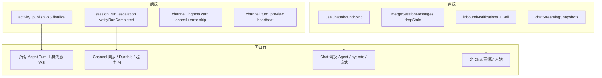

# M55 Phase R-UX — Code Review

> **依据**：[`docs/README.md`](../README.md) · [`docs/review/README.md`](./README.md) · [Stuck-Turn 分析](../changelog/2026-05-23-M55-Stuck-Turn-Inbound-Sync-Analysis.md) · [Implementation](../changelog/2026-05-23-M55-Phase-R-UX-Implementation.md)  
> **审查时间**：2026-05-23 · **范围**：CC-FIX-TOOL-01~03 · CC-FIX-CHANNEL-01/02 · CC-B-06b · CC-WEB-NOTIFY · CC-WEB-REASONING-01 · CC-FEISHU-02 · CC-UX-01~02

---

## 综合评级

| 指标 | 结果 |
|------|------|
| **总分** | **78 / 100**（较 Run Lifecycle Review **+2**） |
| **风险等级** | **P1**（出站回复选取 · auto-focus 抢焦点 · 卡片 cancel 鉴权） |
| **需求闭环** | 卡 Turn / 工具假死 / 铃铛通知 **主路径可演示**；E2E 与运维项仍缺 |

### 六维得分

| 维度 | 权重 | 得分 | 说明 |
|------|------|------|------|
| 需求符合度 | 20 | **18** | 分析文档 11 项中 10 项已代码落地；CC-FEISHU-OPS 仍运维 |
| 架构一致性 | 25 | **20** | 分层正确；`SessionRunEscalationNotifier` 职责膨胀 |
| 后端实现质量 | 20 | **15** | TOOL-01/CHANNEL 闭环有效；completion 回复选取与错误吞没 |
| 前端实现质量 | 15 | **13** | 铃铛 + snapshot 可用；auto-focus 缺偏好与 i18n |
| 测试与验证 | 10 | **5** | 仅 `PublishStuck` + merge 单测；缺 card/cancel/completion E2E |
| 文档一致性 | 10 | **7** | development / changelog 已标 ✅；缺本 Review 前未同步 |

---

## 1. 变更影响域



| 模块 | 文件 | 影响 |
|------|------|------|
| Agent 流式 | `activity_publish.go` · `stream_consumer.go` | **全局**：Turn 结束 orphan tool 补 WS |
| Channel 出站 | `session_run_escalation_notifier.go` · `chat_durable_resume.go` | Durable 完成飞书终稿 |
| Channel 入站 | `channel_ingress_*.go` · `feishu_escalate_card.go` | 卡片 cancel · 超时文案 |
| Chat WS 前端 | `useChatInboundSync.ts` · `streamHandlers.ts` | 入站 sync · 工具收尾 |
| Chat UI | `MainLayout.vue` · `inboundNotifications.ts` | 全局铃铛 |

---

## 2. 做得好的地方

| 项 | 评价 |
|----|------|
| **CC-FIX-TOOL-01** | 根因命中：`FinalizeStuckToolActivities` 只落库不发 WS → 前端永久「正在执行」。`PublishStuckToolResultEnvelopes` 与 DB finalize 分离，即使无 `ActivityPersister` 也能通知 UI |
| **CC-FIX-TOOL-02/03** | Global inbound 与 Session WS 终态逻辑对齐；`dropStaleInFlight` 避免 hydrate 后 merge 保留 ghost `tool_running` |
| **CC-UX-01~02** | 超时文案统一 `/background`；escalating/durable 时跳过重复 timeout IM，与 M55 Run 语义一致 |
| **CC-FIX-CHANNEL-02** | Preview 无 deliverable 正文时 PATCH heartbeat，飞书侧不再「完全无感知」 |
| **分层** | `internal/biz` 未触 trpc-agent-go；Channel 仍经 `channelChatTurnGateway` 窄接口 |

---

## 3. 问题清单（按优先级）

### P1 — 当前迭代应修

| ID | 维度 | 问题 | 代码锚点 | 建议 |
|----|------|------|----------|------|
| **RUX-P1-01** | 业务逻辑 | `NotifyRunCompleted` 取 **会话最后一条** assistant，非 **本 run** 回复；用户 Durable 期间再发消息会发错内容 | `latestAssistantReply` · `session_run_escalation_notifier.go` L72–88 | 按 `run.TurnID` / `run.StartedAt` 过滤；或 durable resume 返回 `asst.ContentMarkdown` 直传 |
| **RUX-P1-02** | 业务逻辑 / UX | **auto-focus 无守卫**：Channel `run_status=running` 即 `focusSessionById`，用户在 Chat 页编辑另一 session 会被抢焦点 | `useChatInboundSync.ts` L206–208 | 增 `channel_auto_focus` 设置；composer 非空 / 非 idle 时只铃铛不 focus |
| **RUX-P1-03** | 安全 / 业务 | 卡片 **「取消执行」** 未像 `EscalateSessionRun` 校验 `session_run_id` ↔ session；仅 `CancelRun(sessionID)` | `handleFeishuCardCancel` · `resolveCardActionSessionID` L91–92 信任 card `session_id` | cancel 亦校验 run 归属；或忽略 card 内 session_id，仅用 peer 解析 |
| **RUX-P1-04** | 错误处理 | Durable resume **失败**无 IM 通知；用户仅见「已转入后台」再无下文 | `chat_durable_resume.go` L72–74 | `Fail` 后 `NotifyRunFailed` 或复用 `deliverTurnErrorReply` 路径 |
| **RUX-P1-05** | 回归风险 | `dropStaleInFlight` 丢弃 **全部** in-flight 行（含 `ws-stream-*`），Turn 完成 hydrate 窗口可能闪空 | `mergeSessionMessages.ts` L22–26 | 终态 merge 仅 drop `tool_running`/`tool_blocked`，保留 streaming 行至 server 覆盖 |

### P2 — 下一迭代

| ID | 维度 | 问题 | 建议 |
|----|------|------|------|
| **RUX-P2-01** | 架构 / SRP | `SessionRunEscalationNotifier` 兼管 soft/durable/**completed** | 拆 `SessionRunIMNotifier` 或 completion 独立接口 |
| **RUX-P2-02** | 前端 | `streamingSnapshots.put` 对 `text_done` **累加**而非 replace，可能与 `patchStreamingMessage` replace 语义冲突 | `done: true` 时 replace 快照字段 |
| **RUX-P2-03** | 前端 | `applyStreamingSnapshotToSession` 要求已有 `ws-stream-*` 行；hydrate 后无 ephemeral 行则 snapshot 无效 | load 后无 stream 行则 insert placeholder 再 merge |
| **RUX-P2-04** | 前端 | 通知文案硬编码中文；铃铛仅在 `MainLayout` desktop | i18n + mobile header |
| **RUX-P2-05** | 后端 | `PublishStuckToolResultEnvelopes` 缺 `attachActivityMetadata`（display_label/duration） | 复用 projector helper 或从 pending tc 拷贝 |
| **RUX-P2-06** | 后端 | 飞书 outbound 无 **平台长度截断**（`preview.SplitPages` 仅 preview 路径） | `NotifyRunCompleted` 走 `SplitPages` |
| **RUX-P2-07** | 测试 | 无 `handleFeishuCardCancel` / `shouldSkipTurnErrorReply` / `NotifyRunCompleted` 单测 | 补 service 单测 + CC-E2E-RUN-05 手工项 |

### P3 — 优化建议

| ID | 说明 |
|----|------|
| RUX-P3-01 | 非 Chat 路由入站：仅铃铛、不 auto-focus — 已部分满足；可恢复轻量 toast 作双通道 |
| RUX-P3-02 | `inboundNotifications` 持久化 localStorage，刷新不丢 |
| RUX-P3-03 | `NotifyRunCompleted` 错误应 FlowLog warn（现 `_ =` 吞没） |

---

## 4. 分模块 Review

### 4.1 后端 — 工具终态 WS（CC-FIX-TOOL-01）

```49:69:internal/agent/activity_publish.go
// PublishStuckToolResultEnvelopes emits failed tool_result envelopes for orphan in-flight tools (CC-FIX-TOOL-01).
func PublishStuckToolResultEnvelopes(ctx context.Context, meta ProjectMeta, bus event.Bus, pending map[string]event.EnvelopeToolCall) {
	// ...
		bus.Publish(ctx, env)
}
```

| 项 | 结论 |
|----|------|
| 单一职责 | ✅ `stuckToolCallPatch` 复用 DB/WS |
| 错误处理 | ⚠️ 无 publish 失败路径（内存 bus 可接受） |
| 影响域 | **高** — 所有 Turn 提前结束且 orphan tool 的路径 |
| 回归 | 真完成的 tool 不应进 `pending`；需确认 parallel tool 正常 result 仍 delete pending |

### 4.2 后端 — Durable 完成出站（CC-FIX-CHANNEL-01）

```55:69:internal/service/session_run_escalation_notifier.go
func (n *channelRunEscalationNotifier) NotifyRunCompleted(ctx context.Context, run biz.SessionRun) error {
	// ...
	reply := latestAssistantReply(ctx, n.sessions, run.SessionID)
```

| 项 | 结论 |
|----|------|
| 业务闭环 | ✅ 填补 Durable 完成后 IM 空白 |
| 逻辑缺陷 | 🔴 **RUX-P1-01** last assistant ≠ this run |
| 触发面 | 仅 `ResumeDurableSessionRun` 成功路径；interactive 同步仍靠 ingress |
| 幂等 | `idempotencyKey run:{id}:completed` ✅ |

### 4.3 后端 — 卡片取消（CC-FEISHU-02）

| 项 | 结论 |
|----|------|
| UX | ✅ 与「后台继续」对称 |
| 鉴权 | 🔴 **RUX-P1-03** background 有 `EscalateSessionRun(sessionRunID, sessionID)`；cancel 无 run 校验 |
| 业务 | `CancelRun` 不标记 `session_run` failed — Jobs 面板可能仍显示 running |

### 4.4 前端 — 入站同步（CC-FIX-TOOL-02/03 · CC-B-06b）

| 项 | 结论 |
|----|------|
| 工具假死 | ✅ `finalizeOrphanToolMessages` + `dropStaleInFlight` 双保险 |
| auto-focus | 🔴 **RUX-P1-02** 缺用户偏好与 composer 守卫 |
| 通知 | ✅ 铃铛替代 bottom toast；非 Chat 页依赖用户点铃铛 |
| 可读性 | `handleInboundEnvelope` 仍 ~90 行分支 — 可抽 `handleChannelRunning` / `handleTurnTerminal` |

### 4.5 前端 — 思考快照（CC-WEB-REASONING-01）

| 项 | 结论 |
|----|------|
| 设计 | ✅ 流式放模块级 cache、terminal 写 DB 一次 — 符合分析文档 |
| 实现 | ⚠️ 模块级 `ref` 非 Pinia — HMR/多实例边界模糊 |
| 切 Agent | 去掉 `clearSessionMessages` ✅ 保留 snapshot；但 **RUX-P2-03** hydrate 后可能不 apply |

---

## 5. 优化计划（建议排期）

### Sprint A — P1（~1.5d）

| ID | 任务 | 验收 |
|----|------|------|
| **RUX-P1-01** | completion 回复按 `TurnID` / resume 返回值 | Durable 完成后 IM 内容与 Web 该轮一致 |
| **RUX-P1-02** | auto-focus 守卫 + 可选设置 | 编辑中不抢焦点；默认 `notify_only` 可配置 |
| **RUX-P1-03** | cancel 卡片 ownership | 与 CC-R-OPT-02 同级测试 |
| **RUX-P1-04** | Durable fail IM | Fail 后飞书收到明确失败文案 |
| **RUX-P1-05** | `dropStaleInFlight` 仅 drop tool 行 | Turn 完成不闪空消息区 |

### Sprint B — P2（~1d）

| ID | 任务 |
|----|------|
| RUX-P2-01~02 | 接口拆分 + snapshot replace 语义 |
| RUX-P2-05~07 | 单测 + E2E 清单扩展 |

---

## 6. 验证建议

```bash
# 已实现最小集
go test ./internal/agent/ -run PublishStuck -count=1
go test ./internal/service/ -run "ChannelTurn|CardAction|FormatChannel" -count=1
cd web && pnpm test -- mergeSessionMessages envelopeToolCall

# 建议补跑（提交前）
make runtime-boundary
go test ./internal/service/ -run "EscalateSessionRun|DurableResume" -count=1
cd web && pnpm lint && pnpm build
```

**手工 E2E（CC-E2E-RUN-05 扩展）**

1. 飞书长任务 → Durable → 完成：IM 终稿与 Web 最后一轮 assistant **一致**
2. Web 编辑 session A 时飞书 session B 入站：**不抢焦点**，铃铛 unread +1
3. 卡片「取消执行」：run 停止 + Web 工具变 cancelled
4. Turn 结束 orphan tool：Web 工具 failed，非永久 running

---

## 7. 结论

Phase R-UX **正确命中** 卡 Turn / 工具假死 / 飞书无终稿等根因，架构分层与 M55 蓝图一致。当前主要风险不在「能不能跑通」，而在 **completion 回复准确性**、**auto-focus 体验回归** 与 **卡片 cancel 鉴权对称性**。建议先完成 Sprint A 五项再标「生产就绪」，并补 CC-FEISHU-OPS-01 运维 checklist。
