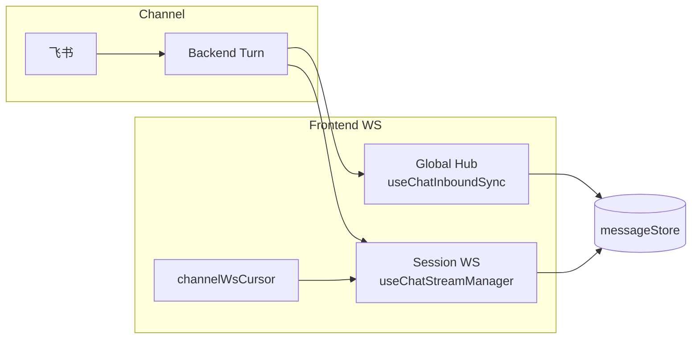

# DECO-01 Channel 同步 Holistic Fix — Code Review

> **日期**：2026-05-24  
> **依据**：[docs/README.md](../README.md) · [docs/review/README.md](./README.md) · [Chat-Flow-Full-Review](./2026-05-23-Chat-Flow-Full-Review.md) · [Channel-Inbound-Review](./2026-05-22-Channel-Inbound-Review.md)  
> **关联变更**：[Holistic Fix changelog](../changelog/2026-05-24-DECO-01-Channel-Sync-Holistic-Fix.md) · [E2E 归档](../changelog/2026-05-24-DECO-01-Feishu-Web-E2E-Archive.md)  
> **范围**：飞书/Web 同 Session 同步回归修复（前端为主）— `useChatInboundSync` · `useChatStreamManager` · `messageStore` · `useChatEntityNav` · `channelWsCursor`

---

## 综合结论

| 项目 | 结论 |
|------|------|
| **综合评级** | **B（78 / 100）** — 根因判断正确，整体从「补丁叠补丁」转为「恢复双通路 + 强制 hydrate」，**有条件通过** |
| **风险等级** | **P1** — 主链路功能应已恢复；存在双 WS 重复 patch 与 turn 完成双 hydrate 两个结构性回归点 |
| **Review 结论** | 建议合入后立刻收敛 P1-01 / P1-02，并复跑 DECO-01 手工 E2E |

### 六维得分

| 维度 | 权重 | 得分 | 说明 |
|------|------|------|------|
| 需求符合度 | 20 | **17** | 针对「助手回复消失」对症；M55 增量 merge、auto-focus、toast 齐修；缺自动化 E2E |
| 架构一致性 | 25 | **19** | 删除 `channelLiveTurn`、引入 `channelWsCursor` 符合 M55 双投影；**违背** Chat-Flow §2.5「Global hub 跳过当前 session text」 |
| 前端实现质量 | 15 | **11** | Composable 边界清晰；`handleInboundEnvelope` 过重、deps 死字段、Team/Agent reload 不对称 |
| 测试与验证 | 10 | **6** | merge/cursor/channelInboundSession 有单测；**无** `useChatInboundSync` 集成测 |
| 文档一致性 | 10 | **7** | 本 Review + changelog 同步；Chat-Flow §2.5 待对齐 |
| **合计** | — | **78** | |

---

## 1. 根因与修复摘要

### 1.1 原始缺陷链（助手回复消失）

```
turn complete → envRev === localRev → 跳过 hydrate
             → dropStaleInFlight 删除 ws-stream (status=ok)
             → afterRevision 返回 [] → 助手气泡消失
```

叠加因素：`channelLiveTurn` 推迟 session WS；`applyInbound` 门控丢弃 turn-complete；auto-focus 时 `clearSessionMessages` 抹流式态。

### 1.2 Holistic Fix 要点

| 变更 | 目的 |
|------|------|
| 删除 `channelLiveTurn.ts` | 恢复 session WS 正常连接 |
| 新增 `channelWsCursor.ts` | connect 时带 `lastEventId`，避免 replay 洪水 |
| `finalizeTurn` 一律全量 hydrate | ephemeral `ws-stream-*` 不可持久，完成时必须拉 API |
| `messageStore` fallback | `afterRevision` 空 + `dropStaleInFlight` → 全量 `listMessages` |
| `ownsEnvelope` 扩展 | channel 的 stream + turn-complete 即使未 focus 也处理 |
| 移除 focus 时 `clearSessionMessages` | 避免 live turn 中被清空 |

---

## 2. 分维度详评

### 2.1 代码质量 — B+

| 项 | 评价 |
|----|------|
| 删除 `channelLiveTurn` | ✅ 减债 |
| `mergeIncrementalSessionMessages` | ✅ 增量与 persisted 分离 |
| `finalizeTurn` 注释 | ✅ 设计意图清晰 |
| per-session `inboundWriter` | ✅ 支持后台 session 缓存 |

| ID | 级别 | 问题 |
|----|------|------|
| CQ-01 | P2 | `ChatInboundSyncDeps.patchAgentMessages/patchTeamMessages` 未使用 |
| CQ-02 | P2 | `reloadTeamAfterCompletion` 仍走 `afterRevision`，与 Agent 全量不一致 |
| CQ-03 | P3 | `inboundWriters` Map 无 session 淘汰 |
| CQ-04 | P3 | `sealedTurnBySession.revision` 写入后未读取 |

### 2.2 业务逻辑 — B

| ID | 级别 | 场景 | 风险 |
|----|------|------|------|
| BL-01 | **P1** | Web 用户在**当前 session** 发消息 | Global hub 不再 skip text，与 session WS **双 patch** |
| BL-02 | P2 | Channel turn 完成且正在看 session | `finalizeTurn` + `runner_completion` **双 hydrate** |
| BL-03 | P2 | `await focusChannelSession()` 在 envelope 链中 | focus 阻塞后续 stream，thinking/tools 可能成批出现 |
| BL-04 | P2 | `alreadyFocused` 仍 `loadMessages` | RUNNING 触发 focus 可能打断 ephemeral 行 |
| BL-05 | P3 | 首条 envelope session meta 未缓存 | `channelInbound` 可能短暂误判 |

### 2.3 架构与设计 — B



| 模式 | 评价 |
|------|------|
| Global hub + Session WS 双消费 | ✅ M55「2 projections」；cursor 替代 defer 正确 |
| `channelInboundSession.ts` 抽取 | ✅ toast / focus 共享 session 解析 |
| `ownsEnvelope` 门控 | ✅ 修复未 focus 时丢 complete |
| Global hub 承担 stream + hydrate + focus | ⚠️ `handleInboundEnvelope` ~140 行，God handler 倾向 |

**文档偏差**：[Chat-Flow-Full-Review §2.5](./2026-05-23-Chat-Flow-Full-Review.md#25-前端对话-ux) 约定 Global hub **跳过**当前 session text；本次为修 Channel 移除该 invariant，需在 P1-01 恢复或更新文档。

### 2.4 可读性与风格 — B+

- 命名（`ownsEnvelope` / `isViewingSession` / `finalizeTurn`）清晰
- 建议拆分 `handleInboundEnvelope` → `handleChannelRouting` / `handleStreamPatch` / `handleTurnComplete`

### 2.5 错误处理与健壮性 — B

| 项 | 评价 |
|----|------|
| `hydrateCurrentSession` try/catch → `onHydrateError` | ✅ |
| `resolveInboundSession` catch → null | ✅ |
| `wsReplaying` gate | ✅ replay 期间不 hydrate |
| `isStaleStreamEnvelope` + seal | ✅ 防止 completed 后迟到 delta |
| `void handleInboundEnvelope` | ⚠️ focus/hydrate 异常无用户可见降级 |
| 无 hydrate in-flight dedupe | ⚠️ 快速连续 complete 可能竞态 |

### 2.6 影响范围与回归风险 — 中高

| 变更点 | 直接影响 | 回归关注点 |
|--------|----------|------------|
| `useChatInboundSync` 重写 | Channel/Cron 入站 + 后台 session 缓存 | 双 patch、focus 阻塞 |
| `useChatStreamManager` | 所有 Agent session WS | `lastEventId`、重连 |
| `messageStore.loadMessages` | 全量/增量 merge | fallback 多一次 HTTP |
| `focusAgentSessionView` | CC-B-06b auto-focus | 跨 Agent、alreadyFocused reload |
| 删除 `channelLiveTurn` | — | 无引用残留 ✅ |

---

## 3. 问题清单（待办）

### P1 — 当前迭代应修

| ID | 问题 | 建议落点 | 状态 |
|----|------|----------|------|
| **DECO-R-P1-01** | Global hub 对 Web turn 双 patch | `useChatInboundSync`：stream 仅 `channelInbound`；或 `isCurrent && !channelInbound` skip | 🚧 |
| **DECO-R-P1-02** | turn complete 双 hydrate | channel → `finalizeTurn`；web 当前 session → 仅 session WS `reloadAgentAfterCompletion`；加 in-flight dedupe | 🚧 |

**P1-01 建议分流：**

```typescript
// Global hub 仅处理 channel 的 stream
if (channelInbound && deps.chatStore.entityKind === "agent" && isStreamEnvelope(env)) { ... }

// turn complete：非当前 web session 或 channel 才 inbound finalize
if (turnComplete && (channelInbound || !isCurrent)) {
  await finalizeTurn(sessionId, env, envRev);
}
```

### P2 — 下一小步

| ID | 问题 | 建议 | 状态 |
|----|------|------|------|
| DECO-R-P2-01 | `await focusChannelSession` 阻塞 envelope | focus 改 fire-and-forget 或 focus 前已 patch stream | 🚧 |
| DECO-R-P2-02 | Team reload 不对称 | `reloadTeamAfterCompletion` 与 Agent 统一全量 merge | 🚧 |
| DECO-R-P2-03 | 缺 inbound sync 集成测 | vitest mock store，断言 turn complete 必调 `loadMessages` | 📋 |
| DECO-R-P2-04 | Chat-Flow §2.5 与实现不一致 | 代码恢复 skip 或文档注明 channel 例外 | 📋 |

### P3 — 优化

| ID | 问题 | 建议 |
|----|------|------|
| DECO-R-P3-01 | dead deps | 移除 `patchAgentMessages` / `patchTeamMessages` from deps |
| DECO-R-P3-02 | cursor 仅内存 | 可选 sessionStorage 降低 refresh replay |
| DECO-R-P3-03 | 拆分 `handleInboundEnvelope` | 3 子函数 + 单测友好 |

---

## 4. 必测矩阵

| # | 场景 | 期望 |
|---|------|------|
| T1 | 飞书 → 跨 Agent auto-focus | 用户气泡 + 流式 + **最终助手** |
| T2 | 已在目标 session 看 Channel turn | 增量 sync，助手不消失 |
| T3 | Web **当前 session** 发消息 | 流式正常、无重复闪烁 |
| T4 | 不在 `/chat` 时 Channel 完成 | toast「查看」+ 跳转完整历史 |
| T5 | 长 session Channel turn 完成 | 无明显全量 reload 卡顿 |
| T6 | Team session Channel（若有） | reload 与 Agent 一致 |

---

## 5. 自动化回归

```bash
go test ./internal/service/ -run TestDECO01_SessionRevisionChannelToWebSync -count=1
cd web && pnpm test -- channelInboundSession mergeSessionMessages channelWsCursor inboundSyncEnvelope --run
```

---

## 6. 文档同步

| 文档 | 更新 |
|------|------|
| [2026-05-24-DECO-01-Channel-Sync-Holistic-Fix.md](../changelog/2026-05-24-DECO-01-Channel-Sync-Holistic-Fix.md) | 变更摘要 + 开放问题 |
| [2026-05-24-DECO-01-Feishu-Web-E2E-Archive.md](../changelog/2026-05-24-DECO-01-Feishu-Web-E2E-Archive.md) | Holistic fix 后续节 |
| [55-chat-channel-cursor-development.md](../需求/55-chat-channel-cursor-development.md) | DECO-R-P1/P2  backlog |
| [execution-plan.md](../guides/execution-plan.md) | CC-E2E-01 · DECO-R-* |
| [2026-05-23-Chat-Flow-Full-Review.md](./2026-05-23-Chat-Flow-Full-Review.md) | §2.5 脚注：channel 例外待 P1-01 |

---

*Review 产出：2026-05-24 · 对应前端 holistic fix（未单独 commit）*
