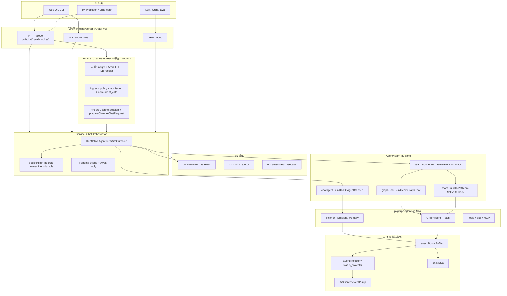

# Channel → Chat → Agent / Team 业务流程综合审查

> **范围**：外部通道接入 → 聊天会话/Run/Turn 编排 → Agent / Team / Graph 多智能体运行时
> **方法**：只读代码审查 + 文档交叉核对（Glob / Grep / Read，CodeGraph MCP 未挂载）
> **日期**：2026-05-26
> **依据规范**：`docs/guides/AI-DEVELOPMENT-SPECIFICATION.md`、`.cursor/rules/trpc-agent-framework-first.mdc`、`docs/AGENT_RUNTIME_BOUNDARY.md`
> **基线 Review**：`docs/review/17-channel-review.md`、`01-chat-review.md`、`10-session-review.md`、`11-team-review.md`、`36-graph-review.md`、`2026-05-23-Chat-Flow-Full-Review.md`、`2026-05-23-M55-Run-Lifecycle-Review.md`、`2026-05-23-Team-Graph-M53-Phase7-Review.md`、`full-project-review.md`

---

## 0. 执行摘要（Executive Summary）

| 评级维度 | 得分（百分制） | 说明 |
|----------|----------------|------|
| 架构与边界 | **88 / 100** | Kratos v2 + trpc-agent-go 分层清晰；biz 不 import trpc、server 不装配 Runner 两条红线全部通过；Channel/Chat/Team 通过 `biz.NativeTurnGateway` / `TurnExecutor` 等窄接口耦合，但 `chat_orchestrator_turn.go` / `runner_team_trpc.go` 巨型函数仍是高耦合点 |
| 代码质量与风格 | **76 / 100** | 命名/格式整洁；圈复杂度 / 函数体长度集中超标（`chat_orchestrator_turn.go:runSingleAgentViaTRPC`≈416 行，`runner_team_trpc.go:runTeamTRPCFromInput`≈620 行，`agent.go` proto 映射≈420 行）；agent settings 三套 legacy/新键并存 |
| 功能正确性 | **80 / 100** | Admission/Pending/Await 路径已收敛；幂等三层（inflight + TTL + DB receipt）逻辑正确但跨进程薄弱；Channel 多平台 IdempotencyKey 存在弱键（钉钉/企微）；Durable Resume 与状态机已对齐 M55 R-OPT |
| 性能与资源 | **78 / 100** | LLM Runner 流式与首字节 guard 合理；存在 Webhook 进程内限流/并发 gate、N+1 风险（`ChannelDelivery` 扫描最近 100 条、Participants 全量 sync）、WS send buffer drop default |
| 安全性 | **74 / 100** | 凭据 AES-GCM 加密、Webhook 二次验签、Cookie HttpOnly；高危：`hasWebhookSigningHeader` 未识别 Slack/Telegram header（生产可能 403）、`DEPLOY_ENV` 未显式时 bypass 仍生效、WS 错误原文外泄、Observatory 输出 ToolArguments/Result 未脱敏 |
| 可测试性 | **70 / 100** | 单测覆盖中等：admission、budget、ingress_policy、parity 编译级、cancel/escalate 有；全平台 Webhook 验签负例、五模式 run 级 parity、HITL→Resume→Success E2E 仍缺 |
| 可维护性 | **78 / 100** | Wire DI + Provider 集中；五种 Team mode 双轨（Native / Graph）并存增加心智负担；`AgentRuntimeSettings` 80+ 扁平字段；`channel_ingress*.go` 30+ 同前缀文件 |
| 错误处理与鲁棒性 | **80 / 100** | LT-06 固定文案、Outbox 退避、dead-letter、FlowLog 都已落地；中等问题：accept 阶段 500/200 不一致、部分静默 `_ =`、WS 错误推送不统一 |
| 兼容性 | **84 / 100** | OpenAPI/Proto 双轨稳定；Go 1.25 / Kratos v2 / trpc-agent-go 本地 replace；前端 Vue3+Quasar；DB SQLite+PG 协调良好；新 IM 平台扩展需补 contract 测试 |
| 合规与规范 | **82 / 100** | 第三方依赖以 MIT/Apache 为主；凭据加解密合规；尚未集中输出 SBOM / 许可证清单；红线 `biz != trpc` / `server != Runner` 通过 |
| 业务逻辑 | **80 / 100** | 单 Agent / Team / Graph / Channel / Cron / Durable 流程语义自洽；五模式（Coordinator/Swarm/Sequential/Parallel/CriticLoop）实现基本对齐，**Swarm 在 Graph 编译归一化为 adaptive**，与 Native 语义有漂移，需文档化 |

**总体评级：B+（82 / 100）** — 主链路工程化扎实，业务模型清晰；下一阶段重点优化「巨型函数拆分 / 跨进程幂等与限流 / 五模式 run 级 parity / Observatory 数据脱敏」。

---

## 1. 业务流程总览

### 1.1 端到端调用链

### 1.2 三个域的边界契约

| 上游 | 下游 | 窄接口（biz 层） | 实现位置 |
|------|------|-------------------|----------|
| Channel | Chat | `biz.NativeTurnGateway` | `internal/service/chat_orchestrator_turn.go` |
| Chat (Team) | Team | `biz.TurnExecutor` + `team_turn_hooks.go` | `internal/team/runner.go` |
| Chat / Team | Graph | `biz.GraphExecutor` / `GraphBuilderFactory` | `internal/graph/trpc/` |
| Channel | Graph (异步) | `biz.ChannelJobGateway` | `internal/service/channel_async_graph.go` |

**红线核查**：

| 检查项 | 结果 | 证据 |
|--------|------|------|
| `internal/biz` 是否 import `pkg/trpc-agent-go` | **PASS** | 仅 `agent_ports.go` / `graph_runtime.go` / `tool_invocation_source.go` 注释提及，无 import |
| `internal/server` 是否装配 Runner | **PASS** | 全文无 `team.Runner` / `NewRunner` / `BuildTRPC*` |
| Runner 装配位置 | service + cmd/admin Wire | `service.NewChatService` → `NewChatOrchestrator` + `cmd/admin/wire.go provideTeamOrchestrationDeps` |

---

## 2. 架构设计审查

### 2.1 分层架构合理性 — **A-**

- **单一职责**：`server` 仅传输 / `service` 桥接 + 编排 / `biz` 领域 / `data` Ent ORM / `internal/agent` & `internal/team` 实现 trpc 适配。Channel 的 32 个 `channel_ingress_*.go` 文件按职责拆分（accept/policy/gate/session/turn/stream/cancel...），单文件平均 < 200 行。
- **依赖倒置**：Channel 通过 `biz.NativeTurnGateway` 而非 `*ChatService` 直接耦合（`channel_ingress.go:53`：`chat biz.NativeTurnGateway`），符合 Phase B1 "port-first" 重构。
- **缺陷**：
  - `channel_ingress_pending.go:15-31` 对 `NativeTurnGateway` 做 **类型断言 `*ChatService`** 以调用未在接口暴露的 `SetSessionPendingMergeFollowup`，绕过端口隔离。
  - `ChatOrchestrator` 是 service 层 god object，聚合 15+ 依赖 + 5 个 `sync.Map`（`chat_orchestrator.go:73-92`），SRP 违反。
  - `team_turn_hooks.go` + chat agent turn 路径形成 **双轨编排**，与 `internal/team/runner_team_trpc.go` 主路径重叠（CHAT-R2-03 待办）。

### 2.2 模块边界 — **A**

- **接口清晰**：`biz/agent_ports.go`、`biz/team_ports.go`、`biz/turn_gateway.go`、`biz/graph_runtime.go` 都是 biz-only 抽象，实现在 service / internal/agent / internal/team / internal/graph。
- **循环依赖**：未发现（无 `biz → service` 反向 import）。
- **缺陷**：`team_graph_run_coordinator.go` 与 `team_graph_run_finisher.go` 跨 `internal/team` 与 `internal/biz`，Resume/Cancel 时 Runner / Coordinator / Graph 三者协作仍依赖隐式 ordering（C-15 / C-16）。

### 2.3 技术选型匹配度 — **A**

| 选型 | 是否合理 | 说明 |
|------|----------|------|
| Kratos v2 | ✅ | HTTP/gRPC/SSE/Wire 与企业级 admin 平台匹配 |
| trpc-agent-go | ✅ | 多 Agent/Team/Graph/Memory 一体化框架，避免自研 |
| Ent ORM | ✅ | 类型安全 + Schema 迁移，Channel/Session/Turn 复杂关系合适 |
| pgvector | ✅ | L3 语义记忆向量检索 |
| Vue3 + Quasar | ✅ | admin 后台 + IM 卡片预览 |
| SQLite + PG 双写 | ⚠️ 中 | L0-L2/L4 走 SQLite，L3 走 PG，跨库一致性靠应用层；evict / GC 边界明确文档化即可 |

### 2.4 扩展性与可复用性 — **A-**

- **Channel** 通过 `runtime.RegisterStarter(type, mode, fn)` + `platformAdapters` 注册表实现新平台插拔（lark/dingtalk/wechat/wecom/discord/slack/telegram/qq/onebot 共 9 平台 + preview）。
- **Team** 五模式（Coordinator/Swarm/Sequential/Parallel/CriticLoop）+ Graph DSL 提供编排扩展点。
- **Skill / MCP / Tool** 可通过 TurnMount 统一挂载。
- **缺陷**：
  - `team/trpc_build.go:109-121` `default` 分支当 coordinator，**未知 mode 静默降级**，应 BadRequest 强校验。
  - `graph_compile.go:75-85` Swarm 编译归一化为 `adaptive`，与 Native `NewSwarm` 语义不同，需要文档化或补 swarm 专用边模板。

### 2.5 系统耦合度 — **B+**

- Channel 与 Chat：**低耦合**（端口 + adapter）
- Chat 与 Team：**中耦合**（共享 `RunRegistry` / `session_lock` / `TurnExecutor` 钩子）
- Chat / Team 与 trpc-agent-go：**适度耦合**（`internal/agent` + `internal/team` 集中适配）
- **过度设计点**：
  - 31+ 个 `channel_ingress_*.go` 文件 / 14+ 个 `chat_*.go` orchestrator 子文件 / `internal/team` 35+ 文件，**碎片化** 提升了导航成本（建议按域聚合为 sub-package）。
  - `RunRegistry` 维护 `running / pending / awaiting_user / completed / failed / cancelled` 六态，与 `SessionRun.phase`（interactive/escalating/durable/...）平行存在，**两套状态机** 需有清晰映射文档。

### 2.6 数据流向 — **A-**

| 数据 | 流向 | 安全性 |
|------|------|--------|
| 用户消息（明文）| Channel/Web → Service → biz → SQLite | 单端到端加密未启用；DB 文件加密由部署层负责 |
| LLM 凭据 | DB（`enc:` AES-GCM） → biz 解密 → provider | ✅ `channel_credential_crypto.go` |
| Tool ArgumentsJSON / ResultJSON | Bus → Observatory RPC + WS | ⚠️ 未脱敏（C-19/C-20/C-21） |
| Token / Usage | Runner → Service → biz UsageUsecase → DB | ✅ |
| 事件流 | Bus → WS pump → 前端 | WS send channel buffer 128，drop default 静默丢事件（#26） |

---

## 3. 代码质量与风格

### 3.1 编码规范 — **A**
- Go 命名（`PascalCase` / `camelCase` / `kebab-case` 文件名）严格遵循 Effective Go；包名简短一致；错误使用 `kerrors.BadRequest("CODE", msg)` 统一。`.golangci.yml` 已挂全。

### 3.2 代码简洁性 — **B**

**重复代码**：
- `internal/team/runner_team_trpc.go:165-236` 与 `runner_team_compiler.go:20-79` Graph 编译逻辑 **inline 与 helper 重复**，helper 未被生产路径调用（C-02 高）。
- `internal/biz/agent_settings_helpers.go:250-394` `configJSONFromSettings` 同时写 `memory` / `memoryL0` / `l0` **三套重复键** 维持向后兼容（C-06 高）。
- `chat_orchestrator_turn.go:724-776` Stream 错误/timeout/empty reply 三段重复 `markTurnError + setRunStatus + publishTurnFailure`，应抽 `abortTurn(reason, err)`（#10）。
- Channel ingress：`channel_ingress_dingtalk.go` / `_slack.go` / `_telegram.go` / `_wechat.go` 等几乎全是同构 webhook handler 包装，仅 idempotency key 不同。

**死代码 / 不一致**：
- `chat_orchestrator_turn.go:1032+` `nativeSendChatMessage` 在 orchestrator 而非 `chat.go`，与"ChatService 仅做映射"注释不一致（#3 低）。
- `channel_ingress.go:86` 方法名 `FeishuWebhookHTTP` 实际路由 **全平台**（#14 低）。

### 3.3 可读性 — **B**

**圈复杂度热点**（建议阈值 ≤ 15）：

| 文件:函数 | 函数体行数 | 估计圈复杂度 | 风险 |
|-----------|-----------|--------------|------|
| `chat_orchestrator_turn.go:runSingleAgentViaTRPC` (~426-841) | ~416 | **40+** | 极高 |
| `internal/team/runner_team_trpc.go:runTeamTRPCFromInput` (~34-620) | ~580 | **35+** | 极高 |
| `internal/service/agent.go` proto 映射段 (~36-456) | ~420 | 25+ | 高 |
| `internal/biz/orchestration_status.go` 状态投影 | ~657 | 25+ | 高 |
| `internal/biz/agent_settings_helpers.go:configJSONFromSettings` | ~250-394 | 20+ | 高 |
| `chat_orchestrator_turn.go:runNativeAgentTurnBody` | ~67 | 15+ | 中 |
| `channel_ingress_accept.go:acceptInbound` | ~150 | 15+ | 中 |

**变量命名**：整体表意清晰；个别历史包名（`channel_ingress.go:FeishuWebhookHTTP`、`channel_feishu_config.go`）误导新人。

### 3.4 复杂度控制 — **C+**
- 三个 god function（`runSingleAgentViaTRPC` / `runTeamTRPCFromInput` / agent proto 映射）建议本季度强制拆分（CHAT-R2-03 / C-03）。
- defer 闭包混合 metrics + usage + context patch（`chat_orchestrator_turn.go:466-474`），可读性差。

### 3.5 最佳实践 — **A-**
- `safego` 包装 goroutine recover；`context.WithTimeout` 普遍存在；Wire 编译期 DI；proto 代码生成；ent schema 迁移。
- ❌ 部分 goroutine 使用 `context.Background()` 丢失 trace（`ws.go:653` / `chat_orchestrator_turn.go:853-861` / `chat_orchestrator_turn.go:331-334` / `channel_ingress_http.go:45-46`）。

### 3.6 代码异味 — **B**

| 异味 | 示例 |
|------|------|
| 魔法数字 | `channel_ingress_ratelimit.go` Webhook 120/min 内联常量；`session_lock.go:35-38` 30min sweep 硬编码 |
| 硬编码字符串 | LT-06 错误文案、`DurableResumePrompt()` 文本提示 |
| 过长参数列表 | `ChatOrchestrator` 构造接 15+ 依赖；`recordSessionTurn(ctx, sessionID, ag, userMsgID, assistantMsgID, prov, mod, promptTok, completionTok, contentPreview)` 10 参 |
| Boolean trap | `acceptInbound(viaWebhook bool, ...)` 多个 bool 参数 |
| Long file | `chat_orchestrator_turn.go` ~1190 行 / 45KB |

---

## 4. 功能正确性

### 4.1 需求匹配度 — **A-**
- 与 `docs/需求/0 系统框图.md` + `17-channel-development.md` + `55-chat-channel-cursor-development.md` 对齐良好；五模式 Team 已对照 trpc-agent-go 接口实现；Memory L0-L4 五层架构落地（L3/pgvector 已可用，L4 cascade 待优化）。
- ❌ Knowledge / Evaluation / A2A 标 ❌ 未实现，需求文档已对齐。

### 4.2 边界条件 — **A-**

| 入口 | 空值 | 极值 | 异常输入 |
|------|------|------|----------|
| `ChannelIngress.FeishuWebhookHTTP` | ✅ `channel_key` 空校验 | ✅ 120/min 限流 | ✅ JSON parse 错误返回 400 |
| `RunNativeAgentTurnWithOutcome` | ✅ `session_id` / `content` 空校验 | ⚠️ `content` 长度无上限（仅在 IM 平台层截断） | ✅ admission 拒绝 busy |
| `Channel` 各平台 handler | ⚠️ dingtalk/wecom idempotency key 弱（#6/#7） | ✅ Webhook 验签 | ✅ 验签失败返回 401/403 |
| Team Run | ✅ `team_id` / `members` 空校验 | ✅ `EnabledMembers` 空 → BadRequest | ⚠️ `validateTeamMembersExist` JSON 解析失败 return nil（C-17）|

### 4.3 逻辑分支覆盖 — **B+**
- Admission gate 五分支（new / queue / steer / reject / cancel）覆盖完整。
- ❌ `team/trpc_build.go:109-121` 未知 mode 静默 coordinator（C-13）。
- ❌ `runner_team_trpc.go` HITL defer 路径 run-level 集成测试缺失（C-24）。

### 4.4 并发正确性 — **B+**

**已加锁的关键路径**：
- `session_lock.SessionLock(sessionID)` per-session `sync.Mutex` 包裹 turn body。
- `RunRegistry` 内部 `sync.RWMutex`。
- `ChatUsecase.EnqueueUserMessage` lock 内入队 + steer 顺序。

**已知竞态 / 风险**：

| 锚点 | 问题 |
|------|------|
| `channel_inbound_inflight.go` + `ingress_dedupe.go` | **单进程内存**幂等，多 admin 实例失效（依赖 DB receipt 兜底，但 receipt claim 之前仍有 race window）（#3 高） |
| `internal/channel/runtime/manager.go` | 同 app_id 仅飞书 WS 冲突检测；**多机/滚动重启**可能双连接（#4 高） |
| `session_lock.go:35-38` | Lock 非可重入；`processPendingQueue` 在 HasActive 与 Dequeue 之间仍有窗口（#21 中） |
| `chat_orchestrator.go:88-90` | `resumeInFlight` / `sessionRunBindings` sync.Map 与 DB SessionRun 可能漂移（#24 中） |
| `session_run_durable_worker.go:45-58` | Worker poll 间隔内可能多次启动 goroutine（已有 `TryClaimDurableResume`，需 E2E 验证）（#16 中） |

### 4.5 数据一致性 — **A-**
- Channel inbound：`channel_inbound_receipt` 表 UNIQUE(channel_id, idempotency_key) 强一致；outbox 模式 `channel_delivery` 异步重试。
- SessionRun phase 转换基本事务化；`MarkPhase(durable)` 与 checkpoint 创建顺序在 R-OPT-03 已修复。
- ❌ `channel_delivery.go:94-99` 出站幂等扫描最近 100 条无 DB unique index（#9 中）。

### 4.6 算法正确性 — **A**
- Adaptive graph 边上限 30 防 O(n²)；coordinator session GC 2h；budget watcher 单调时钟 + soft/hard 双阈值。
- Memory 召回采用 hybrid（L2 sql + L3 vec + composite rerank）。

---

## 5. 性能与资源效率

### 5.1 算法复杂度 — **A-**
- 主路径 O(n) 或 O(1)；adaptive 边 30 上限合理。
- ❌ `channel_delivery.go` 100 条扫描幂等 + Participants 全量 sync（SESS-R-P1-01）需增量化。

### 5.2 数据库性能 — **B+**
- 已有 SQLite 索引；ent unique 约束；Channel inbound receipt 表有 UNIQUE。
- 缺失：`channel_delivery` 上 `(channel_id, idempotency_key)` unique index；session messages 全量拉取需分页（FE-TL-01）。
- 无明显 N+1。

### 5.3 内存使用 — **B+**
- LLM Streaming 通过 `ConsumeWithFirstByteGuard` 限制首字节；event Buffer 有 cap。
- ❌ `ingress_dedupe.go` map 无 size 上限，极端 spam 可涨（#23 低）。
- ❌ `internal/biz/graph_team_execution.go:teamBuildConfigs` 仅内存（C-05 中）。
- ❌ Export 全量加载到内存（SESS-R-P1-02）。

### 5.4 网络请求 — **A-**
- HTTP client 复用 `lark.DefaultHTTPClient()`；WS / Socket Mode 长连接由 `runtime.Manager` 监督；fingerprint 已去 UpdatedAt 避免 2min 双连接。
- ❌ 多实例部署仍可能双 connector（#4）。

### 5.5 资源释放 — **A-**
- `defer runner.Close()` + WS unsubscribe + cancel func 普遍。
- ❌ `chat_orchestrator_turn.go:554-557` defer Close 依赖正常返回，panic 时可能泄漏（#40）。
- ❌ `chat_orchestrator_turn.go:674-680` 60s LLM 日志 goroutine 每 turn 一个（#28）。

### 5.6 批量处理 — **B+**
- session_batch.go 批量归档；agent 批量启用；team_compile 一次性。
- ❌ Channel 出站可批合并 IM 卡片（部分已实现 turn_preview_delivery）。

---

## 6. 安全性

### 6.1 注入攻击 — **A-**
- Ent ORM 参数化；JSON 字段 sanitize（`channel/preview/sanitize`）；前端 v-html 几乎不出现。

### 6.2 认证与授权 — **B**

| 锚点 | 问题 | 严重度 |
|------|------|--------|
| `pkg/auth/webhook.go:56-68` + `middleware.go:88` | `hasWebhookSigningHeader` 未识别 Slack / Telegram / Discord 签名头，生产可能 403 | **高** |
| `pkg/auth/features.go:22-26` | `KRATOS_HTTP_AUTH_DISABLED=1` 且 `DEPLOY_ENV` 未设置时仍 bypass | **高** |
| `internal/server/grpc.go` | gRPC 无 token 时**暂放行**（与 HTTP 不一致） | 中 |
| `chat_session_run_cancel.go:11-38` | 卡片 cancel 有 ownership 校验；escalate 路径需对齐（CC-R-OPT-02） | 中 |

### 6.3 敏感数据 — **B+**
- 凭据 AES-GCM 加密（`channel_credential_crypto.go`）+ `KRATOS_CRED_AES_KEY` 环境变量；密钥不入仓。
- ❌ Observatory RPC + WS 暴露 `ArgumentsJson` / `ResultJson` 全文（C-19/C-20/C-21）；建议产品化脱敏 / 按角色分层。
- ❌ Channel WS 入站失败 `notifyFeishuInboundError` 把 `err.Error()` 原文发给用户（#2 高）。

### 6.4 输入验证 — **A-**
- proto 字段类型校验；biz `Validate*` 入口校验；Channel 验签链完整。
- ❌ `validateTeamMembersExist` JSON 失败 return nil（C-17 中）。

### 6.5 依赖安全 — **A-**
- `go.mod` 钉死版本；trpc-agent-go 本地 replace；前端 npm lock。
- 建议加 `go list -m -u all` + Dependabot / Snyk 扫描。

### 6.6 日志安全 — **B**
- `slog` 普遍；FlowLog 内部使用。
- ❌ 部分 path 直接 log `err.Error()`，可能含敏感 IM 内容；建议在 FlowLogger 增加 redact 规则。

---

## 7. 可测试性

### 7.1 单测覆盖 — **B**

已存在的单测（节选）：
- `channel_ingress_accept_test.go`、`channel_ingress_card_action_test.go`、`channel_ingress_session_test.go`、`channel_ingress_stream_test.go`、`channel_ingress_errors_test.go`、`channel_ingress_gate_test.go`、`channel_concurrent_gate_test.go`、`channel_ingress_peer_test.go`、`turn_admission_test.go`、`session_run_durable_worker_test.go`、`chat_cancel_run_test.go`、`chat_stop_generation_test.go`、`chat_session_run_cancel_test.go`、`chat_session_run_escalate_test.go`、`chat_turn_admission_test.go`、`team_cancel_test.go`、`team_compile_test.go`、`team_dead_letter_test.go`、`team_observatory_test.go`、`parity_runtime_test.go`、`parity_run_e2e_test.go`、`parity_run_test.go`、`parity_test.go`、`memory_*_test.go`、`ingress_policy_test.go`、`ingress_debounce_test.go`、`deco_session_sync_test.go`

缺失关键测试：
- 全平台 Webhook 验签负例（discord / qq）
- 五模式 run 级 token / steps / WS 增量 parity
- HITL defer → resume → success 全链
- Channel streaming E2E（mock Chat + httptest）
- Channel runtime 多实例断网 / 凭据轮换 soak

### 7.2 测试代码质量 — **A-**
- table-driven test 普遍；mock 通过结构体替换 repo；testutil 包提供 fixture。

### 7.3 依赖注入 — **A**
- Wire 编译期 DI；biz 端口接口便于 mock。

### 7.4 可观测性 — **A-**
- OTel turn span（`turn_trace.go`、`session_observability.go`、`graph_telemetry.go`）；FlowLog；event Bus；metrics（`internal/metrics`）；datadog MCP 已挂。
- ❌ Grafana 面板 / SLO 仪表盘待建（CH-P2 建议项）。

### 7.5 异常测试 — **B+**
- 已覆盖 cancel / busy / dedupe / quota / dead_letter；缺：进程崩溃 / 部分写入 / panic 路径。

---

## 8. 可维护性

### 8.1 代码模块化 — **B+**
- channel / chat / team 三域均按域 + 职责拆分；但 `chat_orchestrator_turn.go` / `runner_team_trpc.go` / `agent.go` 三个巨型函数集中了多职责，应继续拆分。

### 8.2 注释质量 — **A-**
- 接口文档（`biz/turn_gateway.go`、`agent_ports.go`、`graph_runtime.go`）注释完整；包级 `doc.go` 普遍存在；`channel/port/types.go` 契约注释清晰。
- ❌ `chat_orchestrator_turn.go` 大函数内部缺少 step-level 注释；新人接手成本高。

### 8.3 变更影响 — **A-**
- Wire DI 限制传染；biz 端口隔离；前端通过 OpenAPI 生成 SDK。
- ❌ `AgentRuntimeSettings` 80+ 字段任何字段变更需双写 config_json，连锁影响大（C-01）。

### 8.4 向后兼容 — **A-**
- Proto API 向后兼容良好；新字段 optional；Channel 平台 schema 通过 `channel_catalog.go` 集中。
- ❌ `configJSONFromSettings` 同时写 memory / memoryL0 / l0 三套键以维持向后兼容（C-06），技术债。

### 8.5 技术债务 — **B+**

| 债务 | 影响 | 偿还计划 |
|------|------|----------|
| `chat_orchestrator_turn.go` 巨型函数 | 高 | CHAT-R2-03 / CC-R-OPT-05 |
| Agent settings 双写 | 高 | 完成 settings 表迁移后停止写 `config_json` |
| Channel 30+ ingress 文件碎片化 | 中 | 长期：按职责聚合为 sub-package |
| Native vs Graph 双轨 | 中 | TG-RT-PARITY run 级对齐后下线 Native（保留应急） |
| Channel 多平台 IdempotencyKey 不一致 | 中 | 平台 adapter 强制 receipt |
| Observability 数据脱敏 | 中 | 产品化按角色分层输出 |
| Async Graph in-process watch | 中 | CC-F-01 Durable Worker |

---

## 9. 错误处理与鲁棒性

### 9.1 异常捕获 — **A-**
- `safego` recover；errors.Is / errors.As 区分语义错误；kerrors 统一错误码。
- ❌ 静默错误：`_ = SaveSessionState`（chat_run_gateway.go:155-178 #33）、`validateTeamMembersExist` JSON 失败 return nil（C-17）、`enrichEndpointFlags` 忽略错误（C-09）。

### 9.2 错误信息 — **A-**
- 错误码 + 中文描述明确；LT-06 固定文案脱敏。
- ❌ `internal/channel/lark/ws_inbound.go:71` WS 入站失败发送 `err.Error()` 原文给用户（#2 高）。

### 9.3 降级策略 — **A-**
- Team Graph 失败 **不**默认回退 Native（除 env/canary holdout，运维需知悉）；Channel outbox 重试 3 次后 dead-letter；budget watcher soft/hard 双阈值。
- 缺：Provider failover / Hedge 在 Channel/Chat 链路的统一开关文档。

### 9.4 重试机制 — **A-**
- `channel_delivery.go` 指数退避 + 最大 3 次 + dead-letter；Webhook handler 200 ACK + 后台 goroutine；turn busy 重试。
- ❌ 部分 ws 路径短路径 retry 隐含、需文档化。

### 9.5 幂等性 — **B+**
- Channel inbound：三层（inflight / TTL / DB receipt）；DB UNIQUE 强一致。
- ❌ 钉钉 idempotency key `dingtalk:{conv}:{ts}` 非 msg_id（#6）。
- ❌ 企微 idempotency key 含 URL `timestamp`（#7）。
- ❌ outbound `channel_delivery` 缺 unique index（#9）。

---

## 10. 兼容性

### 10.1 版本兼容性 — **A**
- OpenAPI 大而稳；proto 字段 optional 演进；前端 SDK 通过 codegen 同步。
- WS 增加 `message_queued` 等事件类型保持向后兼容。

### 10.2 平台兼容性 — **A**
- 后端 Go 1.25 跨平台；Channel 9 平台 + preview；admin 跨 OS（README 已注明 Windows + Cursor 终端 Ctrl+C 提示）。

### 10.3 浏览器兼容性 — **A**
- Quasar + Vue3 现代浏览器；WS 使用标准 API。

### 10.4 数据库兼容性 — **A**
- SQLite 3+ / PostgreSQL 14+；Ent 迁移版本化。

### 10.5 依赖兼容性 — **A-**
- `go.mod` 钉死；trpc-agent-go 本地 replace；前端 lock 文件。

---

## 11. 合规与规范

### 11.1 许可证合规 — **B+**
- 主要依赖（Kratos / trpc-agent-go / Ent / Vue3 / Quasar）以 Apache-2.0 / MIT 为主；项目本身 LICENSE 存在。
- ❌ 仓库未输出 SBOM / 集中许可证清单；建议补 `make license-report`。

### 11.2 代码所有权 — **A**
- 无明显第三方代码块未声明。

### 11.3 公司规范 — **A**
- `.cursor/rules/trpc-agent-framework-first.mdc`、`docs/guides/AI-DEVELOPMENT-SPECIFICATION.md` 已落地为 14 条红线；CI（`make ci`）含 lint + 单测 + boundary check。

### 11.4 数据合规 — **B+**
- 凭据加密 + Cookie HttpOnly + Webhook 验签 OK；
- ❌ 未明确 GDPR / 个保法对应控制（数据导出 / 删除 / 留存策略）；建议补 `docs/compliance/`。

---

## 12. 业务逻辑

### 12.1 业务规则准确性 — **A-**
- Admission / Pending / Await / Steer / Cancel 五种 turn 入站策略与产品意图对齐；Channel inbound `/cancel`、`/background`、`/async` 命令模型完整；SessionRun 三相生命周期对齐 M55 需求。

### 12.2 业务流程合理性 — **A**
- Channel ACK fast-200 + 后台 execute 合理；Long-task IM 平台升格 durable 合理；Team 默认 Graph + Native 应急符合 M53 Phase 7 灰度策略。

### 12.3 业务风险 — **B+**

| 风险 | 严重度 |
|------|--------|
| 多机部署 Webhook 验签头白名单不全 → 真实生产 IM 消息被 403 | **高** |
| 凭据轮换在 Runtime 重启窗口可能拒服务 | 中 |
| Observatory 数据脱敏不足 → 内部 IM 调用栈/参数泄露 | 中 |
| Async Graph 24h watch 进程重启丢失 → 超长任务无法完成 | 中 |
| Swarm Graph 编译归一化为 adaptive → 业务方期望与实际行为漂移 | 中 |

### 12.4 领域模型 — **A-**
- `Agent` / `Team` / `Session` / `SessionRun` / `Channel` / `ChannelDelivery` / `ChannelInboundReceipt` / `TeamRun` / `TeamRunStep` / `GraphExecution` / `Hook` / `Skill` / `MCPServer` 等核心实体语义清晰。
- ❌ `AgentRuntimeSettings` 80+ 扁平字段，与领域不够内聚（建议子结构化）。

### 12.5 产品体验 — **A-**
- WS 实时投影 / IM 卡片流式 / Pending 队列 / Run cancel/escalate 卡片 / Jobs 面板 / Team Observatory 实时面板均落地。
- ❌ M55 RUX-P1 一组 UX 问题（卡片 cancel/escalate 权限不一致、auto-focus 抢焦点、回复选取错误）待修复。

---

## 13. 综合问题清单（优先级 P0–P3，共 45 条）

> 表头说明：**P** 优先级（P0 立即修 / P1 当周 / P2 当 sprint / P3 backlog）；**S** 严重度（高/中/低）；**类** 审查规则类（A 架构 / Q 质量 / C 正确性 / P 性能 / Sec 安全 / T 测试 / M 维护 / E 错处 / Cpb 兼容 / Cmp 合规 / Biz 业务）

| # | P | S | 类 | 位置 | 问题 | 建议 |
|---|---|---|----|------|------|------|
| 1 | **P0** | 高 | Sec | `pkg/auth/webhook.go:56-68` + `middleware.go:88` | Webhook signing header 白名单不含 Slack/Telegram，生产可 403 真实 IM | 按 platform 白名单跳过 guard；补 httptest |
| 2 | **P0** | 高 | Sec/E | `internal/channel/lark/ws_inbound.go:71` | WS 入站失败把 err 原文回写用户 | 复用 `formatChannelTurnErrorMessage` |
| 3 | **P0** | 高 | Sec | `pkg/auth/features.go:22-26` | `KRATOS_HTTP_AUTH_DISABLED=1` 且 DEPLOY_ENV 未设置仍 bypass | 生产强制 `DEPLOY_ENV=production`；未设置时拒绝 bypass |
| 4 | **P0** | 高 | A/M | `chat_orchestrator_turn.go:runSingleAgentViaTRPC` ~416 行 | 巨型函数，圈复杂度 40+ | 拆 `buildAndRunAgent` / `persistTurnMessages` / `handleStreamOutcome`（CHAT-R2-03） |
| 5 | **P0** | 高 | A/M | `internal/team/runner_team_trpc.go:runTeamTRPCFromInput` ~580 行 | Graph/Native 双轨 inline，圈复杂度 35+ | 主路径接入 `runner_team_compiler.compileTeamRuntime`；拆 compile/execute/finalize |
| 6 | **P0** | 高 | Sec | `internal/biz/orchestration_status.go` + `team_observatory.go` | Observatory WS/RPC 输出 ToolArgumentsJSON/ResultJSON 全文 | 默认脱敏；按角色分层（C-19/C-20/C-21） |
| 7 | **P1** | 高 | C | `channel_inbound_inflight.go` + `ingress_dedupe.go` | 单进程内存幂等，多实例失效 | DB receipt 兜底 + Redis 分布式锁；文档单实例 WS |
| 8 | **P1** | 高 | A | `internal/channel/runtime/manager.go` | 多机/滚动重启可能双 connector | DB 级 leader election 或部署层单实例约束 |
| 9 | **P1** | 高 | A | `internal/biz/agent_usecase.go:syncConfigJSON` | settings 表 + config_json 双写 | 完成迁移后下线 config_json 写入 |
| 10 | **P1** | 高 | C/M | `internal/biz/agent_settings_helpers.go:250-394` | memory/memoryL0/l0 三套键并存 | 统一 schema + 单测 golden + 下线 legacy 键 |
| 11 | **P1** | 高 | T | `internal/team/parity_test.go` | 仅 build 级 parity | 五模式 run 级 token/steps/WS E2E（TG-RT-PARITY） |
| 12 | **P1** | 高 | T | full-platform | Channel 全平台验签负例 + streaming E2E 缺失 | mock Chat + httptest（CH-P2-E2E / CH-P2-WEBHOOK-TEST） |
| 13 | **P1** | 高 | C | `ws.go:653-655` | WS turn 用 `context.Background()` 断连不 cancel | 绑定 connCtx 或 RunRegistry lifecycle |
| 14 | **P1** | 高 | C | `chat_orchestrator_turn.go:853-861` | `processPendingQueue` 用 Background ctx | 继承 session-scoped ctx |
| 15 | **P1** | 高 | E | `session_run_escalation_notifier.go` (RUX-P1-01) | NotifyRunCompleted 可能取非本 run 的最后一条 assistant | 按 run.TurnID/checkpoint 过滤 |
| 16 | **P1** | 中 | A | `channel_ingress_pending.go:15-31` | 类型断言 `*ChatService` 破坏端口隔离 | 在 NativeTurnGateway 增加 SetSessionPendingMergeFollowup |
| 17 | **P1** | 中 | A | `internal/service/agent.go` ~420 行 pb 映射 | 手写 mapper 6 组易遗漏字段 | 代码生成或共享 mapper |
| 18 | **P1** | 中 | C | `team/trpc_build.go:109-121` | 未知 mode 默认 coordinator | 严校验 BadRequest |
| 19 | **P1** | 中 | C | `graph_compile.go:75-85` | Swarm 归一化为 adaptive 与 Native 漂移 | 文档化或补 swarm 边模板 |
| 20 | **P1** | 中 | C | `channel_ingress_dingtalk.go:35` + `_wecom.go:35` | idempotency key 含 URL timestamp / conv+ts 非 msg_id | 解析平台 msg_id / event_id |
| 21 | **P1** | 中 | P/E | `internal/biz/channel_delivery.go:94-99` | 出站 100 条幂等扫描无 unique index | 加 unique index + INSERT OR IGNORE |
| 22 | **P1** | 中 | Sec | `internal/server/grpc.go` | gRPC 无 token 暂放行 | 与 HTTP 一致强制 Bearer |
| 23 | **P1** | 中 | C | `session_run_durable_worker.go:45-58` | poll 间隔多次 goroutine 启动 | poll 前 TryClaim 或 per-session 串行 |
| 24 | **P1** | 中 | C | `chat_orchestrator_session_run.go:215-221` | MarkPhase(durable) 与 checkpoint 顺序失败时不一致 | 事务化或 compensating Fail |
| 25 | **P1** | 中 | C | `internal/biz/team_usecase.go:150-151` | validateTeamMembersExist JSON 失败 return nil | 解析失败 BadRequest |
| 26 | **P2** | 中 | M | `chat_orchestrator.go:73-92` | god object 15+ 依赖 + 5 个 sync.Map | 拆 DurableRunCoordinator/AwaitCoordinator/PendingProcessor |
| 27 | **P2** | 中 | A | `internal/biz/graph_team_execution.go:teamBuildConfigs` | 仅内存，重启 team graph resume 丢 cfg | 持久化或 definition 重编译 |
| 28 | **P2** | 中 | C | `chat.go:298-301` | AwaitUserReply 非阻塞 send default 返回 Accepted:false 无错误 | 区分 channel full vs 非 awaiting |
| 29 | **P2** | 中 | C/E | `chat_orchestrator_turn.go:724-776` | Stream 错误/timeout/empty 三段重复 | 抽 `abortTurn(reason, err)` |
| 30 | **P2** | 中 | E | `chat_run_gateway.go:155-178` | persistRunStatusToSession 静默失败 | FlowLog warn + 重试 |
| 31 | **P2** | 中 | P | `ws.go:313-314` | WS send buffer 128 drop default 静默丢事件 | 监控 drop 率；Reliable 模式 backpressure |
| 32 | **P2** | 中 | P | `internal/biz/channel_delivery.go` | 高流量 outbox 性能 | 批量出站 / 索引优化 |
| 33 | **P2** | 中 | A | `team_resume.go:11-35` | Resume 不重启 coordinator watch/finisher | Resume 后联动 Handle*  |
| 34 | **P2** | 中 | A | `channel_ingress_async.go:21-22` | Async Graph in-process watch（24h 上限） | CC-F-01 Durable Worker |
| 35 | **P2** | 中 | C | `ws.go:590` | WS cancel 用 Background ctx 丢 trace/user | 传入 conn ctx |
| 36 | **P2** | 中 | C | `chat_orchestrator_turn.go:331-334` | resumeAwaitAfterRestart detached Background | 带 deadline 的 request ctx |
| 37 | **P2** | 低 | E | `channel_ingress_http.go:45-46` | 后台 goroutine `context.WithoutCancel` 丢 trace | 传 detached trace + 独立 timeout |
| 38 | **P2** | 低 | Sec | `ws.go:234-258` | `session_id=*` 全局 monitor 无 RBAC | 文档限制 admin-only |
| 39 | **P2** | 低 | Q | `channel_ingress.go:86` | 方法名 FeishuWebhookHTTP 实际全平台 | 重命名 ChannelWebhookHTTP（别名） |
| 40 | **P2** | 低 | Q | `chat_orchestrator_turn.go:466-474` | defer 闭包混合多职责 | 抽 `turnCleanup` |
| 41 | **P2** | 低 | P | `chat_orchestrator_turn.go:674-680` | 60s LLM 日志 goroutine/turn | 单 session 复用 timer |
| 42 | **P3** | 低 | T | `ingress_dedupe.go:35-49` | dedupe map 无上限 | 定期 purge + max entries |
| 43 | **P3** | 低 | Cmp | 仓库根 | 缺 SBOM / 集中许可证清单 | `make license-report` |
| 44 | **P3** | 低 | M | `internal/service/channel*` 30+ 文件 | 文件碎片化 | 长期：聚合为 sub-package |
| 45 | **P3** | 低 | Biz/Cpb | `chat.go:1035-1041` | Queued turn HTTP 返回空 response | OpenAPI 显式 `queued: true` |

---

## 14. 推荐落地路线图

### 14.1 立即修复（本周 / P0，6 项）
1. `pkg/auth/webhook.go` Slack/Telegram 验签头白名单 + 集成测
2. `lark/ws_inbound.go` 错误回写脱敏统一 LT-06
3. `pkg/auth/features.go` 生产强制 DEPLOY_ENV
4. **`chat_orchestrator_turn.go` 函数拆分**（CHAT-R2-03 启动）
5. **`runner_team_trpc.go` 接入 compileTeamRuntime helper**（消除重复 + 顺便修 #5 C-02）
6. Observatory `ArgumentsJson`/`ResultJson` 脱敏（默认 + 按角色分层）

### 14.2 当 Sprint（P1，19 项）
- Channel 多实例幂等 / Runtime leader election
- Agent settings 单一真相源迁移
- 五模式 run 级 parity + Channel E2E
- WS context lifecycle 收敛
- Channel idempotency key 强化（钉钉 / 企微）

### 14.3 Backlog（P2-P3，20 项）
- 巨型 god object 拆分
- Async Graph Durable Worker（CC-F-01）
- SBOM / license report / 数据合规文档
- 文件碎片化整理

### 14.4 强建议建立的常态机制
- **CI 红线检查**：`make runtime-boundary` 已存在；增加 `make redline-check`（biz != trpc / server != Runner / Channel signing headers / Observatory redaction）
- **性能基线**：Channel P95 / Turn P95 / WS drop 率 Datadog 看板
- **回归套件**：`go test ./internal/service/... -run 'Durable|Escalate|Admission|Cancel'` + `go test ./internal/team/... -run 'Parity|Graph|Run'` 列为 PR 必跑

---

## 15. 附录

### 15.1 关键文件复杂度速查

| 文件 | 行数 | 主要函数 | 复杂度等级 |
|------|------|----------|------------|
| `internal/service/chat_orchestrator_turn.go` | ~1190 | `runSingleAgentViaTRPC` (~416 行) | **极高** |
| `internal/team/runner_team_trpc.go` | ~621 | `runTeamTRPCFromInput` (~580 行) | **极高** |
| `internal/service/agent.go` | ~854 | proto 映射段 (~420 行) | 高 |
| `internal/biz/orchestration_status.go` | ~657 | 状态投影 store | 高 |
| `internal/biz/agent_settings_helpers.go` | ~518 | `configJSONFromSettings` | 高 |
| `internal/biz/agent_types.go` | ~415 | `AgentRuntimeSettings` 80+ 字段 | 高 |

### 15.2 已闭合 Review（勿重复开 task）
- 飞书 inbound root cause（2026-05-22）
- DECO-01 Channel Sync holistic fix（2026-05-24）
- Graph Phase A-D（92/100，2026-05-23）
- Tools Phase 4-5 fragment edit / workspace unification
- Session Phase 2（部分项 P1 持续中）
- M53 Phase 7（部分项 TG-RT-PARITY 持续中）

### 15.3 文档交叉引用
- 架构与边界：`docs/AGENT_RUNTIME_BOUNDARY.md`、`.cursor/rules/trpc-agent-framework-first.mdc`
- 编码规范：`docs/guides/AI-DEVELOPMENT-SPECIFICATION.md`
- 框架解读：`docs/guides/trpc-agent-go-framework.md`
- 需求与设计：`docs/需求/0 系统框图.md`、`docs/需求/17-channel-development.md`、`docs/需求/55-chat-channel-cursor-development.md`、`docs/需求/admin-auth.design.md`
- 历史 Review：`docs/review/full-project-review.md`、`SUMMARY.md`、`README.md`

---

**结论**：Channel → Chat → Agent/Team 三域主链工程化扎实，分层与红线合规；**当前最大技术债是三处巨型函数 + Agent settings 双写 + Observatory 数据脱敏 + 多实例幂等**。建议按 14.1 / 14.2 顺序推进，可在 1–2 个 sprint 内将整体评级从 **B+ (82)** 提升至 **A- (88)** 以上。

— *Review 作者：Cursor Agent (Claude Opus 4.7)*
— *基于只读静态分析；运行时 / 压测 / 安全渗透测试为补充手段*
