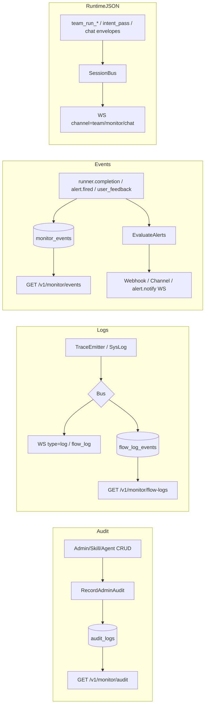

# Monitor 模块代码层 Review（业务逻辑 / 代码质量 / 架构设计）

> **评分**：76 / 100 | **风险等级**：P1
> **审查时间**：2026-05-26
> **范围**：后端 monitor 相关（约 15 个核心 Go 文件 + `internal/server/ws.go` + `internal/event/*` 流接线；**不含 `web/`**）
> **聚焦**：Audit / Logs / Events 三流分离、WebSocket Hub、Trace / Flow / Runner Metrics、Alert 评估与通知
> **真相源**：`.cursor/rules/monitor-streams-wire.mdc`、`docs/AGENT_RUNTIME_BOUNDARY.md`、`.cursor/rules/trpc-agent-framework-first.mdc`
> **历史 Review**：[18-monitor-review.md](./18-monitor-review.md)（2026-05-21，含前端）

---

## 1. 评分详情

| 维度 | 得分 | 满分 | 评述 |
|------|------|------|------|
| 业务逻辑正确性 | 16 | 20 | Audit / runner.completion / alert 主链路清晰；告警冷却仅进程内 `sync.Map`、每次 completion 全规则扫描、`monitor_traces` 无写入路径 |
| 架构一致性 | 20 | 25 | 分层正确，biz 无 trpc import；双 Bus（Session/Monitor）已接线但 **chat / team `TraceEmitter` 仍走 SessionBus**；WS 在 `internal/server`（传输边界）符合文档 |
| 代码质量 | 16 | 20 | `monitor/monitor.go` 561 行可再拆；错误处理 slog / FlowLog / return 混用；`CleanupStaleLastFired` 无调用方；`readPump` 有死参 |
| 测试覆盖 | 5 | 10 | 冷却 / 技能 FS 有单测；**缺** `data/monitor*` / `service/monitor*` / WS 集成测；`monitor_notify` Webhook 无 mock 测 |
| 可扩展性 | 12 | 15 | `MetricKey` switch 易扩展；`AlertNotifier` 接口清晰；告警规则类型与通知渠道仍偏硬编码；无规则注册表 |
| 文档/规则一致性 | 7 | 10 | proto `GetMonitorLogs` 注释明确指向 WS；三流在 **Envelope 类型** 上分离，但 Bus 层仅部分隔离（MON-Q-01） |

---

## 2. 模块组成（按层归类）

| 层 | 文件 | 行数 | 职责 |
|----|------|------|------|
| **biz 门面** | `internal/biz/monitor.go` | 28 | 类型别名 + `NewMonitorUsecase` 重导出 |
| **biz 核心** | `internal/biz/monitor/monitor.go` | **561** | Audit + monitor_events + alert 评估 + runner metrics + completion 幂等/关联 |
| **biz 关联** | `internal/biz/audit_record.go` | 31 | 管理侧 `RecordAdminAudit` 写 audit_logs |
| | `internal/biz/runner_completion.go` | ~329 | `runner.completion` 元数据、`TurnCompletionBridge` |
| | `internal/biz/user_feedback_monitor.go` | 39 | `chat.user_feedback` 落 monitor_events |
| | `internal/biz/flow_log.go` | 16 | FlowLog 类型重导出（实现在 `biz/flowlog/`） |
| | `internal/biz/event_bus_runner_handler.go` | ~100 | completion → monitor + 异步 `EvaluateAlerts` |
| | `internal/biz/event_bus_flow_log_consumer.go` | ~123 | 双 Bus 订阅 `flow_log` 落库 |
| | `internal/biz/event_bus_side_consumers.go` | ~106 | 聚合 side consumers 启动 |
| **biz 测试** | `internal/biz/monitor_alert_test.go` | 153 | 冷却、技能 FS 指标告警 |
| | `internal/biz/runner_completion_test.go` | — | completion 幂等 / 补丁 |
| **data** | `internal/data/monitor.go` | **407** | audit_logs / monitor_events / monitor_traces CRUD + runner.completion 补丁 |
| | `internal/data/monitor_alert.go` | 97 | alert 规则 CRUD + 聚合 COUNT / AVG |
| | `internal/data/sql/monitor_alert.sql` | 19 | `monitor_alert_rules` DDL |
| | `docs/sql/07_monitor.sql` | — | audit / events / traces 主表（权威 schema 在 docs） |
| | `internal/data/sql/flow_log.sql` | — | `flow_log_events`（Monitor Logs Tab 历史查询） |
| **service** | `internal/service/monitor.go` | **425** | gRPC / HTTP Monitor API、JSON 脱敏、FlowLogs 列表 |
| | `internal/service/monitor_notify.go` | 134 | Webhook + Channel webhook 告警 + Bus `alert.notify` |
| | `internal/service/usage_alert_notifier.go` | 42 | 用量预算告警写 `usage.budget_alert` 事件 |
| **conf** | `internal/conf/monitor.go` | 10 | `ProcessLogEnabled()` |
| | `internal/conf/monitor_test.go` | 15 | 进程日志开关默认值 |
| **cmd** | `cmd/admin/monitor_skill_health.go` | 23 | Skill FS → `FilesystemHealthReader` 适配器（纯 DI） |
| **proto** | `api/kratos/monitor/v1/monitor.proto` | 244 | REST 契约；`GetMonitorLogs` 明确为 WS 提示 |
| **流 / WS（传输边界）** | `internal/server/ws.go` | ~809 | `/v1/ws` 升级、全局 `*` 限连、双 pump、enable_log |
| | `internal/event/infra.go` | 81 | SessionBus / MonitorBus / Buffer |
| | `internal/event/system_flow.go` | 96 | 系统域 flow_log → **MonitorBus** |
| | `internal/event/trace_emitter.go` | ~427 | 会话域 flow_log → **Pipeline.Bus（SessionBus）** |
| | `internal/event/flow_log.go` | — | flow_log schema、step 标题注册表 |
| | `internal/event/bus.go` | — | 订阅背压 `DropNewest` / `DropOldest` |
| **无独立 audit 包** | `internal/audit/` | — | **不存在**；审计走 `biz` + `audit_logs` 表 |

> **说明**：本仓库**没有**独立的 `internal/biz/monitor_alert.go` —— 告警逻辑全部在 `internal/biz/monitor/monitor.go`（端口 + Usecase + Eval 同包），仅有 `monitor_alert_test.go` 对应其行为。

---

## 3. 业务逻辑分析

### 3.1 三大数据流（Audit / Logs / Events）



| 流 | 来源 | 聚合 / 存储 | 订阅 / 推送 |
|----|------|-------------|-------------|
| **Audit** | `RecordAdminAudit`（agent / MCP / session / skill 等 service） | `audit_logs` 单行 INSERT | HTTP `ListAuditLogs`；**不**走 WS |
| **Logs（运维文本）** | `EnvelopeTypeLog`（进程日志，受 `ProcessLogEnabled`）；`EnvelopeTypeFlowLog`（流程日志，**不**受 enable_log 门控） | `flow_log_events`（consumer 双 Bus 落库）；实时走 Bus | WS `/v1/ws`；`type=log` 需 `log_enabled` 或全局默认开启；flow_log 始终下发 |
| **Events（运行时 JSON）** | `runner.completion` / `alert.fired` / `chat.user_feedback` / `usage.budget_alert` | `monitor_events` | HTTP 列表 + WS 上 `team_run_*` / `orchestration_*` 等 **SessionBus** Envelope（与 `monitor_events` 表是两套真相） |

**与 `monitor-streams-wire.mdc` 对齐度**：

| 约定 | 状态 |
|------|------|
| Audit 与 Logs/Events 不混表 | ✅ |
| 实时主通道为 WS（无独立 Monitor SSE） | ✅ |
| Bus 层 flow_log 隔离 | ⚠️ **半落地**：`system_flow.go` 走 MonitorBus；**chat / team `TraceEmitter` 仍走 SessionBus**（`Pipeline.Bus`），全局 monitor 连接需双 pump 才能收齐（MON-Q-01） |
| `TeamRunEvent` snake_case + `payload` 扩展 | ✅ |

### 3.2 WebSocket Hub（`internal/server/ws.go`）

| 机制 | 行为 |
|------|------|
| **连接键** | `session_id=*` → `globalMode`；最多 `WS_MAX_GLOBAL_MONITOR_CONNS`（默认 3） |
| **订阅** | 全局自动 `monitor / team / graph / knowledge` channel；`enable_log` 上行或配置默认开进程日志 |
| **双 Bus** | `globalMode` 且 `monitorBus != sessionBus` 时第二个 `eventPump` 订 MonitorBus（`BufferSize=128, DropPolicy=DropNewest`） |
| **背压** | 订阅端 Bus 可丢；`wc.send`（128）满时 **default 丢弃** 并 `SessionSysLogWarn("system.ws.send_drop")` |
| **心跳** | Ping 30 s / Pong 60 s / Write 10 s |
| **生命周期** | `readPump` defer：`removeConn` + `unsubscribe` + `Close`；`writePump` 随 channel 关闭退出 |

> **小问题**：`readPump` 签名接收 `eventCh` 但**未使用**（事件由独立 pump 处理），属 API 死参数（MON-Q-12）。

### 3.3 Trace / Flow / Runner Metrics

| 能力 | 实现 |
|------|------|
| **Flow（实时 + 历史）** | `TraceEmitter` → `EnvelopeTypeFlowLog` + metadata `flow_log/v1`；`ListFlowLogs` 查 `flow_log_events` |
| **Trace（LLM 瀑布）** | `monitor_traces` 表**仅读** API；spans 从 `config_json` / `metadata_json` 解析；**代码库无 INSERT `monitor_traces`** |
| **Runner Metrics** | `runner.completion` 事件 COUNT + `json_extract(duration_ms)` AVG；`GetRunnerMetrics` 暴露 `error_rate` / `avg_duration_ms` |

### 3.4 Monitor Alert（rule eval → notify → 去重）

1. **触发**：每次 `runner.completion` 处理后 `safego.Go` 调用 `EvaluateAlerts`（**全规则扫描**）。
2. **指标**：`runner.error_rate`（窗口内 error/total）；`skill.filesystem_missing_count`（`cmd/admin` 注入的 Skill 适配器）。
3. **去重**：进程内 `lastFired sync.Map` + `CooldownMinutes`（默认 60）；删规则时 `ReplaceAlertRules` 清理对应 key。
4. **持久化**：`alert.fired` 写入 `monitor_events`。
5. **通知**：`MonitorAlertNotifier` 异步 Webhook POST + Channel 凭证 `webhook_url`；再 `bus.Publish(alert.notify)` 推 WS。
6. **未实现 / 缺陷**：邮件 / IM 原生 SDK；无分布式锁 / DB 级 firing 记录；**重启后冷却丢失**。

### 3.5 Notify 渠道

| 渠道 | 实现 |
|------|------|
| Webhook | `postAlertWebhook`，仅 http(s)，10 s 超时 |
| Platform Channel | `ChannelUsecase` + `webhook_url` 凭证 |
| 实时反馈 | `alert.notify` Envelope → WS（monitor channel） |
| 用量预算 | 独立 `usage.budget_alert` 事件（`usage_alert_notifier.go`），**不走** `monitor_alert_rules` |

### 3.6 `cmd/admin/monitor_skill_health.go`

Wire 将 `SkillUsecase.FilesystemHealthStats` 适配为 `biz.FilesystemHealthReader`，供 `skill.filesystem_missing_count` 规则使用；**无 CLI 子命令逻辑**，纯 DI 适配器。

---

## 4. 代码质量评估

### 4.1 复杂度热点

| 文件 | 行数 | 复杂度问题 |
|------|------|----------|
| `internal/server/ws.go` | **~809** | 连接管理 + 双 pump + chat turn 入口 + 命令路由；单文件偏大 |
| `internal/biz/monitor/monitor.go` | **561** | 告警 + completion + audit + metrics 同 Usecase |
| `internal/service/monitor.go` | **425** | 多 RPC + 大块 `sanitizeJSONValue` 递归 |
| `internal/data/monitor.go` | **407** | 多表 SQL + runner.completion 补丁 |

无单方法 ≥ 100 行；`evaluateRunnerErrorRate` 约 56 行，分支扁平可接受。

### 4.2 命名一致性

| 域 | 约定 | 偏差 |
|----|------|------|
| event_key | `runner.completion` / `alert.fired` / `chat.user_feedback` | 与文档一致 ✅ |
| status | `ok` / `error` / `warn` | alert `Severity` 字符串复用 `status` 字段持久化 |
| metric_key | `runner.error_rate` / `skill.filesystem_missing_count` | **字符串 switch**，无注册表 |
| WS channel | `monitor` / `team` / `log` vs `type=flow_log` | 规则写 `channel=monitor` + `type=log`，需前端按 `Envelope.Type` 区分 |

### 4.3 死代码 / 测试-生产偏离（**新发现**）

| 符号 | 文件 | 性质 |
|------|------|------|
| `Usecase.CleanupStaleLastFired` | `monitor/monitor.go:403` | 已实现，**全库无调用** → `lastFired` 长期增长（仅规则 ID 级，规模可控） |
| `readPump(ctx, conn, ..., eventCh)` | `server/ws.go` | `eventCh` 未使用（事件走独立 pump） |
| `monitor_traces` INSERT | `data/monitor.go` | **无生产写入**；Traces Tab 依赖历史 / 手工数据或别路径 |
| `ListMonitorAlertRules` 默认规则 | `service/monitor.go:196` | DB 空时返回**内存默认项**，未持久化；与 Put 后行为不一致 |
| `notifyViaChannel` 文案 | `service/monitor_notify.go:73` | 硬编码 `error_rate=`，对 skill 告警误导 |

### 4.4 错误处理风格

- `RecordAuditLog` / `RecordMonitorEvent`：失败 `slog.Warn` + return err（audit 调用方多忽略 err）。
- Flow 持久化：`SessionSysLogWarn`（flow_log consumer）。
- WS：`SessionSysLogWarn` / `SysLogWarn`。
- `EvaluateAlerts`：`ListAlertRules` 失败 **静默 return**（无日志） —— `evaluateRunnerErrorRate` 内 COUNT 已加 `slog.Warn`，但顶层未对齐（MON-Q-07）。
- 风格不统一但可接受；**静默失败**集中在告警列表与 eval 处更值得修。

### 4.5 并发安全

| 组件 | 评估 |
|------|------|
| `Usecase.lastFired` | `sync.Map`，多 goroutine `EvaluateAlerts` 安全 ✅ |
| `TurnCompletionBridge` | `sync.Mutex` 保护 map ✅ |
| `WSServer.conns` | `sync.RWMutex`；`removeConn` 切片删除正确 ✅ |
| `wc.send` | 无 mutex；仅 writePump 读、eventPump 写 — channel 语义安全 ✅ |
| 告警 eval | 每次 completion 起 goroutine，高峰可能 **eval 风暴**（MON-Q-03） |

### 4.6 测试覆盖

| 维度 | 评价 |
|------|------|
| alert 冷却、skill FS（biz） | ★★★★ `monitor_alert_test.go` |
| `runner_completion` 部分（biz） | ★★★ |
| `conf.ProcessLogEnabled` | ★★★ |
| Event Bus backpressure | ★★★ `event/bus_backpressure_test` |
| **`internal/data/monitor*.go`** | ✗ 无 |
| **`internal/service/monitor*.go`** | ✗ 无（仅基础导入） |
| **WS 全局限连 / enable_log / 双 pump** | ✗ 无 |
| **`EvaluateAlerts` + DB 集成** | ✗ 无 |
| **`monitor_notify` HTTP mock** | ✗ 无 |

---

## 5. 架构与设计评估

### 5.1 依赖方向（红线核查）

| 红线 | 状态 |
|------|------|
| `internal/biz` 不 import `pkg/trpc-agent-go` / `trpc.group/*` | ✅ `monitor` 子包及门面均无 |
| Runner 装配在 service | ✅ Monitor 无 Runner；completion 由 event bus handler 触发 |
| WS 装配 | ⚠️ 在 **`internal/server`**（传输层），非 service —— 与「service 桥点」文档**一致**（Monitor **业务**不直接握 WS，仅向 Bus 发布 Envelope） |

### 5.2 三流 / Wire 纪律（`.cursor/rules/monitor-streams-wire.mdc`）

- **表 / API 分离**：符合 ✅
- **双 Bus（P0）**：`event.Infra` 已分离；**chat flow_log 仍在 SessionBus**（`chat_orchestrator_turn` / `runner_team_trpc` 的 `Pipeline.Bus`），仅 `emitSystem` 用 `monitorBusRef()` → **半分离**（MON-Q-01）
- **禁止 Monitor SSE**：遵守 ✅
- **`make wire-admin` 纪律**：未发现手改 `wire_gen.go` 痕迹 ✅

### 5.3 端口 / 适配

```125:140:internal/biz/monitor/monitor.go
type Repo interface {
	ListAuditLogs(ctx context.Context, query AuditQuery) (AuditListResult, error)
	InsertAuditLog(ctx context.Context, entry AuditLog) error
	InsertMonitorEvent(ctx context.Context, ev EventWrite) error
	ListMonitorEvents(ctx context.Context, query EventsQuery) (ListResult, error)
	GetMonitorEvent(ctx context.Context, id string) (PlatformRow, error)
	ListMonitorTraces(ctx context.Context, query TracesQuery) (ListResult, error)
	GetMonitorTrace(ctx context.Context, id string) (PlatformRow, error)
	ListAlertRules(ctx context.Context) ([]AlertRule, error)
	ReplaceAlertRules(ctx context.Context, rules []AlertRule) error
	CountMonitorEventsSince(ctx context.Context, eventKey, status, sinceRFC3339 string) (int32, error)
	AvgRunnerCompletionDurationMsSince(ctx context.Context, sinceRFC3339 string) (float64, error)
	ExistsRunnerCompletion(ctx context.Context, sessionID, invocationID string) (bool, error)
	PatchRunnerCompletionMetadata(ctx context.Context, sessionID, runID, invocationID, patchJSON string) (bool, error)
}
```

| 接口 | 实现 |
|------|------|
| `biz.MonitorRepo` | `data.monitorRepo` |
| `AlertNotifier` | `service.MonitorAlertNotifier` |
| `FilesystemHealthReader` | `monitorSkillHealthAdapter`（`cmd/admin`） |

### 5.4 可扩展点

- **新 metric**：`EvaluateAlerts` switch 加 case + repo 聚合方法 + 可选 reader。
- **新 notify**：实现 `AlertNotifier` 或扩展 `MonitorAlertNotifier`。
- **新 HTTP 资源**：proto + `MonitorService` + repo 方法。

### 5.5 设计气味

| 气味 | 位置 | 说明 |
|------|------|------|
| **规则引擎字符串 switch** | `EvaluateAlerts` | 无注册表，添加 metric 需修 Usecase + repo + Wire |
| **内存冷却非持久** | `lastFired sync.Map` | 重启即重发 Webhook |
| **Traces 表僵尸读路径** | `data.monitorRepo.ListMonitorTraces` | 无 writer |
| **Service 层默认告警规则** | `ListMonitorAlertRules` 空库 fallback | 用户 Put 后行为陡变 |
| **God Usecase** | `monitor.Usecase` | 5 个域（audit / events / traces / alerts / metrics）打包 |
| **每次 completion 全量 eval** | `event_bus_runner_handler` | 高 QPS 时 `goroutine + 2 COUNT` 风暴 |
| **Magic constants** | window 60 min / cooldown 60 min / WS buffer 128 / max conns 3 / webhook 10 s | 多处常量，未走配置中心 |

---

## 6. 问题清单（按优先级）

### P1 — 当前迭代应处理

| ID | 问题 | 影响 | 建议 |
|----|------|------|------|
| **MON-Q-01** | Chat / Team `flow_log` 仍发布到 **SessionBus**，与 P0「flow_log 隔离」仅一半落地 | 全局 monitor 必须依赖双 pump；chat 高峰 flow_log 与 chat envelope 争用同一 Bus 缓冲 | `TraceEmitter` / `TraceEmitterOpts` 改为 MonitorBus（或同时发布两份）；Pipeline 文档化双 Bus 选型 |
| **MON-Q-02** | 告警冷却仅存 `sync.Map`，进程重启 / 多实例可 **重复 Webhook** | 运维骚扰、重复 `alert.fired` | 冷却写入 DB（`monitor_alert_rules.last_fired_at`）或 Redis；或 `alert.fired` 去重查询 |
| **MON-Q-03** | 每次 `runner.completion` 异步**全规则 `EvaluateAlerts`** + 2× `COUNT` 查询 | 高 QPS 时 DB / CPU 压力，goroutine 风暴 | 定时批评估 / 增量滑动窗口 / singleflight；或入 worker pool |
| **MON-Q-04** | WS `wc.send` 满即丢事件，无客户端反压协议 | Monitor 页漏事件且无可视化告警 | 暴露 `system.ws.send_drop` 计数；增大 buffer 或按 `type` 优先级队列 |
| **MON-Q-05** | `monitor_traces` 表**无写入路径**，只读 API 永远空或陈旧 | Traces Tab 体验差或误导用户 | 接入 trace 落库（usage / metadata spans 投影）或标注只读 / 废弃 API |

### P2 — 下一迭代

| ID | 问题 | 建议 |
|----|------|------|
| **MON-Q-06** | `Usecase.CleanupStaleLastFired` 未调度 | cron 或 wire 启动 `time.Ticker(1h)` + `safego.Go`，maxAge 24 h |
| **MON-Q-07** | `EvaluateAlerts` 顶层 `ListAlertRules` 失败静默 | `slog.Warn` + metric counter |
| **MON-Q-08** | `notifyViaChannel` 固定 `error_rate` 文案 | 按 `metric_key` 模板化 payload |
| **MON-Q-09** | `ListMonitorAlertRules` 空库返回**未持久化默认规则** | 迁移种子数据或 API 标注 `synthetic_default` 字段 |
| **MON-Q-10** | `InsertMonitorEvent` 每次新 UUID，无批量 | 高频 feedback 场景考虑 batch writer |
| **MON-Q-11** | `json_extract` 过滤 agent_id / duration | SQLite 索引友好列或 generated column |

### P3 — 优化建议

| ID | 问题 | 建议 |
|----|------|------|
| **MON-Q-12** | `readPump` 未使用 `eventCh` 参数 | 删除参数或合并 pump |
| **MON-Q-13** | `TraceEmitter.emit` 每行 `safego.Go` 发布 | 高负载下 goroutine 风暴；改同步 `Publish` 或 worker pool |
| **MON-Q-14** | 无 `service / data` monitor 测试 | 至少补 repo 聚合 + `ListFlowLogs` 边界 + `monitor_notify` httptest |
| **MON-Q-15** | `ReplaceAlertRules` DELETE ALL 再 INSERT | 并发 Put 可能短暂无规则；改 UPSERT 或事务 + diff |
| **MON-Q-16** | window 60 min / cooldown 60 min / WS buffer 128 等魔法常量 | 提取配置结构 |

---

## 7. 关键代码引用

### 7.1 告警评估 + Webhook（MON-Q-03）

```257:277:internal/biz/monitor/monitor.go
func (u *Usecase) EvaluateAlerts(ctx context.Context) {
	if u == nil || u.repo == nil {
		return
	}
	rules, err := u.repo.ListAlertRules(ctx)
	if err != nil {
		return
	}
	for _, rule := range rules {
		if !rule.Enabled {
			continue
		}
		switch strings.TrimSpace(rule.MetricKey) {
		case "runner.error_rate":
			u.evaluateRunnerErrorRate(ctx, rule)
		case "skill.filesystem_missing_count":
			u.evaluateSkillFilesystemMissingCount(ctx, rule)
		}
	}
}
```

### 7.2 冷却 map（重启丢失，MON-Q-02）

```380:413:internal/biz/monitor/monitor.go
func (u *Usecase) ShouldFireAlert(rule AlertRule, now time.Time) bool {
	if u == nil {
		return false
	}
	cooldown := rule.CooldownMinutes
	if cooldown <= 0 {
		cooldown = 60
	}
	if v, ok := u.lastFired.Load(rule.ID); ok {
		if last, ok := v.(time.Time); ok && now.Sub(last) < time.Duration(cooldown)*time.Minute {
			return false
		}
	}
	return true
}

func (u *Usecase) MarkAlertFired(ruleID string, now time.Time) {
	if u == nil {
		return
	}
	u.lastFired.Store(ruleID, now)
}

func (u *Usecase) CleanupStaleLastFired(now time.Time, maxAge time.Duration) {
	// 全库无调用方
```

### 7.3 completion 触发 eval 风暴（MON-Q-03）

```53:63:internal/biz/event_bus_runner_handler.go
		if err := RecordRunnerCompletion(ctx, h.monitor, de); err != nil { ... }
		evalCtx := context.WithoutCancel(ctx)
		safego.Go(evalCtx, "monitor.evaluate-alerts", func() {
			h.monitor.EvaluateAlerts(evalCtx)
		})
```

### 7.4 全局 WS 双 Bus 订阅

```322:372:internal/server/ws.go
		ch, unsub := s.eventBus.Subscribe(subOpts)
		// ...
		if globalMode && s.monitorBus != nil && s.monitorBus != s.eventBus {
			mCh, mUnsub := s.monitorBus.Subscribe(event.SubscribeOptions{
				BufferSize: 128,
				DropPolicy: event.DropNewest,
			})
			monitorCh = mCh
		}
		safego.Go(connCtx, "ws-event-pump", func() { s.eventPump(wc, eventCh) })
		if monitorCh != nil {
			safego.Go(connCtx, "ws-monitor-pump", func() { s.eventPump(wc, monitorCh) })
		}
```

### 7.5 WS 背压丢弃（MON-Q-04）

```513:541:internal/server/ws.go
		if env.Type == event.EnvelopeTypeLog && !wc.logEnabled {
			continue
		}
		// flow_log is always delivered on monitor channel (no enable_log gate).
		select {
		case wc.send <- data:
		default:
			event.SessionSysLogWarn(..., "system.ws.send_drop", ...)
		}
```

### 7.6 系统 flow_log 走 MonitorBus（chat 仍走 SessionBus —— MON-Q-01）

```22:49:internal/event/system_flow.go
func emitSystem(ctx context.Context, sessionID, agentKey, stepID string, phase FlowPhase, sev FlowSeverity, message string, extra []Pair) {
	entry := newFlowLogEntry(systemTraceContext(ctx, sessionID, agentKey), stepID, phase, sev, "", message, "", nil, nil, pairsToMap(extra))

	bus := monitorBusRef()
	if os.Getenv("FLOW_LOG_STDERR") == "1" || bus == nil {
		fmt.Fprintf(os.Stderr, "[flow][system] %s\n", entry.displayText())
		_ = os.Stderr.Sync()
	}

	if bus == nil {
		return
	}
	// Info-level high-frequency steps are stderr-only unless explicitly enabled.
	if sev == FlowSeverityInfo && shouldThrottleSystemFlow(stepID) {
		if os.Getenv("FLOW_LOG_BUS") != "1" {
			return
		}
		if !allowSystemFlowEmit(stepID) {
			return
		}
	}
	env := NewEnvelope(EnvelopeTypeFlowLog, "system", sessionID)
	env.Channel = "monitor"
	env.Content = &EnvelopeContent{Text: entry.displayText(), IsPartial: false}
	env.Metadata = entry.toMetadata()
	// Synchronous publish avoids goroutine storms during streaming turns.
	bus.Publish(context.Background(), env)
}
```

### 7.7 `GetMonitorLogs` 仅为 WS 提示（非 SSE 主链路）

```289:310:internal/service/monitor.go
func (s *MonitorService) GetMonitorLogs(...) (*v1.GetMonitorLogsResponse, error) {
	msg := "Process logs follow server.monitor.process_log_enabled; subscribe via WebSocket /v1/ws."
	return &v1.GetMonitorLogsResponse{
		Items:   []*v1.MonitorLogLine{{ ... }},
		Enabled: enabled,
		Message: msg,
	}, nil
}
```

### 7.8 空库合成默认告警规则（MON-Q-09）

```196:211:internal/service/monitor.go
	if len(rules) == 0 {
		rules = []biz.MonitorAlertRule{{
			ID:        "default-runner-errors",
			Name:      "Runner error rate",
			MetricKey: "runner.error_rate",
			Threshold: 0.25,
			...
		}}
	}
```

### 7.9 Channel 通知文案硬编码 error_rate（MON-Q-08）

```73:75:internal/service/monitor_notify.go
	text := fmt.Sprintf("[Monitor Alert] %s — error_rate=%v (rule %s)", rule.Name, payload["error_rate"], rule.ID)
```

### 7.10 `runner.completion` 幂等键

```264:280:internal/data/monitor.go
	err := r.data.RawDB().QueryRowContext(ctx,
		`SELECT COUNT(*) FROM monitor_events WHERE ... event_key = 'runner.completion'
		 AND json_extract(metadata_json, '$.session_id') = ?
		 AND json_extract(metadata_json, '$.invocation_id') = ?`, ...)
```

---

## 8. 与历史 Review 的差异（2026-05-21 → 今）

| 项 | 2026-05-21 | 本次 |
|----|------------|------|
| FlowLog 落库 | 标缺失 | ✅ `flowLogPersistConsumer` + `ListFlowLogs` |
| 双 Bus | 未强调 | ✅ Infra 已有；chat flow 仍 SessionBus（半落地） |
| `useMonitorPage`（前端） | P1 违规 | **未审**（范围外） |
| 评分 | 78 | **76**（Bus 半分离、eval 风暴、traces 无写路径拉低） |

---

## 9. 验证命令

```bash
# 最小验证
go test ./internal/biz/... -run 'EvaluateAlerts|RunnerCompletion|ProcessLog' -count=1

# 扩展：WS / backpressure
go test ./internal/event/... ./internal/server/... -count=1

# data / service（当前覆盖薄弱，先补再跑）
go test ./internal/data/... ./internal/service/... -run 'Monitor' -count=1

# race
go test ./internal/event/... ./internal/biz/monitor/... -race -count=1

# 全量
go build ./...
```

**手工**：全局 `session_id=*` WS 连接，观察 flow_log + team_run + `enable_log` 切换；触发 runner 错误率超阈，确认 Webhook 触发 + 冷却生效。

---

## 10. 总结

- **业务流分层清晰**：Audit / Logs / Events 在表/API/事件名上分离；runner.completion 幂等键、alert 冷却、Skill FS 适配器都已落地。
- **架构边界基本干净**：biz 无 trpc import；WS 在传输层（`internal/server`）符合「service 桥点」文档；端口（`Repo` / `AlertNotifier` / `FilesystemHealthReader`）抽象到位。
- **主要技术债集中在四处**：
  1. **Bus 半分离**：`chat / team TraceEmitter` 仍发布到 `SessionBus`，与 `monitor-streams-wire.mdc` 「flow_log 走 MonitorBus」的 P0 意图仅一半达成；
  2. **告警冷却非持久**：`sync.Map` 进程内 + 重启 / 多实例重发 Webhook；
  3. **eval 风暴 + 读路径压力**：每次 completion 同步触发全规则扫描 + 2× COUNT；
  4. **`monitor_traces` 表无写入**：仅读 API 永远空，体验/语义双向误导。
- **建议本迭代**：解决 MON-Q-01..05（Bus 隔离、冷却持久化、批 eval、WS 反压可视化、Traces 写入或下线）；下一迭代调度 `CleanupStaleLastFired`、补 `service / data / WS` 测试与种子默认规则。
