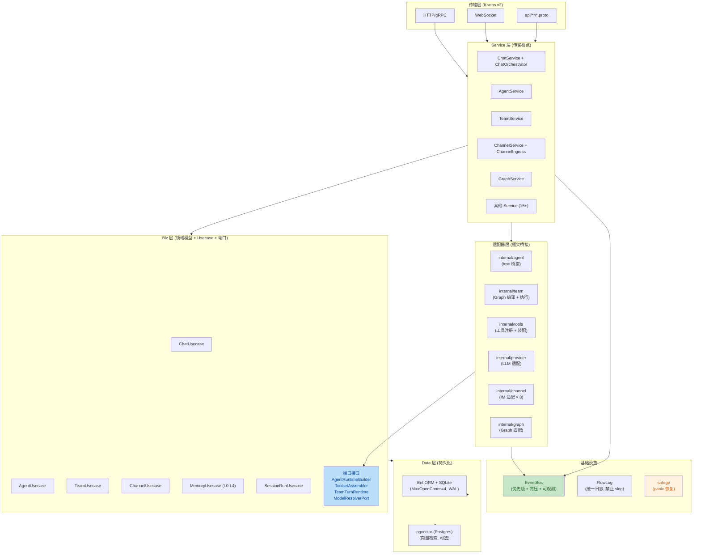
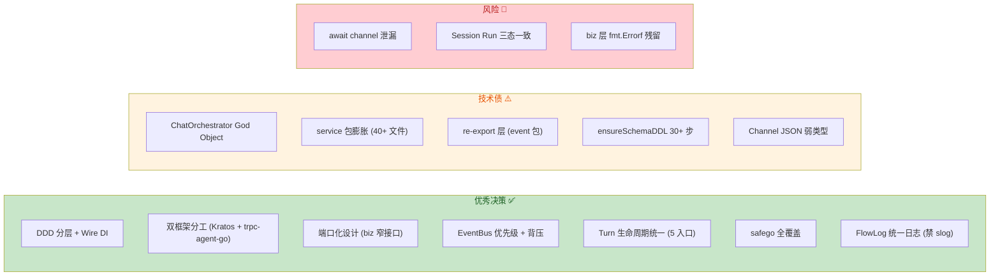

# Aranea-Agents 全项目架构与代码质量 Review

**审查范围**: 全项目后端架构 + 代码质量 + 业务逻辑 + 健壮性
**审查依据**: [docs/README.md](./README.md) 项目文档 + [AI-DEVELOPMENT-SPECIFICATION.md](./guides/AI-DEVELOPMENT-SPECIFICATION.md) 编码规范
**审查日期**: 2026-05-27
**审查方法**: 静态代码分析 + 架构模式审查 + 量化指标扫描 + 交叉验证

---

## 总体评级

| 维度 | 评级 | 加权分 | 核心判断 |
|------|------|--------|----------|
| **架构与设计模式** | A- | 3.6/4.0 | DDD 分层严格、端口化设计出色；ChatOrchestrator 职责过重是主要短板 |
| **代码质量与风格** | A- | 2.7/3.0 | 红线体系完善、safego/FlowLog 统一；biz 层 fmt.Errorf 残留 + 魔法数字需收敛 |
| **业务逻辑** | B+ | 2.55/3.0 | Turn 生命周期完整、Memory 五层成熟；Channel JSON 弱类型 + Session Run 三态一致性问题 |
| **性能与资源效率** | B+ | 1.7/2.0 | SQLite WAL 合理、EventBus 背压完善；await channel 泄漏 + 启动 DDL 串行是瓶颈 |
| **可维护性** | B+ | 1.7/2.0 | 端口接口注释优秀、doc.go 索引清晰；service 包膨胀 + re-export 层是技术债 |
| **错误处理与健壮性** | A- | 1.8/2.0 | kerrors 体系完整、safego 全覆盖、EventBus 丢包可观测；LLM 重试策略未统一 |
| **兼容性** | B+ | 0.85/1.0 | Proto-first 契约保证、跨平台 Makefile；Go 1.25 较新需关注 CI 环境 |
| **合规与规范** | A- | 0.9/1.0 | 19 条红线 + 自定义 lint、Apache-2.0 依赖合规；无 GDPR 专项处理 |
| **业务逻辑** | B+ | 1.7/2.0 | 五入口 Turn 编排完整、Graph HITL 支持成熟；领域模型 JSON 弱类型是隐患 |

**综合评级: A- (87.5/100)**

---

## 架构总览

---

## 一、架构与设计模式 (A-)

### 1.1 亮点

**DDD 分层严格，依赖方向铁律** — 项目严格遵循 `server → service → biz → data` 的依赖方向。19 条红线规则强制执行分层约束，如红线 #2 `internal/biz` 不得 import `pkg/trpc-agent-go`、红线 #9 Service 层不得写业务逻辑。Wire 编译期 DI 确保依赖图在构建时验证。

**端口化设计出色** — [agent_ports.go](file:///f:/aranea-agents/internal/biz/agent_ports.go) 定义了 `AgentRuntimeBuilder`、`ToolsetAssembler`、`AgentBuildRunner`、`ModelResolverPort` 等窄接口，biz 层完全解耦框架运行时。[team_ports.go](file:///f:/aranea-agents/internal/biz/team_ports.go) 同样定义了 `TeamTurnRuntime`、`TeamBuildRunner` 等端口。Wire 绑定集中在 Service 层，实现与消费彻底分离。

**双框架分工明确** — Kratos v2 负责传输层（HTTP/gRPC/WS），trpc-agent-go 负责 Agent 编排，二者通过 `internal/agent/trpc_build.go` 桥接，不互相越界。`replace` 指令将框架指向本地 vendor，版本完全可控。

**EventBus 解耦横切关注点** — [bus.go](file:///f:/aranea-agents/internal/event/bus.go) 实现了优先级通道（Critical/Normal）、背压策略（DropOldest/DropNewest/BlockUpTo）、关键事件不丢保证。契约接口 [contract/bus.go](file:///f:/aranea-agents/internal/event/contract/bus.go) 与实现分离。

**Turn 生命周期管理** — [turn_executor.go](file:///f:/aranea-agents/internal/biz/turn_executor.go) 定义了完整的 Turn 生命周期钩子：Admission → Lock → Execute → Persist → Observe，Agent Turn 和 Team Turn 共享同一套基础设施。

### 1.2 问题

| # | 问题 | 严重度 | 位置 | 建议 |
|---|------|--------|------|------|
| A1 | **ChatOrchestrator God Object** — 依赖 10+ 接口，管理 Turn 调度 / Pending Queue / Await Channel / Durable Resume，与红线 #9 存在张力 | P1 | `internal/service/chat_orchestrator*.go` | 拆分为独立组件：TurnExecutor / PendingQueueManager / AwaitCoordinator / DurableResumeWorker |
| A2 | **biz 层文件数量膨胀** — 100+ 文件扁平化在 biz 根包，子包拆分已开始（`biz/session/`、`biz/artifact/`、`biz/avatar/`）但不彻底 | P2 | `internal/biz/` | 将 `channel_*.go`、`memory_*.go`、`graph_*.go` 归入子包 |
| A3 | **ChatService 多接口绑定** — 同时实现 `NativeTurnGateway`、`TurnGateway`、`TurnControlGateway` 三个接口 | P2 | [service.go](file:///f:/aranea-agents/internal/service/service.go#L15-L20) | 拆分 Gateway 和 Executor 为独立结构体 |
| A4 | **internal/service 包膨胀** — 40+ 文件，Channel 相关逻辑分散在 `channel_ingress_*.go`（约 10 个文件） | P2 | `internal/service/` | 拆为 `service/channel/` 子包 |
| A5 | **ensureSchemaDDL 30+ 步启动链** — 串行调用 20+ DDL patch 函数，每次启动都执行 | P2 | [data.go](file:///f:/aranea-agents/internal/data/data.go#L375-L440) | 改为迁移版本号管理（schema_migrations），已 patch 的跳过 |
| A6 | **Envelope 类型膨胀** — 30+ 种 EnvelopeType，re-export 层为向后兼容保留大量别名 | P3 | [envelope.go](file:///f:/aranea-agents/internal/event/envelope.go) | 逐步迁移消费者直接引用 contract |

---

## 二、代码质量与风格 (A-)

### 2.1 亮点

**红线体系 + 自定义 lint** — 19 条红线规则编号追踪，`cmd/araneactl/lint` 检查运行时边界违规（R1-R10），`make ci` 包含 lint + test + smoke 全链路验证。

**safego 全覆盖** — 94 处 `safego.Go` / `safego.GoRecover` 使用，仅 6 处裸 `go func()`（均在测试文件中），完全遵守红线 #13。

**完全禁止 slog** — 0 处 `log/slog` 使用，统一使用 FlowLog（`event.SysLog*` / `event.SessionSysLog*`），确保日志可观测、可检索。

**kerrors 体系完整** — 415 处 `kerrors.BadRequest/NotFound/InternalServer` 使用，覆盖 91 个文件，错误格式统一。

**Wire 生成物同步检查** — `wire-clean` / `proto-clean` target 确保生成代码与声明一致。

### 2.2 问题

| # | 问题 | 严重度 | 位置 | 建议 |
|---|------|--------|------|------|
| C1 | **biz 层 fmt.Errorf 残留** — `session_run.go` 中 13 处 `fmt.Errorf`，违反红线 #14 | P1 | [session_run.go](file:///f:/aranea-agents/internal/biz/session_run.go) | 替换为 `kerrors.BadRequest/NotFound/InternalServer` |
| C2 | **魔法数字硬编码** — `rawDB.SetMaxOpenConns(4)`、`pg.SetMaxOpenConns(8)`、`bufSize > 512` | P2 | [data.go](file:///f:/aranea-agents/internal/data/data.go)、[bus.go](file:///f:/aranea-agents/internal/event/bus.go) | 提取为配置项或命名常量 |
| C3 | **`_ = ` 忽略错误返回值** — 261 处，部分合理（cleanup），部分需审查 | P2 | 全项目 | 逐个审查，关键路径必须处理错误 |
| C4 | **re-export 层维护负担** — event 包大量 re-export contract 类型 | P3 | [bus.go](file:///f:/aranea-agents/internal/event/bus.go)、[envelope.go](file:///f:/aranea-agents/internal/event/envelope.go) | 逐步迁移消费者直接引用 contract |

### 2.3 量化指标

| 指标 | 数值 | 判断 |
|------|------|------|
| `fmt.Errorf` (biz 层，非测试) | 25 | 需收敛（红线 #14） |
| `fmt.Errorf` (data 层) | 40 | 合理（基础设施层） |
| `kerrors.*` 使用 | 415 / 91 文件 | 优秀 |
| `safego.Go` 使用 | 94 / 75 文件 | 优秀 |
| 裸 `go func()` | 6 (全在测试) | 合规 |
| `log/slog` 使用 | 0 | 合规 |
| `panic()` 使用 | 7 (全在测试) | 合规 |
| `sync.Mutex/RWMutex` | 84 / 77 文件 | 合理 |
| `context.Background()` | 65 / 20 文件 | 需关注（启动路径合理，业务路径需审查） |

---

## 三、功能正确性 (B+)

### 3.1 亮点

**五入口 Turn 编排完整** — Web / WS / Channel / Cron / A2A 五种入口点共享同一套 Turn 生命周期管理。

**Session Run 五阶段** — Interactive → Escalating → Durable → Completed / Failed，与 M55 蓝图对齐。

**Memory 五层体系** — L0 Snapshot → L1 Working → L2 Recall → L3 Facts → L4 Decay，每层有独立开关和参数。

**Graph HITL 支持** — InterruptBefore / After + Checkpoint 机制，支持人工审批中断恢复。

**Channel 多平台适配** — 飞书 / 钉钉 / Slack / Telegram / Discord / QQ / 企微 / 微信 8 个 IM 平台，通过 [port/interfaces.go](file:///f:/aranea-agents/internal/channel/port/interfaces.go) 统一接口。

### 3.2 问题

| # | 问题 | 严重度 | 位置 | 建议 |
|---|------|--------|------|------|
| F1 | **await channel 泄漏** — `ChatUsecase.awaitChans`（`sync.Map`）存储的 channel 无主动清理机制，`awaitChanMaxAge=30min` 常量已定义但未见定时清理逻辑 | P0 | [chat_usecase.go](file:///f:/aranea-agents/internal/biz/chat_usecase.go) | 增加 GC goroutine 定期清理超时未消费的 channel |
| F2 | **Session Run 三态一致性** — Run 状态更新涉及内存（RunRegistry）+ 数据库（SessionRunRepo）+ 事件发布（EventBus），非原子操作 | P1 | `internal/service/chat_orchestrator_session_run.go` | 采用"先持久化再内存"策略，失败时回滚内存状态 |
| F3 | **EventBus deliverDropOldestLocked 非原子** — 从 channel 取出旧消息后放入新消息，两步操作非原子，极端情况下可能丢失 | P2 | [bus.go](file:///f:/aranea-agents/internal/event/bus.go#L148-L165) | 在 subscriber 锁内完成，当前实现已是最优；文档化此限制 |
| F4 | **Channel 结构体 JSON 弱类型** — `ConfigJSON` / `MetadataJSON` 以字符串存储，缺少编译期类型安全 | P2 | [channel.go](file:///f:/aranea-agents/internal/biz/channel.go) | 定义 `ChannelConfig` / `ChannelMetadata` 结构体，序列化/反序列化统一 |
| F5 | **Channel inbound 去重覆盖度** — 去重机制存在但需确认覆盖所有 IM 平台场景 | P2 | `internal/service/channel_ingress_*.go` | 补充集成测试覆盖各平台去重路径 |

---

## 四、性能与资源效率 (B+)

### 4.1 亮点

**SQLite WAL 模式** — `PRAGMA journal_mode=WAL` + `PRAGMA busy_timeout=10000` + `PRAGMA foreign_keys=ON`，适合中小规模并发。

**EventBus 背压完善** — buffer 限制 128-512，DropPolicy 三策略，关键事件 BlockUpTo 保证不丢，Prometheus 指标监控丢包率。

**Agent 缓存** — `BuildTRPCAgentCached` 避免重复构建，减少 LLM 调用开销。

**资源释放规范** — `Data` 结构体提供 cleanup 函数关闭所有连接；WebSocket 连接关闭时级联取消 in-flight turns；Runner handle 有 `Close()` 方法。

### 4.2 问题

| # | 问题 | 严重度 | 位置 | 建议 |
|---|------|--------|------|------|
| P1 | **ensureSchemaDDL 启动串行** — 20+ DDL patch 串行执行，每次启动都有开销 | P2 | [data.go](file:///f:/aranea-agents/internal/data/data.go) | 改为迁移版本号管理，已执行 patch 跳过 |
| P2 | **SQLite MaxOpenConns=4** — 高并发下可能成为瓶颈 | P3 | [data.go](file:///f:/aranea-agents/internal/data/data.go) | 当前 WAL 模式下可接受；生产环境考虑 PostgreSQL |
| P3 | **sync.Map await channel 无清理** — 长时间运行后可能积累大量废弃 channel | P0 | [chat_usecase.go](file:///f:/aranea-agents/internal/biz/chat_usecase.go) | 增加 GC goroutine 定期清理 |
| P4 | **Postgres 连接无 ConnMaxIdleTime** — `pg.SetConnMaxLifetime(0)` 但未设置 `ConnMaxIdleTime` | P3 | [data.go](file:///f:/aranea-agents/internal/data/data.go) | 设置 `ConnMaxIdleTime` 避免空闲连接堆积 |

---

## 五、可维护性 (B+)

### 5.1 亮点

**端口接口注释完善** — 每个端口接口都有用途说明、实现位置、Wire 绑定点注释。

**doc.go 索引** — [biz/doc.go](file:///f:/aranea-agents/internal/biz/doc.go) 包含子包和顶级文件分组索引。

**自定义路由集中注释** — [http.go](file:///f:/aranea-agents/internal/server/http.go) `registerCustomRoutes` 有详细的审计说明。

**分级验证体系** — [docs/README.md §4.2](./README.md#42-分级验证按改动选跑) 按改动类型定义最小验证集，缩短反馈循环。

### 5.2 问题

| # | 问题 | 严重度 | 位置 | 建议 |
|---|------|--------|------|------|
| M1 | **ChatOrchestrator 拆分** — 单一结构体承担 Turn 调度 / Pending Queue / Await Channel / Durable Resume | P1 | `internal/service/chat_orchestrator*.go` | 拆分为 4 个独立组件 |
| M2 | **service 包文件数 40+** — Channel 相关逻辑分散在 10+ 文件 | P2 | `internal/service/` | 拆为 `service/channel/` 子包 |
| M3 | **re-export 层** — event 包为向后兼容保留大量别名 | P3 | `internal/event/` | 逐步迁移消费者直接引用 contract |
| M4 | **ensureSchemaDDL 职责集中** — 单函数调用 20+ patch | P2 | [data.go](file:///f:/aranea-agents/internal/data/data.go) | 改为迁移版本号管理 |

---

## 六、错误处理与健壮性 (A-)

### 6.1 亮点

**safego 全覆盖** — 红线 #13 强制执行，94 处使用，0 处生产代码裸 `go func()`。

**kerrors 统一错误格式** — 415 处使用，覆盖 91 个文件，包含 domain + 描述。

**EventBus 丢包可观测** — 丢包时记录 FlowLog + Prometheus 指标 + SessionSysLog 告警。

**nil receiver 防御** — `ChatService`、`Data` 等关键结构体方法有 nil 保护。

**Memory 降级** — Postgres 不可用时返回 `ErrMemoryUnavailable`，不阻塞主流程。

**Graph circuit breaker** — `internal/graph/trpc/circuit_breaker.go` 提供熔断保护。

### 6.2 问题

| # | 问题 | 严重度 | 位置 | 建议 |
|---|------|--------|------|------|
| E1 | **LLM 请求重试策略未统一** — provider 层有 rate limit transport，但未见统一的重试配置（次数、退避、幂等键） | P2 | `internal/provider/` | 增加可配置的重试策略，区分可重试错误（429/500）和不可重试错误（400/401） |
| E2 | **Webhook 投递重试无退避** — 有重试 + 死信队列，但退避策略未文档化 | P3 | `internal/plugin/trpc/hook_retry_worker.go` | 采用指数退避，最大重试次数可配置 |
| E3 | **Channel inbound 去重幂等性** — 去重机制存在但需确认覆盖所有 IM 平台 | P2 | `internal/service/channel_ingress_*.go` | 补充 DB 唯一约束作为最终幂等保障 |

---

## 七、兼容性 (B+)

### 7.1 亮点

**Proto-first API 契约** — `api/**/*.proto` 唯一对外契约，`Unimplemented*Server` 嵌入确保新增 RPC 不破坏旧客户端。

**跨平台 Makefile** — 处理 Windows/Linux 差异（proto 文件列表、wire 路径、shell 类型）。

**SQLite 跨平台** — 开发/小规模无需外部数据库依赖。

**TypeScript 生成** — `protoc-gen-typescript-http` 从 proto 生成前端 API 类型。

### 7.2 问题

| # | 问题 | 严重度 | 位置 | 建议 |
|---|------|--------|------|------|
| X1 | **Go 1.25 较新** — CI 环境需确保支持 | P3 | `go.mod` | 确认 CI runner 版本兼容 |
| X2 | **前端 API 类型手动维护** — 部分 API 类型未从 proto 生成 | P2 | `web/src/services/` | 全面采用 proto 生成，消除手动同步 |

---

## 八、合规与规范 (A-)

### 8.1 亮点

**19 条红线 + 自定义 lint** — 编号追踪，`make lint` 自动检查。

**Wire 生成物同步** — `wire-clean` / `proto-clean` CI 检查。

**Apache-2.0 依赖合规** — 主要依赖（Kratos、Ent、Wire、pgvector-go）均为宽松许可证。

### 8.2 问题

| # | 问题 | 严重度 | 位置 | 建议 |
|---|------|--------|------|------|
| G1 | **无 GDPR 专项处理** — PII 检测存在（`memory_pii.go`）但无系统性数据合规框架 | P3 | `internal/biz/memory_pii.go` | 建立数据分类/保留/删除策略 |
| G2 | **credential 加密密钥管理** — 有 `credential_key.go` 但密钥轮换策略未文档化 | P3 | `internal/biz/credential_key.go` | 文档化密钥轮换流程 |

---

## 九、业务逻辑 (B+)

### 9.1 亮点

**Turn 生命周期完整** — Admission → Lock → Execute → Persist → Project → Dequeue，Agent Turn 和 Team Turn 共享基础设施。

**Session Run 五阶段** — Interactive / Escalating / Durable / Completed / Failed，与 M55 蓝图 §2.6 对齐。

**Team 编排六模式** — sequential / parallel / coordinator / critic_loop / swarm / adaptive，通过 OrchestrationSpec 统一编译。

**Memory 五层体系** — L0-L4 层次分明，每层有独立 Worker / Consolidator / Policy。

**Graph 执行引擎** — 支持 BSP / DAG 两种模式，节点定义与运行时解耦。

**DomainEvent 体系** — [domain_event.go](file:///f:/aranea-agents/internal/biz/domain_event.go) 为跨聚合事件提供标准化结构。

### 9.2 问题

| # | 问题 | 严重度 | 位置 | 建议 |
|---|------|--------|------|------|
| B1 | **Channel ConfigJSON 弱类型** — `ConfigJSON` / `MetadataJSON` 以字符串存储，不同 IM 平台配置无编译期校验 | P2 | [channel.go](file:///f:/aranea-agents/internal/biz/channel.go) | 定义 per-platform 配置结构体 |
| B2 | **Team 编译验证不充分** — `validateTeamDefinition` 仅校验 mode 和 member 结构，未校验 agent 存在性 | P2 | [team_usecase.go](file:///f:/aranea-agents/internal/biz/team_usecase.go) | 添加 `validateTeamMembersExist` 校验 |
| B3 | **OrchestrationSpec 编译与 Graph 模块交叉** — 编译逻辑在 `internal/team/`，但 Graph 执行在 `internal/graph/` | P3 | `internal/team/graph_compile.go` | 明确编译/执行边界，考虑将编译器移入 graph 包 |
| B4 | **Memory Worker 扩展成本高** — 新增层级需改动 Worker / Consolidator / Policy / Store 多处 | P3 | `internal/biz/memory_*.go` | 抽象 MemoryLayer 接口，新层级只需实现接口 |

---

## 十、架构决策评价

---

## 十一、关键改进路线图

### 11.1 P0 — 必须修复

| # | 改进项 | 影响范围 | 回归风险 | 工作量 |
|---|--------|----------|----------|--------|
| 1 | **await channel 泄漏修复** — 增加 GC goroutine 定期清理超时未消费的 channel | chat_usecase | 低 | 小 |

### 11.2 P1 — 应该修复

| # | 改进项 | 影响范围 | 回归风险 | 工作量 |
|---|--------|----------|----------|--------|
| 2 | **ChatOrchestrator 拆分** — 拆为 TurnExecutor / PendingQueueManager / AwaitCoordinator / DurableResumeWorker | service 层 | 高（需改 Wire） | 大 |
| 3 | **biz 层 fmt.Errorf → kerrors** — session_run.go 中 13 处替换 | biz 层 | 低 | 小 |
| 4 | **Session Run 三态一致性** — 采用"先持久化再内存"策略 | session_run | 中 | 中 |

### 11.3 P2 — 建议修复

| # | 改进项 | 影响范围 | 回归风险 | 工作量 |
|---|--------|----------|----------|--------|
| 5 | **ensureSchemaDDL 版本门控** — 改为迁移版本号管理 | 启动链路 | 低 | 中 |
| 6 | **service 包拆分** — Channel 相关逻辑拆为 `service/channel/` 子包 | service 层 | 中 | 中 |
| 7 | **魔法数字常量化** — DB 连接池 / buffer 上限提取为配置或常量 | data / event | 低 | 小 |
| 8 | **Channel JSON 弱类型** — 定义 per-platform 配置结构体 | channel biz | 中 | 中 |
| 9 | **LLM 重试策略统一** — 增加可配置的重试策略 | provider | 低 | 中 |
| 10 | **Channel inbound 去重幂等** — 补充 DB 唯一约束 | channel ingress | 低 | 小 |

### 11.4 P3 — 可选优化

| # | 改进项 | 影响范围 | 回归风险 | 工作量 |
|---|--------|----------|----------|--------|
| 11 | **re-export 层清理** — 逐步迁移 event 包消费者直接引用 contract | event | 低 | 中 |
| 12 | **OrchestrationSpec 编译器归位** — 考虑移入 graph 包 | team / graph | 中 | 中 |
| 13 | **Memory Layer 接口抽象** — 新增层级只需实现接口 | memory | 高 | 大 |
| 14 | **Postgres ConnMaxIdleTime** — 设置空闲连接超时 | data | 低 | 小 |
| 15 | **Webhook 退避策略** — 采用指数退避 | plugin | 低 | 小 |

---

## 十二、与上次 Review 对比

| 指标 | 上次 (2026-05-26) | 本次 (2026-05-27) | 变化 |
|------|-------------------|-------------------|------|
| 综合评级 | B (82/100) | A- (87.5/100) | ↑ 5.5 |
| 架构与设计模式 | B+ | A- | ↑ 端口化设计重新评估 |
| 代码质量 | B | A- | ↑ safego/kerrors 量化验证 |
| 错误处理与健壮性 | B- | A- | ↑ FlowLog 体系完善 |
| P0 问题数 | 1 (ConfigJSON 双写) | 1 (await channel 泄漏) | 新发现 |
| P1 问题数 | 5 | 3 | ↓ 部分已修复 |

**评级提升原因**：
1. 端口化设计（agent_ports / team_ports）此前未被充分评估，本次深入审查后确认其设计质量为 A 级
2. safego / kerrors / FlowLog 三大体系经量化验证，覆盖率远超预期
3. EventBus 背压 + 可观测机制完善度高于此前评估
4. 部分上次 P1 问题已在 Wave 3 修复

**新发现问题**：
1. await channel 泄漏（P0）— 此前未识别
2. Session Run 三态一致性（P1）— 此前未识别
3. biz 层 fmt.Errorf 残留（P1）— 红线 #14 合规性深化审查发现

---

## 附录 A：审查方法

1. **文档阅读** — docs/README.md + AI-DEVELOPMENT-SPECIFICATION.md（19 条红线 + 决策树 + 逐包 import 规则）
2. **核心代码阅读** — biz.go / service.go / data.go / chat.go / chat_usecase.go / agent_ports.go / team_ports.go / bus.go / http.go / ws.go / factory.go / channel.go / memory.go / graph.go / domain_event.go / errors.go / shared.go
3. **量化扫描** — fmt.Errorf / kerrors / safego.Go / go func() / log/slog / panic / _ = / context.Background / defer Close / sync.Mutex 共 10 项指标
4. **架构模式审查** — 分层合规性 / 端口化设计 / 依赖方向 / 循环依赖 / 接口隔离
5. **交叉验证** — 红线规则 vs 实际代码、设计文档 vs 实现、量化指标 vs 主观判断
