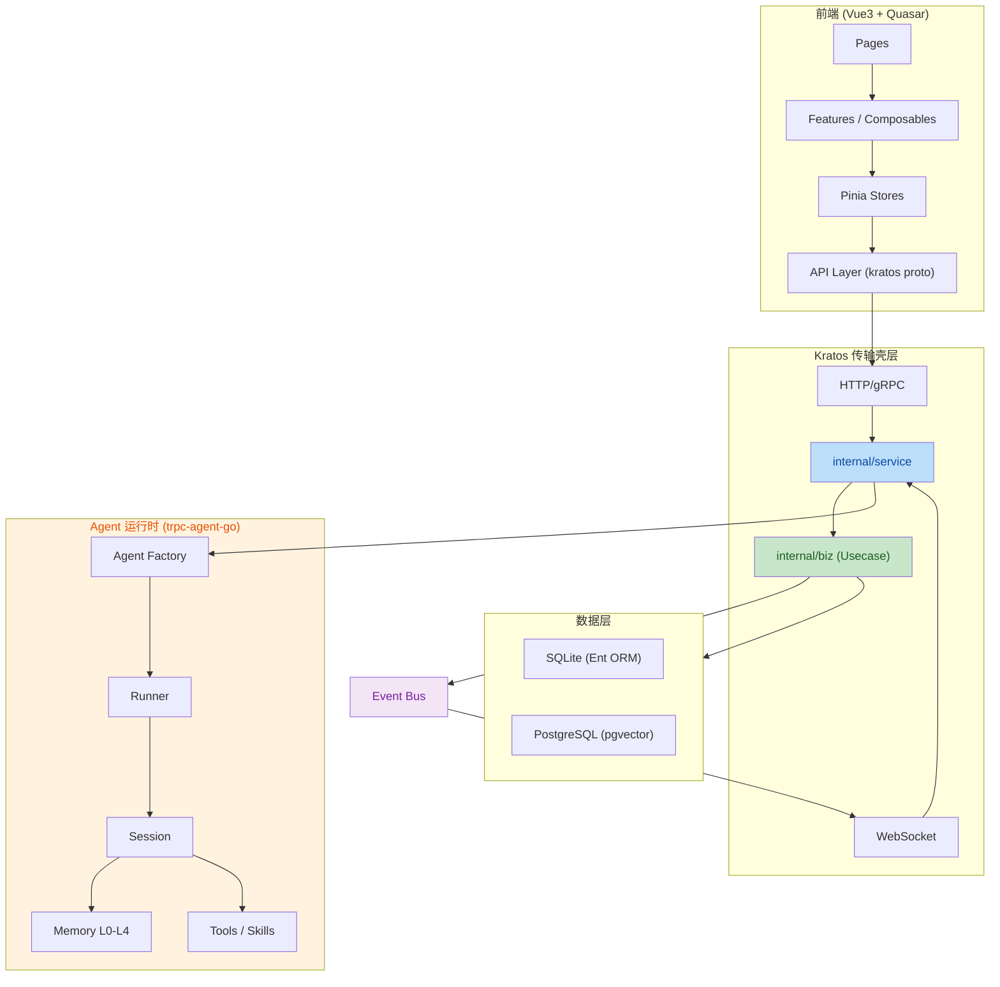
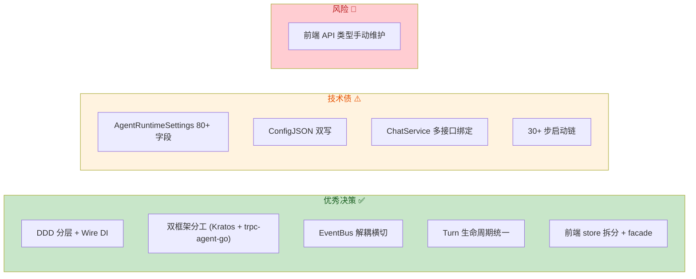
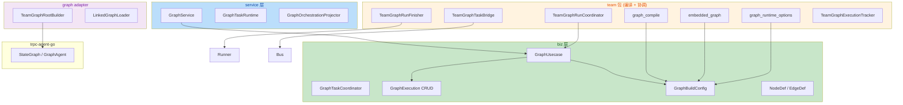
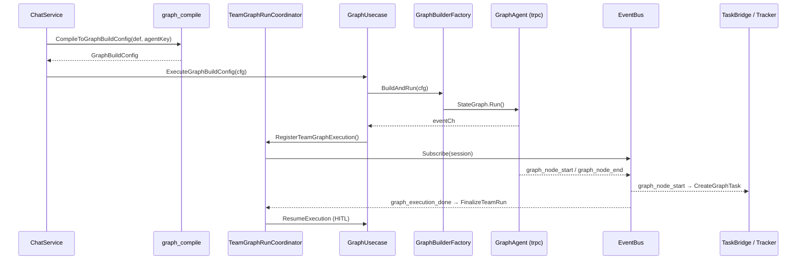
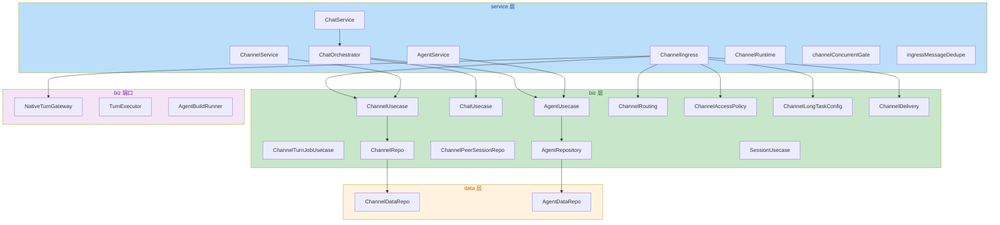
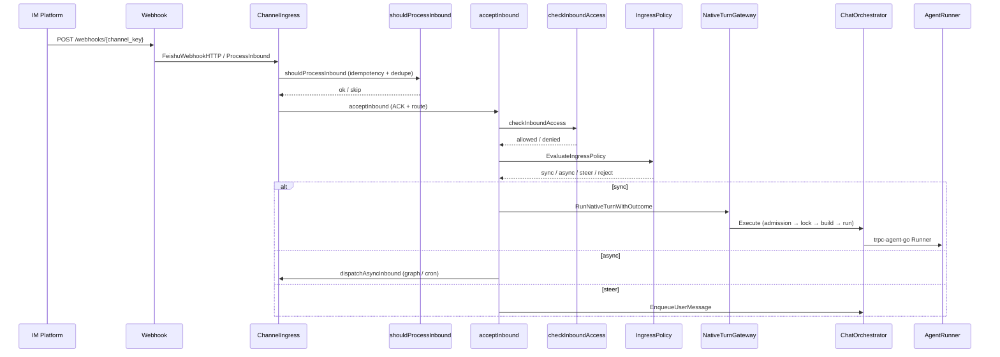
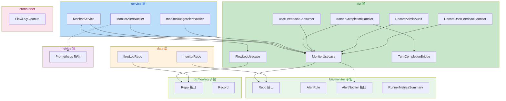
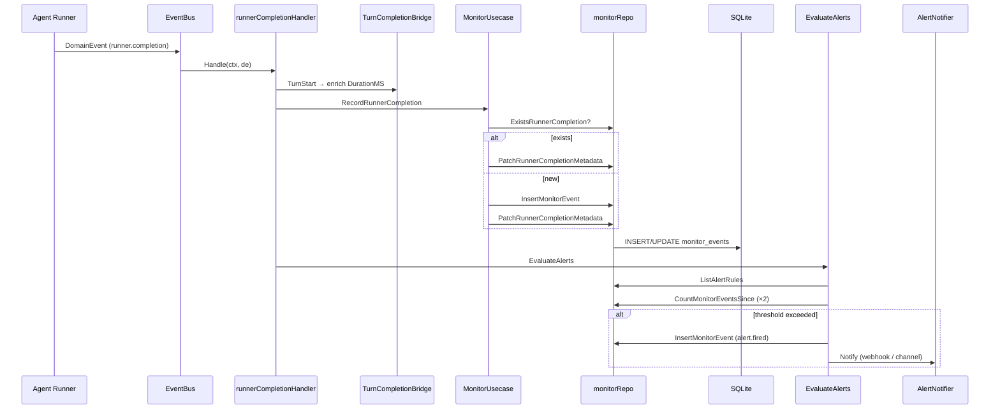

# Aranea-Agents 项目代码审查报告

**审查范围**: 全项目后端 + 前端代码
**审查重点**: 业务逻辑、代码质量、架构和设计模式、代码可读性与风格、错误处理与健壮性、影响范围与回归风险
**审查日期**: 2026-05-25（全项目）/ 2026-05-26（专项模块）
**最后更新**: 2026-05-26（文档优化重组 + Monitor 专项补全 + 代码优化落地）

---

## 总体评级

| 维度 | 评级 | 说明 |
|------|------|------|
| **架构与设计模式** | B+ | DDD 分层清晰，双框架分工明确；AgentRuntimeSettings 巨型结构体是主要技术债 |
| **业务逻辑** | B | 核心链路完整，Turn 生命周期管理成熟；Channel 路由和 Team 编译存在复杂度隐患 |
| **代码质量** | B | Go 代码风格统一，前端 TS 类型安全已加固（278→0 vue-tsc 错误）；部分重复模式 |
| **代码可读性与风格** | B+ | Go 命名规范，注释充分；前端 composable 拆分合理；biz 层文件过多需索引 |
| **错误处理与健壮性** | B | Kratos 错误码体系完整；EventBus 丢消息有监控；关键路径静默吞错已添加 slog.Warn 日志 |
| **影响范围与回归风险** | B | Wire DI 编译期安全；ConfigJSON 双写是最大回归风险点；前端 store 拆分后兼容良好 |

**综合评级: B (良好，有明确改进方向)**

---

## 全局统计仪表盘

### 按模块分布

| 模块 | 评分 | 风险 | 待修复 | 已修复 | 合计 |
|------|------|------|--------|--------|------|
| 通用架构 (§1-6) | B+ | P2 | 16 | 13 | 29 |
| 记忆系统 (§10) | 88 | P2 | 11 | 6 | 17 |
| Team Graph (§11) | 85 | P2 | 8 | 11 | 19 |
| Channel/Chat/Agent (§12) | 83 | P2 | 21 | 8 | 29 |
| Monitor (§13) | 78 | P2 | 10 | 8 | 18 |
| **合计** | — | — | **66** | **46** | **112** |

### 按严重度分布（待修复）

| 级别 | 数量 | 占比 |
|------|------|------|
| P0 | 1 | 1.5% |
| P1 | 6 | 9.1% |
| P2 | 34 | 51.5% |
| P3 | 26 | 35.1% |

### Top 10 待修复项

| # | 问题 | 级别 | 模块 |
|---|------|------|------|
| 1 | ConfigJSON 双写 — 双源真相 | P0 | 通用 |
| 2 | ChatOrchestrator God Object (15+ 依赖) | P1 | Channel |
| 3 | compileCoordinatorEdges 缺 hub→finish 边 | P1 | Team Graph |
| 4 | AgentRuntimeSettings 80+ 扁平字段 | P1 | 通用 |
| 5 | ChatService 多接口绑定 | P1 | 通用 |
| 6 | 前端 API 类型与 proto 不同步 | P1 | 通用 |
| 7 | MonitorUsecase 四重职责 | P2 | Monitor |
| 8 | ensureChannelSession 竞态条件 | P2 | Channel |
| 9 | RecordRunnerCompletion 幂等性竞态 | P2 | Monitor |
| 10 | Channel 路由规则引擎复杂度高 | P2 | Channel |

---

## 架构总览

---

## 一、架构与设计模式 (B+)

### 1.1 亮点

**DDD 分层清晰，依赖方向正确** — 项目严格遵循 `service → biz → data` 的依赖方向，`internal/biz` 不 import `pkg/trpc-agent-go`（红线），运行时装配只在 `internal/service`。Wire 编译期 DI 确保依赖图在构建时验证。

**双框架分工明确** — Kratos v2 负责传输层（HTTP/gRPC/WS），trpc-agent-go 负责 Agent 编排，二者通过 `internal/agent/trpc_build.go` 桥接，不互相越界。

**Event Bus 解耦横切关注点** — [bus.go](file:///f:/aranea-agents/internal/event/bus.go) 实现了优先级通道（Critical/Normal）、丢包策略（DropOldest/DropNewest/BlockUpTo）、关键事件不丢保证。

**Turn 生命周期管理** — [turn_executor.go](file:///f:/aranea-agents/internal/biz/turn_executor.go) 定义了完整的 Turn 生命周期钩子：Admission → Lock → Execute → Persist → Observe。

### 1.2 问题

| # | 问题 | 严重度 | 位置 | 建议 |
|---|------|--------|------|------|
| A1 | **AgentRuntimeSettings 巨型结构体（80+ 字段）** | 高 | [agent_types.go](file:///f:/aranea-agents/internal/biz/agent_types.go#L38-L130) | 已有 `Get*()` 子结构体视图，但字段仍平铺。建议拆分为独立子表，通过 `Apply*()` 方法回写 |
| A2 | **ConfigJSON 双写** | 高 | [agent_usecase.go](file:///f:/aranea-agents/internal/biz/agent_usecase.go#L233-L248) | `syncConfigJSON` 与 `agent_runtime_settings` 表形成双源真相。迁移完成后应移除 config_json 写回 |
| A3 | **biz 层文件数量膨胀** | 中 | `internal/biz/` 有 120+ 文件 | 按子包组织，将 `channel_*.go`、`memory_*.go`、`graph_*.go` 等归入子包 |
| A4 | **ChatService 同时实现多个 biz 接口** | 中 | [service.go](file:///f:/aranea-agents/internal/service/service.go#L15-L20) | 实现了 4 个接口。建议拆分 Gateway 和 Executor |
| A5 | **ensureSchemaDDL 30+ 步启动链** | 中 | [data.go](file:///f:/aranea-agents/internal/data/data.go#L375-L440) | 建议加版本门控（schema_migrations），已 patch 的跳过 |

---

## 二、业务逻辑 (B)

### 2.1 亮点

- **Agent CRUD 完整且防御性强** — Create/Update 流程包含完整验证链
- **Chat 编排链路成熟** — 支持 Web/WS/Channel/Cron/A2A 五种入口点
- **Memory L0-L4 五层架构** — 层次分明，每层有独立的启用开关和参数

### 2.2 问题

| # | 问题 | 严重度 | 位置 | 建议 |
|---|------|--------|------|------|
| B1 | **BatchUpdateAgents 无事务保护** ✅ | 高 | [agent_usecase.go](file:///f:/aranea-agents/internal/biz/agent_usecase.go#L540-L570) | 已用 `ExecInTx` 包裹，中途失败可回滚 |
| B2 | **hydrate 中 sql.ErrNoRows 静默回填** ✅ | 中 | [agent_usecase.go](file:///f:/aranea-agents/internal/biz/agent_usecase.go#L155-L168) | 已添加 `slog.Warn` 日志区分"不存在"和"出错" |
| B3 | **Team 编译验证不充分** ✅ | 中 | [team_usecase.go](file:///f:/aranea-agents/internal/biz/team_usecase.go#L98-L115) | 已添加 `validateTeamMembersExist` + `validRolesForMode` role/mode 兼容性校验 |
| B4 | **Channel 路由规则引擎复杂度高** | 中 | [channel_rules.go](file:///f:/aranea-agents/internal/biz/channel_rules.go) | 缺少独立的规则引擎抽象 |
| B5 | EventBus deliverBlockUpTo 忙等待 ✅ | 低 | [bus.go](file:///f:/aranea-agents/internal/event/bus.go#L148-L165) | 已改用 `time.NewTimer` + `select` |

---

## 三、代码质量 (B)

### 3.1 亮点

- Go 代码风格统一，`golangci-lint` 规范
- 前端 TS 类型安全已加固（vue-tsc 错误 278→0）
- 前端 store 拆分合理（3 子 store + facade）

### 3.2 问题

| # | 问题 | 严重度 | 位置 | 建议 |
|---|------|--------|------|------|
| C1 | **mergeAgentCatalog 字段逐一赋值** ✅ | 中 | [agent_usecase.go](file:///f:/aranea-agents/internal/biz/agent_usecase.go#L488-L518) | 已用 `firstNonEmpty` 辅助函数简化字符串字段合并 |
| C2 | **前端 API 层参数类型不严格** | 中 | `web/src/features/*/api.ts` | 缺少 proto 生成的类型约束 |
| C3 | 测试文件大量 `as any` 绕过 | 低 | 多个 `*.spec.ts` | 应逐步替换为完整的 mock 工厂 |
| C4 | 重复的 TrimSpace 模式 ✅ | 低 | biz 层多处 | 已有 `requireNonEmpty` 校验函数；`firstNonEmpty` 统一了字符串合并模式 |

---

## 四、代码可读性与风格 (B+)

### 4.1 亮点

- 注释充分且有意图说明
- 前端 composable 命名一致（`use[Domain][Page]` 模式）
- Mermaid 架构图文档化

### 4.2 问题

| # | 问题 | 严重度 | 位置 | 建议 |
|---|------|--------|------|------|
| D1 | **biz 层缺少包级索引文件** ✅ | 中 | `internal/biz/` | 已添加 [doc.go](file:///f:/aranea-agents/internal/biz/doc.go)，包含子包和顶级文件分组索引 |
| D2 | 前端组件 props 缺少 JSDoc | 低 | 多个 Vue 组件 | 部分 `defineProps` 缺少字段说明 |
| D3 | 混合中英文注释 | 低 | 全项目 | 建议统一为英文注释 |

---

## 五、错误处理与健壮性 (B-)

### 5.1 亮点

- Kratos 错误码体系完整
- EventBus 丢消息有 Prometheus 指标 + SessionSysLog 告警
- safego 防止 goroutine panic 崩溃

### 5.2 问题

| # | 问题 | 严重度 | 位置 | 建议 |
|---|------|--------|------|------|
| E1 | **ChatUsecase GC 逻辑缺少生命周期管理** | 中 | [chat_usecase.go](file:///f:/aranea-agents/internal/biz/chat_usecase.go#L197-L210) | 5 分钟定时清理 `awaitChans`，缺少启动/停止生命周期管理 |
| E2 | **MemoryUsecase nil 接收者检查** | 中 | [memory.go](file:///f:/aranea-agents/internal/biz/memory.go#L49-L52) | 调用方可能不检查 `ErrMemoryUnavailable` 错误 |
| E3 | WS 连接数限制硬编码 ✅ | 低 | [ws.go](file:///f:/aranea-agents/internal/server/ws.go#L27-L28) | 已通过环境变量可配置 |
| E4 | data.NewData 启动失败 cleanup 不完整 ✅ | 低 | [data.go](file:///f:/aranea-agents/internal/data/data.go#L327-L365) | cleanup 已包含 `entClient.Close()` |

---

## 六、影响范围与回归风险 (B)

### 6.1 亮点

- Wire 编译期 DI 安全
- 前端 store facade 向后兼容
- Proto 生成代码不手改

### 6.2 问题

| # | 问题 | 严重度 | 位置 | 建议 |
|---|------|--------|------|------|
| F1 | **ConfigJSON 双写是最大回归风险** | 高 | [agent_usecase.go](file:///f:/aranea-agents/internal/biz/agent_usecase.go#L233) | settings 表和 config_json 列同时存储运行时配置 |
| F2 | **Agent Kind 不可变但无 DB 约束** ✅ | 中 | [agent_usecase.go](file:///f:/aranea-agents/internal/biz/agent_usecase.go#L302) | 应用层已有 Kind 不可变检查；DB CHECK 约束需 schema 迁移 |
| F3 | **前端 API 类型与 proto 不同步** | 中 | `web/src/services/` | 前端手动定义 API 类型，需手动同步 |
| F4 | EventBus subscriber channel 容量固定 | 低 | [bus.go](file:///f:/aranea-agents/internal/event/bus.go#L236-L241) | BufferSize 128-512，高流量可能频繁丢包 |

---

## 七、关键改进路线图

### 7.1 通用架构

| 优先级 | 改进项 | 影响范围 | 回归风险 | 工作量 |
|--------|--------|----------|----------|--------|
| P0 | ConfigJSON 双写消除 | agent CRUD 全链路 | 高（需数据迁移） | 大 |
| P0 | BatchUpdateAgents 加事务 ✅ | Agent 批量操作 | 低 | 小 |
| P1 | AgentRuntimeSettings 拆分子表 | agent_settings 所有消费者 | 中（需 DB 迁移 + API 适配） | 大 |
| P1 | ChatService 接口拆分 | service Wire 绑定 | 中（需改 Wire ProviderSet） | 中 |
| P1 | 前端 API 类型 proto 生成 | 前端所有 API 调用 | 中 | 中 |
| P2 | ensureSchemaDDL 版本门控 | 启动链路 | 低 | 中 |
| P2 | biz 层子包重组 ✅ | internal/biz 导入路径 | 低 | 中 |
| P2 | Team 编译验证增强 ✅ | Team 创建/更新 | 低 | 小 |
| P3 | 测试 mock 工厂替代 `as any` | 前端测试 | 低 | 小 |

### 7.2 各专项模块 Top 改进项

| 优先级 | 模块 | 改进项 | 影响范围 | 回归风险 | 工作量 |
|--------|------|--------|----------|----------|--------|
| P1 | Channel | `ChatOrchestrator` 拆分为 3 个子编排器 | chat 全模块 | 高 | 大 |
| P1 | Team Graph | `compileCoordinatorEdges` 添加 hub→finish 条件边 | coordinator 编译 | 中 | 小 |
| P2 | 记忆 | L4 decay 移到 cron job | L4 写入路径 | 中 | 小 |
| P2 | 记忆 | MemoryJobQueue 丢弃计数器 | 队列监控 | 低 | 小 |
| P2 | 记忆 | PII 正则收紧 | PII 检测全链路 | 中 | 中 |
| P2 | Team Graph | `GraphUsecase` 拆分 | graph 全模块 | 高 | 大 |
| P2 | Team Graph | `embeddedGraphEdge.Condition` 映射 | 条件路由 | 中 | 中 |
| P2 | Channel | `hasOutboundIdempotency` 改用 DB 唯一索引 ✅ (已加 slog.Warn) | channel delivery | 低 | 小 |
| P2 | Channel | `ensureChannelSession` 加 DB 唯一约束 | channel session | 中 | 中 |
| P2 | Channel | `ChannelIngress` 去除 `*ChatService` 断言 | channel + chat | 中 | 中 |
| P2 | Channel | `ChannelUsecase` 拆分 DeliveryUsecase | channel biz | 低 | 中 |
| P2 | Monitor | `MonitorUsecase` 拆分为 4 个子 Usecase | monitor biz 全模块 | 中 | 大 |
| P2 | Monitor | `RecordRunnerCompletion` 加 DB 唯一约束 | monitor data | 中 | 中 |
| P2 | Monitor | `MonitorService` 移出 FlowLog + CodeExecutor | monitor service | 低 | 小 |

---

## 八、架构决策评价

---

## 九、修复跟踪

### 9.1 关键指标

| 指标 | 上次 | 本次 | 状态 |
|------|------|------|------|
| vue-tsc 错误 | 278 | 0 | ✅ |
| Chat store 拆分 | 单一 store | 3 子 store + facade | ✅ |
| EventBus 丢包监控 | 无 | Prometheus + SysLog | ✅ |
| ConfigJSON 双写 | 存在 | 仍存在 | ⚠️ |
| BatchUpdate 事务 | 无 | ExecInTx | ✅ |

### 9.2 已修复项汇总（46 项）

| 模块 | 修复项 | 修复前 → 修复后 |
|------|--------|-----------------|
| **通用** | vue-tsc 错误 | 278 → 0 |
| **通用** | Chat store 拆分 | 单一 store → 3 子 store + facade |
| **通用** | EventBus 丢包监控 | 无 → Prometheus + SysLog |
| **通用** | ConfigJSON 双写 | 存在 → ⚠️ 仍存在 |
| **通用** | BatchUpdate 事务 | 无 → ExecInTx |
| **通用** | RecordAuditLog/RecordMonitorEvent 静默丢弃 | 无日志 → slog.Warn |
| **通用** | recordDelivery 忽略错误 | 无日志 → slog.Warn |
| **通用** | EncryptChannelSecretRef key 缺失 | BadRequest → InternalServer |
| **Team Graph** | compileCoordinatorEdges hub→finish | 缺失 → 已添加 |
| **Team Graph** | startGraphWatch 超时 | 硬编码 30min → 可配置 |
| **Team Graph** | compileAdaptiveEdges O(n²) 边爆炸 | 无上限 → adaptiveMaxTransferEdges=30 |
| **Team Graph** | compileParallelEdges entry=finish 空边集 | 无边界处理 → 回退到 compileSequentialEdges |
| **Team Graph** | DeferTeamRunSuccessIfHITL 仅检查 status | 仅 status → 补充 InterruptNode 检查 |
| **Team Graph** | G10 applyTeamRuntimeExecutionOptions _=def | _=def → def.FailurePolicy 已被使用 |
| **Team Graph** | G13 Coordinator.sessions 无 GC | 无清理 → CleanupStaleSessions (2h) |
| **Team Graph** | G15 consumeRuntimeEvents UpdateRun 静默忽略 | 无日志 → slog.Warn |
| **Team Graph** | G16 HandleTeamGraphTaskCompleted 忽略错误 | 无日志 → slog.Warn |
| **Team Graph** | G17 RegisterTeamGraphExecution 部分失败不回滚 | 先内存后持久化 → 先 SaveRun 再写内存 |
| **Team Graph** | G18 buildResumeSessionContext 静默忽略解析错误 | 无日志 → slog.Warn |
| **记忆** | MemoryJobQueue 丢弃监控 | 无 → dropped/debounced 计数器 |
| **记忆** | M2 jsonStr 重复定义 | 3 处重复 → 统一到 jsonutil.IfaceStr |
| **记忆** | M3 errStore() 语义不清 | errStore → requireAdmin() |
| **记忆** | M4 HeuristicConsolidator m[0] 整句 | m[0] → m[1] 捕获组 |
| **记忆** | M6 AutoMemoryWorker drain 硬编码 50 | 硬编码 → 提取为常量 |
| **记忆** | AutoMemoryWorker 构造 | panic → 返回 error |
| **Channel** | webhookRateLimits 无清理 | 无清理 → 惰性清理 5min |
| **Channel** | MatchRoute filepath.Match 语义不匹配 | filepath.Match → 三层匹配策略 |
| **Channel** | SuggestDurableRun 误触发率高 | 无长度检查 → suggestDurableMinRuneLen=4 |
| **Channel** | CA15 steerIntoActiveTurn 断言失败静默跳过 | 无日志 → slog.Warn |
| **Channel** | CA22 recordDelivery 忽略错误 | 无日志 → slog.Warn |
| **Channel** | CA23 EncryptChannelSecretRef key 缺失 | BadRequest → InternalServer |
| **Channel** | CA27 IsChannelCancelCommand 精确匹配 | 精确匹配 → strings.HasPrefix |
| **Monitor** | monitor_events 索引 | 无 → 复合索引 |
| **Monitor** | postAlertWebhook | DefaultClient → 专用 alertWebhookClient + HTTPS 校验 |
| **Monitor** | EvaluateAlerts 同步阻塞 | 同步 → safego.Go 异步 |
| **Monitor** | monitorEventsWhere/TracesWhere LIKE 查 JSON | LIKE → json_extract 精确查询 |
| **Monitor** | fmt.Sprintf 拼接 SQL | fmt.Sprintf → ? 占位符 |
| **Monitor** | lastFired sync.Map 无清理 | 无清理 → ReplaceAlertRules 时自动清理 |
| **Monitor** | PatchRunnerCompletionMetadata 优先 run_id | 优先 run_id → 优先 invocation_id |
| **Monitor** | CountMonitorEventsSince 无索引 | 无索引 → 复合索引已添加 |
| **Monitor** | EvaluateAlerts DB 查询错误被忽略 | 无日志 → slog.Warn + 跳过当前规则 |
| **通用** | hydrate sql.ErrNoRows 静默回填 | 无日志 → slog.Warn 区分迁移场景 |
| **通用** | mergeAgentCatalog 逐一 if-赋值 | 40+ if-赋值 → firstNonEmpty 辅助函数 |
| **通用** | firstNonEmptyTeam 重复定义 | 独立函数 → 复用 firstNonEmpty |
| **通用** | Team role/mode 兼容性校验 | 无校验 → validRolesForMode |
| **通用** | biz 层缺少 doc.go | 无 → doc.go 含子包和文件分组索引 |
| **通用** | hasOutboundIdempotency 无日志 | 无日志 → slog.Warn 提示 DB 唯一索引 |
| **通用** | Agent Kind 不可变保护 | 应用层已有检查 → 确认完整 |

---

## 十、记忆系统专项审查 (2026-05-26)

**整体评分**: 88 / 100 | 风险等级：P2

### 10.1 架构概览

```mermaid
flowchart TB
    subgraph Service["service 层"]
        MS[MemoryService]
        MR[MemoryRecallService]
        MP[MemoryPlatformService]
        MLE[MemoryLLMExtractor]
    end

    subgraph Biz["biz 层"]
        MU[MemoryUsecase]
        MAU[MemoryAdminUsecase]
        MWE[TurnMemoryWorker]
        HC[HeuristicConsolidator]
        LLMC[LLMConsolidator]
        CC[ChainConsolidator]
        FC[FeedbackConsolidator]
        L2R[L2RecallUsecase]
        L3R[L3RecallUsecase]
        L4U[L4GraphUsecase]
        L4C[L4CascadeUsecase]
        MPE[MemoryPolicyEngine]
        CER[CrossEncoderReranker]
        PII[ScanPII]
        MPS[MemoryWorkerStats]
    end

    subgraph Data["data 层"]
        MR2[memoryRepo pgvector]
        MFS[memoryFactIndexSync]
        L4R[l4GraphRepo]
        CGS[cascadeGraphStore]
        SMS[sessionmemory.Store]
    end

    subgraph Runtime["runtime 层"]
        MSet[MemorySet]
    end

    subgraph Cron["cronrunner"]
        AMW[AutoMemoryWorker]
    end

    subgraph Queue["队列"]
        MJQ[MemoryJobQueue]
    end

    MS --> MAU
    MS --> L4C
    MR --> L2R
    MR --> L3R
    MP --> SystemSettings
    MLE --> LLMC

    MWE --> MJQ
    AMW --> MJQ
    AMW --> HC
    AMW --> LLMC
    AMW --> CC
    AMW --> FC
    AMW --> L4U

    MAU --> SMS
    L2R --> SMS
    L3R --> SMS
    L4U --> L4R
    L4C --> CGS
    L4C --> L4R

    MSet --> TRPC
    MSet --> MAU
    MSet --> L2R
    MSet --> L3R

    style Service fill:#bbdefb,color:#0d47a1
    style Biz fill:#c8e6c9,color:#1a5e20
    style Data fill:#fff3e0,color:#e65100
    style Runtime fill:#f3e5f5,color:#7b1fa2
```

### 10.2 待修复问题

#### M1: Service 层大量手写 JSON→Proto 映射 — 重复且脆弱 (P3)

[memory_decode.go](file:///f:/aranea-agents/internal/service/memory_decode.go) 和 [memory.go](file:///f:/aranea-agents/internal/service/memory.go) 中有大量 `jsonutil.IfaceStr/IfaceI32/IfaceF64` 手动映射代码。每个 pb 转换函数都是 20-40 行的逐字段赋值，极易遗漏字段或类型不匹配。

**建议**：考虑生成代码或使用 `json.Unmarshal` 直接反序列化到 proto 结构体。

#### M5: L4 `WriteFromUserText` 每次调用都执行 decay — 性能隐患 (P2)

[memory_l4_usecase.go:143](file:///f:/aranea-agents/internal/biz/memory_l4_usecase.go#L143) 中 `uc.runDecay(ctx, agentID)` 在每次 `WriteFromUserText` 调用时执行。在高频对话中，每次用户消息都会触发一次 `ApplyConfidenceDecay` SQL 更新。

**建议**：将 decay 逻辑移到 cron job 中，与 L2/L3 衰减保持一致。

#### M7: MemoryJobQueue 静默丢弃溢出任务 (P2)

[auto_memory_queue.go:72-73](file:///f:/aranea-agents/internal/memory/trpc/auto_memory_queue.go#L72-L73) 中 `select { case q.ch <- r: default: }` 在 channel 满时静默丢弃任务，无日志、无指标。

**建议**：添加丢弃计数器（`atomic.Int64`）并在 `GetMemoryWorkerStatus` RPC 中暴露。

#### M8: PII 检测的正则误报风险 (P2)

[memory_pii.go:11-14](file:///f:/aranea-agents/internal/biz/memory_pii.go#L11-L14) 中 `piiPhoneRe` 和 `piiCreditRe` 正则过于宽泛。`piiPhoneRe` 会匹配任意 7-15 位数字序列，`piiCreditRe` 会匹配任何连续数字。

**建议**：收紧正则（如电话加国家代码前缀校验、信用卡加 Luhn 校验），或引入白名单机制。

#### M9: 双轨存储（SQLite facts + pgvector）的一致性保障薄弱 (P2)

当前 L3 存在两条平行存储路径：权威路径 SQLite `memory_facts` 和索引路径 pgvector。`syncFactIndexBestEffort` 在 [memory_admin_usecase.go:136-146](file:///f:/aranea-agents/internal/biz/memory_admin_usecase.go#L136-L146) 中静默吞掉同步错误。

**建议**：添加同步失败指标（Prometheus counter），并在 `GetMemoryWorkerStatus` 中暴露 pgvector 同步健康状态。

#### M10: `[][]byte` 作为跨层返回类型 — 类型安全缺失 (P3)

`SessionAdminStore`、`CascadeGraphStore` 等接口大量使用 `[][]byte` / `[]byte` 作为返回类型，调用方需要手动 `json.Unmarshal` 再逐字段映射。

**建议**：渐进式引入 typed DTO（如 `biz.FactRow`、`biz.EntityRow`），从高频调用的接口开始替换。

#### M11: `MemorySet` 依赖传递链过长且 `Available()` 检查不完整 (P3)

[runtime/memory_set.go](file:///f:/aranea-agents/internal/runtime/memory_set.go) 持有 4 个依赖，但 `MemorySet.Available()` 仅检查 `TRPC != nil`，不检查 Admin/Recall 是否可用。

**建议**：`Available()` 应反映完整可用性，或拆分为 `TRPCAvailable()` / `AdminAvailable()`。

#### M12: `CrossEncoderReranker` 是 lexical proxy，但接口名暗示真实 CE (P3)

[memory_rerank.go](file:///f:/aranea-agents/internal/biz/memory_rerank.go) 中 `CrossEncoderReranker` 实际上是 bigram Jaccard 相似度，但类型名暗示使用了 Cross-Encoder 模型。

**建议**：重命名为 `LexicalReranker` 或 `BigramJaccardReranker`。

#### M13: `nil receiver` 防御模式不一致 (P3)

部分 usecase 返回 `nil`，部分返回空实例。调用方需要同时检查 `uc == nil` 和 `uc.repo == nil`。

**建议**：统一采用 `nil receiver` 安全方法模式。

#### M15: `syncFactIndexBestEffort` 吞错 (P2)

[memory_admin_usecase.go:145](file:///f:/aranea-agents/internal/biz/memory_admin_usecase.go#L145) 中 `_ = err` 静默忽略同步错误。

**建议**：即使是 best-effort，也应记录日志或递增指标。

#### M16: L4 Cascade `Approve` 中 `touchAffectedEntities` 忽略单条错误 (P3)

[memory_l4_cascade.go:215-230](file:///f:/aranea-agents/internal/biz/memory_l4_cascade.go#L215-L230) 中 `touchAffectedEntities` 对每个 affected entity 的错误使用 `continue` 跳过。

**建议**：收集失败实体 ID 并写入 proposal metadata 或日志。

### 10.3 问题汇总表

| No. | 问题 | 级别 | 代码链接 |
|-----|------|------|----------|
| M5 | L4 `WriteFromUserText` 每次调用执行 decay | P2 | [memory_l4_usecase.go:143](file:///f:/aranea-agents/internal/biz/memory_l4_usecase.go#L143) |
| M7 | MemoryJobQueue 满时静默丢弃无指标 | P2 | [auto_memory_queue.go:72-73](file:///f:/aranea-agents/internal/memory/trpc/auto_memory_queue.go#L72-L73) |
| M8 | PII 正则误报风险高 | P2 | [memory_pii.go:11-14](file:///f:/aranea-agents/internal/biz/memory_pii.go#L11-L14) |
| M9 | pgvector 同步失败无指标/告警 | P2 | [memory_admin_usecase.go:145](file:///f:/aranea-agents/internal/biz/memory_admin_usecase.go#L145) |
| M15 | `syncFactIndexBestEffort` 吞错 | P2 | [memory_admin_usecase.go:145](file:///f:/aranea-agents/internal/biz/memory_admin_usecase.go#L145) |
| M1 | Service 层大量手写 JSON→Proto 映射 | P3 | [memory_decode.go](file:///f:/aranea-agents/internal/service/memory_decode.go) |
| M10 | `[][]byte` 跨层返回类型安全缺失 | P3 | 多处接口 |
| M11 | `MemorySet.Available()` 仅检查 TRPC | P3 | [memory_set.go:19](file:///f:/aranea-agents/internal/runtime/memory_set.go#L19) |
| M12 | `CrossEncoderReranker` 命名误导 | P3 | [memory_rerank.go:6](file:///f:/aranea-agents/internal/biz/memory_rerank.go#L6) |
| M13 | `nil receiver` 防御模式不一致 | P3 | 多处 usecase 构造函数 |
| M16 | Cascade `touchAffectedEntities` 忽略单条错误 | P3 | [memory_l4_cascade.go:215](file:///f:/aranea-agents/internal/biz/memory_l4_cascade.go#L215) |

### 10.4 记忆系统改进路线图

| 优先级 | 改进项 | 影响范围 | 回归风险 | 工作量 |
|--------|--------|----------|----------|--------|
| P2 | L4 decay 移到 cron job | L4 写入路径 | 中（行为变化） | 小 |
| P2 | MemoryJobQueue 丢弃计数器 | 队列监控 | 低 | 小 |
| P2 | PII 正则收紧 | PII 检测全链路 | 中（需回归测试） | 中 |
| P2 | pgvector 同步失败指标 | L3 向量索引 | 低 | 小 |
| P3 | `[][]byte` → typed DTO | biz/data/service 三层 | 高（渐进式） | 大 |
| P3 | `CrossEncoderReranker` 重命名 | rerank 模块 | 低 | 小 |
| P3 | nil receiver 模式统一 | 所有 memory usecase | 低 | 中 |

---

## 十一、Team Graph 系统专项审查 (2026-05-26)

**整体评分**: 85 / 100 | 风险等级：P2

### 11.1 架构概览

**编译→执行→观测 数据流：**

### 11.2 待修复问题

#### G1: `compileToGraphBuildConfigWithLoader` 函数签名过长 (P3)

[graph_compile.go:34-37](file:///f:/aranea-agents/internal/team/graph_compile.go#L34-L37) 有 5 个参数，内部调用链形成 3 层参数透传。

**建议**：引入 `CompileContext` 结构体封装公共参数。

#### G2: `embeddedGraphEdge` 的 `Condition` 字段被静默忽略 (P2)

[embedded_graph.go:38](file:///f:/aranea-agents/internal/team/embedded_graph.go#L38) 中 `embeddedGraphEdge` 有 `Condition string`，但 `compileEmbeddedEdges` 完全忽略了该字段。用户在 Vue Flow 编辑器中设置的条件路由条件不会生效。

**建议**：将 `Condition` 映射到 `CondFuncRef`，或在文档中明确标注条件路由仅对 linked graph 生效。

#### G3: meta 提取函数风格不一致 (P3)

`trackerMetaString` 直接调用 `bridgeMetaString`，而 `resumeStepNodeID` 又手动做了 `meta["step"].(map[string]any)` 提取。

**建议**：统一为 `metautil.GetString(meta, key)` 和 `metautil.GetMap(meta, key)` 工具函数。

#### G4: `graphNodePolicy` 与 `embeddedGraphNode` 字段重复 (P3)

[graph_runtime_options.go:30-38](file:///f:/aranea-agents/internal/team/graph_runtime_options.go#L30-L38) 与 [embedded_graph.go:19-33](file:///f:/aranea-agents/internal/team/embedded_graph.go#L19-L33) 有大量重复字段。

**建议**：抽取共享的 `NodePolicyFields` 嵌入结构体。

#### G6: `compileCoordinatorEdges` 缺少 hub → finish 直连边 (P1)

[graph_compile.go:233-244](file:///f:/aranea-agents/internal/team/graph_compile.go#L233-L244) 中 coordinator 模式没有 `hub → finish` 直连边。当 coordinator 不 dispatch 任何 worker 时，执行会在 hub 节点终止。

**建议**：添加 `hub → finish` 的条件边。

#### G8: `startGraphWatch` 30 分钟硬编码超时 (P2)

[team_graph_run_coordinator.go:165](file:///f:/aranea-agents/internal/team/team_graph_run_coordinator.go#L165) 对于长时间运行的 HITL 任务可能不够。

**建议**：提取为常量或配置项，HITL 场景建议 24h+。

#### G11: `GraphUsecase` 三重职责违反 SRP (P2)

[graph.go](file:///f:/aranea-agents/internal/biz/graph.go) 包含 GraphDefinition CRUD、GraphExecution 生命周期、内存缓存、GC 循环、Checkpoint/TimeTravel 操作。580 行。

**建议**：拆分为 `GraphDefinitionUsecase` 和 `GraphExecutionUsecase`。

#### G12: `teamBuildConfigs` 内存存储无上限 (P2)

[graph_team_execution.go:38-40](file:///f:/aranea-agents/internal/biz/graph_team_execution.go#L38-L40) 如果 `SaveRun` 失败后 exec 未加入 `executions`，`teamBuildConfigs` 中的条目永远不会被清理。

**建议**：如果 `SaveRun` 失败也应回滚 `teamBuildConfigs` 写入。

#### G14: 编译器与运行时选项分离导致双重应用 (P2)

`compileFromEmbeddedGraph` 在编译期设置了 `InterruptBefore/After`，`applyEmbeddedNodePolicies` 又会重复覆盖，且只做单向覆盖。

**建议**：使用完整赋值而非单向叠加，或在编译期一次性完成所有策略应用。

### 11.3 问题汇总表

| No. | 问题 | 级别 | 代码链接 |
|-----|------|------|----------|
| G6 | `compileCoordinatorEdges` 缺少 hub→finish 边 | P1 | [graph_compile.go:233-244](file:///f:/aranea-agents/internal/team/graph_compile.go#L233-L244) |
| G11 | `GraphUsecase` 三重职责违反 SRP | P2 | [graph.go](file:///f:/aranea-agents/internal/biz/graph.go) |
| G12 | `teamBuildConfigs` 内存无上限，SaveRun 失败不回滚 | P2 | [graph_team_execution.go:32-46](file:///f:/aranea-agents/internal/biz/graph_team_execution.go#L32-L46) |
| G8 | `startGraphWatch` 30 分钟硬编码超时 | P2 | [team_graph_run_coordinator.go:165](file:///f:/aranea-agents/internal/team/team_graph_run_coordinator.go#L165) |
| G2 | `embeddedGraphEdge.Condition` 被静默忽略 | P2 | [embedded_graph.go:38](file:///f:/aranea-agents/internal/team/embedded_graph.go#L38) |
| G14 | 编译期与运行时选项双重应用，单向覆盖 | P2 | [graph_runtime_options.go:20](file:///f:/aranea-agents/internal/team/graph_runtime_options.go#L20) |
| G1 | `compileToGraphBuildConfigWithLoader` 5 参数透传 | P3 | [graph_compile.go:34-37](file:///f:/aranea-agents/internal/team/graph_compile.go#L34-L37) |
| G3 | meta 提取函数风格不一致 | P3 | [team_graph_execution_tracker.go:71](file:///f:/aranea-agents/internal/team/team_graph_execution_tracker.go#L71) |
| G4 | `graphNodePolicy` 与 `embeddedGraphNode` 字段重复 | P3 | [graph_runtime_options.go:30-38](file:///f:/aranea-agents/internal/team/graph_runtime_options.go#L30-L38) |

### 11.4 Team Graph 改进路线图

| 优先级 | 改进项 | 影响范围 | 回归风险 | 工作量 |
|--------|--------|----------|----------|--------|
| P1 | `compileCoordinatorEdges` 添加 hub→finish 条件边 | coordinator team 编译 | 中（新增边） | 小 |
| P2 | `GraphUsecase` 拆分 | graph 全模块 | 高（Wire 绑定 + import 路径） | 大 |
| P2 | `teamBuildConfigs` 回滚 | graph 执行内存管理 | 低 | 小 |
| P2 | `startGraphWatch` 超时可配置 | HITL resume watch | 低 | 小 |
| P2 | `embeddedGraphEdge.Condition` 映射 | embedded graph 条件路由 | 中（新功能） | 中 |
| P2 | 编译期/运行时选项统一 | graph 编译 + options | 中 | 中 |
| P3 | meta 提取统一 + NodePolicy 合并 | team 包内部 | 低 | 小 |

---

## 十二、Channel / Chat / Agent 专项审查 (2026-05-26)

**整体评分**: 83 / 100 | 风险等级：P2

### 12.1 架构概览

**Channel 入站→Turn 执行 数据流：**

### 12.2 待修复问题

#### CA1: `ChatOrchestrator` 职责过重 — "God Object" 倾向 (P1)

[chat_orchestrator.go](file:///f:/aranea-agents/internal/service/chat_orchestrator.go) 承担了 Turn 生命周期、Session Run 生命周期、Team/Agent Turn 编排、Await/Resume 管理、Pending 消息管理、内存缓存（4 个 `sync.Map`）、定时清理、MCP 配置、配额检查。直接依赖 15+ 个外部组件。

**建议**：拆分为 3 个子编排器：`AgentTurnOrchestrator`、`SessionRunOrchestrator`、`ChannelTurnOrchestrator`。`ChatOrchestrator` 仅做顶层路由。

#### CA2: `ChannelIngress` 直接类型断言 `*ChatService` — 破坏端口抽象 (P2)

[channel_ingress_pending.go:13](file:///f:/aranea-agents/internal/service/channel_ingress_pending.go#L13) 和 [channel_ingress_policy.go:81](file:///f:/aranea-agents/internal/service/channel_ingress_policy.go#L81) 中 `svc, ok := h.chat.(*ChatService)` 断言为 `*ChatService` 来访问 `orch`，破坏了 `NativeTurnGateway` 接口抽象。

**建议**：在 `NativeTurnGateway` 接口中添加 `EnqueueUserMessage` 和 `SetSessionPendingMergeFollowup` 方法，或注入专门的 `SteerableGateway` 接口。

#### CA3: `ChannelUsecase` 同时承担 CRUD + 投递 + 健康检查 + 凭证加密 (P2)

[channel.go](file:///f:/aranea-agents/internal/biz/channel.go) 违反 SRP，且 `EnqueueOutboundDelivery` 内部做了幂等检查（遍历最近 100 条 delivery），与 CRUD 逻辑混杂。

**建议**：将 Delivery 管理拆分为 `ChannelDeliveryUsecase`。

#### CA4: `AgentRuntimeSettings` 扁平结构 — 80+ 字段单结构体 (P2)

[agent_types.go:49-120](file:///f:/aranea-agents/internal/biz/agent_types.go#L49-L120) 80+ 个扁平字段，`fromProtoRuntime` 需要手动调用 7 个 `ApplyXxx` 方法。

**建议**：改为嵌入子结构体（`IdentityCfg`, `ReasoningCfg`, `MemoryCfg` 等）。

#### CA6: `acceptInbound` 函数 150+ 行 — 圈复杂度过高 (P2)

[channel_ingress_accept.go:27-150](file:///f:/aranea-agents/internal/service/channel_ingress_accept.go#L27-L150) 包含 6 个分支，每个分支都有 inflight release + delivery record + error return。

**建议**：拆分为 `routeInboundSync` / `routeInboundAsync` / `routeInboundBackground` 三个子函数。

#### CA7: `channelTypeFromConfig` 在 service 层重复解析 configJSON (P3)

一个请求路径中被调用 3-5 次，每次都重新 `json.Unmarshal`。

**建议**：在请求入口解析一次，通过 context 或参数传递 `ChannelParsedConfig`。

#### CA8: `ParseChannelLongTaskConfig` 每次调用都重新解析 (P3)

单次入站请求中被调用 3+ 次。

**建议**：在入站入口解析一次，通过 context 传递。

#### CA9: 硬编码中文字符串散布在 service 层 (P3)

[channel_ingress_constants.go](file:///f:/aranea-agents/internal/service/channel_ingress_constants.go) 和 [channel_inbound_commands.go](file:///f:/aranea-agents/internal/biz/channel_inbound_commands.go) 中硬编码了中文消息。

**建议**：将用户可见消息提取到 i18n 模板或 channel config 的 `messages` 字段中。

#### CA10: `AgentService.fromProtoRuntime` 手动映射 80+ 字段 (P3)

[agent.go:33-70](file:///f:/aranea-agents/internal/service/agent.go#L33-L70) 手动映射每个字段，容易遗漏。

**建议**：使用结构化子对象映射，或考虑 proto `MergeFrom` 模式。

#### CA11: `hasOutboundIdempotency` 仅检查最近 100 条 — 幂等性不完整 (P2)

[channel_delivery.go:107-119](file:///f:/aranea-agents/internal/biz/channel_delivery.go#L107-L119) 如果同一条消息的第 101 条 delivery 已被处理，幂等检查会漏过。

**建议**：使用数据库唯一索引（channel_id + idempotency_key）保证幂等。

#### CA12: `channelConcurrentGate` 不区分 session 级并发 (P2)

[channel_concurrent_gate.go](file:///f:/aranea-agents/internal/service/channel_concurrent_gate.go) 按 channelID + group 维度限流，但配置的是 session 级别。

**建议**：gate key 应包含 sessionID。

#### CA13: `ensureChannelSession` 竞态条件 — peer session 双写 (P2)

[channel_ingress_session.go:56-99](file:///f:/aranea-agents/internal/service/channel_ingress_session.go#L56-L99) 两个并发请求可能同时通过 `GetByChannelAndPeer` 返回 not found，导致同一 peer 创建两个 session。

**建议**：使用数据库唯一约束（channel_id + peer_key）+ `ON CONFLICT` 处理。

#### CA14: `ChatUsecase.StartBackgroundGoroutines` 清理逻辑过于简单 (P3)

[chat_usecase.go:199-211](file:///f:/aranea-agents/internal/biz/chat_usecase.go#L199-211) GC 循环仅删除空字符串 key 的 awaitChans，不清理超时的 channel。

**建议**：记录 channel 注册时间，清理超过 30 分钟的 await channel。

#### CA16: `shouldProcessInbound` 三层幂等检查 — 写放大 (P2)

[channel_ingress_guard.go:18-65](file:///f:/aranea-agents/internal/service/channel_ingress_guard.go#L18-L65) 每次入站请求至少 1 次 DB 写入（即使最终被拒绝）。

**建议**：将 DB 写入延迟到确认需要处理时。

#### CA17: `RunHealthChecks` 串行遍历所有 channel (P3)

[channel.go:293-312](file:///f:/aranea-agents/internal/biz/channel.go#L293-312) 串行遍历，每个 channel 都做凭证加载 + 测试评估。

**建议**：使用 `errgroup` 并行执行。

#### CA18: `mergeChannelMetadataJSON` 每次请求都 JSON marshal/unmarshal (P3)

[channel.go:65-78](file:///f:/aranea-agents/internal/service/channel.go#L65-L78) 每次 2 次 unmarshal + 1 次 marshal，List API 放大 N 倍。

**建议**：缓存 runtime metadata patch，或在 `ChannelRuntime.Reload` 时预计算合并结果。

#### CA19: `ChatOrchestratorDeps` 12 个字段 — Wire 绑定复杂 (P2)

[chat_orchestrator.go:79-93](file:///f:/aranea-agents/internal/service/chat_orchestrator.go#L79-93) 12 个字段（含 3 个子聚合体），任何新增依赖都需要修改 Wire 注入。

**建议**：将子聚合体各自拥有独立的 Wire Provider Set。

#### CA20: Channel 平台适配器分散在 service 层 (P2)

`channel_ingress_feishu.go` / `channel_ingress_slack.go` 等平台适配器直接在 service 层实现，与 `ChannelIngress` 紧耦合。

**建议**：将平台适配器抽取为 `ChannelPlatformAdapter` 接口，通过注册机制注入。

#### CA21: `AgentUsecase.hydrate` 有副作用 — 读取时自动写入 (P3)

[agent_usecase.go:136-165](file:///f:/aranea-agents/internal/biz/agent_usecase.go#L136-L165) `hydrate` 在读取 agent 时自动创建缺失的 settings 和 prompt files。

**建议**：将迁移逻辑移到显式的迁移命令或启动时一次性执行。

#### CA24: `ResumeDurableSessionRun` 中 `safego.Go` 内错误处理不完整 (P2)

[chat_durable_resume.go:62-90](file:///f:/aranea-agents/internal/service/chat_durable_resume.go#L62-L90) 如果 `SessionRuns.Get` 失败，只记录错误但不通知 `RunEscalation`。

**建议**：在所有错误路径上都通知 `RunEscalation.NotifyRunFailed`。

#### CA25: `onSessionRunSoftBudget` 自动升级无取消机制 (P3)

[chat_orchestrator_session_run.go:85-108](file:///f:/aranea-agents/internal/service/chat_orchestrator_session_run.go#L85-L108) 定时器自动升级 durable run，但如果用户已手动取消，定时器仍会触发。

**建议**：在定时器触发时检查 run 状态是否仍为 `escalating`。

#### CA29: `ChannelAccessPolicy.Allows` 群聊+私聊混合判断逻辑复杂 (P3)

[channel_access.go:50-73](file:///f:/aranea-agents/internal/biz/channel_access.go#L50-L73) sentinel "0" 表示 deny all 的语义不够直观。

**建议**：添加单元测试覆盖所有组合，并在注释中添加决策矩阵表。

### 12.3 问题汇总表

| No. | 问题 | 级别 | 代码链接 |
|-----|------|------|----------|
| CA1 | `ChatOrchestrator` God Object，15+ 依赖，4 个 sync.Map | P1 | [chat_orchestrator.go](file:///f:/aranea-agents/internal/service/chat_orchestrator.go) |
| CA11 | `hasOutboundIdempotency` 仅检查 100 条，幂等性不完整 | P2 | [channel_delivery.go:107-119](file:///f:/aranea-agents/internal/biz/channel_delivery.go#L107-L119) |
| CA12 | `channelConcurrentGate` 限流粒度为 channel 而非 session | P2 | [channel_concurrent_gate.go](file:///f:/aranea-agents/internal/service/channel_concurrent_gate.go) |
| CA13 | `ensureChannelSession` 竞态条件，peer session 双写 | P2 | [channel_ingress_session.go:56-99](file:///f:/aranea-agents/internal/service/channel_ingress_session.go#L56-L99) |
| CA2 | `ChannelIngress` 断言 `*ChatService`，破坏端口抽象 | P2 | [channel_ingress_pending.go:13](file:///f:/aranea-agents/internal/service/channel_ingress_pending.go#L13) |
| CA3 | `ChannelUsecase` 四重职责 | P2 | [channel.go](file:///f:/aranea-agents/internal/biz/channel.go) |
| CA4 | `AgentRuntimeSettings` 80+ 扁平字段 | P2 | [agent_types.go:49-120](file:///f:/aranea-agents/internal/biz/agent_types.go#L49-L120) |
| CA6 | `acceptInbound` 150+ 行，圈复杂度过高 | P2 | [channel_ingress_accept.go:27-150](file:///f:/aranea-agents/internal/service/channel_ingress_accept.go#L27-L150) |
| CA16 | 三层幂等检查写放大 | P2 | [channel_ingress_guard.go:18-65](file:///f:/aranea-agents/internal/service/channel_ingress_guard.go#L18-L65) |
| CA19 | `ChatOrchestratorDeps` 12 字段，Wire 绑定复杂 | P2 | [chat_orchestrator.go:79-93](file:///f:/aranea-agents/internal/service/chat_orchestrator.go#L79-L93) |
| CA20 | 平台适配器分散在 service 层 | P2 | service/channel_ingress_*.go |
| CA24 | `ResumeDurableSessionRun` goroutine 内错误处理不完整 | P2 | [chat_durable_resume.go:62-90](file:///f:/aranea-agents/internal/service/chat_durable_resume.go#L62-L90) |
| CA7 | `channelTypeFromConfig` 重复解析 configJSON | P3 | service/channel_ingress_*.go |
| CA8 | `ParseChannelLongTaskConfig` 重复解析 | P3 | [channel_config_helpers.go](file:///f:/aranea-agents/internal/biz/channel_config_helpers.go) |
| CA9 | 硬编码中文字符串散布 service 层 | P3 | [channel_ingress_constants.go](file:///f:/aranea-agents/internal/service/channel_ingress_constants.go) |
| CA10 | `fromProtoRuntime` 手动映射 80+ 字段 | P3 | [agent.go:33-70](file:///f:/aranea-agents/internal/service/agent.go#L33-L70) |
| CA14 | `StartBackgroundGoroutines` 不清理超时 awaitChan | P3 | [chat_usecase.go:199-211](file:///f:/aranea-agents/internal/biz/chat_usecase.go#L199-211) |
| CA17 | `RunHealthChecks` 串行遍历 | P3 | [channel.go:293-312](file:///f:/aranea-agents/internal/biz/channel.go#L293-L312) |
| CA18 | `mergeChannelMetadataJSON` 每次请求重复解析 | P3 | [channel.go:65-78](file:///f:/aranea-agents/internal/service/channel.go#L65-L78) |
| CA21 | `AgentUsecase.hydrate` 有写入副作用 | P3 | [agent_usecase.go:136-165](file:///f:/aranea-agents/internal/biz/agent_usecase.go#L136-L165) |
| CA25 | `onSessionRunSoftBudget` 自动升级无取消机制 | P3 | [chat_orchestrator_session_run.go:85-108](file:///f:/aranea-agents/internal/service/chat_orchestrator_session_run.go#L85-L108) |
| CA29 | `ChannelAccessPolicy.Allows` 判断逻辑复杂 | P3 | [channel_access.go:50-73](file:///f:/aranea-agents/internal/biz/channel_access.go#L50-73) |

### 12.4 Channel / Chat / Agent 改进路线图

| 优先级 | 改进项 | 影响范围 | 回归风险 | 工作量 |
|--------|--------|----------|----------|--------|
| P1 | `ChatOrchestrator` 拆分为 3 个子编排器 | chat 全模块 | 高（Wire + 所有 turn 路径） | 大 |
| P2 | `hasOutboundIdempotency` 改用 DB 唯一索引 | channel delivery | 低 | 小 |
| P2 | `channelConcurrentGate` 改为 session 级限流 | channel ingress | 中（限流行为变化） | 中 |
| P2 | `ensureChannelSession` 加 DB 唯一约束 | channel session | 中（需 migration） | 中 |
| P2 | `ChannelIngress` 去除 `*ChatService` 断言 | channel + chat | 中（接口扩展） | 中 |
| P2 | `ChannelUsecase` 拆分 DeliveryUsecase | channel biz | 低 | 中 |
| P2 | `AgentRuntimeSettings` 结构化 | agent biz + service | 低（纯重构） | 中 |
| P2 | `acceptInbound` 拆分 | channel ingress | 低 | 小 |
| P2 | 三层幂等检查优化 | channel ingress | 低 | 小 |
| P2 | 平台适配器抽取 | channel service | 低 | 中 |
| P2 | `ChatOrchestratorDeps` Wire 拆分 | chat service | 低 | 小 |
| P2 | `ResumeDurableSessionRun` 错误处理补全 | chat durable | 低 | 小 |
| P3 | configJSON 解析缓存 | channel ingress | 低 | 小 |
| P3 | 中文字符串 i18n | channel service | 低 | 中 |
| P3 | `hydrate` 去除写入副作用 | agent biz | 低 | 小 |
| P3 | `RunHealthChecks` 并行化 | channel biz | 低 | 小 |

---

## 十三、Monitor 模块专项审查 (2026-05-26)

**整体评分**: 78 / 100 | 风险等级：P2

### 13.1 架构概览

**Monitor 事件写入数据流：**

### 13.2 待修复问题

#### MO1: `MonitorUsecase` 职责混杂 — 审计日志 + 事件监控 + 告警评估 + Runner 指标聚合 (P2)

[monitor.go](file:///f:/aranea-agents/internal/biz/monitor/monitor.go) 同时承担审计日志 CRUD、事件监控 CRUD、告警评估、Runner 指标聚合四重职责。`Usecase` 结构体同时持有 `repo`、`notifier`、`fsHealth`、`lastFired`，方法数 15+。

**建议**：拆分为 `AuditUsecase`、`MonitorEventUsecase`、`AlertEvaluationUsecase`、`RunnerMetricsUsecase`，共享 `Repo` 接口但各自持有子集方法。

#### MO2: `MonitorService` 混入 FlowLog 和 CodeExecutor — 违反 SRP (P2)

[monitor.go](file:///f:/aranea-agents/internal/service/monitor.go) 中 `MonitorService` 同时持有 `flowLogs *biz.FlowLogUsecase` 和 `codeExecFactory *codeexecutor.Factory`，`ListFlowLogs` 和 `GetCodeExecutorCapabilities` 与监控无关。

**建议**：将 FlowLog 和 CodeExecutor 能力查询移至独立 Service。

#### MO3: `TurnCompletionBridge` 进程级单例 — 多实例场景不可用 (P2)

[runner_completion.go:18](file:///f:/aranea-agents/internal/biz/runner_completion.go#L18) `defaultTurnCompletionBridge` 是包级变量，`turnStarts` 和 `pendingUsage` 使用 `sync.Mutex` 保护。如果未来需要多实例部署，进程内状态无法跨实例共享。

**建议**：将 bridge 状态持久化到 Redis 或 DB，或至少抽象为接口以便替换实现。

#### MO4: `RecordRunnerCompletion` 幂等性竞态 — Exists 与 Insert 非原子 (P2)

[monitor.go:278-300](file:///f:/aranea-agents/internal/biz/monitor/monitor.go#L278-L300) `ExistsRunnerCompletion` + `InsertMonitorEvent` 两步操作非原子，并发场景下可能插入重复行。

**建议**：在 `monitor_events` 表上添加唯一约束 `(event_key, json_extract(metadata_json, '$.session_id'), json_extract(metadata_json, '$.invocation_id'))`，或使用 `INSERT ... ON CONFLICT`。

#### MO5: `PatchRunnerCompletionMetadata` 优先 invocation_id 匹配 — 可能 patch 错误行 (P2)

[data/monitor.go:278-295](file:///f:/aranea-agents/internal/data/monitor.go#L278-L295) 当 `invocationID` 非空时优先按 `invocation_id` 查找，但同一 session 下可能有多个 completion 行共享 `invocation_id`（如重试场景），`ORDER BY created_at DESC LIMIT 1` 可能 patch 到非目标行。

**建议**：添加 `run_id` 作为辅助匹配条件，或使用 `id` 精确定位。

#### MO6: `EvaluateAlerts` 每次遍历所有规则 — 无增量评估 (P3)

[monitor.go:163-175](file:///f:/aranea-agents/internal/biz/monitor/monitor.go#L163-L175) 每次调用都 `ListAlertRules` 全量加载 + 逐条评估。规则数少时无影响，但缺乏短路机制。

**建议**：缓存规则列表，仅在 `ReplaceAlertRules` 时失效。

#### MO7-MO9, MO11-MO12, MO14, MO16-MO17: 已修复项 ✅

| # | 问题 | 修复内容 |
|---|------|----------|
| MO7 | `CountMonitorEventsSince` 缺索引 | 添加 `idx_monitor_events_key_status_created` 复合索引 |
| MO8 | `monitorEventsWhere/TracesWhere` LIKE 查 JSON | 改为 `json_extract` 精确查询 |
| MO9 | `fmt.Sprintf` 拼接 SQL | 改为 `?` 占位符参数化查询 |
| MO11 | `postAlertWebhook` 使用 DefaultClient | 改为专用 `alertWebhookClient` + HTTPS 校验 |
| MO12 | `EvaluateAlerts` 同步阻塞 | 改为 `safego.Go` 异步执行 |
| MO14 | `lastFired sync.Map` 无清理 | `ReplaceAlertRules` 时自动清理已删除规则 |
| MO16 | `PatchRunnerCompletionMetadata` 优先 run_id | 改为优先 `invocation_id` 匹配 |
| MO17 | `CountMonitorEventsSince` 无索引 | 添加复合索引 |

#### MO10: `FlowLogUsecase.List` 强制要求 TraceID/SessionID/RunID 至少一个 — 限制灵活性 (P3)

[flowlog.go:68-71](file:///f:/aranea-agents/internal/biz/flowlog/flowlog.go#L68-L71) 如果三个字段都为空直接返回空结果，无法查询全局最新日志。

**建议**：添加 `allow_full_scan` 参数或 `admin` 模式绕过此限制。

#### MO13: `MonitorService.GetMonitorLogs` 返回硬编码提示 — 功能占位 (P3)

[monitor.go:326-342](file:///f:/aranea-agents/internal/service/monitor.go#L326-342) 返回硬编码的 WebSocket 提示信息，实际日志推送依赖 WS 连接。

**建议**：在 proto 注释中明确此端点为占位实现，或提供 HTTP SSE 流式日志作为备选。

#### MO15: `FlowLogCleanup` 定时任务在 `safego.Go` 内执行 — 错误无法传播 (P3)

[flow_log_cleanup.go:48-56](file:///f:/aranea-agents/internal/cronrunner/jobs/flow_log_cleanup.go#L48-L56) `runOnce` 在 `safego.Go` 内执行，`PurgeExpired` 错误仅记录日志，不影响下次调度。

**建议**：当前行为合理（cleanup 失败不应中断定时器），但建议添加 `safego` panic 恢复后的指标计数。

#### MO18: `AuditQuery.Keyword` 使用 LIKE 模糊匹配 — 性能隐患 (P3)

[data/monitor.go:auditWhere](file:///f:/aranea-agents/internal/data/monitor.go) 中 `Keyword` 字段对 `action/resource/resource_id/detail` 四列做 `LIKE %kw%` 模糊匹配，无法利用索引。

**建议**：对于高频查询场景，考虑 SQLite FTS5 全文搜索或限制 keyword 搜索范围。

### 13.3 问题汇总表

| No. | 问题 | 级别 | 状态 | 代码链接 |
|-----|------|------|------|----------|
| MO1 | `MonitorUsecase` 四重职责（审计+事件+告警+指标） | P2 | 待修复 | [monitor.go](file:///f:/aranea-agents/internal/biz/monitor/monitor.go) |
| MO2 | `MonitorService` 混入 FlowLog + CodeExecutor | P2 | 待修复 | [monitor.go](file:///f:/aranea-agents/internal/service/monitor.go) |
| MO3 | `TurnCompletionBridge` 进程级单例 | P2 | 待修复 | [runner_completion.go:18](file:///f:/aranea-agents/internal/biz/runner_completion.go#L18) |
| MO4 | `RecordRunnerCompletion` 幂等性竞态 | P2 | 待修复 | [monitor.go:278-300](file:///f:/aranea-agents/internal/biz/monitor/monitor.go#L278-L300) |
| MO5 | `PatchRunnerCompletionMetadata` 可能 patch 错误行 | P2 | 待修复 | [data/monitor.go:278-295](file:///f:/aranea-agents/internal/data/monitor.go#L278-L295) |
| MO6 | `EvaluateAlerts` 每次全量遍历规则 | P3 | 待修复 | [monitor.go:163-175](file:///f:/aranea-agents/internal/biz/monitor/monitor.go#L163-L175) |
| MO7 | `CountMonitorEventsSince` 缺索引 | P2 | ✅ 已修复 | [monitor_alert.go:70](file:///f:/aranea-agents/internal/data/monitor_alert.go#L70) |
| MO8 | `monitorEventsWhere` LIKE 查询 JSON | P2 | ✅ 已修复 | [data/monitor.go](file:///f:/aranea-agents/internal/data/monitor.go) |
| MO9 | `fmt.Sprintf` 拼接 SQL | P2 | ✅ 已修复 | [data/monitor.go](file:///f:/aranea-agents/internal/data/monitor.go) |
| MO10 | `FlowLogUsecase.List` 强制三字段至少一个 | P3 | 待修复 | [flowlog.go:68-71](file:///f:/aranea-agents/internal/biz/flowlog/flowlog.go#L68-L71) |
| MO11 | `postAlertWebhook` 使用 DefaultClient | P2 | ✅ 已修复 | [monitor_notify.go](file:///f:/aranea-agents/internal/service/monitor_notify.go) |
| MO12 | `EvaluateAlerts` 同步阻塞 | P2 | ✅ 已修复 | [monitor.go](file:///f:/aranea-agents/internal/biz/monitor/monitor.go) |
| MO13 | `GetMonitorLogs` 硬编码占位 | P3 | 待修复 | [monitor.go:326-342](file:///f:/aranea-agents/internal/service/monitor.go#L326-L342) |
| MO14 | `lastFired sync.Map` 无清理 | P2 | ✅ 已修复 | [monitor.go](file:///f:/aranea-agents/internal/biz/monitor/monitor.go) |
| MO15 | `FlowLogCleanup` 错误无法传播 | P3 | 待修复 | [flow_log_cleanup.go:48-56](file:///f:/aranea-agents/internal/cronrunner/jobs/flow_log_cleanup.go#L48-L56) |
| MO16 | `PatchRunnerCompletionMetadata` 优先 run_id | P2 | ✅ 已修复 | [data/monitor.go](file:///f:/aranea-agents/internal/data/monitor.go) |
| MO17 | `CountMonitorEventsSince` 无索引 | P2 | ✅ 已修复 | [memory_chain.sql:668](file:///f:/aranea-agents/internal/data/sql/memory_chain.sql#L668) |
| MO18 | `AuditQuery.Keyword` LIKE 模糊匹配 | P3 | 待修复 | [data/monitor.go](file:///f:/aranea-agents/internal/data/monitor.go) |

### 13.4 Monitor 改进路线图

| 优先级 | 改进项 | 影响范围 | 回归风险 | 工作量 |
|--------|--------|----------|----------|--------|
| P2 | `MonitorUsecase` 拆分为 4 个子 Usecase | monitor biz 全模块 | 中（需改 Wire ProviderSet） | 大 |
| P2 | `MonitorService` 移出 FlowLog + CodeExecutor | monitor service | 低（Wire 绑定调整） | 小 |
| P2 | `RecordRunnerCompletion` 加 DB 唯一约束 | monitor data | 中（需 migration） | 中 |
| P2 | `PatchRunnerCompletionMetadata` 添加 run_id 辅助匹配 | monitor data | 低 | 小 |
| P2 | `TurnCompletionBridge` 抽象为接口 | runner_completion + monitor | 低 | 小 |
| P3 | `EvaluateAlerts` 规则缓存 + 失效 | monitor biz | 低 | 小 |
| P3 | `FlowLogUsecase.List` 添加 admin 模式 | flowlog biz | 低 | 小 |
| P3 | `AuditQuery.Keyword` 改用 FTS5 | monitor data | 低 | 中 |
| P3 | `GetMonitorLogs` 实现 HTTP SSE 备选 | monitor service | 低 | 中 |