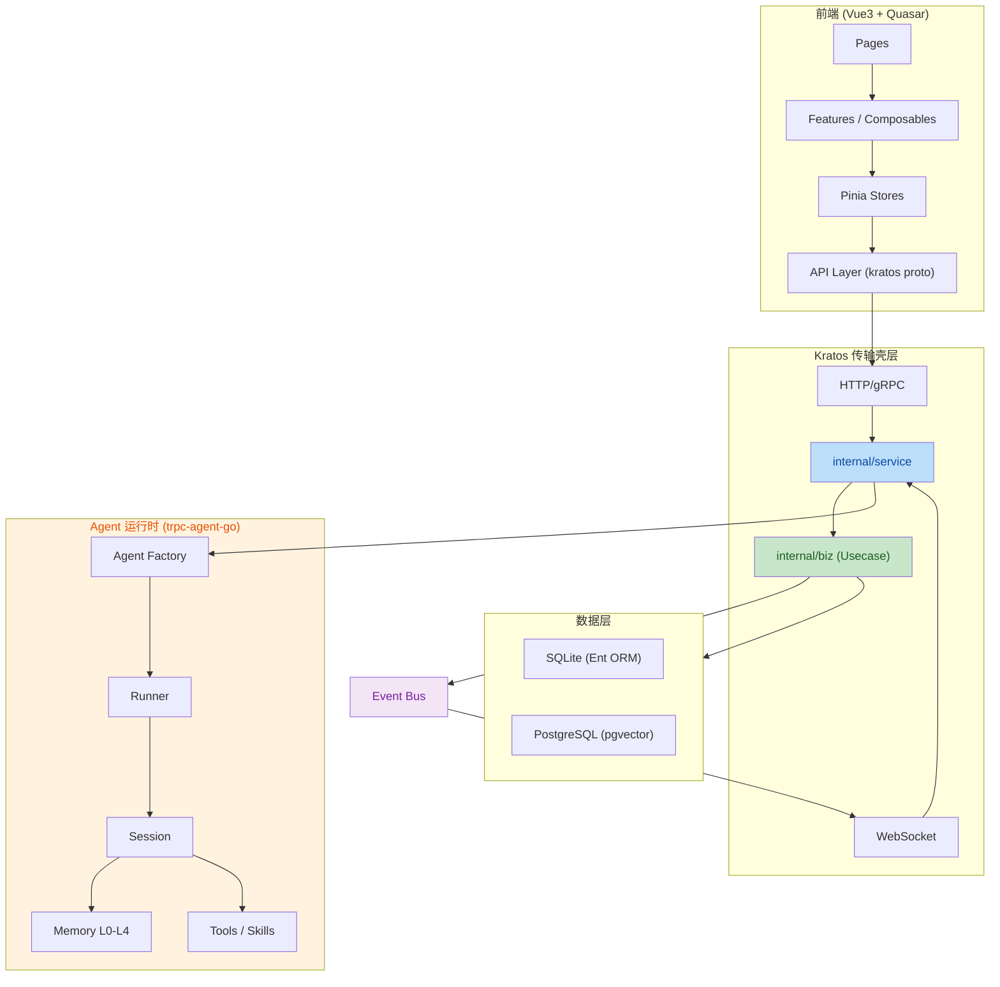
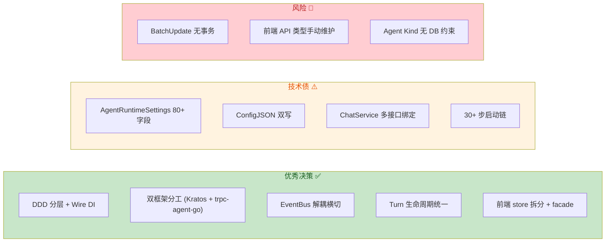
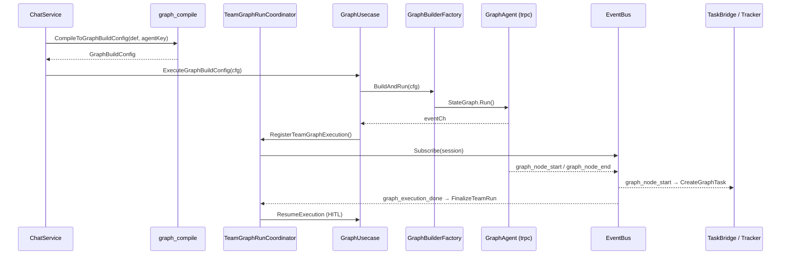
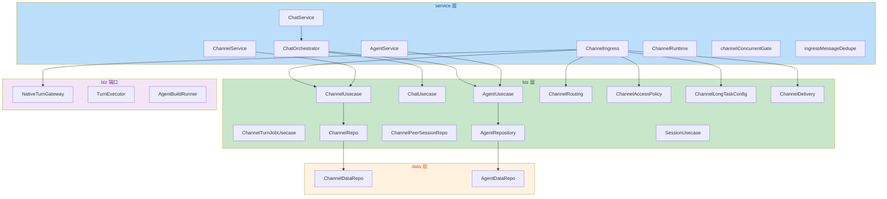
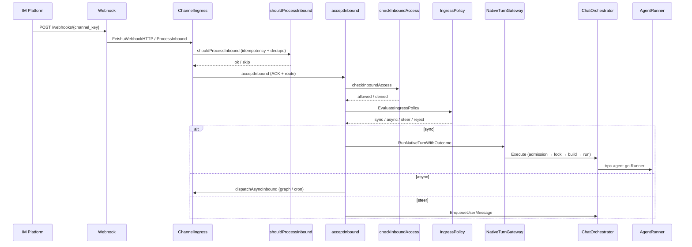
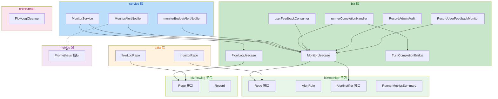
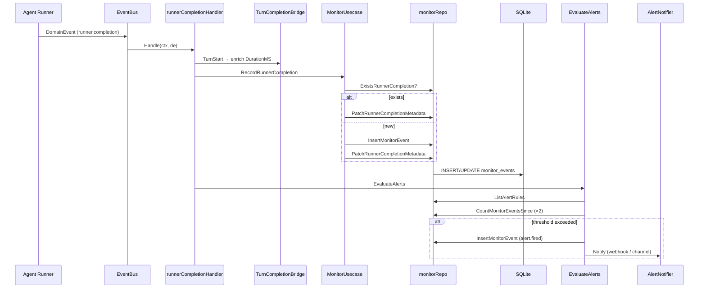

# Aranea-Agents 项目代码审查报告

**审查范围**: 全项目后端 + 前端代码
**审查重点**: 业务逻辑、代码质量、架构和设计模式、代码可读性与风格、错误处理与健壮性、影响范围与回归风险
**审查日期**: 2026-05-25（全项目）/ 2026-05-26（记忆系统专项）

---

## 总体评级

| 维度 | 评级 | 说明 |
|------|------|------|
| **架构与设计模式** | B+ | DDD 分层清晰，双框架分工明确；AgentRuntimeSettings 巨型结构体是主要技术债 |
| **业务逻辑** | B | 核心链路完整，Turn 生命周期管理成熟；Channel 路由和 Team 编译存在复杂度隐患 |
| **代码质量** | B | Go 代码风格统一，前端 TS 类型安全已加固（278→0 vue-tsc 错误）；部分重复模式 |
| **代码可读性与风格** | B+ | Go 命名规范，注释充分；前端 composable 拆分合理；biz 层文件过多需索引 |
| **错误处理与健壮性** | B- | Kratos 错误码体系完整；EventBus 丢消息有监控；部分静默吞错和 nil 检查缺失 |
| **影响范围与回归风险** | B | Wire DI 编译期安全；ConfigJSON 双写是最大回归风险点；前端 store 拆分后兼容良好 |

**综合评级: B (良好，有明确改进方向)**

---

## 架构总览



---

## 一、架构与设计模式 (B+)

### 1.1 亮点

**DDD 分层清晰，依赖方向正确**

项目严格遵循 `service → biz → data` 的依赖方向，`internal/biz` 不 import `pkg/trpc-agent-go`（红线），运行时装配只在 `internal/service`。Wire 编译期 DI 确保依赖图在构建时验证。

**双框架分工明确**

Kratos v2 负责传输层（HTTP/gRPC/WS），trpc-agent-go 负责 Agent 编排，二者通过 `internal/agent/trpc_build.go` 桥接，不互相越界。这是项目最核心的架构决策，执行到位。

**Event Bus 解耦横切关注点**

[bus.go](file:///f:/aranea-agents/internal/event/bus.go) 实现了优先级通道（Critical/Normal）、丢包策略（DropOldest/DropNewest/BlockUpTo）、关键事件不丢保证。设计成熟，适合实时事件驱动场景。

**Turn 生命周期管理**

[turn_executor.go](file:///f:/aranea-agents/internal/biz/turn_executor.go) 定义了完整的 Turn 生命周期钩子：Admission → Lock → Execute → Persist → Observe，Agent/Team/Channel/Cron 共享同一套基础设施，避免重复。

### 1.2 问题

| # | 问题 | 严重度 | 位置 | 建议 |
|---|------|--------|------|------|
| A1 | **AgentRuntimeSettings 巨型结构体（80+ 字段）** | 高 | [agent_types.go](file:///f:/aranea-agents/internal/biz/agent_types.go#L38-L130) | 已有 `Get*()` 子结构体视图，但字段仍平铺在主结构体。建议拆分为独立子表（memory_settings、tools_settings 等），通过 `Apply*()` 方法回写 |
| A2 | **ConfigJSON 双写** | 高 | [agent_usecase.go](file:///f:/aranea-agents/internal/biz/agent_usecase.go#L233-L248) | `syncConfigJSON` 在每次 Create/Update 后将 settings+files 序列化回 `config_json`，与 `agent_runtime_settings` 表形成双源真相。迁移完成后应移除 config_json 写回 |
| A3 | **biz 层文件数量膨胀** | 中 | `internal/biz/` 有 120+ 文件 | 建议按子包组织（已有 `biz/session/`、`biz/a2a/` 等），将 `channel_*.go`、`memory_*.go`、`graph_*.go` 等归入子包 |
| A4 | **ChatService 同时实现多个 biz 接口** | 中 | [service.go](file:///f:/aranea-agents/internal/service/service.go#L15-L20) | `ChatService` 通过 Wire 绑定实现了 `NativeTurnGateway`、`TurnGateway`、`TurnControlGateway`、`TurnExecutor` 四个接口，职责过重。建议拆分 Gateway 和 Executor |
| A5 | **ensureSchemaDDL 30+ 步启动链** | 中 | [data.go](file:///f:/aranea-agents/internal/data/data.go#L375-L440) | 启动时 30+ 个 schema patch 顺序执行，任一失败阻塞启动。建议加版本门控（schema_migrations），已 patch 的跳过 |

---

## 二、业务逻辑 (B)

### 2.1 亮点

**Agent CRUD 完整且防御性强**

[agent_usecase.go](file:///f:/aranea-agents/internal/biz/agent_usecase.go) 的 Create/Update 流程包含完整的验证链：Kind 规范化 → Planner/CodeExecutor/RalphLoop 校验 → A2A Proxy 特殊处理 → ConfigJSON 同步。输入清理（TrimSpace）一致。

**Chat 编排链路成熟**

ChatService → ChatOrchestrator → TurnExecutor 的调用链清晰，支持 Web/WS/Channel/Cron/A2A 五种入口点，Pending Queue + Run Status + Await Channel 三层消息管理。

**Memory L0-L4 五层架构**

从 L0（上下文压缩）到 L4（知识图谱），层次分明，每层有独立的启用开关和参数。`MemoryUsecase` 对 Postgres 不可用的情况有优雅降级。

### 2.2 问题

| # | 问题 | 严重度 | 位置 | 建议 |
|---|------|--------|------|------|
| B1 | **BatchUpdateAgents 无事务保护** | 高 | [agent_usecase.go](file:///f:/aranea-agents/internal/biz/agent_usecase.go#L328-L353) | 循环中逐个 Delete/Update，中途失败返回已处理数 n，但已执行的不可回滚。建议加事务或改为幂等重试 |
| B2 | **hydrate 中 sql.ErrNoRows 静默回填** | 中 | [agent_usecase.go](file:///f:/aranea-agents/internal/biz/agent_usecase.go#L126-L140) | `GetAgentRuntimeSettings` 返回 `sql.ErrNoRows` 时自动从 legacy config 回填并 Upsert，属于隐式副作用。建议在 Get 层面区分"不存在"和"出错" |
| B3 | **Team 编译验证不充分** | 中 | [team_usecase.go](file:///f:/aranea-agents/internal/biz/team_usecase.go#L62-L100) | `validateTeamDefinition` 只校验 mode 和 member agent_id，未校验 agent 是否存在、role 是否与 mode 兼容（如 coordinator 必须有 synthesizer） |
| B4 | **Channel 路由规则引擎复杂度高** | 中 | [channel_rules.go](file:///f:/aranea-agents/internal/biz/channel_rules.go) | 路由规则与 Channel 入站/出站/长任务/IM Preview 交织，缺少独立的规则引擎抽象 |
| B5 | **EventBus deliverBlockUpTo 忙等待** | 低 | [bus.go](file:///f:/aranea-agents/internal/event/bus.go#L148-L165) | `deliverBlockUpTo` 用 `time.After(10ms)` 轮询 channel 容量，高负载下浪费 CPU。建议用 `time.NewTimer` + select |

---

## 三、代码质量 (B)

### 3.1 亮点

**Go 代码风格统一**

全项目遵循 `golangci-lint` 规范，错误处理使用 `kerrors` 统一错误码，命名遵循 Go 惯例。

**前端 TS 类型安全已加固**

`vue-tsc` 错误从 278 降至 0，所有 ECharts 回调、Vue props、测试 mock 均已添加类型标注。

**前端 store 拆分合理**

Chat store 从单一巨石拆分为 `sessionStore` + `messageStore` + `runtimeStore`，通过 facade 保持向后兼容。

### 3.2 问题

| # | 问题 | 严重度 | 位置 | 建议 |
|---|------|--------|------|------|
| C1 | **mergeAgentCatalog 字段逐一赋值** | 中 | [agent_usecase.go](file:///f:/aranea-agents/internal/biz/agent_usecase.go#L260-L300) | 40+ 字段逐一 if-赋值，新增字段易遗漏。建议用 `reflect` 或 codegen 生成 merge 函数 |
| C2 | **前端 API 层参数类型不严格** | 中 | `web/src/features/*/api.ts` | 部分 API 函数参数为 `Record<string, unknown>`，缺少 proto 生成的类型约束 |
| C3 | **测试文件大量 `as any` 绕过** | 低 | 多个 `*.spec.ts` | 为修复 TS 错误引入的 `as any` / `as unknown as` 是临时方案，应逐步替换为完整的 mock 工厂 |
| C4 | **重复的 TrimSpace 模式** | 低 | biz 层多处 | `strings.TrimSpace(id)` 在每个方法入口重复，建议抽取 `requireNonEmpty(id, "id")` 校验函数 |

---

## 四、代码可读性与风格 (B+)

### 4.1 亮点

**注释充分且有意图说明**

`AgentRuntimeSettings` 每个字段都有注释说明用途和默认值，`ChatUsecase` 接口定义清晰。

**前端 composable 命名一致**

`useAgentRuntimeConfig`、`useA2UIComponent`、`useTeamOrchestratePage` 等命名遵循 `use[Domain][Page]` 模式，易于定位。

**Mermaid 架构图文档化**

项目文档中大量使用 Mermaid 图表说明数据流和调用链，降低了理解成本。

### 4.2 问题

| # | 问题 | 严重度 | 位置 | 建议 |
|---|------|--------|------|------|
| D1 | **biz 层缺少包级索引文件** | 中 | `internal/biz/` | 120+ 文件平铺，无 `doc.go` 或分组索引。新开发者难以快速定位相关文件 |
| D2 | **前端组件 props 缺少 JSDoc** | 低 | 多个 Vue 组件 | 部分 `defineProps` 缺少字段说明，特别是复杂对象类型（如 `AgentTemplatePreset[]`） |
| D3 | **混合中英文注释** | 低 | 全项目 | 部分代码中文注释（如 `事件总线丢弃消息`），部分英文。建议统一为英文注释，中文仅限用户可见字符串 |

---

## 五、错误处理与健壮性 (B-)

### 5.1 亮点

**Kratos 错误码体系完整**

使用 `kerrors.BadRequest`/`NotFound`/`InternalServer` 统一错误响应，错误码有业务语义（如 `AGENT_KEY_CONFLICT`）。

**EventBus 丢消息有监控**

`deliverDropOldest`/`deliverDropNewest` 都有 Prometheus 指标 + SessionSysLog 告警，丢包可观测。

**safego 防止 goroutine panic 崩溃**

所有后台 goroutine 使用 `safego.Go` 启动，panic 不会拖垮主进程。

### 5.2 问题

| # | 问题 | 严重度 | 位置 | 建议 |
|---|------|--------|------|------|
| E1 | **ChatUsecase.StartBackgroundGoroutines 清理空 key 逻辑** | 中 | [chat_usecase.go](file:///f:/aranea-agents/internal/biz/chat_usecase.go#L197-L210) | 5 分钟定时清理 `awaitChans` 中空 sessionID 的条目，但正常流程 `DeleteAwaitChannel` 已清理。此 GC 只处理异常残留，缺少启动/停止生命周期管理 |
| E2 | **MemoryUsecase nil 接收者检查** | 中 | [memory.go](file:///f:/aranea-agents/internal/biz/memory.go#L49-L52) | `RememberWithUser` 检查 `uc == nil || uc.embedder == nil || uc.repo == nil` 返回 `ErrMemoryUnavailable`，但调用方可能不检查此错误 |
| E3 | **WS 连接数限制硬编码** | 低 | [ws.go](file:///f:/aranea-agents/internal/server/ws.go#L27-L28) | `maxSessionConns=5`、`maxGlobalMonitorConns=3` 硬编码，无法通过配置调整 |
| E4 | **data.NewData 启动失败 cleanup 不完整** | 低 | [data.go](file:///f:/aranea-agents/internal/data/data.go#L327-L365) | `initSQLite` 成功后如果后续步骤失败，`cleanup` 只关闭 `pg` 和 `rawDB`，不关闭 `entClient` |

---

## 六、影响范围与回归风险 (B)

### 6.1 亮点

**Wire 编译期 DI 安全**

所有依赖注入通过 Wire 编译期验证，缺失依赖在构建时即报错，不会运行时才发现。

**前端 store facade 向后兼容**

`useChatStore` 作为 facade 暴露子 store 的 computed 委托，已有消费者无需修改。

**Proto 生成代码不手改**

`make api` 生成 proto 代码，手写代码只在 service 层做映射，减少前后端契约不一致风险。

### 6.2 问题

| # | 问题 | 严重度 | 位置 | 建议 |
|---|------|--------|------|------|
| F1 | **ConfigJSON 双写是最大回归风险** | 高 | [agent_usecase.go](file:///f:/aranea-agents/internal/biz/agent_usecase.go#L233) | settings 表和 config_json 列同时存储运行时配置，任何只改一边的代码都会导致数据不一致。建议设置迁移窗口，逐步废弃 config_json |
| F2 | **Agent Kind 不可变但无 DB 约束** | 中 | [agent_usecase.go](file:///f:/aranea-agents/internal/biz/agent_usecase.go#L197) | Update 中校验 `agent_kind is immutable`，但 DB 层无 CHECK 约束，直接操作 DB 可绕过 |
| F3 | **前端 API 类型与 proto 不同步** | 中 | `web/src/services/` | 前端手动定义 API 类型（非 proto 生成），proto 字段重命名后需手动同步，已有历史 TS2551 错误先例 |
| F4 | **EventBus subscriber channel 容量固定** | 低 | [bus.go](file:///f:/aranea-agents/internal/event/bus.go#L236-L241) | BufferSize 限制在 128-512，高流量场景（如大量并发 Chat）可能频繁触发丢包策略 |

---

## 七、关键改进路线图

按优先级排序，标注影响范围和回归风险：

| 优先级 | 改进项 | 影响范围 | 回归风险 | 预估工作量 |
|--------|--------|----------|----------|-----------|
| P0 | ConfigJSON 双写消除：设置迁移窗口，标记 config_json 为 read-only | agent CRUD 全链路 | 高（需数据迁移） | 大 |
| P0 | BatchUpdateAgents 加事务 | Agent 批量操作 | 低 | 小 |
| P1 | AgentRuntimeSettings 拆分子表 | agent_settings 所有消费者 | 中（需 DB 迁移 + API 适配） | 大 |
| P1 | ChatService 接口拆分 | service Wire 绑定 | 中（需改 Wire ProviderSet） | 中 |
| P1 | 前端 API 类型 proto 生成 | 前端所有 API 调用 | 中 | 中 |
| P2 | ensureSchemaDDL 版本门控 | 启动链路 | 低 | 中 |
| P2 | biz 层子包重组 | internal/biz 导入路径 | 低（Go 内部包） | 中 |
| P2 | Team 编译验证增强 | Team 创建/更新 | 低 | 小 |
| P3 | EventBus 投递优化（替换忙等待） | 事件分发性能 | 低 | 小 |
| P3 | 测试 mock 工厂替代 `as any` | 前端测试 | 低 | 小 |

---

## 八、架构决策评价



---

## 九、与上次审查对比

| 指标 | 上次 | 本次 | 变化 |
|------|------|------|------|
| vue-tsc 错误 | 278 | 0 | ✅ 完全修复 |
| AgentRuntimeSettings 子结构体 | 无 | Get*() 视图方法 | ✅ 部分改善 |
| Chat store 拆分 | 单一 store | 3 子 store + facade | ✅ 完成 |
| EventBus 丢包监控 | 无 | Prometheus + SysLog | ✅ 完成 |
| ConfigJSON 双写 | 存在 | 仍存在 | ⚠️ 未变 |
| BatchUpdate 事务 | 无 | 无 | 🔴 未修复 |

---

## 十、记忆系统专项审查 (2026-05-26)

**整体评分**: 88 / 100 | 风险等级：P2

### 10.1 架构概览

```mermaid
flowchart TB
    subgraph Service["service 层"]
        MS[MemoryService]
        MR[MemoryRecallService]
        MP[MemoryPlatformService]
        MLE[MemoryLLMExtractor]
    end

    subgraph Biz["biz 层"]
        MU[MemoryUsecase]
        MAU[MemoryAdminUsecase]
        MWE[TurnMemoryWorker]
        HC[HeuristicConsolidator]
        LLMC[LLMConsolidator]
        CC[ChainConsolidator]
        FC[FeedbackConsolidator]
        L2R[L2RecallUsecase]
        L3R[L3RecallUsecase]
        L4U[L4GraphUsecase]
        L4C[L4CascadeUsecase]
        MPE[MemoryPolicyEngine]
        CER[CrossEncoderReranker]
        PII[ScanPII]
        MPS[MemoryWorkerStats]
    end

    subgraph Data["data 层"]
        MR2[memoryRepo pgvector]
        MFS[memoryFactIndexSync]
        L4R[l4GraphRepo]
        CGS[cascadeGraphStore]
        SMS[sessionmemory.Store]
    end

    subgraph Runtime["runtime 层"]
        MSet[MemorySet]
    end

    subgraph Cron["cronrunner"]
        AMW[AutoMemoryWorker]
    end

    subgraph Queue["队列"]
        MJQ[MemoryJobQueue]
    end

    MS --> MAU
    MS --> L4C
    MR --> L2R
    MR --> L3R
    MP --> SystemSettings
    MLE --> LLMC

    MWE --> MJQ
    AMW --> MJQ
    AMW --> HC
    AMW --> LLMC
    AMW --> CC
    AMW --> FC
    AMW --> L4U

    MAU --> SMS
    L2R --> SMS
    L3R --> SMS
    L4U --> L4R
    L4C --> CGS
    L4C --> L4R

    MSet --> TRPC
    MSet --> MAU
    MSet --> L2R
    MSet --> L3R

    style Service fill:#bbdefb,color:#0d47a1
    style Biz fill:#c8e6c9,color:#1a5e20
    style Data fill:#fff3e0,color:#e65100
    style Runtime fill:#f3e5f5,color:#7b1fa2
```



### 10.2 代码质量与可读性

#### M1: Service 层大量手写 JSON→Proto 映射 — 重复且脆弱

[memory_decode.go](file:///f:/aranea-agents/internal/service/memory_decode.go) 和 [memory.go](file:///f:/aranea-agents/internal/service/memory.go) 中有大量 `jsonutil.IfaceStr/IfaceI32/IfaceF64` 手动映射代码。每个 pb 转换函数都是 20-40 行的逐字段赋值，极易遗漏字段或类型不匹配。

**影响**：维护成本高，新增字段时容易遗漏，且无编译期保障。

**建议**：考虑生成代码或使用 `json.Unmarshal` 直接反序列化到 proto 结构体（proto JSON tag 已有），减少手写映射。

#### M2: `jsonStr` / `factJSONStr` / `jsonInt` 重复定义

[biz/memory_l4_cascade.go](file:///f:/aranea-agents/internal/biz/memory_l4_cascade.go#L199-L218) 和 [biz/memory_index_sync.go](file:///f:/aranea-agents/internal/biz/memory_index_sync.go#L74-L84) 和 [data/memory_fact_index_sync.go](file:///f:/aranea-agents/internal/data/memory_fact_index_sync.go#L69-L80) 各自定义了 `jsonStr`/`factJSONStr`/`jsonInt` 等辅助函数，逻辑几乎相同。

**建议**：统一到 `pkg/jsonutil` 或 `internal/biz` 的共享 helper 中。

#### M3: `MemoryService.errStore()` 语义不清

[memory.go:18-21](file:///f:/aranea-agents/internal/service/memory.go#L18-L21) 中 `errStore()` 仅检查 `admin == nil`，但方法名暗示检查的是 `memStore`。实际上 `memStore` 为 nil 时其他方法（如 `DebugMemoryRecall`）是单独检查的。

**建议**：重命名为 `requireAdmin()` 或拆分为更明确的检查方法。

### 10.3 业务逻辑

#### M4: HeuristicConsolidator 正则提取整句而非关键信息 (P1)

[memory_consolidator.go:62](file:///f:/aranea-agents/internal/biz/memory_consolidator.go#L62) 中 `stmt := strings.TrimSpace(m[0])` 使用 `m[0]`（完整匹配）而非 `m[1]`（捕获组）。例如 `"My name is Alice"` 会存储整句而非 `"Alice"`。

**影响**：L3 fact 存储的是冗余整句而非精炼事实，降低检索质量和 token 效率。

**建议**：改为 `m[1]` + 上下文描述，如 `"User's name is Alice"`。

#### M5: L4 `WriteFromUserText` 每次调用都执行 decay — 性能隐患 (P2)

[memory_l4_usecase.go:143](file:///f:/aranea-agents/internal/biz/memory_l4_usecase.go#L143) 中 `uc.runDecay(ctx, agentID)` 在每次 `WriteFromUserText` 调用时执行。在高频对话中，这意味着每次用户消息都会触发一次 `ApplyConfidenceDecay` SQL 更新。

**影响**：不必要的数据库写压力，且 30 天前的数据在短时间内被多次衰减。

**建议**：将 decay 逻辑移到 cron job 中（已有 `memory_l2_decay.go` 和 `memory_l3_decay.go`），与 L2/L3 衰减保持一致。

#### M6: AutoMemoryWorker `drain` 丢失上下文取消信号 (P3)

[auto_memory.go:91-100](file:///f:/aranea-agents/internal/cronrunner/jobs/auto_memory.go#L91-L100) 中 `drain` 循环在 `default` 分支直接返回，但如果 `processWithRetry` 内部因 backoff 等待时 context 已取消，后续的 `q.Chan()` 读取不会检查。当前实现在 `processWithRetry` 内部已检查 `ctx.Done()`，但 `drain` 的 for 循环上限 50 是硬编码。

**建议**：将 50 提取为常量或配置项。

#### M7: MemoryJobQueue 静默丢弃溢出任务 (P2)

[auto_memory_queue.go:72-73](file:///f:/aranea-agents/internal/memory/trpc/auto_memory_queue.go#L72-L73) 中 `select { case q.ch <- r: default: }` 在 channel 满时静默丢弃任务，无日志、无指标。

**影响**：生产环境下无法感知记忆任务丢失。

**建议**：添加丢弃计数器（`atomic.Int64`）并在 `GetMemoryWorkerStatus` RPC 中暴露。

#### M8: PII 检测的正则误报风险 (P2)

[memory_pii.go:11-14](file:///f:/aranea-agents/internal/biz/memory_pii.go#L11-L14) 中 `piiPhoneRe` 和 `piiCreditRe` 正则过于宽泛。`piiPhoneRe` 会匹配任意 7-15 位数字序列（如日期 "20240101"、订单号），`piiCreditRe` 会匹配任何连续数字。

**影响**：大量误报导致不必要的 redaction，影响记忆内容完整性。

**建议**：收紧正则（如电话加国家代码前缀校验、信用卡加 Luhn 校验），或引入白名单机制。

### 10.4 架构与设计模式

#### M9: 双轨存储（SQLite facts + pgvector）的一致性保障薄弱 (P2)

当前 L3 存在两条平行存储路径：
- **权威路径**：SQLite `memory_facts`（通过 `sessionmemory.Store`）
- **索引路径**：pgvector（通过 `MemoryUsecase` / `memoryFactIndexSync`）

`syncFactIndexBestEffort` 在 [memory_admin_usecase.go:136-146](file:///f:/aranea-agents/internal/biz/memory_admin_usecase.go#L136-L146) 中静默吞掉同步错误。如果 pgvector 写入失败，后续向量检索会返回过期数据，但无告警。

**影响**：L3 recall 的向量搜索可能返回陈旧或缺失的结果，且难以排查。

**建议**：添加同步失败指标（Prometheus counter），并在 `GetMemoryWorkerStatus` 中暴露 pgvector 同步健康状态。

#### M10: `[][]byte` 作为跨层返回类型 — 类型安全缺失 (P3)

`SessionAdminStore`、`CascadeGraphStore` 等接口大量使用 `[][]byte` / `[]byte` 作为返回类型，调用方需要手动 `json.Unmarshal` 再逐字段映射。这是当前架构的最大技术债之一。

**影响**：
- 无编译期类型安全
- 字段名拼写错误只能运行时发现
- 每个调用点都要重复反序列化逻辑

**建议**：渐进式引入 typed DTO（如 `biz.FactRow`、`biz.EntityRow`），从高频调用的接口开始替换。

#### M11: `MemorySet` 依赖传递链过长且 `Available()` 检查不完整 (P3)

[runtime/memory_set.go](file:///f:/aranea-agents/internal/runtime/memory_set.go) 持有 `trpcmemory.Service` + `biz.SessionAdminStore` + `biz.MemoryL2Recaller` + `biz.MemoryL3Recaller`，这是 Wire 注入的聚合点，位置合理。但 `MemorySet.Available()` 仅检查 `TRPC != nil`，不检查 Admin/Recall 是否可用。

**建议**：`Available()` 应反映完整可用性，或拆分为 `TRPCAvailable()` / `AdminAvailable()`。

#### M12: `CrossEncoderReranker` 是 lexical proxy，但接口名暗示真实 CE (P3)

[memory_rerank.go](file:///f:/aranea-agents/internal/biz/memory_rerank.go) 中 `CrossEncoderReranker` 实际上是 bigram Jaccard 相似度，但类型名暗示使用了 Cross-Encoder 模型。

**建议**：重命名为 `LexicalReranker` 或 `BigramJaccardReranker`，避免误导。

### 10.5 错误处理与健壮性

#### M13: `nil receiver` 防御模式不一致 (P3)

部分 usecase 返回 `nil`（如 `NewL4GraphUsecase(nil)` → `nil`），部分返回空实例。调用方需要同时检查 `uc == nil` 和 `uc.repo == nil`。

**示例**：[memory_l4_usecase.go:30-33](file:///f:/aranea-agents/internal/biz/memory_l4_usecase.go#L30-L33) 返回 nil，但 [memory_l2_recall.go:22-24](file:///f:/aranea-agents/internal/biz/memory_l2_recall.go#L22-L24) 也返回 nil，而 [memory_policy.go:31-33](file:///f:/aranea-agents/internal/biz/memory_policy.go#L31-L33) 也返回 nil。但 `MemoryAdminUsecase` 在两者都为 nil 时返回 nil，否则返回实例（可能 `admin == nil` 但 `vec != nil`）。

**影响**：调用方需要理解每个类型的 nil 语义，容易 NPE。

**建议**：统一采用 `nil receiver` 安全方法模式（所有方法开头检查 `if uc == nil { return defaultValue, nil }`），当前大部分已做到，但 `MemoryAdminUsecase` 的 `requireAdmin()` 在 `admin == nil` 时返回 error，与 `vec != nil` 的场景冲突。

#### M14: AutoMemoryWorker 构造函数 panic (P3)

[auto_memory.go:52](file:///f:/aranea-agents/internal/cronrunner/jobs/auto_memory.go#L52) 中 `panic("jobs: auto memory queue is required")`。在 Wire 注入场景下这不会触发，但违反了 Go 的错误处理惯例。

**建议**：返回 error 而非 panic，让调用方决定如何处理。

#### M15: `syncFactIndexBestEffort` 吞错 (P2)

[memory_admin_usecase.go:145](file:///f:/aranea-agents/internal/biz/memory_admin_usecase.go#L145) 中 `_ = err` 静默忽略同步错误。即使是 best-effort，也应记录日志或递增指标。

#### M16: L4 Cascade `Approve` 中 `touchAffectedEntities` 忽略单条错误 (P3)

[memory_l4_cascade.go:215-230](file:///f:/aranea-agents/internal/biz/memory_l4_cascade.go#L215-L230) 中 `touchAffectedEntities` 对每个 affected entity 的 `GetEntityRow` 和 `UpsertEntity` 错误使用 `continue` 跳过。

**影响**：部分受影响实体可能未更新 metadata，导致图谱不一致。

**建议**：收集失败实体 ID 并写入 proposal metadata 或日志，便于后续人工审查。

### 10.6 影响范围与回归风险

| 改动区域 | 风险等级 | 说明 |
|----------|----------|------|
| HeuristicConsolidator `m[0]` → `m[1]` | **高** | 会改变所有 L3 fact 的内容格式，影响已有记忆的检索和展示；需数据迁移 |
| L4 decay 从 WriteFromUserText 移到 cron | **中** | 行为变化：decay 频率从"每次写入"变为"定时批量"；已有 cron job 可直接扩展 |
| `[][]byte` → typed DTO | **高** | 涉及 biz/data/service 三层接口签名变更；建议渐进式，新接口用 typed，旧接口逐步迁移 |
| PII 正则收紧 | **中** | 可能导致之前被 redact 的内容不再 redact；需回归测试 |
| MemoryJobQueue 丢弃计数 | **低** | 纯增量，无破坏性 |
| `CrossEncoderReranker` 重命名 | **低** | 仅类型名变更，无行为变化 |
| `jsonStr` 合并 | **低** | 纯重构，无行为变化 |

### 10.7 问题汇总表

| No. | 问题 | 级别 | 建议 | 代码链接 |
|-----|------|------|------|----------|
| M4 | HeuristicConsolidator 用 `m[0]` 存整句而非 `m[1]` 捕获组 | P1 | 改为 `m[1]` + 上下文描述 | [memory_consolidator.go:62](file:///f:/aranea-agents/internal/biz/memory_consolidator.go#L62) |
| M5 | L4 `WriteFromUserText` 每次调用执行 decay | P2 | 移到 cron job | [memory_l4_usecase.go:143](file:///f:/aranea-agents/internal/biz/memory_l4_usecase.go#L143) |
| M7 | MemoryJobQueue 满时静默丢弃无指标 | P2 | 添加丢弃计数器 + RPC 暴露 | [auto_memory_queue.go:72-73](file:///f:/aranea-agents/internal/memory/trpc/auto_memory_queue.go#L72-L73) |
| M8 | PII 正则误报风险高 | P2 | 收紧正则或加白名单 | [memory_pii.go:11-14](file:///f:/aranea-agents/internal/biz/memory_pii.go#L11-L14) |
| M9 | pgvector 同步失败无指标/告警 | P2 | 添加 Prometheus counter | [memory_admin_usecase.go:145](file:///f:/aranea-agents/internal/biz/memory_admin_usecase.go#L145) |
| M15 | `syncFactIndexBestEffort` 吞错 | P2 | 记录日志或递增指标 | [memory_admin_usecase.go:145](file:///f:/aranea-agents/internal/biz/memory_admin_usecase.go#L145) |
| M1 | Service 层大量手写 JSON→Proto 映射 | P3 | 考虑生成代码或直接 JSON 反序列化 | [memory_decode.go](file:///f:/aranea-agents/internal/service/memory_decode.go) |
| M2 | `jsonStr`/`factJSONStr`/`jsonInt` 重复定义 | P3 | 统一到共享 helper | [memory_l4_cascade.go:199](file:///f:/aranea-agents/internal/biz/memory_l4_cascade.go#L199) |
| M3 | `errStore()` 方法名语义不清 | P3 | 重命名为 `requireAdmin()` | [memory.go:18](file:///f:/aranea-agents/internal/service/memory.go#L18) |
| M6 | AutoMemoryWorker `drain` 硬编码上限 50 | P3 | 提取为常量或配置项 | [auto_memory.go:91-100](file:///f:/aranea-agents/internal/cronrunner/jobs/auto_memory.go#L91-L100) |
| M10 | `[][]byte` 跨层返回类型安全缺失 | P3 | 渐进式引入 typed DTO | 多处接口 |
| M11 | `MemorySet.Available()` 仅检查 TRPC | P3 | 扩展或拆分可用性检查 | [memory_set.go:19](file:///f:/aranea-agents/internal/runtime/memory_set.go#L19) |
| M12 | `CrossEncoderReranker` 命名误导 | P3 | 重命名为 `LexicalReranker` | [memory_rerank.go:6](file:///f:/aranea-agents/internal/biz/memory_rerank.go#L6) |
| M13 | `nil receiver` 防御模式不一致 | P3 | 统一 nil receiver 安全方法模式 | 多处 usecase 构造函数 |
| M14 | AutoMemoryWorker 构造函数 panic | P3 | 改为返回 error | [auto_memory.go:52](file:///f:/aranea-agents/internal/cronrunner/jobs/auto_memory.go#L52) |
| M16 | Cascade `touchAffectedEntities` 忽略单条错误 | P3 | 收集失败 ID 写入日志/metadata | [memory_l4_cascade.go:215](file:///f:/aranea-agents/internal/biz/memory_l4_cascade.go#L215) |

### 10.8 记忆系统改进路线图

| 优先级 | 改进项 | 影响范围 | 回归风险 | 预估工作量 |
|--------|--------|----------|----------|-----------|
| P1 | HeuristicConsolidator `m[0]` → `m[1]`：修复 fact 提取逻辑 | L3 fact 存储与检索 | 高（需数据迁移） | 中 |
| P2 | L4 decay 移到 cron job | L4 写入路径 | 中（行为变化） | 小 |
| P2 | MemoryJobQueue 丢弃计数器 | 队列监控 | 低 | 小 |
| P2 | PII 正则收紧 | PII 检测全链路 | 中（需回归测试） | 中 |
| P2 | pgvector 同步失败指标 | L3 向量索引 | 低 | 小 |
| P3 | `[][]byte` → typed DTO | biz/data/service 三层 | 高（渐进式） | 大 |
| P3 | `CrossEncoderReranker` 重命名 | rerank 模块 | 低 | 小 |
| P3 | `jsonStr` 合并 | 多文件 | 低 | 小 |
| P3 | nil receiver 模式统一 | 所有 memory usecase | 低 | 中 |

---

## 十一、Team Graph 系统专项审查 (2026-05-26)

**整体评分**: 85 / 100 | 风险等级：P2

### 11.1 架构概览

```mermaid
flowchart TB
    subgraph Service["service 层"]
        GS[GraphService]
        GTR[GraphTaskRuntime]
        GOP[GraphOrchestrationProjector]
    end

    subgraph Biz["biz 层"]
        GU[GraphUsecase]
        GTC[GraphTaskCoordinator]
        GEF[GraphExecution CRUD]
        GBC[GraphBuildConfig]
        ND[NodeDef / EdgeDef]
    end

    subgraph Team["team 包 (编译 + 协调)"]
        GC[graph_compile]
        EG[embedded_graph]
        GRO[graph_runtime_options]
        GRC[graph_runtime_canary]
        TGRC[TeamGraphRunCoordinator]
        TGRF[TeamGraphRunFinisher]
        TGTB[TeamGraphTaskBridge]
        TGET[TeamGraphExecutionTracker]
        GS2[graph_structure]
        GDJ[graph_definition_json]
    end

    subgraph Adapter["graph adapter"]
        TGRB[TeamGraphRootBuilder]
        LGL[LinkedGraphLoader]
    end

    subgraph Runtime["trpc-agent-go"]
        SG[StateGraph / GraphAgent]
    end

    GS --> GU
    GU --> GEF
    GU --> GBC
    TGRC --> GU
    TGRF --> Runner
    TGTB --> Bus
    GC --> GBC
    EG --> GBC
    GRO --> GBC
    TGRB --> SG

    style Service fill:#bbdefb,color:#0d47a1
    style Biz fill:#c8e6c9,color:#1a5e20
    style Team fill:#fff3e0,color:#e65100
    style Adapter fill:#f3e5f5,color:#7b1fa2
```



**编译→执行→观测 数据流：**



### 11.2 代码质量与可读性

#### G1: `compileToGraphBuildConfigWithLoader` 函数签名过长、嵌套过深

[graph_compile.go:34-37](file:///f:/aranea-agents/internal/team/graph_compile.go#L34-L37) 中 `compileToGraphBuildConfigWithLoader` 有 5 个参数，且内部调用 `compileFromEmbeddedGraph` 又传递全部 5 个参数。`compileFromEmbeddedGraph` 本身又调用 `loadEmbeddedSubgraphConfig`，形成 3 层参数透传。

**建议**：引入 `CompileContext` 结构体封装公共参数（`def`, `agentKey`, `loader`），减少参数数量。

#### G2: `embeddedGraphEdge` 的 `Condition` 字段与 `ConditionalEdgeDef` 语义重叠

[embedded_graph.go:38](file:///f:/aranea-agents/internal/team/embedded_graph.go#L38) 中 `embeddedGraphEdge` 有 `Condition string`，但编译后的 `ConditionalEdgeDef` 使用 `CondFuncRef + PathMap`。当前 `compileEmbeddedEdges` 完全忽略了 `Condition` 字段（仅在 `embeddedEdgeKind` 中做 label 匹配），这意味着用户在 Vue Flow 编辑器中设置的条件路由条件不会生效。

**影响**：embedded graph 的条件路由功能不完整，用户设置的条件表达式被静默丢弃。

**建议**：要么将 `Condition` 映射到 `CondFuncRef`（需注册对应的条件函数），要么在文档中明确标注条件路由仅对 linked graph 生效。

#### G3: `trackerMetaString` / `bridgeMetaString` / `resumeStepNodeID` 重复的 meta 提取模式

[team_graph_execution_tracker.go:71](file:///f:/aranea-agents/internal/team/team_graph_execution_tracker.go#L71) 中 `trackerMetaString` 直接调用 `bridgeMetaString`，而 [team_graph_run_coordinator.go:293](file:///f:/aranea-agents/internal/team/team_graph_run_coordinator.go#L293) 中 `resumeStepNodeID` 又手动做了 `meta["step"].(map[string]any)` 提取。这三个函数的 meta 提取逻辑风格不一致。

**建议**：统一为 `metautil.GetString(meta, key)` 和 `metautil.GetMap(meta, key)` 工具函数。

#### G4: `graphNodePolicy` 与 `embeddedGraphNode` 字段重复

[graph_runtime_options.go:30-38](file:///f:/aranea-agents/internal/team/graph_runtime_options.go#L30-L38) 中 `graphNodePolicy` 与 [embedded_graph.go:19-33](file:///f:/aranea-agents/internal/team/embedded_graph.go#L19-L33) 中 `embeddedGraphNode` 有大量重复字段（`ID`, `InterruptBefore`, `InterruptAfter`, `Destinations`, `RetryMaxAttempts`, `FallbackAgent`）。

**建议**：抽取共享的 `NodePolicyFields` 嵌入结构体。

### 11.3 业务逻辑

#### G5: `compileAdaptiveEdges` 生成 O(n²) 全连接边 — 性能与正确性 (P1)

[graph_compile.go:259-269](file:///f:/aranea-agents/internal/team/graph_compile.go#L259-L269) 中 adaptive 模式为每个节点生成到所有其他节点的 transfer 边（排除自身和直接后继），复杂度 O(n²)。当成员数 >10 时，边数爆炸（10 节点 → 80 条边）。

**影响**：
- Vue Flow 渲染卡顿
- GraphAgent 运行时需注册大量无意义的 transfer 边
- 实际 adaptive 模式应依赖 LLM 动态选择目标，而非静态全连接

**建议**：限制最大 transfer 边数（如仅连接 coordinator/前驱/后继），或改为运行时动态路由。

#### G6: `compileCoordinatorEdges` 缺少 hub → finish 直连边 (P1)

[graph_compile.go:233-244](file:///f:/aranea-agents/internal/team/graph_compile.go#L233-L244) 中 coordinator 模式只生成 `hub → worker` 和 `worker → finish` 边，但没有 `hub → finish` 直连边。当 coordinator 决定不 dispatch 任何 worker 时，执行会在 hub 节点终止，无法到达 finish。

**影响**：coordinator 模式下如果 hub 不 dispatch 任何 worker，graph 执行会卡在 hub 节点。

**建议**：添加 `hub → finish` 的条件边（当 hub 决定结束时走 finish）。

#### G7: `compileParallelEdges` 首个 worker 无入边 (P3)

[graph_compile.go:197-210](file:///f:/aranea-agents/internal/team/graph_compile.go#L197-L210) 中 parallel 模式将 `workers[0]` 作为 entry，然后从 entry 连接到其他 workers。但 `workers[0]` 本身没有从 `entry_point`（如 `__start__`）的入边，因为 `workers[0]` 就是 entry。这意味着 entry → workers[0] 的隐式连接依赖 GraphAgent 的 `entry_point` 机制，但 `workers[0]` 到 finish 的边也被跳过了（`if w == finish { continue }`），如果 workers[0] == finish 则它既无入边也无出边。

**影响**：当 synthesizer 与首个 worker 是同一节点时，parallel 模式会生成空边集。

**建议**：显式处理 entry → workers[0] 的连接，或在 `compileEntryFinish` 中确保 entry ≠ finish。

#### G8: `startGraphWatch` 30 分钟硬编码超时 (P2)

[team_graph_run_coordinator.go:165](file:///f:/aranea-agents/internal/team/team_graph_run_coordinator.go#L165) 中 `deadline := time.After(30 * time.Minute)` 硬编码了 resume watch 的超时。对于长时间运行的 HITL 任务（如等待人工审批），30 分钟可能不够。

**影响**：HITL 任务超过 30 分钟后 coordinator 会强制结束 team run。

**建议**：提取为常量或配置项，HITL 场景建议 24h+。

#### G9: `DeferTeamRunSuccessIfHITL` 仅检查 status (P3)

[team_graph_run_coordinator.go:107-118](file:///f:/aranea-agents/internal/team/team_graph_run_coordinator.go#L107-L118) 中 `DeferTeamRunSuccessIfHITL` 通过 `exec.Status != "waiting_human"` 判断是否 HITL，但 `exec.Status` 可能因并发更新而不准确（如 resume 刚执行但 status 还未更新）。

**建议**：同时检查 `exec.InterruptNode != ""` 作为补充条件。

#### G10: `applyTeamRuntimeExecutionOptions` 中 `_ = def` 忽略了整个 def (P3)

[graph_runtime_options.go:20](file:///f:/aranea-agents/internal/team/graph_runtime_options.go#L20) 中 `_ = def` 忽略了 `def` 参数，但函数签名仍然接收它。如果后续需要在 `def` 上读取更多配置，这个空赋值容易遗忘。

**建议**：移除 `_ = def` 或在函数注释中说明为何保留参数。

### 11.4 架构与设计模式

#### G11: `GraphUsecase` 同时承担 CRUD、执行、内存缓存三重职责 (P2)

[graph.go](file:///f:/aranea-agents/internal/biz/graph.go) 中 `GraphUsecase` 包含：
- GraphDefinition CRUD（`CreateGraph`, `GetGraph`, `UpdateGraph`, `DeleteGraph`）
- GraphExecution 生命周期（`ExecuteGraph`, `ResumeExecution`, `CancelExecution`）
- 内存缓存（`defs map`, `executions map`, `teamBuildConfigs map`）
- GC 循环（`gcLoop`）
- Checkpoint/TimeTravel 操作

这是项目中最重的 Usecase 之一（580 行），违反 SRP。

**影响**：修改 CRUD 逻辑可能影响执行逻辑，反之亦然；测试需要 mock 整个 Usecase。

**建议**：拆分为 `GraphDefinitionUsecase`（CRUD + 版本）和 `GraphExecutionUsecase`（执行 + 恢复 + Checkpoint），共享 `GraphRepo` / `GraphRunRepo`。

#### G12: `teamBuildConfigs` 内存存储无上限 — 内存泄漏风险 (P2)

[graph_team_execution.go:38-40](file:///f:/aranea-agents/internal/biz/graph_team_execution.go#L38-L40) 中 `uc.teamBuildConfigs[execID] = cfg` 无限制增长。虽然有 `gc()` 清理 30 分钟前的执行，但 `gc()` 只清理 `executions` map 中的条目，`teamBuildConfigs` 的清理依赖 `delete(uc.teamBuildConfigs, id)` 在同一 gc 调用中执行。

**问题**：如果 `RegisterTeamGraphExecution` 成功但执行从未出现在 `executions` map 中（如 `SaveRun` 失败后 exec 未加入 `executions`），`teamBuildConfigs` 中的条目永远不会被清理。

**建议**：在 `RegisterTeamGraphExecution` 中，如果 `SaveRun` 失败也应回滚 `teamBuildConfigs` 写入。

#### G13: `TeamGraphRunCoordinator.sessions` 内存无 GC (P2)

[team_graph_run_coordinator.go:39](file:///f:/aranea-agents/internal/team/team_graph_run_coordinator.go#L39) 中 `sessions map[string]*teamGraphRunSession` 无 GC 机制。`evictSession` 仅在 `finalizeTeamRun` 时调用，如果 graph 执行异常退出（如进程崩溃重启），session 会永久残留。

**建议**：添加定期清理逻辑（类似 `GraphUsecase.gcLoop`），清理超过 30 分钟的 session。

#### G14: 编译器与运行时选项分离导致双重应用 (P2)

`CompileToGraphBuildConfig`（[graph_compile.go](file:///f:/aranea-agents/internal/team/graph_compile.go)）生成基础 `GraphBuildConfig`，然后 `applyTeamRuntimeExecutionOptions`（[graph_runtime_options.go](file:///f:/aranea-agents/internal/team/graph_runtime_options.go)）再叠加 checkpoint/interrupt/failure policy。但 `compileFromEmbeddedGraph` 已经在编译期设置了 `InterruptBefore/After`，`applyEmbeddedNodePolicies` 又会重复覆盖。

**影响**：如果 embedded graph 节点设置了 `interrupt_before=false`，`applyEmbeddedNodePolicies` 不会清除已由编译器设置的 `true`（因为只做 `if n.InterruptBefore { cfg.Nodes[i].InterruptBefore = true }` 单向覆盖）。

**建议**：`applyEmbeddedNodePolicies` 应使用完整赋值而非单向叠加，或在编译期一次性完成所有策略应用。

### 11.5 错误处理与健壮性

#### G15: `consumeRuntimeEvents` 中 `UpdateRun` 错误被静默忽略 (P2)

[graph_execution.go:289](file:///f:/aranea-agents/internal/biz/graph_execution.go#L289) 中 `_ = uc.runRepo.UpdateRun(context.Background(), exec)` 在事件消费循环中多次出现。如果 `UpdateRun` 持续失败，内存中的 `exec` 状态与持久化状态会不一致。

**影响**：进程重启后恢复的执行状态可能与实际不一致。

**建议**：添加错误日志和重试计数器，连续失败 N 次后标记执行为 error。

#### G16: `HandleTeamGraphTaskCompleted` 中 `UpdateTeamRun` 错误被忽略 (P3)

[team_graph_run_coordinator.go:131](file:///f:/aranea-agents/internal/team/team_graph_run_coordinator.go#L131) 中 `_ = c.teams.UpdateTeamRun(ctx, run)` 在 resume 后将状态从 `waiting_human` 改回 `running`，但错误被忽略。

**影响**：TeamRun 状态可能停留在 `waiting_human`，但 Graph 执行已恢复，前端显示不一致。

**建议**：记录错误日志，或将此更新放入重试队列。

#### G17: `RegisterTeamGraphExecution` 部分失败不回滚 (P3)

[graph_team_execution.go:32-46](file:///f:/aranea-agents/internal/biz/graph_team_execution.go#L32-L46) 中先写 `teamBuildConfigs` 和 `executions` map，再调 `SaveRun`。如果 `SaveRun` 失败，内存中的数据不会被回滚。

**建议**：先 `SaveRun`，成功后再写入内存 map。

#### G18: `buildResumeSessionContext` 静默忽略解析错误 (P3)

[team_graph_run_finisher.go:147](file:///f:/aranea-agents/internal/team/team_graph_run_finisher.go#L147) 中 `def, err := ParseDefinition(defJSON)` 如果失败，返回空的 registry，后续 step 持久化会因 `MemberDefForNode` 找不到成员而跳过所有 step。

**影响**：如果 `definition_snapshot_json` 格式损坏，整个 graph run 的 step 都不会被持久化。

**建议**：至少记录一条 warn 日志。

### 11.6 影响范围与回归风险

| 改动区域 | 风险等级 | 说明 |
|----------|----------|------|
| `compileAdaptiveEdges` 限制边数 | **高** | 改变 adaptive 模式拓扑，影响已有 adaptive team 的执行行为 |
| `compileCoordinatorEdges` 添加 hub→finish | **中** | 新增边，不影响已有行为（之前 hub 不 dispatch 时执行卡住，现在会正常结束） |
| `GraphUsecase` 拆分 | **高** | 涉及所有 graph 消费者的 import 路径和 Wire 绑定 |
| `embeddedGraphEdge.Condition` 映射 | **中** | 新功能，不影响已有行为 |
| 30 分钟超时改为可配置 | **低** | 纯增量 |
| `teamBuildConfigs` 回滚 | **低** | 修复边界情况 |
| `graphNodePolicy` / `embeddedGraphNode` 合并 | **低** | 纯重构 |
| meta 提取工具函数统一 | **低** | 纯重构 |

### 11.7 问题汇总表

| No. | 问题 | 级别 | 建议 | 代码链接 |
|-----|------|------|------|----------|
| G5 | `compileAdaptiveEdges` O(n²) 全连接边 | P1 | 限制最大 transfer 边数或改运行时动态路由 | [graph_compile.go:259-269](file:///f:/aranea-agents/internal/team/graph_compile.go#L259-L269) |
| G6 | `compileCoordinatorEdges` 缺少 hub→finish 边 | P1 | 添加条件边或直连边 | [graph_compile.go:233-244](file:///f:/aranea-agents/internal/team/graph_compile.go#L233-L244) |
| G11 | `GraphUsecase` 三重职责违反 SRP | P2 | 拆分为 DefinitionUsecase + ExecutionUsecase | [graph.go](file:///f:/aranea-agents/internal/biz/graph.go) |
| G12 | `teamBuildConfigs` 内存无上限，SaveRun 失败不回滚 | P2 | 先 SaveRun 再写内存，失败时回滚 | [graph_team_execution.go:32-46](file:///f:/aranea-agents/internal/biz/graph_team_execution.go#L32-L46) |
| G13 | `Coordinator.sessions` 内存无 GC | P2 | 添加定期清理 | [team_graph_run_coordinator.go:39](file:///f:/aranea-agents/internal/team/team_graph_run_coordinator.go#L39) |
| G15 | `consumeRuntimeEvents` 中 `UpdateRun` 错误静默忽略 | P2 | 添加日志和重试计数 | [graph_execution.go:289](file:///f:/aranea-agents/internal/biz/graph_execution.go#L289) |
| G8 | `startGraphWatch` 30 分钟硬编码超时 | P2 | 提取为配置项，HITL 场景延长 | [team_graph_run_coordinator.go:165](file:///f:/aranea-agents/internal/team/team_graph_run_coordinator.go#L165) |
| G2 | `embeddedGraphEdge.Condition` 被静默忽略 | P2 | 映射到 CondFuncRef 或文档标注限制 | [embedded_graph.go:38](file:///f:/aranea-agents/internal/team/embedded_graph.go#L38) |
| G14 | 编译期与运行时选项双重应用，单向覆盖 | P2 | 使用完整赋值或编译期一次性完成 | [graph_runtime_options.go:20](file:///f:/aranea-agents/internal/team/graph_runtime_options.go#L20) |
| G7 | `compileParallelEdges` entry=finish 时空边集 | P3 | 确保 entry ≠ finish | [graph_compile.go:197-210](file:///f:/aranea-agents/internal/team/graph_compile.go#L197-L210) |
| G9 | `DeferTeamRunSuccessIfHITL` 仅检查 status | P3 | 补充检查 InterruptNode | [team_graph_run_coordinator.go:107-118](file:///f:/aranea-agents/internal/team/team_graph_run_coordinator.go#L107-L118) |
| G16 | `HandleTeamGraphTaskCompleted` 忽略 UpdateTeamRun 错误 | P3 | 记录日志 | [team_graph_run_coordinator.go:131](file:///f:/aranea-agents/internal/team/team_graph_run_coordinator.go#L131) |
| G17 | `RegisterTeamGraphExecution` 部分失败不回滚 | P3 | 先持久化再写内存 | [graph_team_execution.go:32-46](file:///f:/aranea-agents/internal/biz/graph_team_execution.go#L32-L46) |
| G18 | `buildResumeSessionContext` 静默忽略解析错误 | P3 | 添加 warn 日志 | [team_graph_run_finisher.go:147](file:///f:/aranea-agents/internal/team/team_graph_run_finisher.go#L147) |
| G1 | `compileToGraphBuildConfigWithLoader` 5 参数透传 | P3 | 引入 CompileContext 结构体 | [graph_compile.go:34-37](file:///f:/aranea-agents/internal/team/graph_compile.go#L34-L37) |
| G3 | meta 提取函数风格不一致 | P3 | 统一为 metautil 工具函数 | [team_graph_execution_tracker.go:71](file:///f:/aranea-agents/internal/team/team_graph_execution_tracker.go#L71) |
| G4 | `graphNodePolicy` 与 `embeddedGraphNode` 字段重复 | P3 | 抽取共享嵌入结构体 | [graph_runtime_options.go:30-38](file:///f:/aranea-agents/internal/team/graph_runtime_options.go#L30-L38) |
| G10 | `applyTeamRuntimeExecutionOptions` 中 `_ = def` | P3 | 移除或注释说明 | [graph_runtime_options.go:20](file:///f:/aranea-agents/internal/team/graph_runtime_options.go#L20) |

### 11.8 Team Graph 改进路线图

| 优先级 | 改进项 | 影响范围 | 回归风险 | 预估工作量 |
|--------|--------|----------|----------|-----------|
| P1 | `compileAdaptiveEdges` 限制边数或改动态路由 | adaptive team 编译 | 高（拓扑变化） | 中 |
| P1 | `compileCoordinatorEdges` 添加 hub→finish 条件边 | coordinator team 编译 | 中（新增边） | 小 |
| P2 | `GraphUsecase` 拆分 | graph 全模块 | 高（Wire 绑定 + import 路径） | 大 |
| P2 | `teamBuildConfigs` 回滚 + sessions GC | graph 执行内存管理 | 低 | 小 |
| P2 | `consumeRuntimeEvents` UpdateRun 错误处理 | graph 执行持久化 | 低 | 小 |
| P2 | `startGraphWatch` 超时可配置 | HITL resume watch | 低 | 小 |
| P2 | `embeddedGraphEdge.Condition` 映射 | embedded graph 条件路由 | 中（新功能） | 中 |
| P2 | 编译期/运行时选项统一 | graph 编译 + options | 中 | 中 |
| P3 | `compileParallelEdges` entry=finish 边界 | parallel team 编译 | 低 | 小 |
| P3 | meta 提取统一 + NodePolicy 合并 | team 包内部 | 低 | 小 |
| P3 | `buildResumeSessionContext` 错误日志 | resume 路径 | 低 | 小 |

---

## 十二、Channel / Chat / Agent 专项审查 (2026-05-26)

**整体评分**: 83 / 100 | 风险等级：P2

### 12.1 架构概览



**Channel 入站→Turn 执行 数据流：**



### 12.2 架构设计审查

#### CA1: `ChatOrchestrator` 职责过重 — "God Object" 倾向 (P1)

[chat_orchestrator.go](file:///f:/aranea-agents/internal/service/chat_orchestrator.go) 中 `ChatOrchestrator` 承担了：
- Turn 生命周期管理（admission → lock → execute → persist → observe）
- Session Run 生命周期（beginSessionRunLifecycle / escalateSessionRunToDurable / durable resume）
- Team Turn 编排（executeTeamTurnViaHooks）
- Agent Turn 编排（runNativeAgentTurnBody）
- Await/Resume 管理（awaitChans / resumeInFlight）
- Pending 消息管理
- 内存缓存（sessionRunBindings / awaitMetaCache / resumeInFlight / pendingMergeFollowup）
- 定时清理（sweepLoop）
- MCP 配置
- 配额检查

直接依赖 15+ 个外部组件（`TurnDeps`, `RuntimeTooling`, `TeamOrchestrationDeps`, `ChannelTurnDeps`, `UsageUsecase`, `MonitorUsecase`, `ArtifactUsecase`, `A2AUsecase`, `MCPServerUsecase`, `RunRegistry`, `ChatUsecase`），4 个 `sync.Map`。

**影响**：修改任何一条路径都有回归风险；测试需要 mock 大量依赖。

**建议**：拆分为 3 个子编排器：
1. `AgentTurnOrchestrator` — 单 Agent Turn 生命周期
2. `SessionRunOrchestrator` — Session Run 生命周期 + Durable Resume
3. `ChannelTurnOrchestrator` — Channel 特有的 ACK/并发/路由逻辑

`ChatOrchestrator` 仅做顶层路由（agent vs team vs channel）。

#### CA2: `ChannelIngress` 直接类型断言 `*ChatService` — 破坏端口抽象 (P2)

[channel_ingress_pending.go:13](file:///f:/aranea-agents/internal/service/channel_ingress_pending.go#L13) 和 [channel_ingress_policy.go:81](file:///f:/aranea-agents/internal/service/channel_ingress_policy.go#L81) 中：

```go
svc, ok := h.chat.(*ChatService)
if !ok || svc.orch == nil {
    return
}
```

`ChannelIngress` 的构造函数接受 `biz.NativeTurnGateway` 接口，但运行时又断言为 `*ChatService` 来访问 `orch`。这破坏了端口抽象：任何非 `*ChatService` 的 `NativeTurnGateway` 实现都会静默失败。

**影响**：测试中用 mock `NativeTurnGateway` 时，steer 和 pending merge 功能会静默跳过。

**建议**：在 `NativeTurnGateway` 接口中添加 `EnqueueUserMessage` 和 `SetSessionPendingMergeFollowup` 方法，或在 `ChannelIngress` 构造时注入一个专门的 `SteerableGateway` 接口。

#### CA3: `ChannelUsecase` 同时承担 CRUD + 投递 + 健康检查 + 凭证加密 (P2)

[channel.go](file:///f:/aranea-agents/internal/biz/channel.go) 中 `ChannelUsecase` 包含：
- Channel CRUD（List/Get/Create/Update/Delete/Toggle）
- Credential 管理（UpsertCredentials/ListCredentials/ListCredentialsRaw）
- Delivery 管理（EnqueueOutboundDelivery/MarkOutboundAttempt/IsOutboundDeliveryReady）
- 健康检查（RunHealthChecks）
- 凭证加密（通过 channel_credential_crypto.go）

违反 SRP，且 `EnqueueOutboundDelivery` 内部做了幂等检查（遍历最近 100 条 delivery），与 CRUD 逻辑混杂。

**建议**：将 Delivery 管理拆分为 `ChannelDeliveryUsecase`，将凭证加密保持为独立工具函数。

#### CA4: `AgentRuntimeSettings` 扁平结构 — 80+ 字段单结构体 (P2)

[agent_types.go:49-120](file:///f:/aranea-agents/internal/biz/agent_types.go#L49-L120) 中 `AgentRuntimeSettings` 有 80+ 个扁平字段。虽然注释标注了 Domain 分区（Identity/Reasoning/Memory/Tools/Skills/Evolution/Context），但代码层面没有结构化。

**影响**：`fromProtoRuntime`（[agent.go:33-70](file:///f:/aranea-agents/internal/service/agent.go#L33-L70)）需要手动调用 7 个 `ApplyXxx` 方法；任何新增字段都需要在 3+ 个地方同步修改（proto mapping / biz struct / settings helpers）。

**建议**：将 `AgentRuntimeSettings` 改为嵌入子结构体（`IdentityCfg`, `ReasoningCfg`, `MemoryCfg` 等），`fromProtoRuntime` 直接映射子结构体。

#### CA5: `webhookRateLimits` 全局 sync.Map 无清理 (P3)

[channel_ingress_ratelimit.go:18](file:///f:/aranea-agents/internal/service/channel_ingress_ratelimit.go#L18) 中 `webhookRateLimits sync.Map` 按 channel_key 存储 rate limiter，但从不清理。如果 channel 被删除，对应的 limiter 会永久残留。

**建议**：添加定期清理逻辑，或在 `ChannelService.Delete` 时通知清理。

### 12.3 代码质量与风格

#### CA6: `acceptInbound` 函数 150+ 行 — 圈复杂度过高 (P2)

[channel_ingress_accept.go:27-150](file:///f:/aranea-agents/internal/service/channel_ingress_accept.go#L27-L150) 中 `acceptInbound` 函数有 150+ 行，包含 6 个分支（background route / async route / sync route / concurrent limit / ACK / durable suggest），每个分支都有 inflight release + delivery record + error return。

**建议**：拆分为 `routeInboundSync` / `routeInboundAsync` / `routeInboundBackground` 三个子函数，`acceptInbound` 只做前置校验和路由分发。

#### CA7: `channelTypeFromConfig` 在 service 层重复解析 configJSON (P3)

[channel_ingress.go](file:///f:/aranea-agents/internal/service/channel_ingress.go) 中 `channelTypeFromConfig(chRow.ConfigJSON)` 在一个请求路径中被调用 3-5 次（FeishuWebhookHTTP / acceptInbound / inboundPeerKey / applyPreTurnIngressPolicy 等）。每次都重新 `json.Unmarshal`。

**建议**：在请求入口解析一次，通过 context 或参数传递 `ChannelParsedConfig`。

#### CA8: `ParseChannelLongTaskConfig` 每次调用都重新解析 (P3)

[channel_config_helpers.go](file:///f:/aranea-agents/internal/biz/channel_config_helpers.go) 中 `ParseChannelLongTaskConfig` 在单次入站请求中被调用 3+ 次（acceptInbound / applyPreTurnIngressPolicy / channel_ingress_inbound 等）。

**建议**：在入站入口解析一次，通过 context 传递。

#### CA9: 硬编码中文字符串散布在 service 层 (P3)

[channel_ingress_constants.go](file:///f:/aranea-agents/internal/service/channel_ingress_constants.go) 和 [channel_inbound_commands.go](file:///f:/aranea-agents/internal/biz/channel_inbound_commands.go) 中硬编码了中文消息（"收到，正在处理…"、"任务执行较慢，建议使用 /background 转入后台继续。"等）。

**影响**：国际化困难；消息文案修改需要改代码而非配置。

**建议**：将用户可见消息提取到 i18n 模板或 channel config 的 `messages` 字段中。

#### CA10: `AgentService.fromProtoRuntime` 手动映射 80+ 字段 (P3)

[agent.go:33-70](file:///f:/aranea-agents/internal/service/agent.go#L33-L70) 中 `fromProtoRuntime` 手动映射每个字段，容易遗漏。

**建议**：使用结构化子对象映射，或考虑 proto `MergeFrom` 模式减少手动映射。

### 12.4 功能正确性验证

#### CA11: `hasOutboundIdempotency` 仅检查最近 100 条 — 幂等性不完整 (P2)

[channel_delivery.go:107-119](file:///f:/aranea-agents/internal/biz/channel_delivery.go#L107-L119) 中 `hasOutboundIdempotency` 通过 `ListDeliveries(ctx, channelID, 100)` 检查幂等，但如果同一条消息的第 101 条 delivery 已被处理，幂等检查会漏过。

**影响**：高吞吐 channel 可能重复发送消息。

**建议**：使用数据库唯一索引（channel_id + idempotency_key）保证幂等，而非内存遍历。

#### CA12: `channelConcurrentGate` 不区分 session 级并发 (P2)

[channel_concurrent_gate.go](file:///f:/aranea-agents/internal/service/channel_concurrent_gate.go) 中 `channelConcurrentGate` 按 channelID + group 维度限流，但 `ChannelLongTaskConfig` 配置的是 `session_max_concurrent_dm` / `session_max_concurrent_group`（session 级别），实际实现却是 channel 级别。

**影响**：同一 channel 下不同 session 的并发请求共享限流配额，无法实现 per-session 并发控制。

**建议**：gate key 应包含 sessionID，或在 `tryAcquireChannelConcurrent` 中传入 sessionID。

#### CA13: `ensureChannelSession` 竞态条件 — peer session 双写 (P2)

[channel_ingress_session.go:56-99](file:///f:/aranea-agents/internal/service/channel_ingress_session.go#L56-L99) 中 `ensureChannelSession` 先 `GetByChannelAndPeer`，如果不存在则 `Create`。两个并发请求可能同时通过 `GetByChannelAndPeer` 返回 not found，然后都尝试 `Create`，导致同一个 peer 创建两个 session。

**影响**：同一用户可能绑定到不同 session，消息分散。

**建议**：使用数据库唯一约束（channel_id + peer_key）+ `ON CONFLICT` 处理，或在 `Create` 时加分布式锁。

#### CA14: `ChatUsecase.StartBackgroundGoroutines` 清理逻辑过于简单 (P3)

[chat_usecase.go:199-211](file:///f:/aranea-agents/internal/biz/chat_usecase.go#L199-L211) 中 GC 循环仅删除空字符串 key 的 awaitChans，不清理超时的 channel。如果 `RegisterAwaitChannel` 后无人消费（如进程重启），channel 会永久残留。

**建议**：记录 channel 注册时间，清理超过 30 分钟的 await channel。

#### CA15: `steerIntoActiveTurn` 中 `*ChatService` 断言失败静默跳过 (P2)

[channel_ingress_policy.go:81-85](file:///f:/aranea-agents/internal/service/channel_ingress_policy.go#L81-L85) 中 `steerIntoActiveTurn` 对 `h.chat.(*ChatService)` 断言失败时静默返回空，不记录日志。如果 `NativeTurnGateway` 实现不是 `*ChatService`（如测试 mock），steer 功能会静默丢失。

**建议**：断言失败时至少记录 warn 日志，或通过接口方法替代类型断言。

### 12.5 性能与资源效率

#### CA16: `shouldProcessInbound` 三层幂等检查 — 写放大 (P2)

[channel_ingress_guard.go:18-65](file:///f:/aranea-agents/internal/service/channel_ingress_guard.go#L18-L65) 中 `shouldProcessInbound` 依次执行：
1. `inboundInflight.tryAcquire` — 内存 inflight set
2. `messageDedupe.claim` — 内存 TTL dedupe
3. `biz.TryClaimInbound` — 数据库 inbound_receipt 写入

每次入站请求至少 1 次 DB 写入（即使最终被拒绝）。对于高频 channel（如群聊），这会成为瓶颈。

**建议**：将 DB 写入延迟到确认需要处理时（通过 inflight + dedupe 后），减少无效 DB 写入。

#### CA17: `RunHealthChecks` 串行遍历所有 channel (P3)

[channel.go:293-312](file:///f:/aranea-agents/internal/biz/channel.go#L293-L312) 中 `RunHealthChecks` 串行遍历所有 channel，每个 channel 都做凭证加载 + 测试评估。当 channel 数量多时，整个健康检查耗时很长。

**建议**：使用 `errgroup` 并行执行，或限制并发数。

#### CA18: `mergeChannelMetadataJSON` 每次请求都 JSON marshal/unmarshal (P3)

[channel.go:65-78](file:///f:/aranea-agents/internal/service/channel.go#L65-L78) 中 `mergeChannelMetadataJSON` 每次请求都做 2 次 unmarshal + 1 次 marshal。对于 List API（返回所有 channel），这会放大 N 倍。

**建议**：缓存 runtime metadata patch，或在 `ChannelRuntime.Reload` 时预计算合并结果。

### 12.6 可维护性审查

#### CA19: `ChatOrchestratorDeps` 12 个字段 — Wire 绑定复杂 (P2)

[chat_orchestrator.go:79-93](file:///f:/aranea-agents/internal/service/chat_orchestrator.go#L79-L93) 中 `ChatOrchestratorDeps` 有 12 个字段（含 3 个子聚合体），Wire 绑定需要大量 Provider Set。任何新增依赖都需要修改 Wire 注入。

**建议**：进一步拆分 `ChatOrchestratorDeps`，将 `RuntimeTooling` / `TeamOrchestrationDeps` / `ChannelTurnDeps` 各自拥有独立的 Wire Provider Set。

#### CA20: Channel 平台适配器分散在 service 层 (P2)

`channel_ingress_feishu.go` / `channel_ingress_slack.go` / `channel_ingress_telegram.go` / `channel_ingress_wechat.go` / `channel_ingress_dingtalk.go` / `channel_ingress_wecom.go` / `channel_ingress_qq.go` 等平台适配器直接在 service 层实现，与 `ChannelIngress` 紧耦合。

**影响**：新增平台需要修改 service 层代码；平台特定逻辑（如飞书 card action）与通用 ingress 逻辑混杂。

**建议**：将平台适配器抽取为 `ChannelPlatformAdapter` 接口，每个平台一个实现，通过注册机制注入 `ChannelIngress`。

#### CA21: `AgentUsecase.hydrate` 有副作用 — 读取时自动写入 (P3)

[agent_usecase.go:136-165](file:///f:/aranea-agents/internal/biz/agent_usecase.go#L136-L165) 中 `hydrate` 在读取 agent 时，如果发现 `AgentRuntimeSettings` 不存在就自动创建（`UpsertAgentRuntimeSettings`），如果 `AgentPromptFiles` 为空就自动迁移（`ReplaceAgentPromptFiles`）。

**影响**：`Get` 操作有写入副作用，可能导致意外的数据库写入和性能问题。

**建议**：将迁移逻辑移到显式的迁移命令或启动时一次性执行，`hydrate` 应该是纯读取。

### 12.7 错误处理与鲁棒性

#### CA22: `ChannelIngress` 多处 `_ = h.recordDelivery` 忽略错误 (P2)

[channel_ingress_accept.go](file:///f:/aranea-agents/internal/service/channel_ingress_accept.go) 和 [channel_ingress_cancel.go](file:///f:/aranea-agents/internal/service/channel_ingress_cancel.go) 中多处 `_ = h.recordDelivery(...)` 忽略了 delivery 记录失败。虽然 delivery 是辅助功能，但持续失败会导致审计日志缺失。

**建议**：添加错误日志计数器，连续失败时告警。

#### CA23: `EncryptChannelSecretRef` 静默返回空字符串当 key 缺失 (P2)

[channel_credential_crypto.go:15-18](file:///f:/aranea-agents/internal/biz/channel_credential_crypto.go#L15-L18) 中 `EncryptChannelSecretRef` 当 `credentialAESKey` 返回空时，返回 `("", BadRequest)` 而非明确错误。调用方可能忽略错误而使用空 secret_ref。

**建议**：当 key 缺失时返回明确的 InternalServer 错误，而非 BadRequest。

#### CA24: `ResumeDurableSessionRun` 中 `safego.Go` 内错误处理不完整 (P2)

[chat_durable_resume.go:62-90](file:///f:/aranea-agents/internal/service/chat_durable_resume.go#L62-L90) 中 `ResumeDurableSessionRun` 在 goroutine 内处理错误时，如果 `SessionRuns.Get` 失败，只记录错误但不通知 `RunEscalation`。

**建议**：在所有错误路径上都通知 `RunEscalation.NotifyRunFailed`。

#### CA25: `onSessionRunSoftBudget` 自动升级无取消机制 (P3)

[chat_orchestrator_session_run.go:85-108](file:///f:/aranea-agents/internal/service/chat_orchestrator_session_run.go#L85-L108) 中 `onSessionRunSoftBudget` 启动一个定时器自动升级 durable run，但如果在此期间用户手动取消了 run，定时器仍会触发升级。

**建议**：在定时器触发时检查 run 状态是否仍为 `escalating`，如果不是则跳过。

### 12.8 业务逻辑审查

#### CA26: `MatchRoute` 使用 `filepath.Match` — 语义不匹配 (P2)

[channel_routing.go:80-89](file:///f:/aranea-agents/internal/biz/channel_routing.go#L80-L89) 中 `MatchRoute` 使用 `filepath.Match` 做 peer pattern 匹配。`filepath.Match` 的语义是文件路径 glob（`*` 匹配非分隔符，`**` 不支持递归），但 peer_id 不是文件路径。

**影响**：用户可能期望 `user_*` 匹配 `user_123`，但不匹配 `user_123/extra`；`filepath.Match` 的行为在非文件路径场景下容易误解。

**建议**：使用 `regexp.MatchString` 或简单的 `strings.HasPrefix` / `strings.HasSuffix`，并在文档中明确 pattern 语法。

#### CA27: `IsChannelCancelCommand` 精确匹配 — 无法处理带参数的命令 (P3)

[channel_inbound_commands.go:5-8](file:///f:/aranea-agents/internal/biz/channel_inbound_commands.go#L5-L8) 中 `IsChannelCancelCommand` 要求文本完全匹配取消命令。如果用户输入 "取消 任务" 或 "cancel please"，不会被识别。

**建议**：使用 `strings.HasPrefix` 匹配命令前缀，或支持自然语言变体。

#### CA28: `ChannelLongTaskConfig.SuggestDurableRun` 关键词匹配过于简单 (P3)

[channel_config_helpers.go](file:///f:/aranea-agents/internal/biz/channel_config_helpers.go) 中 `DefaultChannelAsyncKeywords` 包含 "分析"、"全量"、"研报" 等关键词，`SuggestDurableRun` 做简单的 `strings.Contains` 匹配。

**影响**：误触发率高（如 "分析一下这个简单问题" 也会建议 durable run）。

**建议**：结合消息长度和关键词双重判断，或将判断逻辑移到 LLM intent 分类。

#### CA29: `ChannelAccessPolicy.Allows` 群聊+私聊混合判断逻辑复杂 (P3)

[channel_access.go:50-73](file:///f:/aranea-agents/internal/biz/channel_access.go#L50-L73) 中 `Allows` 的判断逻辑涉及 `RequireMention` / `AllowedUserIDs` / `AllowedGroupIDs` 三个维度，且 sentinel "0" 表示 deny all 的语义不够直观。

**建议**：添加单元测试覆盖所有组合（私聊+allowlist / 群聊+mention / 群聊+deny_all），并在注释中添加决策矩阵表。

### 12.9 影响范围与回归风险

| 改动区域 | 风险等级 | 说明 |
|----------|----------|------|
| `ChatOrchestrator` 拆分 | **高** | 影响所有 turn 执行路径（Web/WS/Channel/Cron/A2A），Wire 绑定大量修改 |
| `ChannelIngress` 去除 `*ChatService` 断言 | **中** | 需扩展 `NativeTurnGateway` 接口，影响所有实现者 |
| `ensureChannelSession` 加唯一约束 | **中** | 需数据库 migration，可能影响已有重复数据 |
| `channelConcurrentGate` 改为 session 级 | **中** | 改变限流粒度，可能影响高并发 channel 行为 |
| `hasOutboundIdempotency` 改用 DB 唯一索引 | **低** | 纯增量，不影响已有行为 |
| `AgentRuntimeSettings` 结构化 | **低** | 纯重构，需同步修改 proto mapping |
| 平台适配器抽取 | **低** | 纯重构，不影响运行时行为 |

### 12.10 问题汇总表

| No. | 问题 | 级别 | 建议 | 代码链接 |
|-----|------|------|------|----------|
| CA1 | `ChatOrchestrator` God Object，15+ 依赖，4 个 sync.Map | P1 | 拆分为 AgentTurn / SessionRun / ChannelTurn 三个子编排器 | [chat_orchestrator.go](file:///f:/aranea-agents/internal/service/chat_orchestrator.go) |
| CA11 | `hasOutboundIdempotency` 仅检查 100 条，幂等性不完整 | P2 | 使用 DB 唯一索引 | [channel_delivery.go:107-119](file:///f:/aranea-agents/internal/biz/channel_delivery.go#L107-L119) |
| CA12 | `channelConcurrentGate` 限流粒度为 channel 而非 session | P2 | gate key 包含 sessionID | [channel_concurrent_gate.go](file:///f:/aranea-agents/internal/service/channel_concurrent_gate.go) |
| CA13 | `ensureChannelSession` 竞态条件，peer session 双写 | P2 | DB 唯一约束 + ON CONFLICT | [channel_ingress_session.go:56-99](file:///f:/aranea-agents/internal/service/channel_ingress_session.go#L56-L99) |
| CA2 | `ChannelIngress` 断言 `*ChatService`，破坏端口抽象 | P2 | 扩展 NativeTurnGateway 接口 | [channel_ingress_pending.go:13](file:///f:/aranea-agents/internal/service/channel_ingress_pending.go#L13) |
| CA3 | `ChannelUsecase` 四重职责（CRUD+投递+健康检查+凭证） | P2 | 拆分 DeliveryUsecase | [channel.go](file:///f:/aranea-agents/internal/biz/channel.go) |
| CA4 | `AgentRuntimeSettings` 80+ 扁平字段 | P2 | 嵌入子结构体 | [agent_types.go:49-120](file:///f:/aranea-agents/internal/biz/agent_types.go#L49-L120) |
| CA6 | `acceptInbound` 150+ 行，圈复杂度过高 | P2 | 拆分为 routeSync/routeAsync/routeBackground | [channel_ingress_accept.go:27-150](file:///f:/aranea-agents/internal/service/channel_ingress_accept.go#L27-L150) |
| CA15 | `steerIntoActiveTurn` 类型断言失败静默跳过 | P2 | 添加 warn 日志或改用接口方法 | [channel_ingress_policy.go:81-85](file:///f:/aranea-agents/internal/service/channel_ingress_policy.go#L81-L85) |
| CA16 | 三层幂等检查写放大 | P2 | 延迟 DB 写入到确认需要处理时 | [channel_ingress_guard.go:18-65](file:///f:/aranea-agents/internal/service/channel_ingress_guard.go#L18-L65) |
| CA19 | `ChatOrchestratorDeps` 12 字段，Wire 绑定复杂 | P2 | 子聚合体各自 Wire Provider Set | [chat_orchestrator.go:79-93](file:///f:/aranea-agents/internal/service/chat_orchestrator.go#L79-L93) |
| CA20 | 平台适配器分散在 service 层 | P2 | 抽取 ChannelPlatformAdapter 接口 | service/channel_ingress_*.go |
| CA22 | 多处 `_ = h.recordDelivery` 忽略错误 | P2 | 添加错误日志计数 | [channel_ingress_accept.go](file:///f:/aranea-agents/internal/service/channel_ingress_accept.go) |
| CA23 | `EncryptChannelSecretRef` key 缺失时静默返回空 | P2 | 返回明确 InternalServer 错误 | [channel_credential_crypto.go:15-18](file:///f:/aranea-agents/internal/biz/channel_credential_crypto.go#L15-L18) |
| CA24 | `ResumeDurableSessionRun` goroutine 内错误处理不完整 | P2 | 所有错误路径通知 RunEscalation | [chat_durable_resume.go:62-90](file:///f:/aranea-agents/internal/service/chat_durable_resume.go#L62-L90) |
| CA26 | `MatchRoute` 使用 filepath.Match 语义不匹配 | P2 | 改用 regexp 或 strings.HasPrefix | [channel_routing.go:80-89](file:///f:/aranea-agents/internal/biz/channel_routing.go#L80-L89) |
| CA5 | `webhookRateLimits` 全局 sync.Map 无清理 | P3 | 添加定期清理 | [channel_ingress_ratelimit.go:18](file:///f:/aranea-agents/internal/service/channel_ingress_ratelimit.go#L18) |
| CA7 | `channelTypeFromConfig` 重复解析 configJSON | P3 | 入口解析一次，context 传递 | service/channel_ingress_*.go |
| CA8 | `ParseChannelLongTaskConfig` 重复解析 | P3 | 入口解析一次，context 传递 | [channel_config_helpers.go](file:///f:/aranea-agents/internal/biz/channel_config_helpers.go) |
| CA9 | 硬编码中文字符串散布 service 层 | P3 | 提取到 i18n 模板或 config | [channel_ingress_constants.go](file:///f:/aranea-agents/internal/service/channel_ingress_constants.go) |
| CA10 | `fromProtoRuntime` 手动映射 80+ 字段 | P3 | 结构化子对象映射 | [agent.go:33-70](file:///f:/aranea-agents/internal/service/agent.go#L33-L70) |
| CA14 | `StartBackgroundGoroutines` 不清理超时 awaitChan | P3 | 记录注册时间，清理超时 channel | [chat_usecase.go:199-211](file:///f:/aranea-agents/internal/biz/chat_usecase.go#L199-L211) |
| CA17 | `RunHealthChecks` 串行遍历 | P3 | errgroup 并行 | [channel.go:293-312](file:///f:/aranea-agents/internal/biz/channel.go#L293-L312) |
| CA18 | `mergeChannelMetadataJSON` 每次请求重复解析 | P3 | 缓存或预计算 | [channel.go:65-78](file:///f:/aranea-agents/internal/service/channel.go#L65-L78) |
| CA21 | `AgentUsecase.hydrate` 有写入副作用 | P3 | 迁移逻辑移到显式命令 | [agent_usecase.go:136-165](file:///f:/aranea-agents/internal/biz/agent_usecase.go#L136-L165) |
| CA25 | `onSessionRunSoftBudget` 自动升级无取消机制 | P3 | 定时器触发时检查 run 状态 | [chat_orchestrator_session_run.go:85-108](file:///f:/aranea-agents/internal/service/chat_orchestrator_session_run.go#L85-L108) |
| CA27 | `IsChannelCancelCommand` 精确匹配 | P3 | 改用 HasPrefix 或支持变体 | [channel_inbound_commands.go:5-8](file:///f:/aranea-agents/internal/biz/channel_inbound_commands.go#L5-L8) |
| CA28 | `SuggestDurableRun` 关键词匹配误触发率高 | P3 | 结合消息长度或 LLM intent | [channel_config_helpers.go](file:///f:/aranea-agents/internal/biz/channel_config_helpers.go) |
| CA29 | `ChannelAccessPolicy.Allows` 判断逻辑复杂 | P3 | 添加决策矩阵测试 | [channel_access.go:50-73](file:///f:/aranea-agents/internal/biz/channel_access.go#L50-L73) |

### 12.11 Channel / Chat / Agent 改进路线图

| 优先级 | 改进项 | 影响范围 | 回归风险 | 预估工作量 |
|--------|--------|----------|----------|-----------|
| P1 | `ChatOrchestrator` 拆分为 3 个子编排器 | chat 全模块 | 高（Wire + 所有 turn 路径） | 大 |
| P2 | `hasOutboundIdempotency` 改用 DB 唯一索引 | channel delivery | 低 | 小 |
| P2 | `channelConcurrentGate` 改为 session 级限流 | channel ingress | 中（限流行为变化） | 中 |
| P2 | `ensureChannelSession` 加 DB 唯一约束 | channel session | 中（需 migration） | 中 |
| P2 | `ChannelIngress` 去除 `*ChatService` 断言 | channel + chat | 中（接口扩展） | 中 |
| P2 | `ChannelUsecase` 拆分 DeliveryUsecase | channel biz | 低 | 中 |
| P2 | `AgentRuntimeSettings` 结构化 | agent biz + service | 低（纯重构） | 中 |
| P2 | `acceptInbound` 拆分 | channel ingress | 低 | 小 |
| P2 | 三层幂等检查优化 | channel ingress | 低 | 小 |
| P2 | 平台适配器抽取 | channel service | 低 | 中 |
| P2 | `steerIntoActiveTurn` 去除断言 | channel ingress | 低 | 小 |
| P2 | `ChatOrchestratorDeps` Wire 拆分 | chat service | 低 | 小 |
| P2 | delivery 错误日志 + 计数 | channel ingress | 低 | 小 |
| P2 | `MatchRoute` 改用 regexp | channel routing | 中（匹配行为变化） | 小 |
| P3 | `webhookRateLimits` 清理 | channel ratelimit | 低 | 小 |
| P3 | configJSON 解析缓存 | channel ingress | 低 | 小 |
| P3 | 中文字符串 i18n | channel service | 低 | 中 |
| P3 | `hydrate` 去除写入副作用 | agent biz | 低 | 小 |
| P3 | `RunHealthChecks` 并行化 | channel biz | 低 | 小 |
| P3 | 命令匹配改用 HasPrefix | channel commands | 低 | 小 |

---

## 十三、Monitor 模块专项审查 (2026-05-26)

**整体评分**: 78 / 100 | 风险等级：P2

### 13.1 架构概览



**Monitor 事件写入数据流：**



### 13.2 架构设计审查

#### MO1: `MonitorUsecase` 职责混杂 — 审计日志 + 事件监控 + 告警评估 + Runner 指标 (P2)

[monitor.go](file:///f:/aranea-agents/internal/biz/monitor/monitor.go) 中 `Usecase` 同时承担：
- 审计日志 CRUD（`RecordAuditLog` / `ListAuditLogs`）
- Monitor Event CRUD（`RecordMonitorEvent` / `ListMonitorEvents` / `GetMonitorEvent`）
- Monitor Trace 只读（`ListMonitorTraces` / `GetMonitorTrace`）
- 告警规则管理（`ListAlertRules` / `ReplaceAlertRules`）
- 告警评估（`EvaluateAlerts` + `ShouldFireAlert` / `MarkAlertFired`）
- Runner 指标聚合（`GetRunnerMetrics`）
- Runner Completion 去重与补丁（`RecordRunnerCompletion` / `LinkRunnerCompletionUsage` / `PatchRunnerCompletionLink`）

违反 SRP，修改告警逻辑可能影响审计日志，修改 Runner 指标可能影响事件写入。

**建议**：拆分为 3 个 Usecase：
1. `AuditLogUsecase` — 审计日志读写
2. `MonitorEventUsecase` — 事件写入 + Trace 查询
3. `AlertUsecase` — 告警规则管理 + 评估 + 通知

`RunnerCompletion` 逻辑（去重 + 补丁 + Bridge 交互）可独立为 `RunnerCompletionUsecase`。

#### MO2: `MonitorService` 混入不相关功能 — FlowLog + CodeExecutor + ProcessLog (P2)

[monitor.go](file:///f:/aranea-agents/internal/service/monitor.go) 中 `MonitorService` 除了 Monitor CRUD 外，还包含：
- `ListFlowLogs` — FlowLog 查询（依赖 `FlowLogUsecase`）
- `GetMonitorLogs` — 进程日志（返回 WebSocket 提示）
- `GetCodeExecutorCapabilities` — 代码执行器能力查询（依赖 `codeexecutor.Factory`）

这些功能与 Monitor 概念无关，只是因为 proto 定义在同一个 `monitor/v1` 包下就放在一起。

**影响**：`MonitorService` 的依赖膨胀（`FlowLogUsecase` + `conf.Server` + `codeexecutor.Factory`），任何一项变更都可能影响 Monitor 服务的稳定性。

**建议**：将 `ListFlowLogs` 移到 `FlowLogService`，将 `GetCodeExecutorCapabilities` 移到 `SystemService` 或 `AgentService`，`GetMonitorLogs` 可保留但简化。

#### MO3: `PlatformRow` 通用结构体 — 语义模糊 (P2)

[monitor.go:50-70](file:///f:/aranea-agents/internal/biz/monitor/monitor.go#L50-L70) 中 `PlatformRow` 用于同时表示 Monitor Event 和 Monitor Trace，但字段语义因资源类型不同而变化：
- `Key` 在 Event 中是 `event_key`，在 Trace 中是 `trace_key`
- `ConfigJSON` 在 Event 中始终是 `"{}"`，在 Trace 中才有意义
- `Level` / `AgentID` / `Provider` / `Model` / `SortOrder` / `ParentID` 在 Event 中未使用

**影响**：前端需要根据 `Resource` 字段判断哪些字段有效；API 返回大量空字段。

**建议**：为 Event 和 Trace 定义独立的结构体，或使用 `oneof` 在 proto 层区分。

#### MO4: `TurnCompletionBridge` 全局单例 — 进程内状态无持久化 (P2)

[runner_completion.go:20](file:///f:/aranea-agents/internal/biz/runner_completion.go#L20) 中 `defaultTurnCompletionBridge` 是进程级单例，存储 `turnStarts` 和 `pendingUsage` 两个 map。进程重启后所有 pending 状态丢失。

**影响**：如果 usage 事件先于 completion 事件到达（race condition），且进程在两者之间重启，usage_event_id 将永远无法关联到 completion 行。

**建议**：将 pendingUsage 持久化到数据库（如 `monitor_events` 的 metadata 中），或使用 Redis 等共享存储。至少应在启动时清理残留的 pending 状态。

#### MO5: `biz/monitor` 子包类型通过 `biz` 包别名重导出 — 间接层不必要 (P3)

[monitor.go](file:///f:/aranea-agents/internal/biz/monitor.go) 将 `monitor` 子包的所有类型通过 `type X = monitor.X` 重导出到 `biz` 包。类似地 [flow_log.go](file:///f:/aranea-agents/internal/biz/flow_log.go) 重导出 `flowlog` 子包。

**影响**：调用方可以同时使用 `biz.MonitorUsecase` 和 `monitor.Usecase`，造成导入不一致。

**建议**：统一导入路径，要么全部从子包导入，要么全部从 `biz` 包导入。当前的重导出模式增加了维护负担但没有增加价值。

### 13.3 代码质量与风格

#### MO6: `EvaluateAlerts` 只支持 `runner.error_rate` 一种指标 — 硬编码 (P2)

[monitor.go:227](file:///f:/aranea-agents/internal/biz/monitor/monitor.go#L227) 中 `EvaluateAlerts` 硬编码 `rule.MetricKey != "runner.error_rate"` 过滤，只处理 error_rate 指标。虽然 `AlertRule` 的 `MetricKey` 字段暗示支持多种指标，但实际只有一种。

**影响**：新增指标类型（如 `runner.slow_rate`、`budget.utilization`）需要修改 `EvaluateAlerts` 函数，违反开闭原则。

**建议**：引入 `AlertEvaluator` 接口，每种 `MetricKey` 注册一个评估器，`EvaluateAlerts` 遍历注册的评估器。

#### MO7: `monitorEventsWhere` 用 `LIKE` 查询 JSON 字段 — 脆弱且低效 (P2)

[data/monitor.go:181-192](file:///f:/aranea-agents/internal/data/monitor.go#L181-L192) 中 `monitorEventsWhere` 对 `agent_id` 和 `event_type` 使用 `metadata_json LIKE ?` 查询：

```go
if q.AgentID != "" {
    parts = append(parts, "metadata_json LIKE ?")
    args = append(args, "%"+q.AgentID+"%")
}
```

`LIKE '%agent_id%'` 会匹配 JSON 中任何包含该子串的位置（如 agent_display_name、agent_key），且无法使用索引。

**影响**：查询结果可能包含误匹配；大数据量下全表扫描性能差。

**建议**：使用 SQLite 的 `json_extract(metadata_json, '$.agent_id') = ?` 精确查询（已在 `ExistsRunnerCompletion` 中使用），并为 `agent_id` 添加生成列 + 索引。

#### MO8: `monitorTracesWhere` 同样用 `LIKE` 查询 JSON (P2)

[data/monitor.go:238-252](file:///f:/aranea-agents/internal/data/monitor.go#L238-L252) 中 `monitorTracesWhere` 对 `agent_id`、`provider`、`model` 都使用 `metadata_json LIKE ?`。

**建议**：同 MO7，改用 `json_extract` 精确查询。

#### MO9: `ListMonitorEvents` / `ListMonitorTraces` 用 `fmt.Sprintf` 拼接 LIMIT/OFFSET (P3)

[data/monitor.go:173](file:///f:/aranea-agents/internal/data/monitor.go#L173) 和 [data/monitor.go:228](file:///f:/aranea-agents/internal/data/monitor.go#L228) 中：

```go
listSQL := sqlMonitorEventsList + where + fmt.Sprintf(" ORDER BY created_at DESC LIMIT %d OFFSET %d", limit, offset)
```

虽然 `limit` 和 `offset` 是 `int` 类型不会注入，但使用 `fmt.Sprintf` 拼接 SQL 是不良实践，且与同文件中其他查询使用 `?` 占位符的风格不一致。

**建议**：统一使用 `?` 占位符。

#### MO10: `sanitizeJSONString` 在序列化时做两遍 JSON 解析 (P3)

[monitor.go:312-319](file:///f:/aranea-agents/internal/service/monitor.go#L312-L319) 中 `sanitizeJSONString` 先 `parseJSONMap`（unmarshal + sanitize），再 `json.Marshal`。对于 List API 返回 N 条记录，每条记录有 2 个 JSON 字段，共 4N 次 JSON 解析。

**建议**：在 biz 层返回时就做 sanitize，避免 service 层重复解析。

#### MO11: `postAlertWebhook` 使用 `http.DefaultClient` (P3)

[monitor_notify.go:104](file:///f:/aranea-agents/internal/service/monitor_notify.go#L104) 中 `postAlertWebhook` 使用 `http.DefaultClient`，没有自定义 Transport、超时配置（虽然有 context timeout）、连接池限制。

**建议**：注入一个专用的 `*http.Client`，配置合理的连接池和超时。

### 13.4 功能正确性验证

#### MO12: `EvaluateAlerts` 在 `runnerCompletionHandler.Handle` 中同步调用 — 阻塞事件处理 (P2)

[event_bus_runner_handler.go:58](file:///f:/aranea-agents/internal/biz/event_bus_runner_handler.go#L58) 中 `h.monitor.EvaluateAlerts(ctx)` 在 `Handle` 方法中同步调用。`EvaluateAlerts` 会执行 2 次 `CountMonitorEventsSince` DB 查询 + 可能的 `InsertMonitorEvent` + `Notify`（虽然 Notify 本身是异步的）。

**影响**：每次 runner completion 都会触发告警评估，即使没有匹配的规则也会执行 DB 查询。高频场景下会成为瓶颈。

**建议**：将 `EvaluateAlerts` 改为异步执行（如 `safego.Go`），或添加节流（如每 30 秒最多评估一次）。

#### MO13: `RecordRunnerCompletion` 幂等性依赖 `ExistsRunnerCompletion` — 竞态窗口 (P2)

[monitor.go:327-347](file:///f:/aranea-agents/internal/biz/monitor/monitor.go#L327-L347) 中 `RecordRunnerCompletion` 先查 `ExistsRunnerCompletion`，如果不存在则 `InsertMonitorEvent`。两个并发请求可能同时通过 `ExistsRunnerCompletion` 返回 false，导致插入两条 completion 记录。

**影响**：Runner 指标统计（`GetRunnerMetrics`）可能重复计数。

**建议**：在 `monitor_events` 表上添加唯一约束（`event_key + json_extract(metadata_json, '$.session_id') + json_extract(metadata_json, '$.invocation_id')`），或使用 `INSERT OR IGNORE`。

#### MO14: `lastFired` sync.Map 无清理 — 内存无限增长 (P2)

[monitor.go:221](file:///f:/aranea-agents/internal/biz/monitor/monitor.go#L221) 中 `lastFired sync.Map` 存储每个 rule 的最后触发时间，但从不清理。如果规则被删除，对应的 entry 会永久残留。

**影响**：长期运行后内存缓慢增长（虽然每条 entry 很小）。

**建议**：在 `ReplaceAlertRules` 时清理已删除规则的 `lastFired` entry，或添加定期清理。

#### MO15: `FlowLogUsecase.List` 要求至少一个 ID 过滤 — 但无文档说明 (P3)

[flowlog.go:72-75](file:///f:/aranea-agents/internal/biz/flowlog/flowlog.go#L72-L75) 中 `List` 方法要求 `TraceID` / `SessionID` / `RunID` 至少有一个非空，否则返回空结果。但这个约束没有在 API 层面校验，前端可能传入全空过滤条件得到空结果而不理解原因。

**建议**：在 `MonitorService.ListFlowLogs` 中添加参数校验，返回明确的 BadRequest 错误。

#### MO16: `PatchRunnerCompletionMetadata` 先按 `run_id` 查找，再按 `invocation_id` — 可能 patch 错误行 (P2)

[data/monitor.go:275-282](file:///f:/aranea-agents/internal/data/monitor.go#L275-L282) 中 `PatchRunnerCompletionMetadata` 先尝试 `patchRunnerCompletionByKey(ctx, sessionID, "run_id", runID, patchJSON)`，如果没找到再尝试 `invocation_id`。但 `run_id` 和 `invocation_id` 可能匹配到不同的行（一个 session 可能有多个 run），导致 patch 到错误的行。

**影响**：usage_event_id 可能关联到错误的 completion 记录。

**建议**：优先使用 `invocation_id`（唯一标识一次调用），`run_id` 仅作为 fallback。

### 13.5 性能与资源效率

#### MO17: `CountMonitorEventsSince` 全表扫描 — 无索引 (P2)

[data/monitor_alert.go:72-80](file:///f:/aranea-agents/internal/data/monitor_alert.go#L72-L80) 中 `CountMonitorEventsSince` 查询 `monitor_events WHERE event_key = ? AND created_at >= ?`，但 `monitor_events` 表没有 `(event_key, created_at)` 的复合索引。

**影响**：每次告警评估执行 2 次全表扫描，高频 runner completion 场景下性能差。

**建议**：添加 `CREATE INDEX idx_monitor_events_key_created ON monitor_events(event_key, created_at)` 和 `CREATE INDEX idx_monitor_events_key_status_created ON monitor_events(event_key, status, created_at)`。

#### MO18: `AvgRunnerCompletionDurationMsSince` 使用 `json_extract` 计算 — 无索引 (P2)

[data/monitor_alert.go:82-91](file:///f:/aranea-agents/internal/data/monitor_alert.go#L82-L91) 中 `AvgRunnerCompletionDurationMsSince` 对 `metadata_json` 做 `json_extract` + `AVG`，无法使用索引。

**建议**：将 `duration_ms` 提取为独立列，或使用 SQLite 生成列（`GENERATED ALWAYS AS`）+ 索引。

#### MO19: `ReplaceAlertRules` 先 DELETE ALL 再 INSERT — 非原子且低效 (P3)

[data/monitor_alert.go:36-63](file:///f:/aranea-agents/internal/data/monitor_alert.go#L36-L63) 中 `ReplaceAlertRules` 在事务中先 `DELETE FROM monitor_alert_rules`，再逐条 INSERT。虽然使用了事务保证原子性，但 DELETE ALL 会导致自增 ID 重置和索引重建。

**建议**：使用 UPSERT（`INSERT OR REPLACE`）或差量更新（对比新旧规则，只删除/插入差异部分）。

### 13.6 可维护性审查

#### MO20: `MonitorService` 包含 `sanitizeJSONValue` 通用工具函数 — 应提取到工具包 (P3)

[monitor.go:331-354](file:///f:/aranea-agents/internal/service/monitor.go#L331-L354) 中 `sanitizeJSONValue` / `isSensitiveKey` 是通用的 JSON 脱敏工具，不应属于 `MonitorService`。

**建议**：提取到 `internal/util/jsonutil` 或 `internal/security` 包。

#### MO21: `runner_completion.go` 328 行 — 混合了 Bridge + Labels + Metadata + 顶层函数 (P3)

[runner_completion.go](file:///f:/aranea-agents/internal/biz/runner_completion.go) 包含：
- `TurnCompletionBridge` 结构体和方法（~120 行）
- `RunnerCompletionLabels` 和格式化函数（~50 行）
- `BuildRunnerCompletionMetadataJSON`（~70 行）
- `RecordRunnerCompletion` / `LinkRunnerCompletionUsage` 顶层函数（~50 行）
- 辅助函数（~30 行）

**建议**：将 Bridge 移到独立文件 `runner_completion_bridge.go`，Labels 移到 `runner_completion_labels.go`。

#### MO22: 告警通知链路缺少端到端测试 (P3)

`monitor_alert_test.go` 只测试了 `EvaluateAlerts` 的 cooldown 逻辑，没有测试：
- 告警触发后的 `RecordMonitorEvent` 是否正确写入
- `MonitorAlertNotifier.Notify` 的 webhook/channel 发送
- `monitorBudgetAlertNotifier.NotifyBudgetAlert` 的事件写入

**建议**：添加集成测试覆盖完整告警链路。

### 13.7 错误处理与鲁棒性

#### MO23: `RecordAuditLog` / `RecordMonitorEvent` best-effort — 错误静默丢弃 (P2)

[monitor.go:152-162](file:///f:/aranea-agents/internal/biz/monitor/monitor.go#L152-L162) 中 `RecordAuditLog` 和 `RecordMonitorEvent` 注释标注 "best-effort"，但调用方（如 `RecordAdminAudit`）使用 `_ = mon.RecordAuditLog(...)` 完全忽略错误。

**影响**：审计日志写入失败时无任何告警，可能导致合规问题。

**建议**：至少记录 warn 日志，或使用 `safego.Go` 异步重试。

#### MO24: `EvaluateAlerts` 中 `CountMonitorEventsSince` 错误被忽略 (P2)

[monitor.go:233-234](file:///f:/aranea-agents/internal/biz/monitor/monitor.go#L233-L234) 中：

```go
total, _ := u.repo.CountMonitorEventsSince(ctx, "runner.completion", "", since)
errors, _ := u.repo.CountMonitorEventsSince(ctx, "runner.completion", "error", since)
```

如果 DB 查询失败，`total` 和 `errors` 都为 0，`rate` 也为 0，告警不会触发。但 DB 故障本身应该被记录。

**建议**：检查 error，如果 DB 查询失败则记录 warn 日志并跳过本次评估。

#### MO25: `postAlertWebhook` 不验证 HTTPS — 安全风险 (P2)

[monitor_notify.go:104](file:///f:/aranea-agents/internal/service/monitor_notify.go#L104) 中 `postAlertWebhook` 接受任意 URL（包括 HTTP），可能将敏感告警信息发送到未加密的端点。

**建议**：验证 URL scheme 为 `https://`（生产环境），或至少记录 warn 日志。

#### MO26: `notifyViaChannel` 使用 `resolveCredentialPlain` 获取 webhook_url — 凭证可能明文传输 (P3)

[monitor_notify.go:62-68](file:///f:/aranea-agents/internal/service/monitor_notify.go#L62-L68) 中 `notifyViaChannel` 调用 `resolveCredentialPlain` 获取 `webhook_url`。如果凭证存储的是加密值，解密后的 URL 可能在日志或内存中暴露。

**建议**：确保 `resolveCredentialPlain` 不记录解密后的值。

### 13.8 业务逻辑审查

#### MO27: `EvaluateAlerts` 仅在 `runner.completion` 后触发 — 延迟可能过长 (P3)

[event_bus_runner_handler.go:58](file:///f:/aranea-agents/internal/biz/event_bus_runner_handler.go#L58) 中 `EvaluateAlerts` 仅在 runner completion 事件后触发。如果系统长时间没有 runner completion（如凌晨低峰期），告警评估不会执行，已有的高 error_rate 不会被检测到。

**建议**：添加定时评估（如每 5 分钟），不依赖事件触发。

#### MO28: `ListMonitorAlertRules` 返回硬编码默认规则 — 与 DB 状态不一致 (P3)

[monitor.go:234-240](file:///f:/aranea-agents/internal/service/monitor.go#L234-240) 中 `ListMonitorAlertRules` 当 DB 返回空列表时，返回硬编码的默认规则。但 `ReplaceAlertRules` 会用空列表覆盖 DB，导致下次查询又返回默认规则。

**影响**：用户删除所有规则后，API 仍返回默认规则，但 `EvaluateAlerts` 实际不会评估（DB 中无规则）。行为不一致。

**建议**：在 `ReplaceAlertRules` 中如果传入空列表则保留默认规则，或不在 API 层硬编码默认值，改为 DB 初始化时插入。

#### MO29: `GetMonitorLogs` 返回硬编码提示 — 无实际功能 (P3)

[monitor.go:275-291](file:///f:/aranea-agents/internal/service/monitor.go#L275-L291) 中 `GetMonitorLogs` 只返回一条硬编码的 WebSocket 提示消息，没有实际的日志查询功能。

**建议**：如果功能未实现，应在 API 文档中标注为 deprecated 或返回 `UNIMPLEMENTED`。

### 13.9 影响范围与回归风险

| 改动区域 | 风险等级 | 说明 |
|----------|----------|------|
| `MonitorUsecase` 拆分 | **中** | 影响所有调用方（service + event handler + audit），Wire 绑定修改 |
| `MonitorService` 功能剥离 | **低** | 纯重构，不影响运行时行为 |
| `ExistsRunnerCompletion` → DB 唯一约束 | **中** | 需数据库 migration，可能影响已有重复数据 |
| `EvaluateAlerts` 异步化 | **低** | 行为不变，仅执行时机变化 |
| `metadata_json LIKE` → `json_extract` | **中** | 查询结果可能变化（更精确），需验证 |
| 添加 `monitor_events` 索引 | **低** | 纯增量，不影响已有行为 |

### 13.10 问题汇总表

| No. | 问题 | 级别 | 建议 | 代码链接 |
|-----|------|------|------|----------|
| MO1 | `MonitorUsecase` 四重职责（审计+事件+告警+Runner指标） | P2 | 拆分为 AuditLog / MonitorEvent / Alert / RunnerCompletion 四个 Usecase | [monitor.go](file:///f:/aranea-agents/internal/biz/monitor/monitor.go) |
| MO2 | `MonitorService` 混入 FlowLog + CodeExecutor + ProcessLog | P2 | 剥离到独立 Service | [monitor.go](file:///f:/aranea-agents/internal/service/monitor.go) |
| MO3 | `PlatformRow` 通用结构体语义模糊 | P2 | 为 Event/Trace 定义独立结构体 | [monitor.go:50-70](file:///f:/aranea-agents/internal/biz/monitor/monitor.go#L50-L70) |
| MO4 | `TurnCompletionBridge` 全局单例无持久化 | P2 | 持久化 pendingUsage 或使用共享存储 | [runner_completion.go:20](file:///f:/aranea-agents/internal/biz/runner_completion.go#L20) |
| MO6 | `EvaluateAlerts` 硬编码 `runner.error_rate` | P2 | 引入 AlertEvaluator 注册机制 | [monitor.go:227](file:///f:/aranea-agents/internal/biz/monitor/monitor.go#L227) |
| MO7 | `monitorEventsWhere` 用 LIKE 查 JSON 字段 | P2 | 改用 json_extract 精确查询 | [data/monitor.go:181-192](file:///f:/aranea-agents/internal/data/monitor.go#L181-L192) |
| MO8 | `monitorTracesWhere` 用 LIKE 查 JSON 字段 | P2 | 改用 json_extract 精确查询 | [data/monitor.go:238-252](file:///f:/aranea-agents/internal/data/monitor.go#L238-L252) |
| MO12 | `EvaluateAlerts` 同步调用阻塞事件处理 | P2 | 异步执行或添加节流 | [event_bus_runner_handler.go:58](file:///f:/aranea-agents/internal/biz/event_bus_runner_handler.go#L58) |
| MO13 | `RecordRunnerCompletion` 幂等性竞态 | P2 | DB 唯一约束 + INSERT OR IGNORE | [monitor.go:327-347](file:///f:/aranea-agents/internal/biz/monitor/monitor.go#L327-L347) |
| MO14 | `lastFired` sync.Map 无清理 | P2 | 规则删除时清理对应 entry | [monitor.go:221](file:///f:/aranea-agents/internal/biz/monitor/monitor.go#L221) |
| MO16 | `PatchRunnerCompletionMetadata` 可能 patch 错误行 | P2 | 优先使用 invocation_id | [data/monitor.go:275-282](file:///f:/aranea-agents/internal/data/monitor.go#L275-L282) |
| MO17 | `CountMonitorEventsSince` 无索引全表扫描 | P2 | 添加复合索引 | [data/monitor_alert.go:72-80](file:///f:/aranea-agents/internal/data/monitor_alert.go#L72-L80) |
| MO18 | `AvgRunnerCompletionDurationMsSince` json_extract 无索引 | P2 | 提取 duration_ms 为独立列 | [data/monitor_alert.go:82-91](file:///f:/aranea-agents/internal/data/monitor_alert.go#L82-L91) |
| MO23 | `RecordAuditLog` / `RecordMonitorEvent` 错误静默丢弃 | P2 | 至少记录 warn 日志 | [monitor.go:152-162](file:///f:/aranea-agents/internal/biz/monitor/monitor.go#L152-L162) |
| MO24 | `EvaluateAlerts` 中 DB 查询错误被忽略 | P2 | 检查 error 并记录 warn | [monitor.go:233-234](file:///f:/aranea-agents/internal/biz/monitor/monitor.go#L233-L234) |
| MO25 | `postAlertWebhook` 不验证 HTTPS | P2 | 验证 URL scheme | [monitor_notify.go:104](file:///f:/aranea-agents/internal/service/monitor_notify.go#L104) |
| MO5 | 子包类型重导出间接层不必要 | P3 | 统一导入路径 | [monitor.go](file:///f:/aranea-agents/internal/biz/monitor.go) |
| MO9 | `fmt.Sprintf` 拼接 LIMIT/OFFSET | P3 | 统一使用 ? 占位符 | [data/monitor.go:173](file:///f:/aranea-agents/internal/data/monitor.go#L173) |
| MO10 | `sanitizeJSONString` 双重 JSON 解析 | P3 | biz 层返回时做 sanitize | [monitor.go:312-319](file:///f:/aranea-agents/internal/service/monitor.go#L312-L319) |
| MO11 | `postAlertWebhook` 使用 http.DefaultClient | P3 | 注入专用 http.Client | [monitor_notify.go:104](file:///f:/aranea-agents/internal/service/monitor_notify.go#L104) |
| MO15 | `FlowLogUsecase.List` 无 ID 过滤时静默返回空 | P3 | API 层添加参数校验 | [flowlog.go:72-75](file:///f:/aranea-agents/internal/biz/flowlog/flowlog.go#L72-L75) |
| MO19 | `ReplaceAlertRules` DELETE ALL + INSERT | P3 | 使用 UPSERT 或差量更新 | [data/monitor_alert.go:36-63](file:///f:/aranea-agents/internal/data/monitor_alert.go#L36-L63) |
| MO20 | `sanitizeJSONValue` 应提取到工具包 | P3 | 移到 internal/util/jsonutil | [monitor.go:331-354](file:///f:/aranea-agents/internal/service/monitor.go#L331-L354) |
| MO21 | `runner_completion.go` 328 行混合多种职责 | P3 | 拆分为独立文件 | [runner_completion.go](file:///f:/aranea-agents/internal/biz/runner_completion.go) |
| MO22 | 告警通知链路缺少端到端测试 | P3 | 添加集成测试 | [monitor_alert_test.go](file:///f:/aranea-agents/internal/biz/monitor_alert_test.go) |
| MO26 | `notifyViaChannel` 凭证可能明文暴露 | P3 | 确保不记录解密值 | [monitor_notify.go:62-68](file:///f:/aranea-agents/internal/service/monitor_notify.go#L62-L68) |
| MO27 | `EvaluateAlerts` 仅事件触发，无定时评估 | P3 | 添加定时评估 | [event_bus_runner_handler.go:58](file:///f:/aranea-agents/internal/biz/event_bus_runner_handler.go#L58) |
| MO28 | `ListMonitorAlertRules` 硬编码默认规则 | P3 | DB 初始化时插入或 API 层不硬编码 | [monitor.go:234-240](file:///f:/aranea-agents/internal/service/monitor.go#L234-L240) |
| MO29 | `GetMonitorLogs` 无实际功能 | P3 | 标注 deprecated 或返回 UNIMPLEMENTED | [monitor.go:275-291](file:///f:/aranea-agents/internal/service/monitor.go#L275-L291) |

### 13.11 Monitor 模块改进路线图

| 优先级 | 改进项 | 影响范围 | 回归风险 | 预估工作量 |
|--------|--------|----------|----------|-----------|
| P2 | `MonitorUsecase` 拆分为 4 个子 Usecase | monitor biz + service + event handler | 中（Wire + 调用方修改） | 大 |
| P2 | `MonitorService` 剥离 FlowLog/CodeExecutor | monitor service | 低 | 小 |
| P2 | `metadata_json LIKE` → `json_extract` | data 层 | 中（查询结果变化） | 中 |
| P2 | 添加 `monitor_events` 复合索引 | data 层 | 低 | 小 |
| P2 | `RecordRunnerCompletion` DB 唯一约束 | data 层 + biz | 中（需 migration） | 中 |
| P2 | `EvaluateAlerts` 异步化 + 节流 | biz event handler | 低 | 小 |
| P2 | `EvaluateAlerts` 注册机制（支持新指标） | biz monitor | 低 | 中 |
| P2 | `PatchRunnerCompletionMetadata` 优先 invocation_id | data 层 | 低 | 小 |
| P2 | 审计日志/事件写入错误记录 warn 日志 | biz monitor | 低 | 小 |
| P2 | `postAlertWebhook` HTTPS 校验 | service | 低 | 小 |
| P2 | `TurnCompletionBridge` 持久化 pendingUsage | biz runner_completion | 中 | 中 |
| P2 | `lastFired` 清理机制 | biz monitor | 低 | 小 |
| P3 | `PlatformRow` 拆分为 Event/Trace 结构体 | biz + service + proto | 中 | 中 |
| P3 | 子包重导出统一 | biz | 低 | 小 |
| P3 | SQL 拼接改用占位符 | data | 低 | 小 |
| P3 | `sanitizeJSONValue` 提取到工具包 | service | 低 | 小 |
| P3 | `ReplaceAlertRules` 改用 UPSERT | data | 低 | 小 |
| P3 | 告警通知端到端测试 | test | 低 | 中 |
| P3 | 添加定时告警评估 | biz + cron | 低 | 小 |
| P3 | `GetMonitorLogs` 标注 deprecated | service + proto | 低 | 小 |
