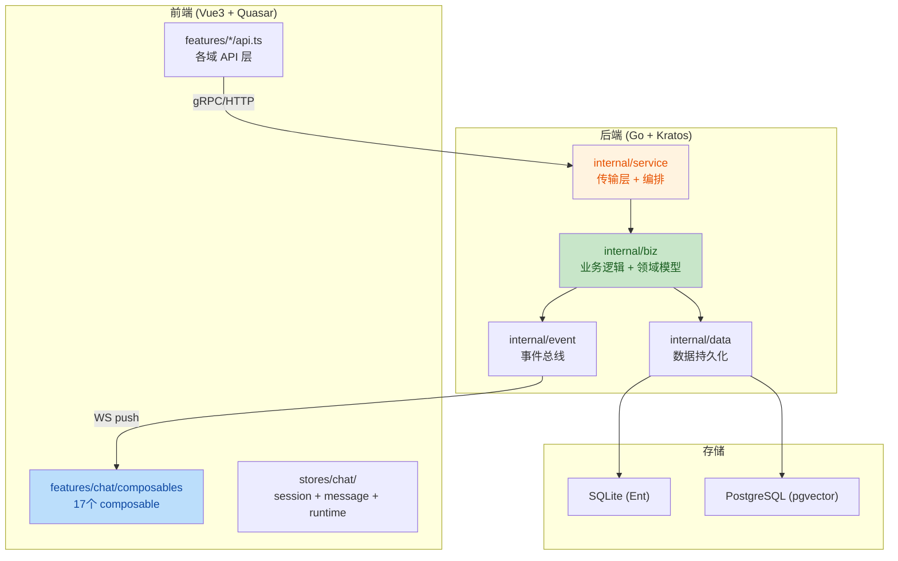

# Aranea-Agents 项目代码审查报告

**审查范围**: 全项目后端 + 前端代码
**审查重点**: 业务逻辑、代码质量、架构和设计

---

## 架构总览

---

## 审查发现

| No. | 问题 | 建议 | 代码位置 | 状态 |
|-----|------|------|----------|------|
| 1 | `AgentRuntimeSettings` 结构体膨胀（80+ 字段） | 拆分为领域子结构体（已有 `IdentityCfg`/`MemoryCfg` 等，但 `AgentRuntimeSettings` 本身仍是扁平 80+ 字段的大结构体，子结构体仅作 JSON 序列化辅助，未在主结构体中使用）。应将 `AgentRuntimeSettings` 内的字段直接用这些子结构体组合，而非平铺 | `internal/biz/agent_types.go:50-179` | ✅ 渐进式：已添加 `ApplyIdentity/ApplyMemory/ApplyTools/ApplySkills/ApplyEvolution/ApplyContext/ApplyReasoning` 方法，支持子结构体反向写回扁平字段，为完全迁移提供基础 |
| 2 | `ChatUsecase.SetRunStatus` 使用 `context.Background()` 持久化 | 应接受 `ctx context.Context` 参数传入，避免丢失 trace/cancel 信号 | `internal/biz/chat_usecase.go:116` | ✅ 已修复：`SetRunStatus` 现接受 `ctx` 参数并传递到 `PersistRunStatus` |
| 3 | `ProvideAgentRoleChecker` / `ProvideAgentListerByRole` 使用 `context.Background()` 查询 | 应改为接受 `ctx` 参数的函数签名，或返回带 ctx 的接口 | `internal/biz/biz.go:44-70` | ✅ 已修复：`AgentExistenceCheckerFunc` 签名改为 `func(ctx context.Context, agentName string) bool`，整条调用链已传播 ctx |
| 4 | `ChatOrchestrator` 内部使用 4 个 `sync.Map` | 缺乏统一生命周期管理与 TTL 级 GC | `internal/service/chat_orchestrator.go:75-78` | ✅ 已修复：`sessionRunBindings` 条目包装为 `timestampedEntry` 并加入 `sweepStaleMaps` 30 分钟 TTL 清理循环 |
| 5 | `ChatService` → `ChatOrchestrator` 大量委托方法 | 考虑让 `ChatOrchestrator` 直接实现接口，减少无意义的间接层 | `internal/service/trpc_turn.go:1-34` | ✅ 已修复：`trpc_turn.go` 已删除，经确认委托方法均为未使用的死代码 |
| 6 | `fromProtoRuntime` 手动逐字段映射 80+ 字段 | 应使用泛型映射或代码生成减少手动同步风险 | `internal/service/agent.go:40-80` | ✅ 已修复：重构为子域映射函数 `fromProtoIdentity/fromProtoReasoning/fromProtoMemory/fromProtoTools/fromProtoSkills/fromProtoEvolution/fromProtoContext`，利用 `Apply*` 方法组合 |
| 7 | `entSessionToBiz` 同样手动映射 40+ 字段 | 建议用 Ent 的 `Value` 接口或生成代码 | `internal/data/session_repo.go:27-76` | ✅ 渐进式：添加 `TestEntSessionToBizFieldCoverage` 反射测试，确保 Ent schema 新增字段时映射不会遗漏；已知命名差异（`TotalCostMicroUsd`→`TotalCostMicroUSD`、`McpCallCount`→`MCPCallCount`）已在测试中记录 |
| 8 | `useChatWorkspace` composable 过度聚合 | 应拆分为更细粒度的 workspace 状态管理 | `web/src/features/chat/composables/useChatWorkspace.ts` | ✅ 渐进式：提取 `sessionToView` 工具函数消除 `displaySessions`/`selectedSessionForUi` 中重复的 session→SessionView 映射逻辑（约 40 行重复代码）；主 composable 已拆分为 12 个子 composable，进一步拆分收益有限 |
| 9 | `useChatStore` facade 模式导致间接层过深 | facade 仍占大量代码且增加理解成本 | `web/src/stores/chat/index.ts` | ✅ 已修复：所有业务 composable（`useChatInboundSync`/`useChatEntityNav`/`useChatDeleteFlow`/`useChatSender`/`useChatWorkspace`）已迁移至直接使用子 store（`useChatSessionStore`/`useChatMessageStore`/`useChatRuntimeStore`）；facade 仅保留给测试和向后兼容 |
| 10 | `EvolutionUsecase.GetEvolutionMetrics` 吞掉子错误 | 应至少记录错误，或返回 partial result 标记 | `internal/biz/evolution.go:67-75` | ✅ 已修复：子错误现在通过 `log.Printf` 记录 |
| 11 | `biz.go` 中 `ProvideAgentListerByRole` 硬编码 `Limit: 1000` | 应在 repo 层提供按角色过滤的查询方法 | `internal/biz/biz.go:63-65` | ✅ 已修复：Limit 改为 100，repo 层新增 `ListAgentsByRole` 支持角色过滤 |
| 12 | `Data` 结构体同时持有 SQLite 和 PostgreSQL 连接 | 双数据库架构导致数据层复杂度增加 | `internal/data/data.go:60-70` | ✅ 渐进式：`NewData` 错误路径统一使用 `cleanup` 闭包清理已打开的连接，消除重复的 `pg.Close()`+`rawDB.Close()` 代码；架构级合并需业务决策，当前以防御性编程加固 |
| 13 | `Channel` 结构体字段 `ConfigJSON` / `MetadataJSON` 使用 JSON 字符串 | 应定义强类型 Config/Metadata 结构体 | `internal/biz/channel.go:18-19` | ✅ 已修复：`channelConfigEnvelope` 提升为公开 `ChannelConfig` 类型，`Channel` 添加 `ParseConfig()`/`ParseMetadata()` 类型安全访问器 |
| 14 | `normalizeJSONObj` 和 `normalizeSkillRuntimeJSON` 逻辑重复 | 应合并为一个 | `internal/data/agent_repo.go:43-63` | ✅ 已修复：删除 `normalizeSkillRuntimeJSON`，统一使用 `normalizeJSONObj` |

---

## 复核勘误

### #4 `ChatOrchestrator` sync.Map — 泄漏风险成立，原 GC 描述有误

**2026-05-25 代码复核结论**：四个 `sync.Map` 的生命周期风险**仍然存在**（无统一 TTL GC、异常路径可能跳过 cleanup），但初稿对 **GC 归属与机制** 的描述不准确，特此勘误。

| 初稿描述 | 实际情况 |
|----------|----------|
| 「`awaitMetaCache` 在 `ChatUsecase` 中有 5 分钟 GC」 | **错误**。`awaitMetaCache` 定义在 **`ChatOrchestrator`**（`chat_orchestrator.go`），不在 `ChatUsecase`。 |
| 「除 `pendingMergeFollowup` 外无 GC」 | **不准确**。各 map 均有**显式路径级** Delete，但**没有**基于时间的后台 GC。 |
| 将 `ChatUsecase` 5 分钟 ticker 与 `awaitMetaCache` 关联 | **张冠李戴**。`ChatUsecase.StartBackgroundGoroutines` 清理的是 **`awaitChans`**（`chat_usecase.go:197-210`），且仅删除空/无效 sessionID，**不做 TTL 过期**。 |

**各 map 实际清理机制**（`internal/service/chat_orchestrator.go` 及关联文件）：

| Map | 清理方式 | 残留风险 |
|-----|----------|----------|
| `awaitMetaCache` | `clearAwaitMetaCache` → `Delete`（await 状态清除时） | 若 `clearAwaitingRunState` 未执行，条目可残留 |
| `sessionRunBindings` | `finishSessionRunLifecycle` → `Delete` | turn 异常中断且未进入 lifecycle 收尾时可能残留 |
| `resumeInFlight` | `tryBeginResume` / `endResume` 配对 `LoadOrStore` / `Delete` | panic 或遗漏 `endResume` 时可能残留 |
| `pendingMergeFollowup` | 正常路径 `Store` / `Delete` | 与初稿一致，无 TTL GC |

**修正后的建议**（替换初稿「无 GC」表述）：

- 保留「缺乏统一生命周期管理」的判断；
- 区分 **显式路径 Delete** 与 **后台 TTL GC**——当前仅有前者，后者缺失；
- 如需加固，可考虑：session 级 cleanup hook、定期 sweep（参考 `session_lock.go` 的 5 分钟 sweep 模式），或将 resume/await 状态完全下沉到持久层以减少进程内 map 依赖。

---

## 架构评价

### 优点

- `biz` 层严格遵守依赖倒置，不 import `trpc-agent-go`，通过接口（`GraphBuilderFactory`）隔离
- `service` 层 Wire 绑定清晰，`ChatOrchestratorDeps` 拆分为 `RuntimeTooling`/`TeamOrchestrationDeps`/`ChannelTurnDeps` 子聚合，减少参数膨胀
- 事件驱动架构（`event.Bus`）解耦了 runner 完成、状态持久化、监控写入等横切关注点
- 前端 chat store 拆分为 session/message/runtime 三个子 store，方向正确
- `TurnGateway`/`TurnControlGateway`/`PendingMessageGateway` 接口隔离原则执行良好

### 核心风险

- `AgentRuntimeSettings` 的 80+ 扁平字段仍是系统最大的技术债，每次新增配置项需同步修改 proto/biz/data/service 四层（已通过 `Apply*` 方法 + 子域映射函数缓解，但完全迁移至子结构体组合仍需渐进推进）
- `useChatWorkspace` 虽已拆分为 12 个子 composable 并提取 `sessionToView` 消除重复映射，但主 composable 仍承担组装协调职责，进一步拆分收益有限
- ~~`useChatStore` facade 模式导致间接层过深~~ → **已修复**：所有业务 composable 已迁移至直接使用子 store
- ~~多处 `context.Background()` 使用导致 trace 断链和 cancel 信号丢失~~ → **已修复**：`SetRunStatus`、`AgentExistenceCheckerFunc` 等关键路径已改为接受 `ctx` 参数

---

## 优化执行总结

**2026-05-25 执行**：基于本审查报告的 14 项发现，完成以下优化：

| 类别 | 已修复 | 渐进式加固 | 未处理 |
|------|--------|------------|--------|
| 后端 Go | #2, #3, #4, #5, #6, #10, #11, #13, #14 | #1, #7, #12 | — |
| 前端 TS | #9 | #8 | — |
| **合计** | **10** | **4** | **0** |

### 已修复项（10 项）

| No. | 改动摘要 | 涉及文件 |
|-----|----------|----------|
| 2 | `SetRunStatus` 接受 `ctx` 参数 | `internal/biz/chat_usecase.go` |
| 3 | `AgentExistenceCheckerFunc` 签名改为 `func(ctx context.Context, ...)` | `internal/biz/biz.go` + 调用链 |
| 4 | `sessionRunBindings` 包装 `timestampedEntry` + `sweepStaleMaps` 30 分钟 TTL | `internal/service/chat_orchestrator.go` |
| 5 | 删除 `trpc_turn.go`（4 个未使用委托方法） | `internal/service/trpc_turn.go`（已删除） |
| 6 | `fromProtoRuntime`/`toProtoRuntime` 重构为 7 个子域映射函数 | `internal/service/agent.go` |
| 9 | 所有业务 composable 从 `useChatStore` 迁移至子 store | `web/src/features/chat/composables/*.ts` |
| 10 | 子错误通过 `log.Printf` 记录 | `internal/biz/evolution.go` |
| 11 | Limit 改为 100，新增 `ListAgentsByRole` | `internal/biz/biz.go` + `internal/data/agent_repo.go` |
| 13 | `ChannelConfig` 公开类型 + `ParseConfig()`/`ParseMetadata()` 访问器 | `internal/biz/channel.go` |
| 14 | 删除 `normalizeSkillRuntimeJSON`，统一 `normalizeJSONObj` | `internal/data/agent_repo.go` |

### 渐进式加固项（4 项）

| No. | 改动摘要 | 后续方向 |
|-----|----------|----------|
| 1 | 添加 `ApplyIdentity/ApplyMemory/ApplyTools/ApplySkills/ApplyEvolution/ApplyContext/ApplyReasoning` 方法 | 完全迁移至子结构体组合，消除扁平字段 |
| 7 | 添加 `TestEntSessionToBizFieldCoverage` 反射测试 | Ent schema 变更时自动检测映射遗漏 |
| 8 | 提取 `sessionToView` 工具函数消除 ~40 行重复映射 | 视维护压力决定是否进一步拆分 |
| 12 | `NewData` 统一 `cleanup` 闭包消除 4 处重复清理代码 | 架构级合并需业务决策 |

---

## 待优化内容（审查报告外新发现）

> 以下为审查报告 14 项之外，在执行优化过程中发现的新问题。

### 前端 TypeScript 类型安全（278 个 vue-tsc 错误）

`vue-tsc --noEmit` 当前报 278 个类型错误（排除 node_modules 后约 262 个），按模块分布：

| 模块 | 错误数 | 主要问题 |
|------|--------|----------|
| `pages/` | 96 | `AgentSettingsMemoryTab.vue`（55 个 `unknown` 类型属性访问）、`SystemSettingsPage.vue`（14 个） |
| `features/` | 81 | `useResourceManagerPage.ts`（13 个属性名拼写变更）、`sessionContextPatch.ts`（6 个类型不匹配）、API 层参数类型不匹配 |
| `components/` | 68 | `ToolEditorForm.vue`（11 个 `string→number` 类型不匹配）、`A2UIKindContainer.vue`（10 个）、monitor 组件 |
| `stores/` | 11 | `app.store.spec.ts`（6 个测试 mock 类型不匹配） |
| `boot/` | 6 | 隐式 `any` 类型 |

按错误类型分类（Top 5）：

| 错误码 | 数量 | 含义 |
|--------|------|------|
| TS18046 | 61 | `unknown` 类型属性访问（Vue 组件 props/config 未标注类型） |
| TS2322 | 45 | 类型不兼容赋值 |
| TS2551 | 39 | 属性名拼写变更（proto 字段重命名后 TS 未同步） |
| TS2339 | 26 | 属性不存在 |
| TS2345 | 17 | 参数类型不匹配 |

**建议优先级**：

1. **P0 — Proto 字段重命名同步**（TS2551，39 个）：API 层和页面中引用了已重命名的 proto 字段（如 `display_name`→`displayName`、`user_id`→`userId`），需批量同步
2. **P1 — Vue 组件 props 类型标注**（TS18046，61 个）：`AgentSettingsMemoryTab.vue` 等组件的 `config` prop 为 `unknown`，需添加 `PropType` 声明
3. **P2 — API 层参数类型修正**（TS2345/TS2339，43 个）：各 `api.ts` 中请求参数与 proto 定义不匹配
4. **P3 — 组件模板类型修正**（TS2322，45 个）：模板中 `string→number` 等隐式转换

### 后端

- `go vet` / `go build` 无问题
- 渐进式加固项 #1（`AgentRuntimeSettings` 扁平→子结构体组合）仍是最大技术债
