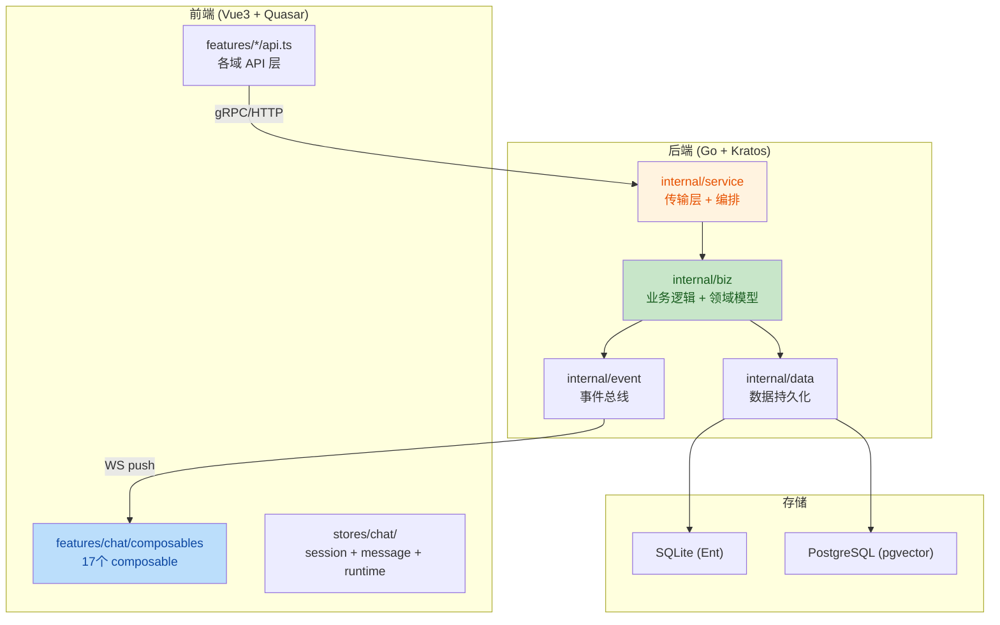

# Aranea-Agents 项目代码审查报告

**审查范围**: 全项目后端 + 前端代码
**审查重点**: 业务逻辑、代码质量、架构和设计

---

## 架构总览

---

## 审查发现

| No. | 问题 | 建议 | 代码位置 |
|-----|------|------|----------|
| 1 | `AgentRuntimeSettings` 结构体膨胀（80+ 字段） | 拆分为领域子结构体（已有 `IdentityCfg`/`MemoryCfg` 等，但 `AgentRuntimeSettings` 本身仍是扁平 80+ 字段的大结构体，子结构体仅作 JSON 序列化辅助，未在主结构体中使用）。应将 `AgentRuntimeSettings` 内的字段直接用这些子结构体组合，而非平铺 | `internal/biz/agent_types.go:50-179` |
| 2 | `ChatUsecase.SetRunStatus` 使用 `context.Background()` 持久化 | 应接受 `ctx context.Context` 参数传入，避免丢失 trace/cancel 信号。当前调用链 `SetRunStatus` → `PersistRunStatus(context.Background(), ...)` 会导致该持久化操作脱离请求上下文 | `internal/biz/chat_usecase.go:116` |
| 3 | `ProvideAgentRoleChecker` / `ProvideAgentListerByRole` 使用 `context.Background()` 查询 | 这些函数在 Wire 初始化时创建闭包，每次调用都用 `context.Background()`，无法传递超时或 cancel。应改为接受 `ctx` 参数的函数签名，或返回带 ctx 的接口 | `internal/biz/biz.go:44-70` |
| 4 | `ChatOrchestrator` 内部使用 4 个 `sync.Map` | 四个 map 缺乏统一生命周期管理与 TTL 级 GC；异常路径未走 cleanup 时可能残留条目。各 map 实际清理方式见下方 **#4 复核勘误** | `internal/service/chat_orchestrator.go:75-78` |
| 5 | `ChatService` → `ChatOrchestrator` 大量委托方法 | `trpc_turn.go` 中每个方法只是单行委托 `s.orch.xxx()`，这种模式在 `ChatService` 上产生了约 10+ 个纯委托方法。考虑让 `ChatOrchestrator` 直接实现接口，减少无意义的间接层 | `internal/service/trpc_turn.go:1-34` |
| 6 | `fromProtoRuntime` 手动逐字段映射 80+ 字段 | `AgentService.fromProtoRuntime` 将 proto 结构逐字段映射到 biz 结构，80+ 行重复赋值。应使用泛型映射或代码生成减少手动同步风险 | `internal/service/agent.go:40-80` |
| 7 | `entSessionToBiz` 同样手动映射 40+ 字段 | `data/ent` → `biz` 的转换函数手动逐字段赋值，Ent schema 变更时容易遗漏。建议用 Ent 的 `Value` 接口或生成代码 | `internal/data/session_repo.go:27-76` |
| 8 | `useChatWorkspace` composable 过度聚合 | 该 composable 约 600 行，组合了 17 个子 composable，返回 5 个 reactive 分组。职责边界模糊，初始化逻辑（`onMounted`）包含 50+ 行条件分支。应拆分为更细粒度的 workspace 状态管理 | `web/src/features/chat/composables/useChatWorkspace.ts` |
| 9 | `useChatStore` facade 模式导致间接层过深 | `stores/chat/index.ts` 作为 facade 将所有方法委托到 `sessionStore`/`messageStore`/`runtimeStore`，每个方法都是一行委托。新代码被建议直接用子 store，但 facade 仍占大量代码且增加理解成本 | `web/src/stores/chat/index.ts` |
| 10 | `EvolutionUsecase.GetEvolutionMetrics` 吞掉子错误 | `GetToolSuccessRate` / `GetRetrievalQuality` / `GetEpisodeCount` / `GetNegativeFeedbackCount` 的错误被静默忽略（`_ = err`），返回不完整数据但无任何日志或指标。应至少记录错误，或返回 partial result 标记 | `internal/biz/evolution.go:67-75` |
| 11 | `biz.go` 中 `ProvideAgentListerByRole` 硬编码 `Limit: 1000` | 查询所有 agent 再内存过滤角色，当 agent 数量增长时性能堪忧。应在 repo 层提供按角色过滤的查询方法 | `internal/biz/biz.go:63-65` |
| 12 | `Data` 结构体同时持有 SQLite 和 PostgreSQL 连接 | 双数据库架构（SQLite 做 CRUD + PostgreSQL 做 pgvector）导致数据层复杂度增加，事务跨库不可能。`NewData` 初始化逻辑包含多步启动流程，任一失败需手动清理已打开的连接 | `internal/data/data.go:60-70` |
| 13 | `Channel` 结构体字段 `ConfigJSON` / `MetadataJSON` 使用 JSON 字符串 | 多处使用 `string` 类型存储 JSON，缺乏类型安全。应定义强类型 Config/Metadata 结构体，在边界层序列化 | `internal/biz/channel.go:18-19` |
| 14 | `normalizeJSONObj` 和 `normalizeSkillRuntimeJSON` 逻辑重复 | 两个函数实现完全相同（空值返回 `{}`，有效 JSON 原样返回），应合并为一个 | `internal/data/agent_repo.go:43-63` |

---

## 复核勘误

### #4 `ChatOrchestrator` sync.Map — 泄漏风险成立，原 GC 描述有误

**2026-05-25 代码复核结论**：四个 `sync.Map` 的生命周期风险**仍然存在**（无统一 TTL GC、异常路径可能跳过 cleanup），但初稿对 **GC 归属与机制** 的描述不准确，特此勘误。

| 初稿描述 | 实际情况 |
|----------|----------|
| 「`awaitMetaCache` 在 `ChatUsecase` 中有 5 分钟 GC」 | **错误**。`awaitMetaCache` 定义在 **`ChatOrchestrator`**（`chat_orchestrator.go`），不在 `ChatUsecase`。 |
| 「除 `pendingMergeFollowup` 外无 GC」 | **不准确**。各 map 均有**显式路径级** Delete，但**没有**基于时间的后台 GC。 |
| 将 `ChatUsecase` 5 分钟 ticker 与 `awaitMetaCache` 关联 | **张冠李戴**。`ChatUsecase.StartBackgroundGoroutines` 清理的是 **`awaitChans`**（`chat_usecase.go:197-210`），且仅删除空/无效 sessionID，**不做 TTL 过期**。 |

**各 map 实际清理机制**（`internal/service/chat_orchestrator.go` 及关联文件）：

| Map | 清理方式 | 残留风险 |
|-----|----------|----------|
| `awaitMetaCache` | `clearAwaitMetaCache` → `Delete`（await 状态清除时） | 若 `clearAwaitingRunState` 未执行，条目可残留 |
| `sessionRunBindings` | `finishSessionRunLifecycle` → `Delete` | turn 异常中断且未进入 lifecycle 收尾时可能残留 |
| `resumeInFlight` | `tryBeginResume` / `endResume` 配对 `LoadOrStore` / `Delete` | panic 或遗漏 `endResume` 时可能残留 |
| `pendingMergeFollowup` | 正常路径 `Store` / `Delete` | 与初稿一致，无 TTL GC |

**修正后的建议**（替换初稿「无 GC」表述）：

- 保留「缺乏统一生命周期管理」的判断；
- 区分 **显式路径 Delete** 与 **后台 TTL GC**——当前仅有前者，后者缺失；
- 如需加固，可考虑：session 级 cleanup hook、定期 sweep（参考 `session_lock.go` 的 5 分钟 sweep 模式），或将 resume/await 状态完全下沉到持久层以减少进程内 map 依赖。

---

## 架构评价

### 优点

- `biz` 层严格遵守依赖倒置，不 import `trpc-agent-go`，通过接口（`GraphBuilderFactory`）隔离
- `service` 层 Wire 绑定清晰，`ChatOrchestratorDeps` 拆分为 `RuntimeTooling`/`TeamOrchestrationDeps`/`ChannelTurnDeps` 子聚合，减少参数膨胀
- 事件驱动架构（`event.Bus`）解耦了 runner 完成、状态持久化、监控写入等横切关注点
- 前端 chat store 拆分为 session/message/runtime 三个子 store，方向正确
- `TurnGateway`/`TurnControlGateway`/`PendingMessageGateway` 接口隔离原则执行良好

### 核心风险

- `AgentRuntimeSettings` 的 80+ 扁平字段是系统最大的技术债，每次新增配置项需同步修改 proto/biz/data/service 四层
- `useChatWorkspace` 600 行的"上帝 composable"是前端最大的维护风险点
- 多处 `context.Background()` 使用导致 trace 断链和 cancel 信号丢失
