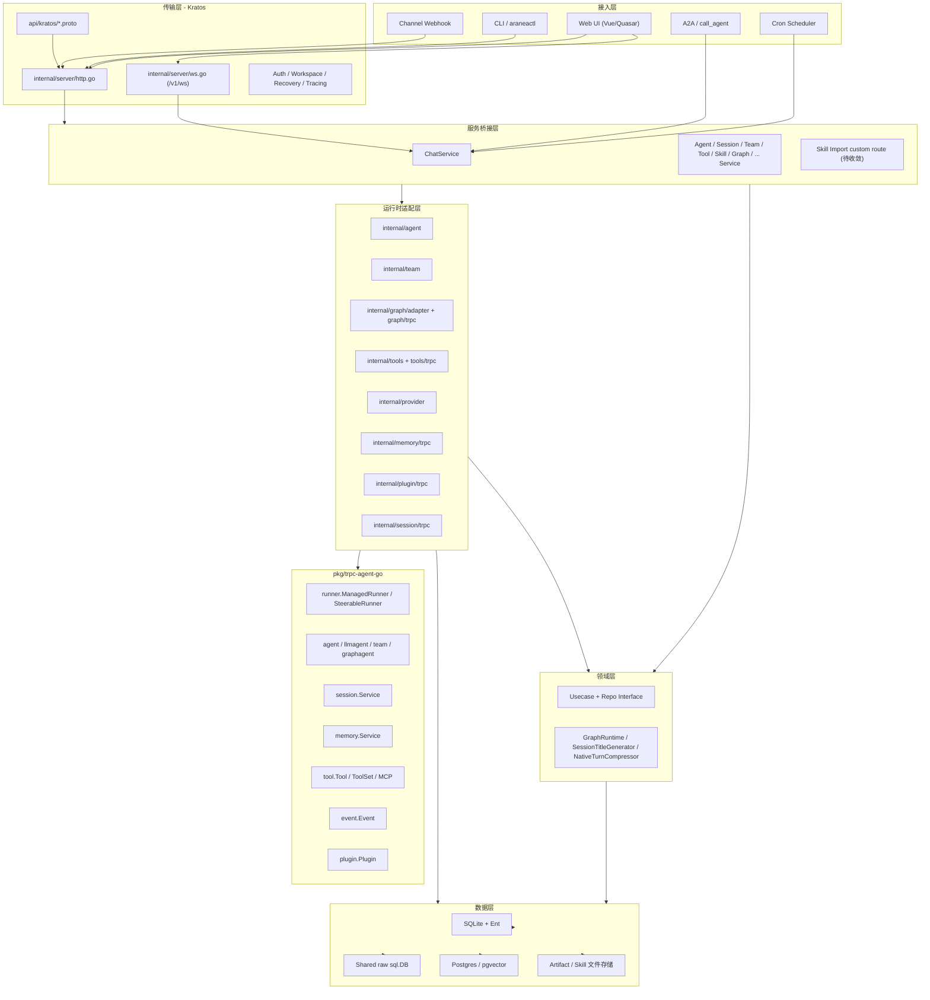
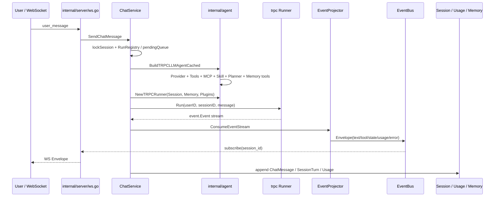
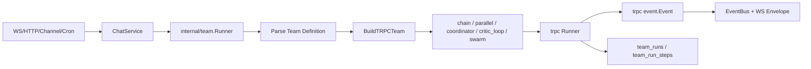
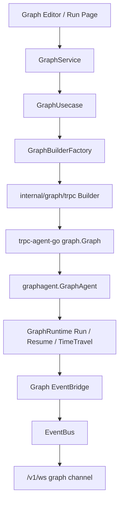
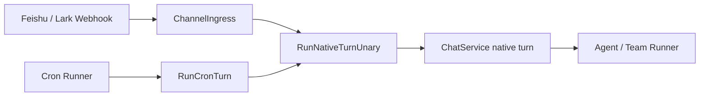
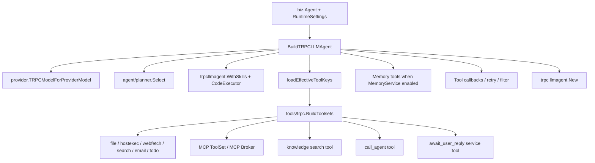
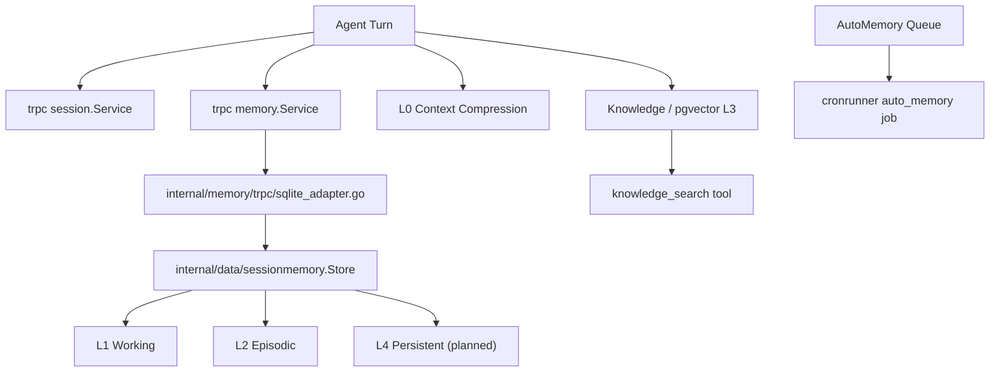
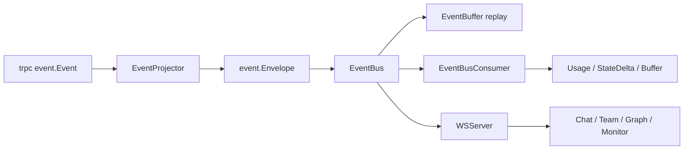

# Aranea-Agents 系统架构总览

> 本文档是当前项目的系统级“真理库”。AI 在实现任何模块前，应先阅读 `docs/README.md`，再阅读本文确认模块位置、依赖方向和运行时边界，最后读取对应模块的需求、设计与开发计划。
>
> **更新时间**：2026-05-19  
> **基线**：Kratos v2 负责传输与 DI，`pkg/trpc-agent-go` 负责 Agent 运行时。OpenClaw 只作为产品化装配参考，不复制其单体 `app.go`、HTML Admin 或渠道栈。

## 一、系统定位

Aranea-Agents 是基于 `trpc-agent-go` 的企业级多 Agent 编排平台。它提供 Agent / Team / Graph 三类编排、WS 实时事件、Session、五层记忆、知识库、工具 / MCP / Skill / Plugin、Cron、Channel、Monitor、Evaluation、Artifact 与 A2A 能力。

当前系统已经形成可运行主链路：Web / Channel / Cron 进入 `ChatService`，由 `internal/agent` 和 `internal/team` 装配 `trpc-agent-go` Runner，运行事件投影到 `internal/event`，再通过 `/v1/ws` 推送给前端。

## 二、分层架构图

## 三、依赖方向红线

| 边界 | 允许 | 禁止 | 当前健康度 |
|------|------|------|------------|
| `internal/server` | 注册 proto service、WS、少量基础设施路由 | 直接调用 Runner / Agent / LLM | 基本健康；`skill_import_http.go` 仍绕过 service |
| `internal/service` | proto ↔ biz 映射；组装 `trpc-agent-go` 运行时；投影事件 | 直接承载大量业务状态机 | 中等；运行控制已抽 `internal/runtime.RunRegistry`，待 RunnerManager 统一入口 |
| `internal/biz` | 领域模型、Usecase、Repo 接口、运行时端口接口 | import `pkg/trpc-agent-go`、import `internal/agent/team/trpc` | 健康；未发现 trpc 直接导入 |
| `internal/data` | Repo 实现、Ent / SQL / pgvector | 过多运行时框架绑定 | 中等；`data.go` 绑定 trpc session / graph checkpoint |
| `internal/agent/team/graph/tools/provider/*/trpc` | 框架适配、Builder、Runner、ToolSet、Plugin、Memory bridge | 复制 `pkg/trpc-agent-go` 内部实现 | 健康 |
| `web/src` | `pages -> features/stores -> services` | 领域类型散落到 components；store/API 双轨长期并存 | 中等；需统一 feature 模板 |

## 四、模块职责矩阵

| 域 | 模块 | 主要职责 | 代码锚点 | 当前完整度 |
|----|------|----------|----------|------------|
| 核心运行 | Chat(1) | 对话入口、WS 上行、Runner 调用、待执行队列、用量 | `internal/service/chat.go`、`trpc_turn.go` | 核心完成 |
| 核心运行 | Runner(40) | ManagedRunner / SteerableRunner 对齐、运行控制 | `internal/agent/trpc_runtime.go`、`internal/runtime/run_registry.go` | 部分完成；RunRegistry + EnqueueUserMessage RPC 已落地；RunnerManager / Artifact / Ingestor 待补 |
| 核心运行 | Session(10) | 会话、消息、标题、压缩、trpc session 适配 | `internal/biz/session_usecase.go`、`internal/session/trpc` | 基础完成；trace / snapshot 待补 |
| 核心运行 | Provider(9) | 模型目录、厂商配置、HA、Inspect | `internal/provider`、`internal/biz/llm_provider_model.go` | 核心完成；biz/provider 环待拆 |
| 编排 | Agent(2-8) | 创建、列表、分类、设置、文件、进化、标题、头像 | `internal/biz/agent_*`、`web/src/pages/AgentSettingsPage.vue` | 大多完成；设置页需拆分 |
| 编排 | Team(11) | 多 Agent 编排、五种模式、运行轨迹 | `internal/team`、`internal/service/team.go` | 核心完成；RunTeamTest / member 事件待补 |
| 编排 | Graph(36) | 确定性工作流、Checkpoint、HITL、Task | `internal/graph`、`internal/service/graph.go` | 核心完成；LLM/Tool 节点接线待补 |
| 能力 | Tools(23) | 工具目录、Agent 绑定、运行时挂载 | `internal/tools`、`internal/tools/trpc` | 核心完成；Override 生效和调用统计待补 |
| 能力 | MCP(19) | 外部 MCP Server、Broker、健康探活 | `internal/mcp*`、`internal/tools/mcpmount` | 部分完成；超时、重连、认证待补 |
| 能力 | Skill(20) | Skill 包、导入、运行时工具、CodeExecutor | `internal/skill` | 核心完成；导入路由需 service 化 |
| 能力 | Plugin(22) / Callback(28) | Runner 横切插件、Agent/Tool/Model 回调 | `internal/plugin/trpc`、`internal/agent/callbacks` | 部分完成；Callback Chain 全面挂载待补 |
| 记忆知识 | Memory(12-16) | L0-L4、trpc MemoryService、MemoryWorker | `internal/data/sessionmemory`、`internal/memory/trpc` | L0-L3 部分完成；L4 / Worker 待补 |
| 记忆知识 | Knowledge(37) | 文档摄取、chunk、embedding、检索工具 | `internal/knowledge`、`internal/biz/knowledge.go` | 核心完成；前端管理页缺失 |
| 文件 | Artifact(27) | 产物存储、版本、Runner 注入 | `internal/artifact/trpc`、`internal/data/artifactfs` | 部分完成；Runner 注入和 UI 待补 |
| 自动化 | Cron(21) | 定时触发 Agent / Team | `internal/cronrunner`、`internal/service/cron.go` | 核心完成 |
| 接入 | Channel(17) | 外部 IM 接入、Webhook、投递 | `internal/channel`、`internal/service/channel_ingress.go` | CRUD 完成；多通道适配待补 |
| 观测 | Message(51) / Event(34) | Envelope、EventBus、WS、多路复用、回放 | `internal/event`、`internal/server/ws.go` | 核心完成 |
| 观测 | Monitor(18) / Telemetry(24) / Token(29) | Audit、Events、Logs、Usage、metrics、OTLP | `internal/metrics`、`internal/telemetry`、`internal/biz/usage.go` | 基础完成；Dashboard/Trace/Quota 待补 |
| 互通 | A2A(26) | 对外 A2A、call_agent、远程互通 | `internal/a2a`、`api/kratos/a2a` | 基础完成；标准 server/a2a 待接 |
| 评测 | Evaluation(33) | EvalSet、Runner、LLM Judge、结果 | `internal/evaluation` | 后端基础完成；框架 EvalSet 对齐和 UI 待补 |
| 平台 | Ecosystem(30) | 市场、模板、扩展发现 | `web/src/pages/EcosystemPage.vue` | 前端 mock；后端未实现 |

## 五、核心运行链路

### 5.1 单 Agent 对话

### 5.2 Team 对话

### 5.3 Graph 工作流

### 5.4 Channel 与 Cron 入口

## 六、工具挂载链

## 七、记忆系统关系

需要统一的概念：`trpc-agent-go/memory.Service` 是 Runner 层跨会话记忆接口；Aranea L0-L4 是产品级记忆模型。后续开发应明确由 Aranea L0-L4 提供框架 MemoryService 适配，而不是长期双轨。

## 八、WebSocket 与事件架构

当前实时传输主通道是 `/v1/ws`。独立 Chat SSE `/v1/chat/messages/stream` 与独立 SSE 端口已经从主链路移除；文档中仍出现的 SSE 表述应改为“历史兼容概念”或“外部协议 SSE（如 A2A/MCP）”，不得写作当前 Chat/Team 主通道。

## 九、架构健康度诊断

| 编号 | 问题 | 影响 | 康复方向 | 优先级 |
|------|------|------|----------|--------|
| AH-01 | 系统级总览、执行计划曾为空 | AI 缺少真理库，容易读错旧需求 | 本文 + `0-system-development.md` + `execution-plan.md` 作为总基线 | P0 |
| AH-02 | `ChatService` 曾承载 Gateway 状态机 | 并发、取消、排队逻辑难复用 | `RunRegistry` 已抽（2026-05-19）；待 `RunnerManager` + Team/Cron/Channel 共用 | P0（部分完成） |
| AH-03 | `service/agent` 直连 `sessionmemory.Store` | 记忆读写双路径，schema 变化风险高 | 下沉到 `biz.MemoryUsecase` 或定义 infra 端口 | P0 |
| AH-04 | `internal/data` 绑定 trpc session / graph checkpoint | Data 层测试和替换存储受运行时影响 | 将框架 adapter provider 上移到 `internal/runtime` / Wire | P1 |
| AH-05 | `server/skill_import_http.go` 绕过 service | 鉴权、观测、API 契约分叉 | 扩展 `skill.proto`，迁入 `SkillService` | P1 |
| AH-06 | `biz` 与 `provider` 形成双向依赖 | LLM inspect 与模型目录边界不稳 | 抽 `internal/llminspect` 或 biz 端口接口 | P1 |
| AH-07 | Runner 仍是临时创建模式 | Artifact/Ingestor 未挂；GetRunStatus 未对齐 ManagedRunner | RunnerManager + 框架能力注入；EnqueueUserMessage 已可用 | P1（enqueue 部分完成） |
| AH-08 | 前端 store/API/mapper 三套风格并存 | UI 迭代易重复、测试不能覆盖真实 mapper | 统一 feature 模板、抽 `mappers.ts`、删除空转 store | P1 |
| AH-09 | Knowledge / Evaluation / Artifact / A2A 有 API 无管理页 | 模块闭环不完整 | 按模块补路由、页面和导航，或文档降级为 API-only | P2 |
| AH-10 | Monitor/Message/Team 旧 SSE 口径残留 | AI 可能实现错误传输链路 | 全部收敛到 WS/EventBus | P0 |

## 十、AI 开发读取顺序

1. `docs/README.md`
2. 本文档
3. `docs/需求/0-system-development.md`
4. `docs/guides/execution-plan.md`
5. 目标模块的 `需求/*.md`、`*.design.md`、`*-development.md`
6. 框架相关任务先读 `docs/guides/trpc-agent-go-framework.md` 与 `pkg/trpc-agent-go` 对应包；Channel/Gateway 对照 OpenClaw 时只读 `pkg/trpc-agent-go/openclaw` 作为参考

## 十一、当前真理库摘要

- `pkg/trpc-agent-go` 是 Runner / Agent / Session / Memory / Tool / Event / Plugin / Team / Graph / A2A / Evaluation 的框架真相源。
- `internal/service` 是传输到运行时的桥点；`internal/biz` 不 import `trpc-agent-go`。
- `/v1/ws` 是 Chat / Team / Graph / Monitor 的实时主通道。
- Agent / Team 主运行链路已可用；Graph 核心已可用；Tools/MCP/Skill/Plugin 基础已可用。
- 最大架构债不是“缺少模块”，而是横切状态机、记忆双轨、Data 运行时耦合、前端模式分裂和旧文档口径漂移。
