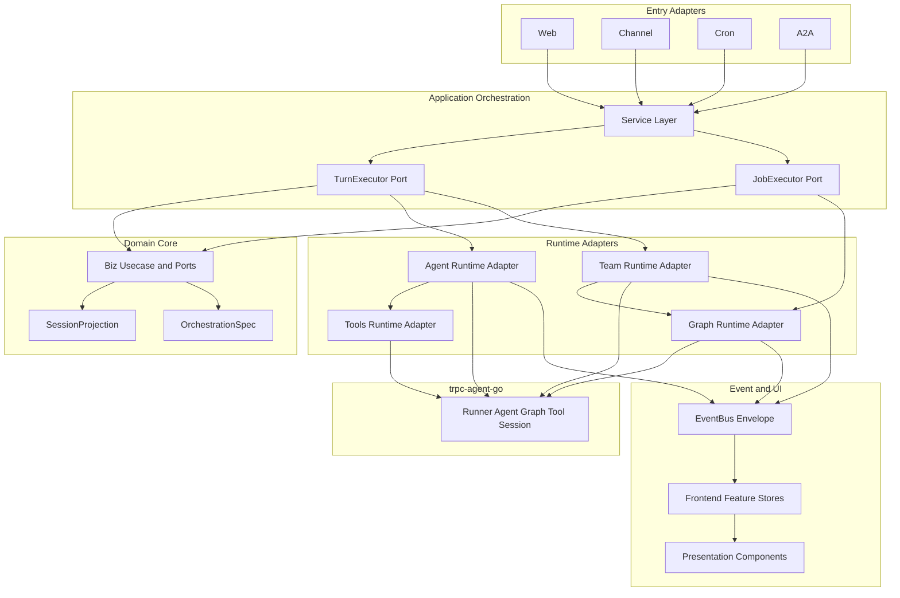

# 模块解耦架构指导

> **定位**：面向后续 AI 编码代理与架构治理的跨模块解耦指南（原 `guides/module-decoupling-architecture-guide.md` + `guides/backend-decoupling-guide.md` 已合并至本文）。  
> **适用范围**：Chat、Channel、Agent、Team、Graph，以及它们在前后端中的共享运行时、事件、状态与 UI 编排。  
> **前置阅读**：任何代码改动前先读 [docs/README.md](../README.md)，后端读 [guides/AI-DEVELOPMENT-SPECIFICATION.md](../guides/AI-DEVELOPMENT-SPECIFICATION.md)，前端读 [guides/frontend-guide.md](../guides/frontend-guide.md)。

## 1. 本文目标

本项目已经形成可运行主链路，但 Chat / Channel / Agent / Team / Graph 在持续扩展后会自然产生聚合点。本文的目标不是要求一次性重构，而是给后续 AI 做功能开发和模块优化时提供稳定判断：

1. 新能力应该落在哪个模块。
2. 模块之间应该通过什么端口交互。
3. 哪些依赖方向不能继续扩大。
4. 旧路径如何分阶段迁移，不破坏现有业务。

本文优先约束**新增代码**。存量代码迁移应小步执行，每次只拆一个边界或一个入口路径。

---

## 2. 架构红线

### 2.1 后端红线

| 红线 | 说明 |
|------|------|
| `internal/server` 只做传输注册 | 不直接调用 Runner、Agent、LLM、Graph runtime；不写业务路由状态机 |
| `internal/service` 是运行时桥点 | 可装配 Agent / Team / Graph runtime，但不得无限承载业务规则 |
| `internal/biz` 不 import `pkg/trpc-agent-go` | biz 只放领域模型、Usecase、Repo 接口和运行时端口 |
| `internal/biz` 不 import `api/*/v1` | proto 只在 service/server 边界转换 |
| `internal/data` 只实现 Repo / Store | 不新增运行时装配逻辑，不绕过 `NewData` 另开 SQLite |
| `internal/channel/*` 不感知 Chat 私有实现 | Channel 通过端口请求 Turn / Job，不持有完整 ChatService 能力 |
| `internal/team` 不新增 chat proto 依赖 | Team runtime 接收 biz 级 `TurnInput`，proto 映射在 service |
| Graph 运行时类型不泄漏到 biz | biz 暴露 `GraphBuildConfig` / `GraphRuntime` 等端口，trpc graph 留在 adapter/trpc |

### 2.2 前端红线

| 红线 | 说明 |
|------|------|
| 展示组件不 import Store / API | `components/**` 只接收 props、发 emits |
| Page 不直接 import `features/*/api` | Page 通过 Store 或域内 composable 间接触发 action |
| 网络请求只写在 `features/<域>/api.ts` | Store action 调 API，Composable 默认只组合 Store |
| Chat 不再扩大 `useAppStore` | 新 Chat 状态进入 session/chat runtime 等专用 Store |
| Envelope / WS 不绑死 Chat feature | 共享实时协议应作为 runtime/transport 模块供 Chat、Team、Graph、Monitor 使用 |
| 跨域路由跳转不上沉到展示组件 | 组件 emit 意图，Page 或 composable 决定跳转 |

---

## 3. 目标依赖方向



核心原则：

- 入口层只表达“来自哪里”和“要做什么”，不关心 Agent / Team / Graph 如何执行。
- 应用编排层统一接 Turn / Job 请求，选择运行时并投影事件。
- 领域层定义业务真相源和端口，不持有框架类型。
- 运行时适配层负责把 biz 配置翻译为 `trpc-agent-go` 对象。
- 前端只消费 API / Envelope / Store，不把后端运行时细节写进组件。

---

## 4. 模块职责边界

### 4.1 Chat

**职责**

- 管理用户 Turn 生命周期：admission、pending queue、cancel、await reply、usage、assistant message。
- 维护 Session / Messages 的真相源和增量同步游标。
- 将 Agent / Team / Graph runtime 事件投影为 Chat UI 可消费的 Envelope。

**不应承担**

- 不解析 Channel 平台协议、消息卡片、机器人凭据。
- 不直接内置 Graph 长任务 Job 监听策略。
- 不继续把 Agent、Team、Session、Message、Channel Job 全部塞进一个前端全局 Store。

**目标端口**

| 端口 | 用途 |
|------|------|
| `TurnExecutor` | Web / WS / Channel / Cron 共用的同步 turn 执行入口 |
| `TurnGateway` | cancel、status、enqueue、await reply 等运行控制 |
| `SessionProjection` | 消息、revision、activity、artifact 的会话投影 |

### 4.2 Channel

**职责**

- 接入飞书、企业微信、钉钉、Telegram、Slack 等平台协议。
- 标准化入站事件为 `port.InboundEvent`。
- 完成访问控制、路由、幂等、ACK、出站投递。
- 按配置选择 Turn 平面或 Job 平面。

**不应承担**

- 不持有 `*ChatService` 的完整具体类型。
- 不构造 proto chat request 作为内部业务对象。
- 不把异步 Graph / Cron completion watch 散落在平台适配器中。

**目标端口**

| 端口 | 用途 |
|------|------|
| `NativeTurnGateway` | Channel 同步 Turn 只依赖窄接口 |
| `ChannelJobGateway` | Channel async 只依赖 Job 创建、查询、取消、完成通知 |
| `OutboundDeliveryPort` | 平台无关的投递队列和状态记录 |

### 4.3 Agent

**职责**

- 定义单 Agent 的配置、模型、工具、Skill、Memory、Planner、Plugin 输入。
- 在 `internal/agent` 将 biz Agent 转成 `trpc-agent-go` LLMAgent / Runner。

**不应承担**

- 不感知 Channel、Cron、A2A 入口细节。
- 不反向依赖 Team 或 Graph 产品视图。
- 不让前端 Agent 页面复用 Chat 全局状态。

**目标端口**

| 端口 | 用途 |
|------|------|
| `AgentRuntimeBuilder` | 构建单 Agent runtime |
| `ToolsetAssembler` | 统一工具挂载与覆盖策略 |
| `ModelResolver` | 将 biz provider/model 配置解析为 runtime model |

### 4.4 Team

**职责**

- 以 `OrchestrationSpec` 作为唯一团队编排真相源。
- 将 Team Definition 编译为 `GraphBuildConfig`。
- 维护 TeamRun、成员步骤、summary、activity timeline。

**不应承担**

- 不接收 proto chat request。
- 不复制单 Agent turn 的整套生命周期代码。
- Native Team runtime 不作为长期主路径；仅保留应急开关。

**目标端口**

| 端口 | 用途 |
|------|------|
| `TeamCompiler` | `OrchestrationSpec` 到 `GraphBuildConfig` |
| `TeamTurnRuntime` | Team turn 执行端口，内部优先 GraphAgent |
| `TeamRunObserver` | TeamRun / steps / activity timeline 投影 |

### 4.5 Graph

**职责**

- 作为确定性工作流执行引擎，支持 DAG/BSP、checkpoint、HITL、retry、cache、router、agent/tool 节点。
- 通过 `biz.GraphRuntime` 暴露 Run / Resume / Cancel / TimeTravel。
- 通过 adapter 将 `GraphBuildConfig` 转为 `trpc-agent-go` GraphAgent。

**不应承担**

- 不直接感知 Channel 平台。
- 不将 trpc graph 类型传入 biz。
- 不让前端 Graph 页面直接理解 Team 内部临时字段；Team->Graph 转换集中在 orchestration bridge。

**目标端口**

| 端口 | 用途 |
|------|------|
| `GraphBuilderFactory` | biz config 到 GraphRuntime |
| `GraphExecutionObserver` | execution 状态、事件、trace 投影 |
| `GraphNodeResolverSet` | Agent / Tool / Model / Function / Subgraph resolver 分离注入 |

---

## 5. 当前耦合点与治理方向

| 耦合点 | 风险 | 治理方向 |
|--------|------|----------|
| `internal/service/chat.go` 依赖聚合过宽 | ChatService 变成入口总线，改动半径大 | 按 `TurnGateway`、`SessionProjection`、`JobGateway` 拆窄接口 |
| `ChannelIngress` 直接调用 Chat 私有 turn | Channel 与 Chat 执行细节绑定 | Channel 只依赖 biz DTO + `NativeTurnGateway` |
| Agent turn 与 Team turn 生命周期重复 | timeout、trace、usage、pending 行为漂移 | 抽 `TurnExecutor` 共享生命周期，Agent/Team 只提供 build hook |
| `internal/team` import chat proto | transport 合同进入 runtime 层 | service 做 proto -> biz `TurnInput` 映射 |
| `internal/team/runner_team_trpc.go` 同时编译、执行、观测 | 文件持续膨胀，Graph 单链迁移困难 | 拆 `compiler`、`runtime`、`observer`、`fallback_policy` |
| `graph/adapter` resolver 汇聚 Agent/Tool/Provider | 每新增节点都扩大依赖集合 | Resolver ports 独立注入，adapter 只组装 |
| 前端 `useAppStore` 是 Chat 真相源 | Chat、Agent、Session 类型和状态混杂 | 迁移到 `session` store + `chatRuntime` store |
| 前端 Chat composable 直调 API | Page/composable 承担业务过程 | API 调用进入 Store action，composable 只组合状态和事件 |
| Envelope / WS 位于 Chat feature | Team/Graph/Monitor 复用时形成反向依赖 | 抽 shared realtime runtime，Chat 只是消费者 |

---

## 6. 后端解耦路线

### Phase B1：端口先行

目标：新增代码先用端口，不扩大具体类型依赖。

- 在 `internal/runtime` 或 `internal/turn` 定义 `TurnInput`、`TurnOptions`、`TurnOutcome`、`TurnExecutor`。
- 为 Channel 定义窄接口：`RunNativeTurn(ctx, input) (TurnOutcome, error)`。
- 为 Job 定义窄接口：`StartJob`、`GetJob`、`CancelJob`、`NotifyJobDone`。
- 将跨层 timeout、turn/job 判定、first byte timeout 等策略集中为 policy 类型。

验收：

- Channel 新增入口不直接调用 `ChatService` 私有方法。
- Team 新增执行入口不接收 proto request。
- `make runtime-boundary` 应通过。

### Phase B2：Turn 生命周期收敛

目标：Agent 与 Team 共享 turn 生命周期。

- 把 admission、session lock、pending queue、run registry、trace、usage、await hook 注入抽入 `TurnExecutor`。
- Agent runtime 和 Team runtime 只实现 `BuildRunner` / `PersistTurnRecord` / `ProjectRuntimeEvent` hook。
- Channel、Web、WS、Cron 统一进入 `TurnExecutor`。

验收：

- Agent turn 和 Team turn 的 cancel/status/enqueue 行为一致。
- 一条 trace 可以串起入口、turn、runtime、tool、message persistence。
- 原有 Chat / Team 单测保留，并新增共享 executor 测试。

### Phase B3：Team -> Graph 单链

目标：Team 默认编译到 GraphAgent。

- `OrchestrationSpec` v2 成为 Team Definition 的稳定格式。
- `TeamCompiler` 只产出 `GraphBuildConfig`。
- Native Team runtime 仅保留 `ARANEA_TEAM_NATIVE=1` 应急开关。
- TeamRun observer 只消费 GraphAgent 和 Team runtime 的统一事件。

验收：

- Team Chat、Team RunTest、Channel async team、Cron team 走同一 GraphAgent 执行链。
- Native fallback 使用有明确日志、metrics 和开关。

### Phase B4：Graph resolver 拆分

目标：Graph adapter 不再是所有运行时依赖的汇聚文件。

- 将 AgentResolver、ToolResolver、ModelResolver、FunctionResolver、SubgraphResolver 分离。
- Wire 中按 resolver 组装 `GraphNodeResolverSet`。
- `graph/trpc` 只依赖 resolver 接口，不直接知道业务 Usecase 细节。

验收：

- 新增一种 Graph 节点只新增对应 resolver 和 node wiring。
- 不需要同时修改 Agent、Provider、Tools 多个无关模块。

---

## 7. 前端解耦路线

### Phase F1：Chat 状态拆分

目标：逐步退出 `useAppStore` 的 Chat 真相源职责。

- `stores/session` 管理 sessions、messages、revision。
- 新建或扩展 `stores/chat-runtime` 管理 run status、pending queue、await reply、WS replay、jobs refresh。
- `features/chat/composables/useChatWorkspace.ts` 只组合 Store 和路由，不再直接持有跨域业务状态。

验收：

- Chat 消息加载、增量同步、发送、停止、pending 操作均由 Store action 发起。
- `useAppStore` 不再新增 Chat 字段。

### Phase F2：Realtime runtime 抽离

目标：Envelope / WS 成为共享基础设施。

- 将 `globalWsHub`、`useEnvelopeStream`、Envelope parser 中的跨域部分移到共享 runtime 目录。
- Chat、Team、Graph、Monitor 通过显式订阅配置使用它。
- Team API 不再从 Chat feature import WS 工具。

验收：

- `features/teams`、`features/graph` 不 import `features/chat/useEnvelopeStream`。
- Envelope 类型、run status、team event mapper 分别放在对应 domain 或 shared realtime。

### Phase F3：Composable -> Store action

目标：Composable 从业务执行者变成页面编排层。

- `useChatSender`、`useAwaitReply`、`useChatRunStatus`、`useFollowUpQueue` 等 API 调用迁入 Store action。
- Composable 暴露 `storeToRefs` 和事件处理函数。
- 展示组件中涉及跳转的动作改为 emit，由 Page / composable 执行 router push。

验收：

- `components/**` 无 Store/API import。
- Page 不直接 import `features/*/api`。
- Composable 直调 API 必须带 `TECH-DEBT` 注释和迁移任务 ID。

### Phase F4：类型边界收敛

目标：消除 `components/chat/types.ts` 作为跨域类型桶。

- Chat 视图模型放 `features/chat/types.ts` 或 `features/chat/viewModels.ts`。
- Session、Agent、Team、Graph 类型从各自 feature 导出。
- 组件只 type-only import 所需展示类型。

验收：

- 展示组件不作为业务类型 barrel。
- 跨域类型只通过 feature public types 或 shared view model 暴露。

---

## 8. AI 改代码前决策树

```text
我要改的是入口协议吗？
  是 -> internal/server 或 internal/service 的入口适配；不得调用 runtime 私有实现
  否 -> 继续

我要改的是业务规则 / 数据真相源吗？
  是 -> internal/biz + Repo 接口；不得 import proto / trpc-agent-go
  否 -> 继续

我要改的是 Agent / Team / Graph 执行吗？
  Agent -> internal/agent 或 TurnExecutor hook
  Team -> internal/team compiler/runtime/observer；输入用 biz DTO
  Graph -> internal/graph/adapter 或 graph/trpc；biz 只见端口
  否 -> 继续

我要改的是 Channel 平台行为吗？
  是 -> internal/channel/port + service ingress；通过 Turn/Job 端口执行
  否 -> 继续

我要改的是前端 UI 吗？
  请求/状态 -> feature api + store action
  页面编排 -> composable
  展示 -> components props/emits
```

---

## 9. 禁止新增耦合清单

后续 PR 中出现以下情况应立即停止并重设方案：

- `internal/biz` 新增 `trpc-agent-go`、`api/*/v1`、`internal/tools/*` 运行时依赖。
- `internal/server` 新增 `internal/agent`、`internal/team`、`internal/graph/trpc` 依赖。
- `internal/channel` 平台适配器直接调用 Chat / Graph concrete service。
- `internal/team` 新增 chat proto request / response 依赖。
- `internal/service.ChatServiceDeps` 继续新增非 Chat turn 必需依赖。
- `graph/adapter` 新增无关业务 Usecase 只是为了某个节点查数据。
- `web/src/components/**` 新增 Store、API、router 业务跳转。
- `web/src/pages/**` 新增直接 `features/*/api` 调用。
- `features/chat` 继续作为 Team / Graph / Monitor 的共享实时依赖入口。

---

## 10. 迁移任务模板

每个解耦 PR 应在描述或任务文档中包含：

```markdown
## 目标边界
- 从：<当前具体依赖>
- 到：<目标端口 / Store / Composable>

## 改动范围
- 后端：
- 前端：
- 文档：

## 旧路径策略
- 保留多久：
- 如何降级：
- 删除条件：

## 验收
- 单测：
- 集成 / 手测：
- 边界脚本：

## 回滚
- 回滚开关：
- 数据兼容：
- 风险：
```

---

## 11. 验收清单

### 11.1 后端

- [ ] `make runtime-boundary`
- [ ] 涉及 Wire 时：`make wire && make wire-clean`
- [ ] 涉及 Proto 时：`make api`
- [ ] 涉及 Agent / Team / Graph turn 时：相关单测覆盖 cancel、timeout、error、usage、event 投影
- [ ] 涉及 Channel 时：同步 Turn、异步 Job、ACK、幂等、出站投递路径可回归
- [ ] 涉及 Graph 时：Run / Resume / Cancel / Checkpoint / EventBridge 至少覆盖核心路径

### 11.2 前端

- [ ] `cd web && pnpm lint`
- [ ] 涉及 Store / Composable 时补或更新 focused test
- [ ] `/chat` 验证 Agent 和 Team 会话切换、发送、停止、pending、revision 同步
- [ ] `/teams` 验证 Team 编辑、运行观测、Graph 编排入口
- [ ] `/graphs` 验证编辑、执行、节点状态、HITL / task 面板
- [ ] 展示组件无 Store/API import，Dialog 只 emit submit

### 11.3 文档

- [ ] 更新 `docs/README.md` 索引。
- [ ] 若改变模块边界，更新对应 `docs/需求/*-development.md` 或 review 文档。
- [ ] Mermaid 图使用无空格节点 ID，不写显式颜色。

---

## 12. 参考锚点

| 主题 | 文档 |
|------|------|
| 项目文档入口 | [`docs/README.md`](../README.md) |
| 后端唯一行为准则 | [`AI-DEVELOPMENT-SPECIFICATION.md`](../guides/AI-DEVELOPMENT-SPECIFICATION.md) |
| 前端唯一行为准则 | [`frontend-guide.md`](../guides/frontend-guide.md) |
| Kratos 分层 | [`kratos-framework-guide.md`](../guides/kratos-framework-guide.md) |
| trpc-agent-go 映射 | [`trpc-agent-go-framework.md`](../guides/trpc-agent-go-framework.md) |
| Chat × Channel 蓝图 | [55-chat-channel-cursor-solution.md §9 附录](./55-chat-channel-cursor-solution.md#9-附录企业级蓝图与-ai-落地指南) |
| Team × Graph 蓝图 | [53 team-graph-orchestration.design.md 附录](./53%20team-graph-orchestration.design.md#附录企业级蓝图与-ai-落地指南) |
| 系统架构总览 | [`../需求/0 系统框图.md`](../需求/0%20系统框图.md) |
| Review 总览 | [`../review/README.md`](../review/README.md) |


---

## 附录：后端代码审查与分阶段优化路线

> 基于 2026-05-23 对 `internal/` 全量代码的深度审查（构造函数签名、import 图、Wire 装配点、runtime-boundary 脚本）。

## 1. 当前耦合全景

### 1.1 依赖方向总览

```
api/proto
  ↓
service ←── 桥点：proto ↔ biz + 运行时装配
  ↓
biz ←── 领域模型 + Usecase + Repo 接口
  ↓
data ←── Repo 实现（Ent + SQLite）
```

**合规方向**：service → biz → data。**禁止** data → service、biz → service。

### 1.2 横向依赖现状（internal 子包间，基于实际 import 扫描）

| 包 | 依赖的兄弟包 | 耦合程度 |
|---|---|---|
| `agent` | biz, event (23 文件), provider, knowledge, mcp/config, skill/storage, tools/*, plugin/trpc, session/trpc, a2a/trpc, telemetry, metrics | **极高** |
| `team` | biz, agent (6 文件), runtime (3 文件), event, graph/adapter, graph/trpc, knowledge, plugin/trpc, tools/*, metrics, telemetry | **高** |
| `runtime` | biz, agent (2 文件), event, provider, data/sessionmemory, memory/trpc, graph/trpc, session/trpc | **高** |
| `service` | biz, agent, team, event, channel/*, runtime, knowledge, compress, a2a, graph/*, plugin/trpc, tools/*, metrics, telemetry | **极高** |
| `channel/runtime` | biz, event, channel/port, metrics | 中等 |
| `graph/adapter` | biz, agent, event, graph/trpc, provider, tools/* | 高 |
| `event` | metrics | **低** |
| `data` | biz, ent/*, conf, pgvector, sessionmemory | 低（合规） |

### 1.3 关键发现：agent / team / runtime 不是循环依赖

**实际依赖方向**（经代码验证）：

```
team → agent      (6 个文件：runner_finish_steps, runner_team_trpc, team_graph_run_finisher,
                    team_graph_run_coordinator, runner_helpers, trpc_build, usage_tokens)

team → runtime    (3 个文件：runner_team_trpc, runner, runner_helpers)

runtime → agent   (2 个文件：runner_manager, run_status)

agent → team      ❌ 无依赖
agent → runtime   ❌ 无依赖
runtime → team    ❌ 无依赖
```

这是**单向依赖链**（`team → agent + runtime`，`runtime → agent`），不是循环依赖。但 team 同时依赖 agent 和 runtime 两个包，仍需关注接口稳定性。

---

## 2. 核心耦合问题（按严重程度排序）

### P1：ChatService 是 God Service——27 个 Wire 参数

`provideChatServiceDeps` 在 [wire.go](file:///f:/aranea-agents/cmd/admin/wire.go) 中接收 **27 个参数**来组装 `ChatServiceDeps`：

```go
func provideChatServiceDeps(
    runs *rt.RunRegistry,                          // 1
    teams biz.TeamRepository,                      // 2
    teamsNative *team.Runner,                      // 3
    usage *biz.UsageUsecase,                       // 4
    sessions *biz.SessionUsecase,                  // 5
    agents biz.AgentRepository,                    // 6
    agentsUC *biz.AgentUsecase,                    // 7
    toolsCatalog biz.ToolRepo,                     // 8
    toolUC *biz.ToolUsecase,                       // 9
    llmCatalog *biz.LlmProviderModelUsecase,       // 10
    skillUC *biz.SkillUsecase,                     // 11
    sys biz.SystemSettingRepo,                     // 12
    persist rt.PersistenceSet,                     // 13
    compress biz.NativeTurnCompressor,             // 14
    eventBus event.Bus,                            // 15
    eventBuffer *event.Buffer,                     // 16
    pluginRT *plugintrpc.Runtime,                  // 17
    pluginMgr *plugintrpc.Manager,                 // 18
    skillDBRepo trpcskill.Repository,              // 19
    a2aUC *biz.A2AUsecase,                         // 20
    artifacts *biz.ArtifactUsecase,                // 21
    mcpUC *biz.MCPServerUsecase,                   // 22
    knowledgeRetriever *knowledge.Retriever,       // 23
    mon *biz.MonitorUsecase,                       // 24
    codeExecFactory *localexec.Factory,            // 25
    graphFactory biz.GraphBuilderFactory,           // 26
    graphs *biz.GraphUsecase,                      // 27
    tasks *biz.TaskUsecase,                        // 28
    teamGraphCoord *team.TeamGraphRunCoordinator,  // 29
    turnJobs *biz.ChannelTurnJobUsecase,           // 30
) service.ChatServiceDeps
```

`ChatService` 结构体持有 16 个字段，`ChatServiceDeps` 持有 21 个字段（含嵌入的 `rt.TurnDeps`）。

**问题本质**：ChatService 同时承担了 Chat CRUD、Turn 生命周期、Team 编排、A2A 调用、Knowledge 检索、Plugin 管理、Graph 编排、MCP 工具装配——远超"传输桥点"的职责。

### P2：biz 包过大——单包承载所有领域

`internal/biz` 承载了所有领域模型、Repo 接口和 Usecase。文件数超过 100 个，所有 Usecase 共享同一个 `package biz` 命名空间。

**实际影响**：
- **隐式耦合**：同包 Usecase 可直接访问彼此的内部细节，无需显式依赖注入
- **编译爆炸**：改一个 Usecase 触发整个 biz 包重编译
- **心智负担**：无法快速定位"这个模块包含什么"

**但好消息是**：biz 内 Usecase 间的**显式交叉依赖较少**。审查所有 `NewXxxUsecase` 构造函数发现：

| Usecase | 依赖 | 类型 |
|---|---|---|
| `ChannelTurnJobUsecase` | `*ChannelUsecase` | 具体结构体（应改为接口） |
| `AgentMCPTooling` | `*AgentUsecase` + `*MCPServerUsecase` | 具体结构体（应改为接口） |
| `PluginUsecase` | `AgentRepository` | Repo 接口（合规） |
| `SessionUsecase` | `SessionRepository` + `AgentRepository` + `TeamRepository` | Repo 接口（合规，跨聚合只读） |
| 其余 ~20 个 Usecase | 仅 Repo 接口 | 合规 |

大多数 Usecase 只依赖 Repo 接口，这是好的。问题集中在少数几个交叉引用。

### P3：biz 层反向依赖 internal 子包（12 个文件）

规范红线 2 要求 `biz` 不得 import `pkg/trpc-agent-go`，但 biz 内还存在对 `internal` 子包的直接依赖：

| biz 文件 | 依赖 | 性质 |
|---|---|---|
| `memory_worker.go` | `internal/memory/trpc` | 运行时适配层 |
| `memory_admin_store.go` | `internal/data/sessionmemory` | data 层实现 |
| `web_research_runtime.go` | `internal/tools/webresearch` | 工具实现 |
| `tool_catalog_runtime.go` | `internal/tools/webresearch` | 工具实现 |
| `tool_test_invoke.go` | `internal/tools/testexec` | 工具实现 |
| `mcp_server.go` | `internal/mcp/metadata` + `internal/mcp/probe` | MCP 内部包 |
| `mcp_user_credential.go` | `internal/mcp/config` | MCP 配置 |
| `llm_provider_model.go` | `internal/llminspect` | 检查实现 |
| `webhook_dispatcher.go` | `internal/event` | 事件总线 |
| `domain_event_adapter.go` | `internal/event` | 事件总线 |
| `orchestration_status.go` | `internal/event` | 事件类型 |
| `event_bus_*.go` (8 files) | `internal/event` | 事件消费/发布 |
| `memory_worker.go` | `internal/event` | 事件消费 |

**最严重的是 event 包**：biz 内 **12+ 文件** 直接 import `internal/event`。虽然 `event.Bus` 是接口，但 biz 还使用了 `event.Envelope`、`event.EventType` 等具体类型。

### P4：wire.go 成为耦合汇聚点

[wire.go](file:///f:/aranea-agents/cmd/admin/wire.go) 中的 `provide*` 函数承担了大量跨层组装逻辑：

- `provideChatServiceDeps`：30 个参数
- `provideAutoMemoryWorker`：直接引用 `data.NewL4GraphWriterAdapter`、`memtrpc.NewSQLiteMemoryService`
- `providePluginRuntime`：手动组装回调闭包
- `provideCronRunnerDeps`：引用 `service.ChatService`

wire.go 本应是纯组装，但实际上包含了**业务编排逻辑**（如 `providePluginRuntime` 中的 `SetCatalogConfirmChecker` 闭包）。

### P5：Channel 平台硬编码注册

`channel_platform_registry.go` 硬编码 import 了 9 个平台包。新增平台必须修改此文件。

---

## 3. 优化路线

### Phase 1：ChatService 拆分（优先级最高，收益最大）

**目标**：将 ChatService 的编排职责下放，service 层回归"传输桥点"。

**当前**：
```
ChatService = Chat CRUD + Turn 执行 + Team 编排 + A2A + Knowledge + Plugin + Graph + MCP
```

**目标**：
```
ChatService (service 层)         ← 只做 proto 映射 + HTTP/WS 传输
ChatOrchestrator (biz/chat)      ← Turn 生命周期编排
TurnExecutor (agent 包)          ← 单次 Turn 执行（已有，但 ChatService 绕过了）
TeamRunCoordinator (team 包)     ← Team 运行协调（已有，ChatService 不应直接持有）
```

**具体拆分步骤**：

1. **提取 ChatOrchestrator**：将 `SendChatMessage`、`CancelChat`、`AwaitReply` 的核心逻辑移到 `biz/chat_orchestrator.go`，ChatService 只做参数转换 + 调用

2. **TurnDeps 内聚**：`rt.TurnDeps` 已包含 Catalog + Pipeline + LLMHTTP 等，ChatService 不应再额外持有 `pluginRT`、`pluginManager`、`knowledgeRetriever`、`codeExecFactory`——这些应全部收入 `TurnDeps` 或其扩展

3. **消除 ChatService 对 team.Runner 的直接持有**：ChatService 通过 `ChatOrchestrator` 接口调用，不直接持有 `*team.Runner`

4. **Wire 参数从 30 降到 ≤ 10**：ChatOrchestrator 自己组装内部依赖

| 职责 | 当前位置 | 迁移到 |
|---|---|---|
| Chat CRUD (ListMessages, GetOptions) | ChatService | ChatService (保留) |
| Turn 生命周期 (Send, Cancel, AwaitReply) | ChatService | `biz.ChatOrchestrator` |
| Team 编排 | ChatService.teamsNative | `ChatOrchestrator` 内部引用 |
| A2A 调用 | ChatService.a2aUC | `ChatOrchestrator` 内部引用 |
| Knowledge 检索 | ChatService.knowledgeRetriever | `agent.TurnDeps` 内部 |
| Plugin 管理 | ChatService.pluginRT/pluginManager | `agent.TurnDeps` 内部 |
| Graph 编排 | ChatService.graphFactory/graphs | `ChatOrchestrator` 内部引用 |

### Phase 2：biz 包拆分

**目标**：将 `internal/biz` 按聚合根拆为子包，每个子包内聚自己的模型 + Repo 接口 + Usecase。

```
internal/biz/
├── agent/          ← AgentUsecase + AgentRepository + Agent 模型
├── team/           ← TeamUsecase + TeamRepository + Team 模型
├── channel/        ← ChannelUsecase + ChannelTurnJobUsecase + Channel 模型
├── session/        ← SessionUsecase + SessionRepository + Session 模型
├── chat/           ← ChatUsecase + ChatOrchestrator + Chat 模型
├── tool/           ← ToolUsecase + ToolRepository + Tool 模型
├── skill/          ← SkillUsecase + SkillRepository
├── mcp/            ← MCPServerUsecase + MCP 模型
├── memory/         ← MemoryUsecase + L4GraphUsecase + MemoryWorker
├── graph/          ← GraphUsecase + Graph 模型
├── usage/          ← UsageUsecase + Usage 模型
├── monitor/        ← MonitorUsecase + Monitor 模型
├── hook/           ← HookUsecase + HookDeliveryUsecase
├── cron/           ← CronUsecase
├── plugin/         ← PluginUsecase
├── event/          ← EventStoreUsecase + FlowLogUsecase
├── a2a/            ← A2AUsecase
├── knowledge/      ← KnowledgeUsecase
├── evaluation/     ← EvalUsecase
├── avatar/         ← AvatarUsecase
├── artifact/       ← ArtifactUsecase
├── ecosystem/      ← EcosystemUsecase
├── shared/         ← 跨聚合共享：pagination, errors, json_list, json_schema, channelicons
└── biz.go          ← Wire ProviderSet（聚合各子包）
```

**规则**：
- 子包间**禁止**直接引用具体 Usecase 结构体，必须通过接口
- 子包间接口定义在**消费方**子包（依赖倒置）
- `shared/` 只放纯值对象和通用错误码，不放 Usecase

**迁移策略**：
1. 先建子包目录，将对应文件移动过去，package 名改为子包名
2. 保留 `internal/biz` 作为 re-export 兼容层（`type AgentUsecase = agent.AgentUsecase`），逐步迁移调用方
3. Wire ProviderSet 拆为各子包独立 ProviderSet，biz.go 聚合
4. 优先迁移**无交叉依赖**的 Usecase（avatar, hook, skill, flow_log, eval, ecosystem, artifact），风险最低

**必须同步修复的交叉引用**：

| 当前 | 改为 |
|---|---|
| `ChannelTurnJobUsecase.channels: *ChannelUsecase` | 定义 `ChannelLookup` 接口在 channel 子包 |
| `AgentMCPTooling.agents: *AgentUsecase` | 定义 `AgentEffectiveToolsLookup` 接口 |
| `AgentMCPTooling.mcp: *MCPServerUsecase` | 定义 `MCPToolingLookup` 接口 |

### Phase 3：消除 biz 对 internal 子包的反向依赖

**原则**：biz 层只定义接口，具体实现在 data/service/agent 等上层包注入。

#### 3.1 event 包解耦 ✅ 已完成

`event.Bus` 已是接口，biz 生产代码已全部迁移至 `event/contract`。

**已完成**：提取 `internal/event/contract` 子包，biz 只 import `event/contract`，不 import `event`（含实现）。

#### 3.2 runtime 包解耦 ✅ 已完成

`runtime.NewPersistenceSet` 及 `sessionAdminStoreAdapter` 迁移至 `cmd/admin/wire.go`。`internal/runtime/deps.go` 不再 import `data/sessionmemory` 和 `memory/trpc`。

#### 3.3 其他反向依赖（通过 Wire adapter 层已解耦）

| 当前依赖 | 状态 |
|---|---|
| `biz → internal/memory/trpc` | ✅ 已通过 `biz.AutoMemoryEnqueuer` 接口 + wire adapter 解耦 |
| `biz → internal/data/sessionmemory` | ✅ 已通过 `biz.SessionAdminStore` 接口 + wire adapter 解耦 |
| `biz → internal/tools/webresearch` | ✅ 已通过 `biz.WebResearchReadinessChecker` 接口 + wire adapter 解耦 |
| `biz → internal/tools/testexec` | ✅ 已通过 `biztool.ToolTester` 接口 + wire adapter 解耦 |
| `biz → internal/mcp/*` | ✅ 已通过 `biz.MCPProber` / `biz.MCPMetadataEditor` 接口 + wire adapter 解耦 |
| `biz → internal/llminspect` | ✅ 已通过 `biz.LLMInspector` 接口 + wire adapter 解耦 |

### Phase 4：team 包对 agent + runtime 的依赖收敛

**现状**：team 包有 6 个文件依赖 agent、3 个文件依赖 runtime。这是合理的依赖方向（team 编排 agent），但接口边界需收敛。

**目标**：team 只依赖 agent 的**公开接口**，不依赖内部实现细节。

1. **agent 包定义 `AgentBuilder` 接口**：team 通过接口构建 agent，不直接引用 `chatagent.TRPCBuilderDeps` 等具体类型
2. **runtime 包定义 `RunStatusQuerier` 接口**：team 通过接口查询运行状态，不直接引用 `rt.RunRegistry`

### Phase 5：Channel 平台注册解耦

**目标**：新增平台无需修改 `channel_platform_registry.go`。

**方案**：采用 `init()` 自注册模式（参考 `database/sql` 驱动注册模式）。

```go
// internal/channel/port/registry.go
var platforms = map[string]PlatformFactory{}

func RegisterPlatform(name string, factory PlatformFactory) {
    platforms[name] = factory
}
```

各平台包在 `init()` 中自注册：
```go
// internal/channel/lark/lark.go
func init() {
    port.RegisterPlatform("lark", NewLarkPlatform)
}
```

`channel_platform_registry.go` 简化为遍历 `port.ListPlatforms()`。

### Phase 6：wire.go 瘦身

**目标**：wire.go 只做纯组装，不包含业务逻辑。

1. ~~**`providePluginRuntime` 中的 `SetCatalogConfirmChecker` 闭包**：移入 `plugin/trpc` 包内部~~ ✅ 已修复（`SetToolUsecase`）
2. ~~**`provideAutoMemoryWorker` 中的 `data.NewL4GraphWriterAdapter`**：移入 `data` 包的 ProviderSet~~ ✅ 已修复（`provideL4GraphWriter`）
3. ~~**`provideChatServiceDeps` 30 个参数**：Phase 1 完成后自然缩减~~ ✅ 已降至 11 个

---

## 4. 新增模块接入规范

为防止耦合回弹，新增模块必须遵循：

### 4.1 分层规则

| 层 | 允许 import | 禁止 import |
|---|---|---|
| `service` | biz/*, proto, event/contract | agent, team, runtime, tools/*, data |
| `biz/*` | biz/shared, event/contract | service, data, agent, team, runtime, tools/*, mcp/*, memory/* |
| `data` | biz/*, ent, conf | service, agent, team, runtime |
| `agent` | biz/* (接口), event/contract, provider | team, runtime, service |
| `team` | biz/* (接口), agent (接口), event/contract, runtime (接口) | service |
| `runtime` | biz/* (接口), agent (接口), event/contract | team, service |
| `event` | metrics | biz, agent, team, runtime, service |

### 4.2 Usecase 间通信规则

- **同一聚合根内**：Usecase 可直接引用同包其他 Usecase
- **跨聚合根**：必须通过接口，接口定义在消费方
- **跨模块事件**：通过 `event.Bus` 发布/订阅，禁止同步调用

### 4.3 新 Usecase 检查清单

- [ ] Usecase 只依赖 Repo 接口 + 标准库 + biz/shared
- [ ] 如需跨聚合根，定义接口在**本包**，实现由调用方注入
- [ ] 不直接 import `internal/event`（用 `event/contract`）
- [ ] 不直接 import 任何 `tools/*` 实现包
- [ ] 不直接 import `internal/data/*` 实现包
- [ ] 不直接 import `internal/mcp/*` 实现包

### 4.4 Service 层检查清单

- [ ] Service 构造函数参数 ≤ 5 个
- [ ] Service 不持有 `*team.Runner`、`*plugintrpc.Runtime` 等运行时具体类型
- [ ] Service 不写业务逻辑（if/for 业务判断放 biz）
- [ ] Wire provider 函数不包含业务闭包

---

## 5. 量化指标与验收标准

| 指标 | 初始值 | 当前值 | Phase 3 目标 |
|---|---|---|---|
| `provideChatServiceDeps` 参数数 | 30 | 11 | ≤ 6 |
| ChatService 结构体字段数 | 16 | 1 (orch) | ≤ 5 |
| biz 直接依赖 internal 子包数（非 event） | 8 | 0 | 0 |
| biz 依赖 event 实现包文件数（生产代码） | 12+ | 0 | 0 |
| runtime 依赖 data/sessionmemory | 是 | 否 | 否 |
| runtime 依赖 memory/trpc | 是 | 否 | 否 |
| team 依赖 agent 文件数 | 6 | 6 | ≤ 3（通过接口） |
| 新增平台需修改文件数 | 1 (registry) | 1 | 0 |
| wire.go provider 函数含业务闭包 | 3 处 | 0 | 0 |

---

## 6. 实施优先级

| 优先级 | Phase | 预期收益 | 风险 | 前置条件 |
|---|---|---|---|---|
| **P0** | Phase 1: ChatService 拆分 | Wire 参数 30→10，service 回归传输职责 | 涉及运行时行为变更，需 E2E 覆盖 | 无 |
| **P1** | Phase 2: biz 拆包 | 编译速度、心智模型、后续优化基础 | 迁移工作量大，需 Wire 配套调整 | Phase 1（ChatOrchestrator 需要先有 biz/chat 子包） |
| **P2** | Phase 3: 消除 biz 反向依赖 | 依赖方向合规、可独立测试 | 接口抽取需谨慎，避免过度抽象 | Phase 2（子包边界清晰后才好定义接口） |
| **P3** | Phase 4: team 依赖收敛 | team/agent 接口稳定 | 需要接口设计 | Phase 2 |
| **P4** | Phase 5: Channel 自注册 | 扩展性 | 低风险，独立可做 | 无 |
| **P5** | Phase 6: wire.go 瘦身 | 组装逻辑归位 | 低风险 | Phase 1 + Phase 3 |

**关键路径**：Phase 1 → Phase 2 → Phase 3。Phase 4/5/6 可并行。

---

## 7. 反模式警示

以下模式在新增代码中**禁止**引入：

1. **God Service**：一个 Service 持有 10+ Usecase/Runner 依赖 → 应拆为多个专注 Service + biz 层编排器
2. **Biz 直接引用实现包**：`biz → internal/data/*`、`biz → internal/tools/*` → 应定义接口注入
3. **Usecase 间同步调用具体结构体**：`*ChannelUsecase` 在 `ChannelTurnJobUsecase` 中 → 应通过接口
4. **平台硬编码注册**：`switch provider { case "lark": ... case "slack": ... }` → 应自注册
5. **Wire provider 含业务闭包**：`providePluginRuntime` 中的 `SetCatalogConfirmChecker(func()...)` → 应移入实现包 ✅ 已修复（`SetToolUsecase`）
6. **30+ 参数的 provider 函数**：→ 应拆分为多个小 provider + 结构体内聚组装

---

## 8. 变更记录

### 2026-05-24 (2)：Phase 1 继续拆分 + Phase 3 解耦 + Phase 6 闭包消除

**Phase 1 — provideTurnDeps 提取**

将 `provideChatServiceDeps` 中 TurnDeps 的 12 个构造参数提取为独立 `provideTurnDeps` provider。`provideChatServiceDeps` 参数从 21 个降至 11 个（1 TurnDeps + 3 子聚合 + 7 独立依赖）。

**Phase 3 — runtime 包消除 data/sessionmemory + memory/trpc 依赖**

将 `runtime.NewPersistenceSet` 及其 `sessionAdminStoreAdapter` 迁移至 `cmd/admin/wire.go`（`providePersistenceSet` + `wireSessionAdminStoreAdapter`）。`internal/runtime/deps.go` 不再 import `internal/data/sessionmemory` 和 `internal/memory/trpc`，仅保留类型定义和 `NewEmptyPersistenceSet`（测试用）。

`biz` 包生产代码已全部使用 `event/contract`，不再直接 import `internal/event`。测试文件 `event_bus_user_feedback_consumer_test.go` 改用 `contract.Bus` 直接构造 consumer。

**Phase 6 — providePluginRuntime 闭包消除**

将 `providePluginRuntime` 中的 `SetCatalogConfirmChecker(func()...)` 闭包替换为 `plugintrpc.Runtime.SetToolUsecase(tools)` 方法，闭包逻辑封装在 `internal/plugin/trpc` 包内，wire.go 不再包含业务闭包。

**涉及文件**：
- `cmd/admin/wire.go` — 新增 `provideTurnDeps`、`providePersistenceSet`、`wireSessionAdminStoreAdapter`；简化 `providePluginRuntime`
- `internal/runtime/deps.go` — 移除 `NewPersistenceSet`、`sessionAdminStoreAdapter`、`data/sessionmemory` 和 `memory/trpc` import；新增 `NewEmptyPersistenceSet`
- `internal/runtime/runner_lifecycle_test.go` — 适配 `NewEmptyPersistenceSet`
- `internal/plugin/trpc/runtime.go` — 新增 `SetToolUsecase` 方法
- `internal/biz/event_bus_user_feedback_consumer_test.go` — 移除 `internal/event` import

### 2026-05-24 (3)：Channel 解耦 + 死代码清理

**优化1 — ChannelIngress 构造函数收窄**

`ChannelIngress` 构造函数中 `*ChatService` 参数替换为 `biz.NativeTurnGateway` + `*event.Buffer`。Channel 不再持有 Chat 的完整具体类型，仅依赖窄接口。

Wire 绑定：`wire.Bind(new(biz.NativeTurnGateway), new(*ChatService))`。

**优化2 — Channel graph 执行接口 proto 解耦**

将 `channelAsyncGraphExecutor`（返回 `*graphv1.ExecuteGraphResponse`）替换为 `channelGraphExecutor`（返回 `string` 即 executionID）。Channel 不再 import `graphv1` proto 包。

新增 `GraphService.ExecuteGraphByID` 方法，支持 biz 级 graph 执行入口。

**优化3 — deprecated 死代码移除**

- 移除 `ChatService.RunNativeTurnUnary`（proto 入口，无调用者）
- 移除 `ChatService.RunNativeTurnStreaming`（deprecated，无调用者）
- 移除 `ChatOrchestrator.RunNativeAgentTurn`（deprecated 桥接方法，`nativeSendChatMessage` 已直接走 `RunNativeAgentTurnFromInput`）
- 移除 `ChannelStreamCallback`、`WithChannelStreamCallback`、`channelStreamCallbackFromContext`、`streamPreviewTurnError`（deprecated 死代码）
- 删除 `channel_stream_callback_test.go`

**优化4 — 红线合规验证**

- `internal/biz` 无 `api/*/v1` import ✅
- `internal/biz` 无 `trpc-agent-go` import ✅
- `internal/team`、`internal/channel`、`internal/agent` 无 proto import ✅

**涉及文件**：
- `internal/service/channel_ingress.go` — 构造函数收窄 + `channelGraphExecutor` → `biz.GraphExecutor`
- `internal/service/channel_async_graph.go` — `ExecuteGraphBuildConfig` 返回 string + 新增 `ExecuteGraphByID`
- `internal/service/channel_async_graph_test.go` — stub 适配新接口
- `internal/service/chat_native.go` — 移除 `RunNativeTurnUnary`/`RunNativeTurnStreaming`
- `internal/service/chat_orchestrator_turn.go` — 移除 `RunNativeAgentTurn`
- `internal/service/channel_stream_callback.go` — 仅保留 `streamPreviewUpdater` 接口
- `internal/service/service.go` — Wire 绑定 `biz.NativeTurnGateway` + `biz.GraphExecutor`
- `internal/biz/graph.go` — 新增 `biz.GraphExecutor` 端口接口
- `cmd/admin/wire_gen.go` — 自动重新生成

### 2026-05-24 (4)：端口接口迁移至 biz 层（Kratos 依赖倒置合规）

**问题**：`channelGraphExecutor` 接口定义在 `internal/service` 包内，不符合 Kratos 依赖倒置原则（接口应在消费方的 biz 层定义，实现在提供方的 service 层）。

**修复**：
- 新增 `biz.GraphExecutor` 接口（`internal/biz/graph.go`）
- `ChannelIngress.graphs` 字段从 `channelGraphExecutor` 改为 `biz.GraphExecutor`
- `NewChannelIngress` 参数从 `*GraphService` 改为 `biz.GraphExecutor`
- Wire 绑定：`wire.Bind(new(biz.GraphExecutor), new(*GraphService))`
- 删除 service 包内的 `channelGraphExecutor` 接口定义

**涉及文件**：
- `internal/biz/graph.go` — 新增 `GraphExecutor` 接口
- `internal/service/channel_ingress.go` — 使用 `biz.GraphExecutor`
- `internal/service/service.go` — Wire 绑定 `biz.GraphExecutor`

---

## 9. 未完成优化项

> 以下为文档 §5 耦合点和 §6 解耦路线中尚未完成的项目，按优先级排列。

### 9.1 后端 — Phase B1（端口先行）

| 编号 | 未完成项 | 当前状态 | 说明 |
|------|----------|----------|------|
| B1-1 | `ChannelJobGateway` 端口定义 | 未开始 | Channel async 只依赖 Job 创建、查询、取消、完成通知；当前仍直接使用 `*biz.ChannelTurnJobUsecase` |
| B1-2 | `OutboundDeliveryPort` 端口定义 | 未开始 | 平台无关的投递队列和状态记录；当前 Channel 出站逻辑散落在 platform adapter |
| B1-3 | `TurnExecutor` 统一入口 | 未开始 | Web / WS / Channel / Cron 共用的同步 turn 执行入口；当前各入口各自调用 `RunNativeAgentTurnFromInput` |
| B1-4 | 跨层 timeout / first-byte timeout 策略集中 | 未开始 | 当前策略分散在 `chat_orchestrator_turn.go` 和 `channel_ingress_execute.go` |

### 9.2 后端 — Phase B2（Turn 生命周期收敛）

| 编号 | 未完成项 | 当前状态 | 说明 |
|------|----------|----------|------|
| B2-1 | `TurnExecutor` 抽取 admission / session lock / pending queue / run registry / trace / usage | 未开始 | Agent turn 与 Team turn 生命周期重复；timeout、trace、usage、pending 行为漂移 |
| B2-2 | Agent runtime 实现 `BuildRunner` / `PersistTurnRecord` / `ProjectRuntimeEvent` hook | 未开始 | Agent runtime 当前直接内嵌在 ChatOrchestrator |
| B2-3 | Team runtime 实现 hook 接口 | 未开始 | Team runtime 当前在 `internal/team/runner_team_trpc.go` 同时编译、执行、观测 |
| B2-4 | Channel / Web / WS / Cron 统一进入 `TurnExecutor` | 未开始 | 依赖 B2-1 完成 |

### 9.3 后端 — Phase B3（Team → Graph 单链）

| 编号 | 未完成项 | 当前状态 | 说明 |
|------|----------|----------|------|
| B3-1 | `OrchestrationSpec` v2 成为 Team Definition 稳定格式 | 未开始 | 当前 Team 定义格式仍在演进 |
| B3-2 | `TeamCompiler` 只产出 `GraphBuildConfig` | 未开始 | 当前 Native Team runtime 仍是默认路径 |
| B3-3 | Native Team runtime 降级为应急开关 | 未开始 | 需 `ARANEA_TEAM_NATIVE=1` 环境变量 |
| B3-4 | TeamRun observer 统一消费 GraphAgent 和 Team runtime 事件 | 未开始 | 依赖 B3-2 |

### 9.4 后端 — Phase B4（Graph resolver 拆分）

| 编号 | 未完成项 | 当前状态 | 说明 |
|------|----------|----------|------|
| B4-1 | AgentResolver / ToolResolver / ModelResolver / FunctionResolver / SubgraphResolver 分离 | 部分完成 | `internal/graph/trpc/build_deps.go` 已定义 resolver 接口，但 adapter 仍有汇聚 |
| B4-2 | Wire 按 resolver 组装 `GraphNodeResolverSet` | 未开始 | 依赖 B4-1 完成 |
| B4-3 | `graph/trpc` 只依赖 resolver 接口，不直接知道业务 Usecase 细节 | 未开始 | 依赖 B4-2 完成 |

### 9.5 后端 — 其他耦合点

| 编号 | 未完成项 | 当前状态 | 说明 |
|------|----------|----------|------|
| O-1 | `ChatService` 按 `TurnGateway` / `SessionProjection` / `JobGateway` 拆窄接口 | 未开始 | §5 耦合点：`chat.go` 依赖聚合过宽 |
| O-2 | `internal/team/runner_team_trpc.go` 拆 compiler / runtime / observer / fallback_policy | 未开始 | §5 耦合点：文件持续膨胀 |
| O-3 | `internal/team` 消除 chat proto 依赖 | 部分完成 | service 层已做 proto→biz 映射，但 team 包仍有间接路径需验证 |
| O-4 | `graph/adapter` resolver 汇聚问题 | 部分完成 | 见 B4-1 |

### 9.6 前端 — Phase F1~F4

| 编号 | 未完成项 | 当前状态 | 说明 |
|------|----------|----------|------|
| F1-1 | Chat 状态从 `useAppStore` 拆分到 `session` store + `chatRuntime` store | 未开始 | §5 耦合点：`useAppStore` 是 Chat 真相源 |
| F2-1 | Envelope / WS 从 Chat feature 抽离为共享 realtime runtime | 未开始 | §5 耦合点：Envelope/WS 位于 Chat feature |
| F3-1 | Composable API 调用迁入 Store action | 未开始 | §5 耦合点：Chat composable 直调 API |
| F4-1 | `components/chat/types.ts` 跨域类型桶消除 | 未开始 | §5 耦合点：展示组件作为类型 barrel |

### 2026-05-24：Phase 1 子聚合 + Phase 6 瘦身

**Phase 1 — ChatOrchestrator 子聚合拆分**

将 `ChatOrchestrator` 的 30+ 扁平依赖字段重构为 3 个语义子聚合：

| 子聚合 | 字段 | 说明 |
|--------|------|------|
| `RuntimeTooling` | PluginRT, PluginManager, SkillDBRepo, KnowledgeRetriever, CodeExecFactory | 运行时工具链依赖 |
| `TeamOrchestrationDeps` | Teams, TeamsNative, GraphFactory, Graphs, Tasks, TeamGraphCoord | Team/Graph 编排依赖 |
| `ChannelTurnDeps` | TurnJobs, SessionRuns, Channels, RunEscalation | Channel Turn 生命周期依赖 |

`provideChatServiceDeps` 参数从 33 个降至 21 个（3 个子聚合 + 18 个 TurnDeps/独立依赖）。
新增 3 个独立 provider：`provideRuntimeTooling`、`provideTeamOrchestrationDeps`、`provideChannelTurnDeps`。

**Phase 6 — wire.go 瘦身**

将 `provideAutoMemoryWorker` 中内联的 `data.NewL4GraphWriterAdapter(data.NewL4GraphUsecaseFromStore(memStore))` 提取为独立 provider `provideL4GraphWriter`，消除 service 层对 data 层构造逻辑的直接依赖。

**涉及文件**：
- `internal/service/chat_orchestrator.go` — 子聚合结构定义 + ChatOrchestrator 字段重构
- `internal/service/chat_orchestrator_turn.go` — 引用更新 `o.team.*` / `o.rt.*`
- `internal/service/chat_orchestrator_session_run.go` — 引用更新 `o.chTurn.*`
- `internal/service/chat_durable_resume.go` — 引用更新 `s.orch.chTurn.*`
- `internal/service/chat_session_run_cancel.go` — 引用更新
- `internal/service/chat_session_run_escalate.go` — 引用更新
- `internal/service/chat_jobs.go` — 引用更新
- `internal/service/chat.go` — 引用更新
- `internal/service/a2a_endpoint.go` — 引用更新 `b.chat.orch.rt.*`
- `cmd/admin/wire.go` — provider 拆分 + wire.Build 注册
- `cmd/admin/wire_gen.go` — 自动重新生成
- 测试文件同步更新
