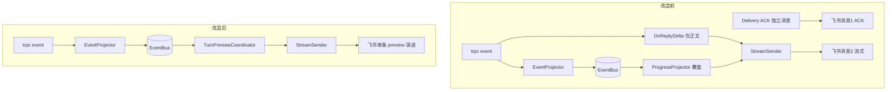
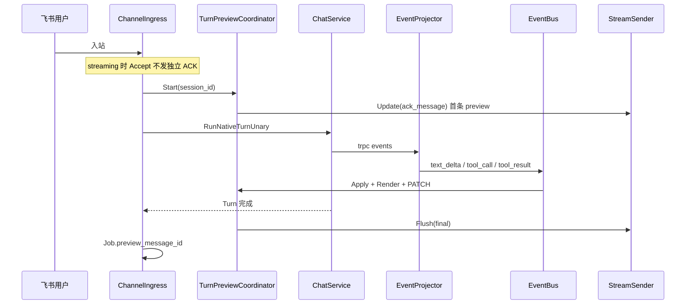

# Channel 渠道 — 实现设计文档

> 对应需求：[17 channel.md](./17%20channel.md)  
> **跨模块集成**：[17-channel-agent-team-integration.md](./17-channel-agent-team-integration.md) · [integration.design.md](./17-channel-agent-team-integration.design.md)  
> 遵循：[AI-DEVELOPMENT-SPECIFICATION.md](../guides/AI-DEVELOPMENT-SPECIFICATION.md)、[AGENT_RUNTIME_BOUNDARY.md](../guides/AGENT_RUNTIME_BOUNDARY.md)  
> 平台连接参考：[MuseBot](https://github.com/yincongcyincong/MuseBot) `robot/` + `http/`（MIT）

---

## 一、模块概述

Channel 在 **Kratos 传输层** 负责外部 IM 平台连接：凭据管理、入站标准化、路由到 Agent/Team、异步出站。

**设计原则**：

1. **只移植 MuseBot 的连接层**（SDK 初始化、收消息、发消息、验签）— 不移植 `Robot` 接口内的 LLM/`requestLLM`/`executeLLM`
2. **DB 多实例** — 每个 `channel` 行独立连接；非 MuseBot 全局 singleton
3. **双入站路径** — Webhook（✅）+ Runtime 长连接（✅ scaffold，见 `internal/channel/runtime/`）
4. **`internal/biz` 禁止 import trpc-agent-go** — Agent 调用仅在 `internal/service`

**当前实现状态**（2026-05-22，P1 优化后）：

| 能力 | 状态 |
|------|------|
| Proto CRUD + Catalog + Test + Credentials | ✅ |
| Webhook 入站：feishu / dingtalk / wecom / slack / telegram / wechat / onebot | ✅ |
| 统一入站：`ProcessInbound` + `processInboundHTTP` | ✅ |
| 异步 `channel_delivery` + Worker（3 次重试） | ✅ |
| 长连接 Runtime（larkws / ding stream / socketmode / polling / discord gateway） | ✅ scaffold |
| `Manager.Reload` 配置 fingerprint reconcile | ✅ |
| 流式回复（edit-in-place） | ✅ MVP（Telegram / Feishu / Slack） |
| 长任务：Webhook 同步阻塞 Turn | ✅ Phase E1（async execute） |
| 长任务：入队 IM 反馈 | ✅ Phase E1-4 |
| 长任务：ChannelTurnJob | ✅ Phase E3 + ListChannelTurnJobs API |
| wechat 出站（被动 ReplyXML + 主动 API） | ✅ |
| discord 出站 | ✅ |
| personal_qq / onebot 出站 | ✅ |
| qq 官方 botgo | ❌ |

---

## 二、架构与数据流

```
┌─────────────────────────────────────────────────────────────────┐
│ 入站 A：Webhook（已实现）                                          │
│   POST /webhooks/{channel_key}  →  ChannelIngress               │
└────────────────────────────┬────────────────────────────────────┘
                             │
┌────────────────────────────▼────────────────────────────────────┐
│ 入站 B：Runtime（已实现 scaffold）                                 │
│   ChannelRuntime.Start → Manager.Reload(reconcile)               │
│     ├ feishu:   larkws.Client          [MuseBot lark.go]         │
│     ├ dingtalk: StreamClient           [MuseBot ding.go]        │
│     ├ slack:    socketmode.Client      [MuseBot slack.go]       │
│     ├ telegram: GetUpdatesChan         [MuseBot telegram.go]    │
│     └ discord:  discordgo.Session      [MuseBot discord.go]     │
└────────────────────────────┬────────────────────────────────────┘
                             │  NormalizedInbound { channelID, peerID, text, meta }
                             ▼
┌─────────────────────────────────────────────────────────────────┐
│  internal/service/channel_consumer.go（规划，逻辑同 ingress）      │
│   ParseChannelRouting → ResolveChannelTarget                     │
│   channel_peer_session → Session                                 │
│   ChatService.RunNativeTurnUnary                                 │
│   enqueueOutboundReply                                           │
└────────────────────────────┬────────────────────────────────────┘
                             ▼
┌─────────────────────────────────────────────────────────────────┐
│  channel_delivery → ChannelDeliveryWorker → platform SendText    │
│  Phase 2: StreamSender（MsgChunk → edit message）                │
└─────────────────────────────────────────────────────────────────┘
```

---

## 三、Adapter 接口（`internal/channel/`）

MuseBot 的 `Robot` 接口混合了 LLM 与传输；Aranea **拆分为纯传输 port**：

```go
// internal/channel/port.go（规划）

type InboundEvent struct {
    ChannelID      string
    ChannelKey     string
    PlatformType   string
    PeerID         string
    PeerKey        string
    Text           string
    IdempotencyKey string
    Meta           map[string]string // thread_id, reply_target, session_webhook, ...
}

// Connector：长连接平台实现
type Connector interface {
    Identified
    Start(ctx context.Context, cfg RuntimeConfig) error
    Stop(ctx context.Context) error
}

// WebhookAdapter：HTTP 回调平台实现（当前）
type WebhookAdapter interface {
    Verify(ctx context.Context, r *http.Request, creds []biz.ChannelCredential) ([]byte, error)
    ParseInbound(raw []byte, ch biz.Channel) (InboundEvent, error)
}

// OutboundAdapter：出站
type OutboundAdapter interface {
    Identified
    SendText(ctx context.Context, ch biz.Channel, creds []biz.ChannelCredential, ev OutboundPayload) error
}

// StreamOutbound：可选，MuseBot StreamRobot.sendTextStream
type StreamOutbound interface {
    OutboundAdapter
    SendStream(ctx context.Context, ch biz.Channel, target string, chunks <-chan string) error
}
```

现有 `internal/channel/surface.go`（`Identified` / `Runner` / `OutboundText`）逐步收敛到上述 port。

---

## 四、Proto / Biz / Data

### 4.1 Proto

`api/kratos/channel/v1/channel.proto` — CRUD、Catalog、Test、Credentials、Deliveries。  
Webhook 路由在 `internal/server/http.go`，不进 Proto。

### 4.2 Biz

| 文件 | 职责 |
|------|------|
| `channel.go` | CRUD、Test commit |
| `channel_catalog.go` | MuseBot 对齐的 10 平台目录 |
| `channel_routing.go` | Agent/Team/dm_scope/rules |
| `channel_access.go` | `allowed_user_ids` / `allowed_group_ids` / `require_mention` 策略解析与判定 |
| `channel_rules.go` | 凭据校验、requiredCredentials |

### 4.3 Data

| 表 | 说明 |
|----|------|
| `channel` | 实例主表 |
| `channel_credential` | `secret_ref`（enc:/env:） |
| `channel_delivery` | 出站队列 |
| `channel_peer_session` | peer → session |

---

## 五、Service 层

### 5.1 ChannelIngress（Webhook）

`internal/service/channel_ingress*.go` — 平台 switch → `internal/channel/{lark,dingtalk,wecom,slack,telegram}/webhook.go`

**入站访问控制**（`channel_ingress_access.go`，在 Agent Turn 之前）：

```
InboundEvent + channel.config_json
  → biz.ParseChannelAccessPolicy
  → inboundAccessContextFromEvent(ev)   // PeerID, chat_id, chat_type, mentioned
  → policy.Allows(ctx)
       ├ false → recordDelivery(access_denied) + enqueueOutboundReply(拒绝文案)
       └ true  → ResolveChannelTarget → ChatService
```

| 入站 meta 字段 | 用途 |
|----------------|------|
| `sender_open_id` / `sender_user_id` / `PeerID` | 匹配 `allowed_user_ids` |
| `chat_id` + `chat_type=group` | 匹配 `allowed_group_ids` |
| `mentioned` / `mentions` | 匹配 `require_mention` |

飞书 WS：`internal/channel/lark/parse_message.go` 写入 `sender_open_id`、`chat_type`、`mentioned`。Webhook 路径由 `channel_ingress.go` 补全 `chat_type`（`InferChatTypeFromChatID`）。

### 5.2 ChannelRuntimeManager（规划）

```go
// internal/service/channel_runtime.go
type ChannelRuntimeManager struct {
    channels *biz.ChannelUsecase
    ingress  *ChannelIngress  // 复用 runChatTurn / enqueueOutboundReply
    runners  map[string]context.CancelFunc
}

func (m *ChannelRuntimeManager) Reload(ctx context.Context) error
func (m *ChannelRuntimeManager) startInstance(ctx context.Context, ch biz.Channel) error
```

启动逻辑参考 MuseBot `StartRobot()`：按 `config_json.type` + `receive_mode` 选择 Connector，**每个 DB 实例一个 goroutine**。

Wire：admin 进程启动时 `Reload()`；Toggle/Update 后触发单实例重启。

### 5.3 出站

`channel_delivery_worker.go` — 按 type 分发；钉钉 Webhook 模式用 `session_webhook`（MuseBot 同）；Stream 模式用 OpenAPI（MuseBot `ding.go`）。

---

## 六、MuseBot 平台实现对照

| type | Aranea 包 | 当前 | MuseBot 文件 | MuseBot 连接 | 目标 SDK |
|------|-----------|------|--------------|-------------|----------|
| `feishu` | `lark/` | webhook ✅ | `lark.go` | larkws | `larksuite/oapi-sdk-go/v3` |
| `dingtalk` | `dingtalk/` | webhook ✅ | `ding.go` | StreamClient | `open-dingtalk/dingtalk-stream-sdk-go` |
| `wecom` | `wecom/` | webhook ✅ | `comwechat.go` | HTTP `/com/wechat` | PowerWeChat work |
| `wecom-app` | `wecom/` | webhook ✅ | 同上 | 同上 | 同上 |
| `wechat` | — | ❌ | `wechat.go` | HTTP `/wechat` | PowerWeChat officialAccount |
| `slack` | `slack/` | Events webhook ✅ | `slack.go` | Socket Mode | `slack-go/slack` + socketmode |
| `telegram` | `telegram/` | webhook ✅ | `telegram.go` | Long polling | `go-telegram-bot-api/v5` |
| `discord` | — | ❌ | `discord.go` | discordgo Open | `bwmarrin/discordgo` |
| `qq` | — | ❌ | `qq.go` | webhook + botgo WS | `tencent-connect/botgo` |
| `personal_qq` | — | ❌ | `personalqq.go` | OneBot POST `/onebot` | 自定义 + OneBot HTTP |

### 6.1 MuseBot HTTP 路由 → Aranea 映射

| MuseBot 路径 | 平台 | Aranea 建议 |
|--------------|------|-------------|
| `/wechat` | 微信公众号 | `/webhooks/{channel_key}` 或 `/channels/wechat/{key}` |
| `/com/wechat` | 企微 | 同上（已实现 wecom handler） |
| `/qq` | QQ 官方 | 专用路由 + botgo 事件 |
| `/onebot` | OneBot | `/webhooks/{channel_key}` + HMAC 验签 |

统一原则：**优先** `/webhooks/{channel_key}`；企微/微信 AES 回调可保留类型前缀便于调试。

### 6.2 从 MuseBot 迁移连接代码 Checklist

1. 阅读 MuseBot `robot/<platform>.go` 中 **Start* / handler / send* 函数**（跳过 `requestLLM`、`ExecCmd`）
2. 提取 SDK 初始化与消息 parse/send 到 `internal/channel/<platform>/`
3. 入站转为 `InboundEvent`，调用 `ChannelIngress.runChatTurn`（或 consumer 等价物）
4. 出站从 `OutboundPayload` 调 MuseBot 同款 API
5. 凭据字段映射到 `channel_credential`（见需求 §5）
6. 添加 `webhook_test.go` 或 integration test
7. catalog `bundled=true`，前端 schema 补字段

**许可证**：MuseBot MIT — 迁移时保留版权声明。

### 6.3 不应从 MuseBot 复制

- `Robot` / `RobotInfo` 整体接口与 LLM 耦合
- 全局变量（`TelegramBot`、`LarkBotClient` 等）— 改为实例级 DI
- `SendMsg()` 巨型 switch — 改为 registry `map[type]OutboundAdapter`
- `go RobotInfo.Exec()` 无界并发 — 使用 bounded worker pool
- MuseBot 内置 HTTP `:36060` 混布 — Webhook 挂 Kratos `internal/server`

---

## 七、流式回复（Phase 2）

MuseBot 模式：

```go
type MsgChan struct {
    NormalMessageChan chan *MsgInfo  // { Content, PartContent, Finished }
    StrMessageChan    chan string    // QQ 专用
}
```

Aranea 映射：

- Agent 流式事件（已有 Envelope/SSE）→ `StreamOutbound.SendStream`
- 平台实现：Telegram `EditMessageText`、飞书卡片更新、Slack `UpdateMessage`
- 配置：`config_json.config.streaming_enabled`

---

## 八、Web 前端

```
web/src/features/channels/
web/src/components/channels/
```

- `receive_mode` 下拉：选项来自 catalog `receive_modes`
- 非 bundled 平台：Catalog 展示「即将支持」
- 微信 `active_mode`、钉钉 Stream 凭据分区：Phase 2 schema 驱动

---

## 九、Wire 与运维

| 组件 | 说明 |
|------|------|
| `ChannelService` | gRPC/HTTP API |
| `ChannelIngress` | Webhook |
| `ChannelRuntimeManager` | 长连接（规划） |
| `ChannelDeliveryWorker` | cron 5s |

| 环境变量 | 作用 |
|----------|------|
| `CHANNEL_DELIVERY_DISABLED=1` | 关闭出站 worker |
| `CHANNEL_HEALTH_DISABLED=1` | 关闭健康扫描 |
| `CHANNEL_RUNTIME_DISABLED=1` | 关闭长连接 Runtime（规划） |
| `ARANEA_CREDENTIAL_KEY` | 凭据加密 |

---

## 十、测试策略

| 层级 | 内容 |
|------|------|
| `internal/channel/*/webhook_test.go` | 验签、parse |
| `internal/channel/*/connector_test.go` | mock SDK 入出站（规划） |
| `internal/biz/channel_*_test.go` | routing、config |
| E2E | 各平台 sandbox 账号 |

---

## 十一、新增平台优先级（MuseBot 顺序建议）

1. **P0 巩固**：现有 6 平台 Webhook 单测 + Runtime 骨架  
2. **P1 连接升级**：飞书 larkws、钉钉 Stream、Slack Socket Mode、Telegram polling  
3. **P1 国内补全**：微信公众号（PowerWeChat）  
4. **P2 海外/QQ**：Discord、QQ 官方、OneBot  

---

## 十二、长任务异步执行设计

> **需求**：[17 channel.md §8](./17%20channel.md#8-长任务场景飞书-channel)  
> **开发计划**：[17-channel-development.md §10](./17-channel-development.md#10-长任务异步执行phase-e)  
> **跨模块 Turn**：[17-channel-agent-team-integration.design.md §4.4](./17-channel-agent-team-integration.design.md#44-长任务路径)

### 12.1 设计目标

| 目标 | 手段 |
|------|------|
| 飞书回调 SLA 与 Turn 解耦 | Ingress **Accept** 与 **Execute** 分两阶段 |
| 单一职责 | Ingress 受理；Worker 执行 Turn；Projector 进度；Delivery 出站 |
| 复用运行时 | `ChatService.RunNativeTurn*`；不新建 Channel 专用 LLM 路径 |
| biz 不触框架 | Job 状态、配置解析在 `internal/biz`；Runner 仅在 `internal/service` |

### 12.2 现状瓶颈（代码锚点）

| 瓶颈 | 位置 | 影响 |
|------|------|------|
| Webhook 同步阻塞 | `channel_ingress_http.go` → `ProcessInboundWebhook` | HTTP 等待 Turn 完成（最长 5min） |
| 入队无 IM 反馈 | `runNativeAgentTurn` 入队返回空 assistant → `enqueueOutboundReply` 跳过空 reply | 用户静默 |
| 全局 Turn 超时 | `trpc_turn.go` `defaultTurnTimeout = 5min` | Team/重工具易超时 |
| 首字节 30s | `trpc_turn.go` `firstByteTimeout` | 工具阶段无 text delta 即失败 |
| 流式仅 text delta | `processInboundStreaming` | 工具/Team 长静默无 PATCH |

WS 入站已异步（`lark/ws.go` `safego.Go` + `HandleWSInbound` `WithoutCancel`），Webhook 需对齐。

### 12.3 目标架构

```
InboundEvent
  → ChannelIngress.acceptInbound()     // 验签、幂等、访问控制、写 Job=accepted、发 ACK
  → HTTP 200 / WS handler return

ChannelTurnWorker / safego
  → ChannelIngress.executeInboundTurn()
       → prepareChannelChatRequest
       → RunNativeTurnStreaming | Unary（ctx 带 Channel 级 timeout）
       → ChannelProgressProjector（可选，订阅 EventBus）
       → StreamSender | enqueueOutboundReply
       → Job=completed|failed|timeout
```

**与 Web Chat 边界**：Turn、Session 锁、pending queue 仍在 `ChatService`；Channel 层只增加 **IM 投影**（ACK / 进度 / 最终文本）与 **Job 审计**。

### 12.4 包职责（SRP）

| 包 / 文件 | 职责 | 禁止 |
|-----------|------|------|
| `internal/biz/channel_turn_job.go` | Job 实体、Repo 接口、状态机、`ParseChannelLongTaskConfig` | import trpc-agent-go |
| `internal/biz/channel_config_helpers.go` | `streaming_enabled` 等已有 helper；扩展 timeout/ack/progress 解析 | Turn 执行 |
| `internal/data/channel_turn_job.go` | Ent schema + Repo 实现 | 业务规则 |
| `internal/service/channel_ingress_accept.go` | `acceptInbound`：幂等、ACK 出站、创建 Job | LLM |
| `internal/service/channel_ingress_execute.go` | `executeInboundTurn`：调 `RunNativeTurn*`、更新 Job | 平台 SDK |
| `internal/service/channel_ingress_http.go` | Webhook：Accept → 200 → async Execute | Turn 逻辑 |
| `internal/service/channel_turn_worker.go` | 扫 Job / 或仅 async goroutine 调度 | 验签 |
| `internal/service/channel_progress_projector.go` | 订阅 EventBus → StreamSender 进度 PATCH | 路由 / Session 创建 |
| `internal/service/trpc_turn.go` | 从 ctx 读取 Channel 注入的 timeout（可选值） | 飞书 API |
| `internal/channel/lark/stream_outbound.go` | 平台 PATCH（已有） | Agent Turn |

### 12.5 数据模型：`channel_turn_job`

| 列 | 类型 | 说明 |
|----|------|------|
| `id` | UUID PK | |
| `channel_id` | FK | |
| `session_id` | string | 绑定 Session |
| `peer_id` / `peer_key` | string | IM 对端 |
| `idempotency_key` | string UNIQUE(channel_id, key) | 与 receipt 对齐 |
| `status` | enum | accepted / running / completed / failed / timeout / cancelled |
| `preview_message_id` | string nullable | 飞书流式消息 ID |
| `error_message` | text nullable | |
| `started_at` / `finished_at` | timestamp | |

SQL 增量：`docs/sql/04_channel.sql`（或新编号文件）；Ent schema 与 migration 随 Phase E1。

**与现有表**：`channel_inbound_receipt` 保幂等；`channel_delivery` 保 unary 出站重试；Job 表保 **Turn 生命周期** 审计。

### 12.6 配置解析（biz）

扩展 `ChannelLongTaskConfig`（自 `config_json.config`）：

```go
type ChannelLongTaskConfig struct {
    AckMessage          string
    AckOnQueued         string
    TurnTimeoutSec      int  // 0 = 用 service 默认
    FirstByteTimeoutSec int
    ProgressMode        string // off | text | steps
    ProgressQuietSec    int
    HeartbeatMessage    string
    ExecutionMode       string // sync | async | auto (P2)
}
```

解析函数放 `internal/biz/channel_config_helpers.go`；Ingress 读取后注入 `context` 或 `SendChatMessageRequest` metadata（**不**写入 proto 对外字段，除非后续 Admin API 需要列表 Job）。

### 12.7 Accept 路径（P0）

**Webhook**（`channel_ingress_http.go`）：

1. `shouldProcessInbound` / `checkInboundAccess`（不变）  
2. `sendAckIfConfigured` → `StreamSender` 首条或 `enqueueOutboundReply`  
3. `w.WriteHeader(200)`  
4. `safego.Go` → `executeInboundTurn(context.WithoutCancel(...))`

**WebSocket**（`lark/ws_inbound.go`）：在现有 `HandleWSInbound` 内先 ACK 再 `ProcessInbound`；最终统一调用 `executeInboundTurn`。

**幂等**：Accept 阶段已 `TryClaimInbound`；Execute 阶段 Job `idempotency_key` 唯一；重复 Execute  no-op。

### 12.8 Execute 路径与 ChatService 集成

**Turn 结果分类**（`executeInboundTurn` 需识别）：

| `RunNativeTurn` 结果 | Channel 行为 |
|---------------------|--------------|
| 正常 assistant 文本 | 流式 flush 或 unary enqueue |
| `EnqueueUserMessage` queued | 出站 `ack_on_queued`；Job=`completed`（受理完成，非 Turn 完成） |
| `EnqueueUserMessage` 拒绝 | 出站拒绝文案；Job=`failed` |
| Turn 错误 / 超时 | `notifyFeishuInboundError` + Job 终态 |

**Channel 级 timeout**：在 `executeInboundTurn` 用 `context.WithTimeout` 包裹；**若 parent 已有更短 deadline 则尊重 parent**（与 `trpc_turn.go` 现有逻辑一致）。

**入队检测**：扩展 `runChatTurn` / `runChatTurnStreaming` 返回 `TurnOutcome`（`biz` 或 `service` 小 struct），避免通过「空 reply」猜测。

### 12.9 IM Preview 投影（TurnPreviewCoordinator，2026-05-23）

> **替代** 原 `ChannelProgressProjector` 与 `OnReplyDelta` 双轨 PATCH；进度语义并入 transcript。

#### 12.9.1 现状 vs 目标



#### 12.9.2 分层职责（SRP）

| 包 | 类型 | 职责 |
|----|------|------|
| `internal/biz` | `ChannelIMRenderPolicy` | 配置解析、legacy `progress_mode` 映射 |
| `internal/channel/preview` | `Transcript` / `RenderPlainText` | Envelope → 有序 segment → 纯文本 |
| `internal/service` | `TurnPreviewCoordinator` | 订阅 EventBus、节流 PATCH、心跳、写 `preview_message_id` |
| `internal/channel/lark` 等 | `StreamSender` | 平台 HTTP send/patch（无业务语义） |

**禁止**：在 `internal/agent` 或 `trpc_turn` 内嵌 IM 格式逻辑；Channel 仅订阅已投影的 Envelope。

#### 12.9.3 端到端序列



#### 12.9.4 Envelope → Transcript 映射

| Envelope | Segment |
|----------|---------|
| `text_delta` / `text_done` | `text` / `reasoning`（可配置展示） |
| `tool_call` / `tool_result` | `tool`（DisplayLabel / ActivityKind / Summary） |
| `member_*` | `member`（`im_team_mode`） |

#### 12.9.5 配置项（`config_json.config`）

| 字段 | 默认 | 说明 |
|------|------|------|
| `im_render_mode` | `reply_only` | `reply_only` \| `transcript` \| `transcript_with_reasoning` |
| `im_show_reasoning` | `false` | 思考链展示 |
| `im_tool_detail` | `label_summary` | `off` \| `label` \| `label_summary` |
| `im_team_mode` | `off` | `off` \| `inline` \| `steps` |
| `im_max_preview_chars` | `4000` | 渲染截断（尾部优先） |
| `im_tool_card_mode` | `off` | `off` \| `feishu_append`（工具**终态**时追加 Interactive Card） |
| `im_split_overflow` | `false` | Turn 结束超出平台上限时首条 PATCH + 分页 enqueue |
| `progress_mode` | — | **deprecated**；映射到 `im_render_mode` / `im_team_mode` |

`metadata.web_app_origin`：Web 管理端 origin，供 IM Card「Web 详情」深链；未配置时回退 `public_webhook_origin`（`biz.ResolveChannelWebOrigin`）。

`streaming_enabled=true` 且平台支持流式时，`ack_message` 由 Coordinator 写入首条 preview（`ChannelACKDeferredToPreview`）。

**飞书 Tool Card（`im_tool_card_mode=feishu_append`）— 单行模板**

| 元素 | 规则 |
|------|------|
| 布局 | 单行 `column_set`：左侧 lark_md 信息带 · 右侧 **Web 详情** 按钮 |
| 类型辨识 | MCP=📡 · Skill=⚡ · Agent=🤖 · 知识库=📚 · 记忆=🧠 · 工具=🔧（加粗类型标签） |
| 状态 | 完成 `<font color='green'>✓</font>` · 进行中 `<font color='orange'>🔄</font>`（**仅 preview PATCH**）· 失败 `<font color='red'>✕</font>` |
| Header | 成功=green / 进行中=orange / 失败=red；标题 `{emoji} {类型} · {label}` |
| Web 详情 | `{web_app_origin}/sessions/{session_id}?focus=tool&tool_id={id}`（回退 webhook origin） |
| 生命周期 | `tool_call` POST 进行中 Card → 同 `message_id` PATCH 终态；每工具 1 条 IM 消息 |
| Preview 文本 | 同策略下工具行与 Card 语义一致的单行压缩 |
| 心跳 | 静默期 PATCH `RenderPlainText(transcript) + "\n\n" + heartbeat`（与 EventBus 消费同 select 循环） |
| Card 异步 | Card HTTP 在 `safego` + `cardSerial` 队列，不阻塞 EventBus |

**Card 可观测性**：发送失败写 FlowLog `channel.tool.card`；指标 `aranea_channel_tool_card_total{platform,status}`。

#### 12.9.6 测试锚点

| 文件 | 覆盖 |
|------|------|
| `biz/channel_im_render_test.go` | Policy 解析、ACK defer |
| `biz/channel_web_origin_test.go` | `web_app_origin` 优先 |
| `channel/preview/transcript_test.go` | 顺序：正文→工具→正文 |
| `channel/lark/interactive_card_test.go` | Card HTTP 契约 |
| `service/channel_turn_preview_test.go` | Coordinator + 心跳保留 transcript |
| `service/channel_turn_preview_scenario_test.go` | ACK defer、overflow、终态 Card |
| `service/channel_ingress_accept_test.go` | streaming 时 ACK defer |

---

### 12.10 进度投影器（已合并，deprecated）

原 `ChannelProgressProjector` 已并入 `TurnPreviewCoordinator`。`progress_mode=text|steps` 仅作 legacy 映射，新配置请使用 `im_render_mode` / `im_team_mode`。

### 12.11 超长任务 async 模式（P2）

`execution_mode=async|auto` 时 Accept 路径：

1. 解析路由 → Agent/Team/Graph 触发器（`auto` 可经意图或命令前缀 `/async`）  
2. 创建 `GraphExecution` 或 `CronTask`（复用 `internal/biz` + 既有 service）  
3. IM 立即回复 `task_id` + Web Session 链接  
4. 订阅 `graph.execution.completed` / Cron 完成事件 → `enqueueOutboundReply`  

**影响域**：Channel Ingress、`GraphService`/`CronService` 触发 API、EventBus 消费者；**不在** Channel 内实现 Graph 节点逻辑。

### 12.12 影响域矩阵

| 变更 | 影响模块 | 风险 |
|------|----------|------|
| Webhook 异步 | 飞书/钉钉等 webhook 入站 | 低；WS 已异步 |
| ACK 文案 | 全平台 outbound | 低；可配置关闭 |
| TurnOutcome | `ChatService` 返回契约 | 中；需保持 Web Chat RPC 兼容（Web 忽略 queued outbound） |
| Channel timeout ctx | `trpc_turn` | 中；仅 Channel 注入 ctx 时生效 |
| channel_turn_job 表 | data/migration | 中 |
| ProgressProjector | event 订阅顺序 | 中；需防 goroutine 泄漏，Turn 结束 unregister |
| async → Graph | Graph/Cron/Event | 高；P2 独立迭代 |

### 12.13 指标与 FlowLog

| 指标 | 标签 |
|------|------|
| `aranea_channel_turn_job_total` | channel_id, status |
| `aranea_channel_turn_duration_seconds` | platform, owner_type |
| `aranea_channel_ack_total` | platform, result |

FlowLog 步骤（注册表追加）：

| step | 说明 |
|------|------|
| `channel.inbound.accept` | 受理 + ACK |
| `channel.turn.start` / `channel.turn.done` | Job 执行 |
| `channel.preview.patch` | IM preview PATCH（debug 级；原 channel.progress.patch） |

### 12.14 测试策略

| 层级 | 内容 |
|------|------|
| `biz/channel_config_helpers_test.go` | 长任务配置解析默认值 |
| `service/channel_ingress_accept_test.go` | Webhook 200 先于 Turn 完成 |
| `service/channel_ingress_execute_test.go` | queued / timeout / ACK |
| `service/channel_turn_preview_test.go` | Coordinator 节流 + transcript PATCH |
| `service/channel_ingress_accept_test.go` | streaming ACK defer |
| 集成 | mock StreamSender + fake ChatService 延迟 Turn |

---

## 十三、文档修订记录

| 版本 | 日期 | 说明 |
|------|------|------|
| 1.0 | 2026-05-22 | §十二 长任务异步执行：Accept/Execute 分离、Job 模型、ProgressProjector、影响域 |
