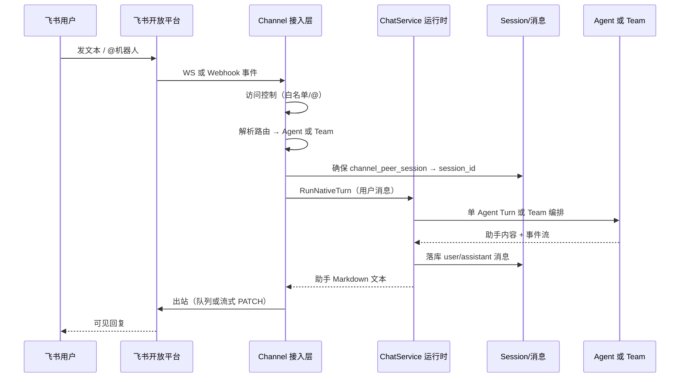

# Channel × Agent × Team × 会话消息 — 业务集成说明

> **版本**：2026-05-22  
> **读者**：产品、运维、全栈开发  
> **关联**：[17 channel.md](./17%20channel.md) · [11 multi-agent.md](./11%20multi-agent.md) · [10 session.md](./10%20session.md) · [51 消息机制.md](./51%20消息机制.md) · [0 系统框图.md](./0%20系统框图.md)  
> **技术设计**：[17-channel-agent-team-integration.design.md](./17-channel-agent-team-integration.design.md)

---

## 1. 一句话关系

| 模块 | 业务角色（对用户意味着什么） |
|------|------------------------------|
| **Agent** | 可配置的「单个智能体能力包」：模型、提示词、工具、记忆策略；是**执行单元**，不是 IM 入口。 |
| **Team** | 可配置的「多智能体协作编排」：顺序/并行/主控/评审/Swarm；对外表现为**一个对话对象**（与单 Agent 类似）。 |
| **Session（会话）** | 某用户（或某 IM 对端）与**一个 Agent 或一个 Team** 的连续对话容器；承载历史消息与上下文。 |
| **聊天消息** | Session 内的用户/助手轮次记录；Web Chat 实时展示，Channel 侧主要消费**最终助手文本**回发 IM。 |
| **Channel（飞书等）** | 外部 IM 的**接入与投递层**：收消息、鉴权、路由到 Agent/Team、调运行时、把回复发回飞书；**不包含**编排与 LLM 逻辑。 |

**业务主链**：飞书用户发消息 → Channel 识别对端 → 按路由选定 Agent 或 Team → 绑定/创建 Session → 写入用户消息并运行 Turn → 助手回复落库 → 回发飞书（或流式更新消息）。

---

## 2. 为什么分成四个概念

### 2.1 Agent：能力资产，不是渠道入口

- 用户在 **Agent 管理** 中创建的是「可被调用的专家」：客服、写作、代码审查等。
- Agent **不直接绑定**飞书群/用户；同一 Agent 可被 Web Chat、Cron、A2A、多个 Channel 实例复用。
- 业务上：先沉淀 Agent 能力与治理（模型、工具、记忆），再在**渠道配置**里决定「哪条路进来找谁」。

### 2.2 Team：复杂任务的「统一门面」

- 当一条用户问题需要**多角色分工**（收集→分析→汇总、并行评审、主控分派）时，用 Team 而不是把多个 Agent 串在 Channel 路由里。
- 对飞书用户而言：仍是一个机器人、一段连续对话；Team 内部成员切换**不强制**暴露在 IM 里（当前 Channel 出站以**汇总文本**为主）。
- 业务上：**简单问答 → 路由到单 Agent**；**流程型/多专家 → 路由到 Team**。

### 2.3 Session：连续性契约

- 同一飞书用户（或群+用户维度）在**同一 Channel 实例**下应有稳定会话，才能记住上下文。
- `dm_scope` 决定「一人一会话 / 全渠道一会话 / 按 peer 分会话」等产品语义（见设计文档 §3.2）。
- Session 创建时固定 `owner_type=agent|team` 与 `agent_id`/`team_id`；**已绑定会话不因路由配置变更而自动改绑**（避免历史上下文张冠李戴）。

### 2.4 聊天消息：审计与体验的两条通路

| 通路 | 谁消费 | 业务目的 |
|------|--------|----------|
| **持久化消息**（`chat_messages` 等） | Session 历史、管理端检索、合规审计 | 真相源：这一轮说了什么 |
| **实时 Envelope**（`/v1/ws`） | Web Chat、Team 运行条、Monitor | 流式体验与运维可观测 |

Channel 路径走 `RunNativeTurnUnary` / 流式出站：IM 用户看到回复；Web 端若订阅该 `session_id` 仍可看到与 Chat 一致的落库与部分事件，但**不依赖**用户开着 Web 才能回复飞书。

---

## 3. 飞书场景下的业务流转

### 3.1 配置阶段（管理员）

1. 在 **Agent 管理** 创建/维护目标 Agent（或 **Team 管理** 创建 Team 并挂成员）。
2. 在 **渠道管理** `/channels` 创建飞书实例：`app_id`、凭据、`receive_mode=websocket`（推荐）、访问控制（白名单、`require_mention`）。
3. 在 Channel **路由** 区选择：
   - **单 Agent**：`routing.default_agent_id`（支持 UUID 或 `agent_key`，如 `main`）；
   - **Team**：`routing.default_team_id`；
   - （规划）按群/用户 `rules[]` 分流不同 Agent/Team。
4. 可选：`dm_scope` 控制私聊/群聊是否会话隔离。

### 3.2 运行阶段（终端用户）

### 3.3 与 Web Chat 的对比

| 维度 | Web Chat | 飞书 Channel |
|------|----------|--------------|
| 入口 | 用户选 Agent/Team 建会话 | 管理员在 Channel 配路由 |
| 实时 UI | WS `text_delta`、工具卡片、Team 成员条 | 平台消息更新或一次性文本 |
| 取消/插队 | WS `cancel` / `enqueue_message` | 当前以单轮为主；并发 Turn 走 Session 锁与排队策略 |
| 可观测 | 用户可见全过程 | 运维查 Session、投递记录、`channel_delivery` |

---

## 4. 路由决策（业务规则）

优先级（与实现对齐，见 `biz.MatchRoute` + `ResolveChannelTarget`）：

1. **`routing.rules[]`**：按 `peer_pattern`（glob）匹配飞书 `peer_id`（如 `open_id`、群 `chat_id`），命中则使用该条的 `agent_id` 或 `team_id`。
2. **`default_team_id`**：若规则未命中且配置了默认 Team → 会话 `owner_type=team`。
3. **`default_agent_id`**：否则默认 Agent（必填其一，否则入站报错）。
4. **Team 优先于 Agent**：同一条 rule 若同时填了 team 与 agent，以 **team_id** 为准。

**产品建议**：

| 场景 | 推荐路由目标 |
|------|----------------|
| 单聊客服、FAQ | 单 Agent |
| 研报流水线、代码多维度审查 | Team（sequential / parallel） |
| 飞书多群不同业务线 | `rules` 按 `chat_id` 分流（待 UI 完善） |
| 仅允许高管私聊 | `allowed_user_ids` + 默认 Agent |

---

## 5. 用户故事与验收（跨模块）

| ID | 故事 | 验收要点 |
|----|------|----------|
| CAT-01 | 飞书私聊绑定客服 Agent | 首条消息后 Session 标题含 channel key；连续多轮上下文连贯 |
| CAT-02 | 飞书群 @ 机器人走 Team | `owner_type=team`；`team_runs` 有记录；飞书收到汇总回复 |
| CAT-03 | 改 Channel 默认 Agent | **新 peer** 走新 Agent；**老 peer** 仍用原 Session（行为须文档化） |
| CAT-04 | 非白名单用户 | 飞书收到拒绝文案；无 Session Turn；`access_denied` 投递 |
| CAT-05 | 流式开启 | 飞书侧消息随生成 PATCH；失败则 fail-fast 并记指标 |
| CAT-06 | 运维排障 | 能在 Session 列表按标题/filter 找到 `feishu:channel_key:peer` 会话并查看消息 |

---

## 6. 当前差距与产品路线图（摘要）

完整技术项见 [integration.design.md](./17-channel-agent-team-integration.design.md) §5。

| 优先级 | 差距 | 业务影响 |
|--------|------|----------|
| P1 | `rules` 前端未完整 | 多群分流可在高级 JSON 配置；`dm_scope` 已在路由区 ✅ |
| P1 | 路由变更与旧 Session | 保存 Channel 时清除 peer 绑定 ✅；旧 Session 行仍保留作审计 |
| P1 | 飞书有回复、Web Chat 空白 | 全局 WS 同步 + 打开渠道 Session 流式 Markdown ✅ |
| P2 | Channel Team 无 IM 侧成员过程展示 | 飞书只见汇总；Web Team Session 可见成员事件 |
| P2 | Channel 与 Monitor 联动弱 | 飞书问题需靠 Session/投递表反查 |
| P2 | Agent Channel 引用反查 | Agent 设置页「渠道引用」✅ |

---

## 7. 文档修订记录

| 版本 | 日期 | 说明 |
|------|------|------|
| 1.0 | 2026-05-22 | 首版：Channel / Agent / Team / Session / 消息五模块业务关系与飞书主链 |
| 1.1 | 2026-05-22 | §6 差距表对齐实现：Chat 同步、dm_scope、peer 重置、Agent 渠道引用 |
