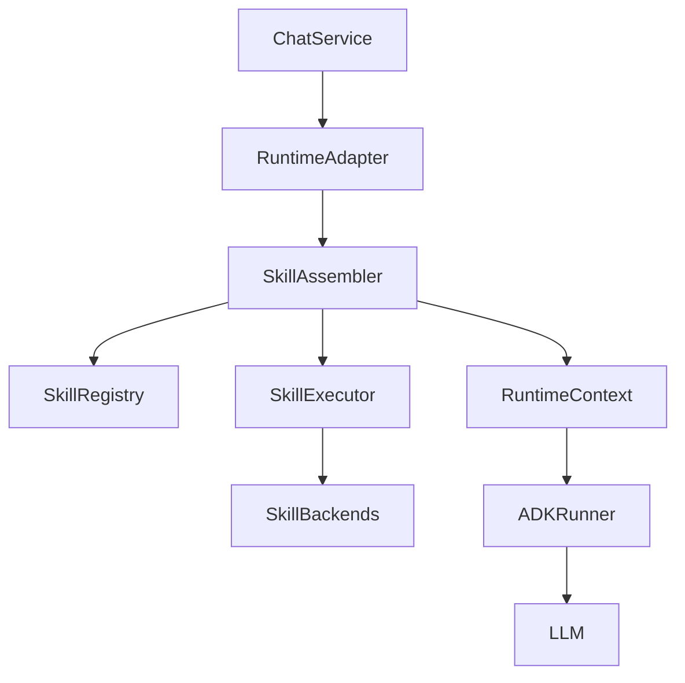
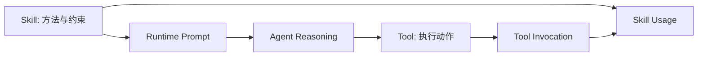

# Skill 模块重构设计（对齐 Tools 分层模式）

Skill 模块需要围绕 Go 接口抽象、SQLite/文件系统持久化、HTTP 管理 API、CLI 安装流程，以及 go-adk Agent 运行时上下文来落地。它与 Tool 模块相似，都需要“目录管理 + 运行时装配 + 中间件治理 + 可观测性”，但二者职责不同：

- **Tool** 是模型可调用的执行函数，核心是参数、执行、副作用和返回值。
- **Skill** 是可安装、可版本化、可检索、可注入上下文的能力包，核心是说明书、示例、约束、资产文件、适用条件和运行时选择。

> **范围说明（Aranea）**：Skill 清单、版本、文件、导入任务、调用记录继续由后端 SQLite + 文件系统 + HTTP API 管理；本文不把 Skill 等同为 Tool，也不要求每个 Skill 都暴露成 go-adk FunctionTool。Skill 运行时主要负责 **发现、筛选、加载、注入上下文、追踪使用**；若某 Skill 需要执行动作，应通过 Tool 层或后续 SkillAction 适配显式接入。

---

## 一、完整能力清单

1. Skill 注册与发现（本地目录、ZIP 导入、远程仓库安装、内置种子）
2. Skill 元数据与版本管理（slug、tag、status、enabled、current version）
3. Skill 文件管理（README / SKILL.md / examples / assets / references）
4. Skill Manifest 解析与校验（frontmatter 或 manifest JSON）
5. Skill 检索与匹配（关键词、tag、embedding、Agent 偏好、上下文意图）
6. Skill 激活与上下文注入（将选中 Skill 的说明注入系统提示或 Runtime Context）
7. Skill 使用追踪（显式 `use_skill`、隐式激活、工具调用关联）
8. Skill 版本发布与回滚（draft / published / archived）
9. Skill 导入冲突处理（相似度检查、候选合并、AI refine）
10. Skill 执行治理（预算、去重、权限、审计、Tracing）
11. Skill 调用记录与统计（invocations、成功率、耗时、Agent 关联）
12. Mock 与测试支持（可控 registry、fixture skill、导入流程测试）

---

## 二、整体分层架构（Go 实现版）

```text
┌─────────────────────────────────────────────────┐
│ go-adk Agent / Runner                            │
│ ● 通过 Runtime Context / System Prompt 使用 Skill │
│ ● 可选通过 use_skill 工具显式记录 Skill 使用       │
├─────────────────────────────────────────────────┤
│ Skill Runtime Assembler                          │
│ ● 读取 Agent、Session、输入意图与 Skill 策略       │
│ ● 选择本回合应激活的 Skill                        │
│ ● 输出 Skill hints / prompt blocks / usage hooks  │
├──────────────────┬──────────────────────────────┤
│ Middleware        │ Executor / Loader             │
│ - Validation      │ - Manifest parse              │
│ - Policy          │ - File load                   │
│ - Budget          │ - Version resolve             │
│ - Cache           │ - Context render              │
│ - Logging/Trace   │ - Usage record                │
├──────────────────┴──────────────────────────────┤
│ Runtime Backends                                 │
│ - Markdown Skill                                 │
│ - Prompt Pack                                    │
│ - Workflow/Recipe                                │
│ - Tool-backed Skill（通过 Tool 层执行动作）        │
├─────────────────────────────────────────────────┤
│ Persistence / Infra                              │
│ - SQLite: skill / skill_version / invocation      │
│ - File storage: installed skill directories       │
│ - OpenTelemetry / optional vector index           │
└─────────────────────────────────────────────────┘
```

**关键适配点**：Skill 不直接替代 Tool。Skill 运行时应在 Agent 构建前完成“本轮可用 Skill 面”的选择，并把结果写入 `RuntimeContext` 或系统提示；Tool 层仍负责真正的可调用函数。现有 `skill_usage_tracker` plugin 可迁移为 Skill runtime 的 usage middleware 或 event sink。

---

## 三、Go 目录结构设计

```text
skills/
├── schema/                 # Skill 输入输出与 manifest struct
│   ├── manifest.go
│   ├── import.go
│   └── usage.go
├── skilldef/               # Skill 抽象接口
│   └── skill.go
├── registry/               # Skill 注册、发现、索引
│   ├── registry.go
│   ├── filesystem.go
│   └── sqlite_source.go
├── middleware/             # Skill 激活/加载链路中间件
│   ├── middleware.go
│   ├── validation.go
│   ├── policy.go
│   ├── budget.go
│   ├── cache.go
│   └── tracing.go
├── executor/               # Skill 加载、激活、渲染执行器
│   └── executor.go
├── skillctx/               # SkillContext，避免与标准 context 冲突
│   └── skillctx.go
├── backends/               # 具体 Skill 类型实现
│   ├── markdown.go
│   ├── prompt_pack.go
│   ├── workflow.go
│   └── tool_backed.go
├── adkbridge/              # go-adk 集成适配层
│   ├── assembler.go
│   └── prompt.go
├── telemetry/              # Trace & Metrics
│   └── provider.go
├── config/
│   └── config.go
├── storage/               # 数据库操作（Repository 层）
│   ├── skill_repo.go      # Skills / Versions / Files 的持久化
│   ├── dependency_repo.go # Skill 依赖关系
│   └── usage_repo.go      # Skill 激活 & 使用记录
```

> **包名建议**：使用 `skillctx`，不要使用 `context` 作为包名。Skill 运行时可与 Tool 运行时并存，二者分别位于 `internal/skills` 与 `internal/tools`，通过 runtime assembler 在 Agent 构建阶段汇合。

---

## 四、核心抽象与接口定义

### 1. Skill 基类接口

```go
// skilldef/skill.go
package skilldef

import "arenea/backend/internal/skills/skillctx"

type Skill interface {
    ID() string
    Slug() string
    Name() string
    Description() string
    Tags() []string
    Version() string
    Status() string
    Enabled() bool

    Manifest() Manifest
    Load(ctx *skillctx.SkillContext) (LoadedSkill, error)
    Render(ctx *skillctx.SkillContext, loaded LoadedSkill) (RenderedSkill, error)
}

type LoadedSkill struct {
    Body        string
    Files       []SkillFile
    Examples    []SkillExample
    Constraints []string
    Metadata    map[string]any
}

type RenderedSkill struct {
    Slug       string
    Version    string
    Prompt     string
    Hints      []SkillHint
    TokenCost  int
    SourceRefs []string
}

type SkillHint struct {
    Slug        string
    Name        string
    Description string
    Tags        []string
}
```

### 2. Manifest 与强类型 Schema

```go
// schema/manifest.go
package schema

type Manifest struct {
    Name        string   `json:"name"`
    Slug        string   `json:"slug"`
    Description string   `json:"description"`
    Version     string   `json:"version"`
    Tags        []string `json:"tags"`
    Kind        string   `json:"kind"` // markdown | prompt_pack | workflow | tool_backed
    Entry       string   `json:"entry"`
    Examples    []string `json:"examples"`
    Requires    []string `json:"requires"`
    RiskLevel   string   `json:"risk_level"`
}
```

Manifest 来源优先级：

1. `skill.json` 或 `manifest.json`
2. `SKILL.md` frontmatter
3. `README.md` frontmatter
4. 导入 API 中显式传入的 metadata
5. 仓库推断默认值（slug、name、tags）

### 3. SkillContext

```go
// skillctx/skillctx.go
package skillctx

import "context"

type SkillContext struct {
    context.Context

    SessionID string
    AgentID   string
    AgentKey  string
    UserID    string
    Input     string
    TraceID   string

    TokenBudget int
    MaxSkills   int
    StateStore  StateStore
}

type StateStore interface {
    Get(key string) (any, error)
    Set(key string, value any) error
}
```

---

## 五、中间件系统设计

Skill 中间件处理的是“是否激活、如何加载、如何渲染、如何记录”，不是 Tool 的函数执行参数校验。

```go
// middleware/middleware.go
package middleware

import (
    "arenea/backend/internal/skills/skillctx"
    "arenea/backend/internal/skills/skilldef"
)

type Next func(ctx *skillctx.SkillContext, skill skilldef.Skill) (skilldef.RenderedSkill, error)

type Middleware interface {
    Run(ctx *skillctx.SkillContext, skill skilldef.Skill, next Next) (skilldef.RenderedSkill, error)
}

type MiddlewareFunc func(ctx *skillctx.SkillContext, skill skilldef.Skill, next Next) (skilldef.RenderedSkill, error)

func (m MiddlewareFunc) Run(ctx *skillctx.SkillContext, skill skilldef.Skill, next Next) (skilldef.RenderedSkill, error) {
    return m(ctx, skill, next)
}
```

建议首批中间件：

- `ValidationMiddleware`：校验 manifest、entry 文件、版本号、slug。
- `PolicyMiddleware`：检查 enabled/status、Agent allow/deny、tag 策略、风险级别。
- `BudgetMiddleware`：限制本轮激活 Skill 数量、总 token、重复 Skill 注入。
- `CacheMiddleware`：缓存 `LoadedSkill` 与渲染结果，按 skill version 失效。
- `TracingMiddleware`：为 Skill 匹配、加载、渲染创建 span。
- `UsageMiddleware`：记录 activated / rendered / explicitly_used 事件。

---

## 六、执行器与 Runtime Assembler

### 1. Executor

```go
// executor/executor.go
package executor

import (
    "arenea/backend/internal/skills/middleware"
    "arenea/backend/internal/skills/skillctx"
    "arenea/backend/internal/skills/skilldef"
)

type Executor struct {
    chain middleware.Middleware
}

func New(mws ...middleware.Middleware) *Executor {
    return &Executor{chain: middleware.BuildChain(mws...)}
}

func (e *Executor) Activate(ctx *skillctx.SkillContext, s skilldef.Skill) (skilldef.RenderedSkill, error) {
    return e.chain.Run(ctx, s, func(ctx *skillctx.SkillContext, s skilldef.Skill) (skilldef.RenderedSkill, error) {
        loaded, err := s.Load(ctx)
        if err != nil {
            return skilldef.RenderedSkill{}, err
        }
        return s.Render(ctx, loaded)
    })
}
```

### 2. Runtime Assembler

Runtime Assembler 负责在每次 Agent run 前做 Skill 选择：

1. 从 DB 读取 enabled + published Skill。
2. 结合 Agent 设置、输入文本、Session、Team、L0/L1/L2/L3/L4 上下文生成候选。
3. 用关键词、tag、embedding、历史偏好排序。
4. 调用 executor 激活前 N 个 Skill。
5. 将渲染结果合并到 Runtime Context 或 system prompt。
6. 注册 usage sink，后续显式 `use_skill` 或 tool 调用可关联到已激活 Skill。

```go
type Assembler interface {
    Assemble(ctx context.Context, req SkillAssembleRequest) (SkillAssembleResult, error)
}

type SkillAssembleRequest struct {
    AgentID      string
    SessionID    string
    UserInput    string
    TokenBudget  int
    MaxSkills    int
    Allow        []string
    Deny         []string
}

type SkillAssembleResult struct {
    Activated []skilldef.RenderedSkill
    Hints     []skilldef.SkillHint
    Prompt    string
    TokenCost int
}
```

---

## 七、与 go-adk 的集成

Skill 与 go-adk 集成应放在 `skills/adkbridge`，不要散落在 `ChatService` 或 `runtime/adk_runner_backend.go` 中。

```go
// adkbridge/assembler.go
func EnrichRuntimeContext(rc *runtime.RuntimeContext, result SkillAssembleResult) *runtime.RuntimeContext {
    clone := cloneRuntimeContext(rc)
    clone.Skills = toRuntimeSkillHints(result.Hints)
    return clone
}

// adkbridge/prompt.go
func RenderSkillPrompt(result SkillAssembleResult) string {
    // 将 Skill 名称、版本、使用条件、约束、示例片段渲染为稳定 prompt block。
    return result.Prompt
}
```

推荐数据流：



Runtime Context 建议新增：

```go
type RuntimeContext struct {
    Session SessionContext
    Team    *TeamContext
    SelfRole string
    Tools   []ToolHint
    Skills  []SkillHint
}
```

Skill prompt block 示例：

```text
## Available Skills
- `product-design` v1.2.0: Use when the user asks for product specs, UX flows, or PRD writing.
  Constraints: ask clarifying questions for ambiguous product goals; produce structured output.
- `react-components` v0.4.1: Use when converting UI designs into modular React components.
```

---

## 八、后端持久化与 API 对齐

现有实现已经包含：

- `skill`
- `skill_version`
- `skill_invocation`
- `SkillService`
- `sqlite_skills.go`
- `transport/skill.go`
- CLI `aranea skill`
- import / conflict refine / file read-write

重构后建议统一为以下服务边界：

```text
SkillService
├── Catalog: list/get/create/update/delete/duplicate/toggle
├── Version: publish/archive/rollback/list/get
├── Files: list/read/write/delete
├── Import: inspect/apply/refine
├── Runtime: assemble/activate/render
└── Observability: runs/stats/usage
```

### HTTP API 建议

```text
GET    /api/v1/skills
POST   /api/v1/skills
GET    /api/v1/skills/{id-or-slug}
PUT    /api/v1/skills/{id-or-slug}
DELETE /api/v1/skills/{id-or-slug}
PATCH  /api/v1/skills/{id-or-slug}/enabled
POST   /api/v1/skills/{id-or-slug}/duplicate

GET    /api/v1/skills/{id-or-slug}/versions
POST   /api/v1/skills/{id-or-slug}/versions
POST   /api/v1/skills/{id-or-slug}/versions/{version}/publish
POST   /api/v1/skills/{id-or-slug}/versions/{version}/rollback

GET    /api/v1/skills/{id-or-slug}/files
GET    /api/v1/skills/{id-or-slug}/file?path=...
PUT    /api/v1/skills/{id-or-slug}/file
DELETE /api/v1/skills/{id-or-slug}/file?path=...

POST   /api/v1/skills/import
GET    /api/v1/skills/import/{job_id}
POST   /api/v1/skills/import/{job_id}/apply
POST   /api/v1/skills/import/{job_id}/conflict-groups/{group_id}/refine

GET    /api/v1/skill-runs
GET    /api/v1/skills/{id-or-slug}/runs
POST   /api/v1/skills/runtime/preview
```

### 前端 API 层契约

前端不直接理解 SQLite 表结构，只通过 `features/skills/api.ts` 的强类型函数访问后端。建议将 API 层拆成五组：

```ts
// Catalog
listSkills(query): Promise<PaginatedResponse<Skill>>
getSkill(idOrSlug): Promise<SkillDetail>
createSkill(input): Promise<Skill>
updateSkill(idOrSlug, input): Promise<Skill>
deleteSkill(idOrSlug): Promise<void>
toggleSkillEnabled(idOrSlug, enabled): Promise<Skill>
duplicateSkill(idOrSlug): Promise<Skill>

// Versions
listSkillVersions(idOrSlug): Promise<SkillVersion[]>
createSkillVersion(idOrSlug, input): Promise<SkillVersion>
publishSkillVersion(idOrSlug, version): Promise<Skill>
rollbackSkillVersion(idOrSlug, version): Promise<Skill>

// Files
listSkillFiles(idOrSlug): Promise<SkillFile[]>
readSkillFile(idOrSlug, path): Promise<SkillFileContent>
updateSkillFile(idOrSlug, input): Promise<SkillFileContent>
deleteSkillFile(idOrSlug, path): Promise<void>

// Import
importSkillZip(file): Promise<SkillImportJobRef>
getSkillImportJob(jobID): Promise<SkillImportJob>
applySkillImport(jobID, input): Promise<SkillImportApplyResult>
refineSkillConflictGroup(jobID, groupID, input): Promise<SkillRefineResult>

// Runtime / Observability
previewSkillRuntime(input): Promise<SkillRuntimePreview>
listSkillRuns(query): Promise<PaginatedResponse<SkillInvocation>>
```

响应形态约定：

- 列表统一 `{ items, page, page_size, total }`，避免页面重复适配。
- 详情返回 `SkillDetail`，包含 `skill`、`current_version`、`manifest`、`files_summary`、`permissions`、`runtime_status`。
- 写接口返回更新后的资源快照，前端可直接合并表格行。
- JSON 字段（manifest/config/metadata）后端保存字符串或 JSON blob 均可，但 API 层应以结构化对象暴露给前端，避免每个页面重复 `JSON.parse`。
- 错误响应应区分 `validation_error`、`permission_denied`、`conflict_detected`、`dependency_missing`，前端据此展示字段错误、确认弹窗或冲突解决 UI。

### DB 迁移建议

保留现有表，补齐运行时字段：

- `skill.kind`：markdown / prompt_pack / workflow / tool_backed
- `skill.risk_level`
- `skill.entry_path`
- `skill.runtime_status`
- `skill.config_schema_json`
- `skill.default_config_json`
- `skill.current_version_id`
- `skill_version.manifest_json`
- `skill_version.file_manifest_json`
- `skill_invocation.activation_id`
- `skill_invocation.source`：runtime / use_skill / import / preview

若不想破坏旧库，应沿用现有 `ensureLegacyColumns()` 风格增列。

### SQLite 表结构细化

现有 `skill`、`skill_version`、`skill_invocation` 继续作为主表。新增表优先使用 `CREATE TABLE IF NOT EXISTS`，新增列使用 `ensureLegacyColumns()`，避免旧本地库迁移失败。

#### `skill`

```sql
CREATE TABLE IF NOT EXISTS skill (
  id TEXT PRIMARY KEY,
  skill_key TEXT UNIQUE NOT NULL,
  name TEXT NOT NULL,
  description TEXT NOT NULL DEFAULT '',
  kind TEXT NOT NULL DEFAULT 'markdown',
  status TEXT NOT NULL DEFAULT 'draft',
  enabled INTEGER NOT NULL DEFAULT 0,
  visibility TEXT NOT NULL DEFAULT 'workspace',
  owner_user_id TEXT NOT NULL DEFAULT '',
  owner_agent_id TEXT NOT NULL DEFAULT '',
  risk_level TEXT NOT NULL DEFAULT 'low',
  entry_path TEXT NOT NULL DEFAULT 'SKILL.md',
  runtime_status TEXT NOT NULL DEFAULT 'catalog_only',
  current_version_id TEXT NOT NULL DEFAULT '',
  config_schema_json TEXT NOT NULL DEFAULT '{}',
  config_json TEXT NOT NULL DEFAULT '{}',
  default_config_json TEXT NOT NULL DEFAULT '{}',
  metadata_json TEXT NOT NULL DEFAULT '{}',
  created_at TEXT NOT NULL,
  updated_at TEXT NOT NULL,
  deleted_at TEXT NOT NULL DEFAULT ''
);
```

关键约束：

- `skill_key` 是稳定 slug，不随展示名变化。
- `status` 只允许 `draft`、`published`、`archived`。
- `visibility` 只允许 `private`、`agent`、`workspace`、`public`、`system`。
- `deleted_at = ''` 表示未删除；所有查询默认过滤软删除。

#### `skill_version`

```sql
CREATE TABLE IF NOT EXISTS skill_version (
  id TEXT PRIMARY KEY,
  skill_id TEXT NOT NULL,
  version TEXT NOT NULL,
  status TEXT NOT NULL DEFAULT 'draft',
  content_markdown TEXT NOT NULL DEFAULT '',
  manifest_json TEXT NOT NULL DEFAULT '{}',
  file_manifest_json TEXT NOT NULL DEFAULT '[]',
  metadata_json TEXT NOT NULL DEFAULT '{}',
  created_at TEXT NOT NULL,
  updated_at TEXT NOT NULL,
  published_at TEXT NOT NULL DEFAULT '',
  UNIQUE(skill_id, version)
);
```

#### `skill_invocation`

```sql
CREATE TABLE IF NOT EXISTS skill_invocation (
  id TEXT PRIMARY KEY,
  activation_id TEXT NOT NULL DEFAULT '',
  skill_id TEXT NOT NULL,
  skill_version TEXT NOT NULL DEFAULT '',
  agent_id TEXT NOT NULL DEFAULT '',
  user_id TEXT NOT NULL DEFAULT '',
  session_id TEXT NOT NULL DEFAULT '',
  message_id TEXT NOT NULL DEFAULT '',
  source TEXT NOT NULL DEFAULT 'runtime',
  status TEXT NOT NULL DEFAULT 'success',
  duration_ms INTEGER NOT NULL DEFAULT 0,
  started_at TEXT NOT NULL DEFAULT '',
  ended_at TEXT NOT NULL DEFAULT '',
  input_preview TEXT NOT NULL DEFAULT '',
  input_hash TEXT NOT NULL DEFAULT '',
  output_preview TEXT NOT NULL DEFAULT '',
  error_code TEXT NOT NULL DEFAULT '',
  error_message TEXT NOT NULL DEFAULT '',
  metadata_json TEXT NOT NULL DEFAULT '{}',
  created_at TEXT NOT NULL
);
```

#### 新增关系表

```sql
CREATE TABLE IF NOT EXISTS skill_permissions (
  id TEXT PRIMARY KEY,
  skill_id TEXT NOT NULL,
  subject_type TEXT NOT NULL, -- user | agent | team | role | workspace
  subject_id TEXT NOT NULL,
  can_view INTEGER NOT NULL DEFAULT 0,
  can_use INTEGER NOT NULL DEFAULT 0,
  can_edit INTEGER NOT NULL DEFAULT 0,
  can_manage INTEGER NOT NULL DEFAULT 0,
  created_at TEXT NOT NULL,
  updated_at TEXT NOT NULL,
  deleted_at TEXT NOT NULL DEFAULT '',
  UNIQUE(skill_id, subject_type, subject_id)
);

CREATE TABLE IF NOT EXISTS skill_dependencies (
  id TEXT PRIMARY KEY,
  skill_id TEXT NOT NULL,
  dependency_slug TEXT NOT NULL,
  version_constraint TEXT NOT NULL DEFAULT '',
  optional INTEGER NOT NULL DEFAULT 0,
  reason TEXT NOT NULL DEFAULT '',
  created_at TEXT NOT NULL,
  updated_at TEXT NOT NULL,
  deleted_at TEXT NOT NULL DEFAULT '',
  UNIQUE(skill_id, dependency_slug)
);

CREATE TABLE IF NOT EXISTS skill_conflicts (
  id TEXT PRIMARY KEY,
  skill_id TEXT NOT NULL,
  conflicting_slug TEXT NOT NULL,
  conflict_type TEXT NOT NULL DEFAULT 'runtime', -- import | runtime | semantic | file | tool
  severity TEXT NOT NULL DEFAULT 'warn',         -- info | warn | block
  reason TEXT NOT NULL DEFAULT '',
  resolution_hint TEXT NOT NULL DEFAULT '',
  created_at TEXT NOT NULL,
  updated_at TEXT NOT NULL,
  deleted_at TEXT NOT NULL DEFAULT '',
  UNIQUE(skill_id, conflicting_slug, conflict_type)
);
```

建议索引：

```sql
CREATE INDEX IF NOT EXISTS idx_skill_status_enabled ON skill(status, enabled, deleted_at);
CREATE INDEX IF NOT EXISTS idx_skill_visibility ON skill(visibility, deleted_at);
CREATE INDEX IF NOT EXISTS idx_skill_version_skill ON skill_version(skill_id, status, created_at);
CREATE INDEX IF NOT EXISTS idx_skill_invocation_skill ON skill_invocation(skill_id, created_at);
CREATE INDEX IF NOT EXISTS idx_skill_invocation_session ON skill_invocation(session_id, created_at);
CREATE INDEX IF NOT EXISTS idx_skill_permissions_subject ON skill_permissions(subject_type, subject_id, deleted_at);
CREATE INDEX IF NOT EXISTS idx_skill_dependencies_slug ON skill_dependencies(dependency_slug, deleted_at);
CREATE INDEX IF NOT EXISTS idx_skill_conflicts_slug ON skill_conflicts(conflicting_slug, severity, deleted_at);
```

---

## 九、Skill 权限与可见性模型

Skill 权限需要同时解决两类问题：

- **可见性**：用户或 Agent 能否看到这个 Skill。
- **可用性**：运行时能否激活这个 Skill，或用户能否在管理台启用它。

### 可见性层级

```text
system      内置系统 Skill，仅管理员可管理，所有符合策略的 Agent 可使用
workspace   工作区可见，默认团队/组织内可浏览
agent       绑定到特定 Agent，仅该 Agent 与管理员可见
private     创建者私有，仅 owner 与管理员可见
public      可导出/分享/安装，仍受本地 enabled 与 policy 控制
```

### 权限动作

```text
can_view    可在前端列表/详情/API 中查看
can_use     可被 runtime assembler 激活，或可通过 use_skill 记录使用
can_edit    可编辑 metadata、manifest、文件、版本草稿
can_manage  可发布、回滚、删除、改 visibility、改权限
```

权限计算顺序：

1. 系统管理员或 `can_manage` 全局角色直接允许。
2. 软删除、`archived`、`enabled=false` 默认禁止 runtime use，但仍可被有管理权限的人查看。
3. `visibility` 决定初始候选范围。
4. `skill_permissions` 的显式 subject override 覆盖 visibility 默认值。
5. Agent runtime settings 的 allow/deny/tag policy 再过滤可用性。
6. Skill 依赖缺失或 block 级冲突会把 `can_use` 降为 false。
7. 风险级别 `high/critical` 可要求确认或仅允许特定 Agent profile 使用。

### Runtime Policy 输入

```go
type SkillRuntimeSettings struct {
    SkillsEnabled bool
    Profile       string
    Allow         []string // slug 或 tag:xxx
    Deny          []string // slug 或 tag:xxx
    MaxSkills     int
    TokenBudget   int
}
```

推荐 profile：

```text
none        不激活任何 Skill
safe        只激活 readonly / low risk / published Skill
coding      激活代码、文件、组件相关 Skill
research    激活检索、总结、资料分析相关 Skill
full        允许全部已启用 Skill，但仍受权限、依赖、冲突约束
```

### API 返回权限

前端 `Skill` / `SkillDetail` 应包含：

```ts
type SkillPermissions = {
  can_view: boolean;
  can_use: boolean;
  can_edit: boolean;
  can_manage: boolean;
  blocked_reason?: string;
};
```

列表页可隐藏不可见 Skill；详情页可展示 `blocked_reason`，例如 `disabled`、`permission_denied`、`dependency_missing`、`conflict_blocked`。

---

## 十、Skill 依赖与冲突管理

Skill 之间可能存在依赖、互斥、重复能力或文件冲突。该能力应同时用于导入安装、启用发布、运行时激活。

### 依赖类型

```text
required_skill     必须安装并启用另一个 Skill
optional_skill     可选增强，不满足时不阻断
tool_capability    依赖某个 Tool key 或 Tool group
runtime_feature    依赖平台能力，例如 memory、image、browser、filesystem
file_asset         依赖某个 Skill 文件或资源存在
```

Manifest 表达建议：

```yaml
requires:
  - type: skill
    slug: react-components
    version: ">=0.4.0"
    optional: false
  - type: tool
    key: read_file
    optional: false
  - type: feature
    key: memory_l3
    optional: true
conflicts:
  - slug: legacy-react-generator
    type: semantic
    severity: warn
    reason: overlaps component generation instructions
```

### 依赖解析流程

1. 解析 manifest 中的 `requires`。
2. 通过 `skill_dependencies` 查询已安装 Skill 与版本。
3. 检查版本约束，缺失 required 依赖时标记 `dependency_missing`。
4. 构建依赖图并检测循环依赖。
5. 对 optional 依赖只记录 warning，不阻断安装或运行。
6. 对 Tool/feature 依赖调用 Tool registry 或平台 feature registry 检查。
7. Runtime assembler 激活 Skill 时自动补齐 required Skill，或在超出 token budget 时优先保留根 Skill 并报告依赖裁剪原因。

### 冲突类型

```text
import      导入时 slug/version/storage_dir 冲突
semantic    描述、tag、embedding 高度相似，可能重复
runtime     两个 Skill 的使用策略互相矛盾
file        文件路径或资产覆盖冲突
tool        Tool 使用要求冲突，例如一个要求只读，一个要求写入
policy      权限或风险策略冲突
```

### 冲突处理规则

- `severity=info`：只展示提示。
- `severity=warn`：允许安装/启用，但前端显示 warning，并在 runtime preview 中解释。
- `severity=block`：阻止发布、启用或 runtime 激活，除非管理员明确解决。

导入阶段：

1. 先按 `slug` 和 `version` 查重。
2. 再用 tag/description/body similarity 查语义重复。
3. 再检查 manifest `conflicts` 与现有 `skill_conflicts`。
4. 输出 conflict groups，供前端展示合并、覆盖、跳过、重命名、AI refine。

启用/发布阶段：

1. 检查 required 依赖是否存在并可用。
2. 检查 block 级冲突是否存在。
3. 检查风险级别是否需要 `can_manage` 或确认。
4. 成功后写入 `skill.runtime_status = 'ready'`。

运行时阶段：

1. Runtime assembler 生成候选 Skill。
2. Dependency resolver 自动展开 required dependencies。
3. Conflict resolver 删除 block 冲突项，warn 冲突项保留但写入 reason。
4. Budget middleware 按 root Skill、依赖 Skill、偏好分排序裁剪。
5. Preview API 返回 `activated`、`blocked`、`warnings` 与 `dependency_graph`。

### 依赖图输出

```ts
type SkillDependencyGraph = {
  nodes: Array<{ slug: string; version: string; status: string }>;
  edges: Array<{ from: string; to: string; optional: boolean; constraint: string }>;
  missing: Array<{ from: string; slug: string; constraint: string }>;
  conflicts: Array<{ a: string; b: string; severity: string; reason: string }>;
};
```

---

## 十一、具体 Backend 类型

### 1. MarkdownSkill

用于当前大多数 Skill：读取 `SKILL.md` 或 entry markdown，渲染为 prompt block。

```go
type MarkdownSkill struct {
    Catalog domain.Skill
    Version domain.SkillVersion
    RootDir string
}
```

### 2. PromptPackSkill

用于多文件提示包：按 manifest 指定 entry、examples、references 拼接。

### 3. WorkflowSkill

用于步骤型能力：将流程步骤、检查清单、输入输出规范渲染给 Agent。

### 4. ToolBackedSkill

用于“Skill 选择 + Tool 执行”的复合能力：Skill 负责何时使用与如何使用，Tool 负责实际动作。例如 `react-components` 可激活相关说明，同时允许调用 `read_file` / `write_file`。

---

## 十二、Skill 与 Tool 的协作关系

Skill 不应直接偷偷执行副作用。推荐关系：



示例：

- 用户要求“把 Stitch 设计转成 React 组件”
- Skill runtime 激活 `react-components`
- Prompt 中注入组件拆分、文件命名、校验规则
- Agent 决定调用 `read_file` / `write_file`
- Tool invocation 记录实际文件操作
- Skill usage 记录本轮使用了 `react-components`

---

## 十三、可观测性与事件

Skill runtime 应记录三类事件：

1. `skill.activated`：被 runtime 选中并注入上下文。
2. `skill.used`：Agent 显式声明使用，或通过 `use_skill` 工具记录。
3. `skill.failed`：加载、渲染、校验失败。

OpenTelemetry 建议 span：

```text
skills.assemble
skills.registry.search
skills.executor.activate
skills.backend.load
skills.backend.render
skills.usage.record
```

关键属性：

- `skill.id`
- `skill.slug`
- `skill.version`
- `skill.kind`
- `agent.id`
- `session.id`
- `activation.source`
- `token.cost`
- `cache.hit`

---

## 十四、前端管理台设计

Skill 管理台可按 Tools 管理台模式重构：

- 列表页：name、slug、tags、status、enabled、current version、usage 7d、success/failure。
- 详情页：manifest、当前版本、文件树、README/SKILL.md preview、调用记录。
- 编辑页：metadata、tags、risk、entry、config、manifest JSON。
- 版本页：draft/published/archived、diff、publish、rollback。
- 导入页：ZIP / Git URL、候选、冲突组、AI refine、apply。
- 运行页：activation/use records、Agent、Session、耗时、错误。

前端类型建议：

```ts
type SkillManifest = {
  name: string;
  slug: string;
  description: string;
  version: string;
  tags: string[];
  kind: string;
  entry: string;
  risk_level: string;
};

type SkillRuntimePreview = {
  activated: SkillHint[];
  prompt: string;
  token_cost: number;
  reasons: Record<string, string>;
};
```

---

## 十五、CLI 设计

现有 `aranea skill ls/get/enable/disable/delete/install/import` 保留，并扩展：

```text
aranea skill create
aranea skill update <id-or-slug>
aranea skill versions <id-or-slug>
aranea skill publish <id-or-slug> <version>
aranea skill rollback <id-or-slug> <version>
aranea skill files <id-or-slug>
aranea skill file get <id-or-slug> <path>
aranea skill file put <id-or-slug> <path>
aranea skill runs
aranea skill preview --agent <id> --input "..."
```

---

## 十六、迁移路径

### Phase 1：抽象层落地

- 新增 `backend/internal/skills/*` 包结构。
- 抽出 `skilldef.Skill`、`skillctx.SkillContext`、middleware、executor、registry。
- 将当前 `SkillService` 中的文件读取、manifest 解析、import 校验逐步下沉到 backends/registry。

### Phase 2：Runtime 装配

- 在 `ADKRuntimeAdapter` 中增加 `SkillAssembler` 依赖。
- `ChatService.Send/SendStream` 构建 `GenerateRequest` 时传入 Skill runtime settings。
- `adk_runner_backend.buildAgent` 在 build prompt 前调用 Skill assembler。
- `RuntimeContext` 增加 `Skills []SkillHint` 并渲染 Skill usage policy。

### Phase 3：API 与前端

- 补齐 create/update/version/file delete/runtime preview API。
- 重构 Skill 管理台为 catalog + version + file editor + import + runs。
- CLI 对齐新增 API。

### Phase 4：观测与测试

- 将 `adk_plugin_skill_usage.go` 迁移到 Skill runtime usage middleware 或事件 sink。
- 补齐 registry、executor、manifest、import、runtime assemble、HTTP API、前端 build 测试。

---

## 十七、测试策略

后端单测：

- manifest parse / validation
- registry list/search/filter
- executor middleware order
- markdown skill load/render
- policy allow/deny/status/enabled
- dependency graph resolution / cycle detection
- import conflict/refine / runtime conflict blocking
- usage event persistence

集成测试：

- 空库 migrate 后 seed/import Skill 正常。
- 旧库 migrate 后 current version、files、metadata 不丢。
- Chat runtime 可按输入激活 Skill 并渲染到 prompt。
- `use_skill` 与 tool invocation 能关联到 skill invocation。

前端验证：

- Skill list/detail/editor/import/runs 页面构建通过。
- manifest JSON 错误能在 UI 中阻止保存。
- runtime preview 能展示激活原因和 prompt。

---

## 十八、与当前实现的映射

当前文件与目标模块映射：

```text
internal/service/skill_service.go
├── Catalog API orchestration      -> service layer 保留
├── import zip / conflict refine   -> skills/registry + skills/backends + service orchestration
├── file list/read/update          -> skills/backends + storage port
└── runtime Generate for refine    -> service 调用 runtime 保留

internal/repository/sqlite_skills.go
├── SearchSkills / GetSkillByID    -> registry sqlite source
├── CreateSkillWithVersion         -> catalog/version repository
└── SearchSkillInvocations         -> usage repository

internal/runtime/adk_plugin_skill_usage.go
└── skill usage tracking           -> skills/middleware/usage.go 或 runtime event sink

internal/transport/skill.go
└── HTTP handlers                  -> 扩展完整 Skill management API
```

---

## 十九、落地原则

1. Skill 是知识/流程/提示能力包，Tool 是可执行函数；二者通过 runtime context 和 usage 事件协作。
2. Skill 的版本和文件是核心资产，任何重构都不能破坏已安装 Skill 的 storage_dir 与 current version。
3. Runtime 激活必须可解释：每个激活 Skill 都要有 reason、token cost、source refs。
4. Skill prompt 渲染必须稳定、可测试、可截断，避免无限注入大文件。
5. 所有副作用仍应走 Tool 层或显式审批路径，Skill 本身默认只提供上下文与约束。
