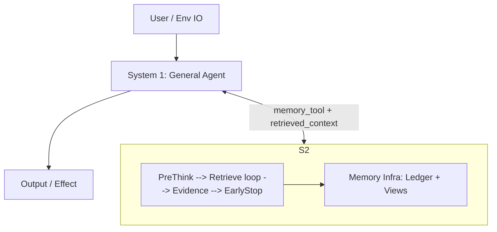
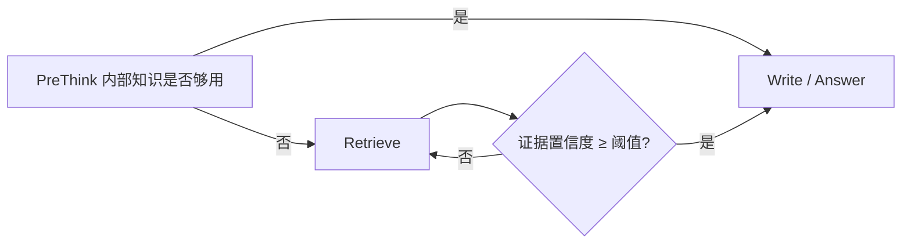

# Memory — 知识体系（合并稿）

> **构成**：原 `docs/domain/memory/memery.md`（长文思辨、Mermaid 示意、头条配图 DeepLink）与 **梳理副本**（结构化提要）合并为本文，作为需求侧单一入口。  
> **立场**：个人实践与独立思考，非产品规格；近年论文未经充分同行检验，**仅供参考**。  
> **规格**：验收与实现约束以 **`12 memory-L0-sensory.md`～`16 memory-L4-persistent.md`** 各文 **§0**、[`12-16 memory.md`](./12-16%20memory.md) 与 [`12-16 memory-development.md`](./12-16%20memory-development.md) 为准。  
> **对外图文**（自动化抓取常读不到配图）：[今日头条同主题 DeepLink](https://www.toutiao.com/article/7636596749927039530/)（正式配图以客户端/网页为准）。  

---

## 目录

1. [定义与价值立场](#1-定义与价值立场)
2. [三个核心命题 A / B / C](#2-三个核心命题-a--b--c)
3. [Ledger Event 的典型字段](#3-ledger-event-的典型字段)
4. [四条结论链](#4-四条结论链)
5. [System 1 与 System 2](#5-system-1-与-system-2)
6. [参数化 vs 非参数化；修正项 Δ](#6-参数化-vs-非参数化修正项-δ)
7. [文献支撑：JitRL、UMEM](#7-文献支撑jitrlumem)
8. [非参数化 Memory 效果上限的三大瓶颈](#8-非参数化-memory-效果上限的三大瓶颈)
9. [瓶颈与可观测指标（sandbox / A/B）](#9-瓶颈与可观测指标sandbox--ab)
10. [Policy 控制层](#10-policy-控制层)
11. [AgeMem RL 与 InfMem 协议](#11-agemem-rl-与-infmem-协议)
12. [陈述性单元：固化、压缩、时序](#12-陈述性单元固化压缩时序)
13. [时序 Memory：架构级推理](#13-时序-memory架构级推理)
14. [时序与其他维度交叉](#14-时序与其他维度交叉)
15. [Δ 中的时序分量与时间地基瓶颈](#15-δ-中的时序分量与时间地基瓶颈)
16. [分层记忆相关：LightMemory、MemWeaver](#16-分层记忆相关lightmemorymemweaver)
17. [程序性记忆：ProcMEM 与相关工作](#17-程序性记忆procmem-与相关工作)
18. [整合层：Memory Tokens、LycheeMemory、MemAdapter](#18-整合层memory-tokenslycheeememorymemadapter)
19. [Latent Memory / C-D 路线（原文占位）](#19-latent-memory--c-d-路线原文占位)
20. [五层架构抽象（内核 / 文件系统 / 可执行 / 总线 / 学习）](#20-五层架构抽象内核--文件系统--可执行--总线--学习)
21. [全文五条回顾](#21-全文五条回顾)

---

## 1. 定义与价值立场

- **本文 Memory 指**：Agent 在长期交互中积累、可被检索与利用的记录 / 知识 / 经验库；影响个性化、持续学习与长程任务表现。
- **价值判断**：仅解决垂直问题的模型更依赖赛道规模；具备**用户级个性化记忆**的模型更绑定单用户价值。
- **资产属性**：记忆类数据与互联网公司的数据资产类似，是不愿丢失的一类资产。
- **参数化 vs 非参数化（长期判断）**：参数化 Memory 潜在上限更高；在**当前工程与资源约束**下，非参数化更易落地；同时应思考如何让非参数化设计**逼近**参数化效果上限。

---

## 2. 三个核心命题 A / B / C

### 命题 A：Memory 不是「存储」，而是可被决策利用的外部状态（external state）

- 仅「存很多历史」不等于能力；能力来自历史能否**以某种形式影响当前决策分布**。
- 记忆系统从历史中提取**当前可用信息**（证据、摘要、子图、可执行技能等）交给推理层。
- 价值在「历史 → 当前决策」**通道是否有效**，不在存储量。
- Memory ≠ 历史本身；是「把历史转成当前可用信息」的通道：输出进入上下文，或直接参与决策（如对输出分布做调制）。

### 命题 B：最小闭包是 (Ledger, Views, Policy) 三件套

为满足 **provenance（可溯源）、rollback（可回滚）、可观测** 等硬约束，最小形态不能只是「向量库 + prompt」，而应是**可审计的状态机**：

| 组件 | 角色 | 要点 |
|------|------|------|
| **Raw Ledger** | 权威记录 | 追加式记录每次写入/更新/删除及当时输入、时间、scope 等 |
| **Derived Views** | 派生视图 | 向量 / keyword / hybrid、KG/TKG、timeline、skill index 等；可多、可 lossy，但必须**可回指 Ledger** |
| **Policy** | 控制层 | 何时读、读多少、何时写、如何更新、如何遗忘；决策须**显式化为可记录/可回放**的 Action（ADD/UPDATE/DELETE/NONE…），不能仅靠 prompt 暗示 |

- 类比：Ledger = 账本/黑匣子；Views = 缓存+索引+物化视图；Policy = 调度器/控制回路。  
- 缺一：不可治理 / 不可用 / 不可持续迭代。

### 命题 C：基本单位是 event 序列，但「纯 event 流」不等于可用系统

**通用 Ledger 事件**宜包含：

- **scope**：用户 / 会话 / 任务归属  
- **时间戳**  
- **输入观测**：messages、环境片段  
- **系统动作**：对外输出 + Memory Tool 动作  
- **记忆变更**：ADD/UPDATE/DELETE/NONE  
- **反馈（可选）**：reward、评分、成败  
- **决策元数据（可选）**：candidate_set、provenance、early stop 阈值等  

- event 序列是真相来源但过底层；**能力**来自 **views**（重组织/压缩/索引/时序化/技能化）与 **policy**（触发哪些 view、如何更新）。
- **关系**：event 是 Ledger 的**数据形态**；views + policy 是**能力形态**。

---

## 3. Ledger Event 的典型字段

（与命题 C 一致，单列便于实现对照。）

scope · 时间戳 · 输入观测 · 系统动作 · 记忆变更 · 可选反馈 · 可选决策元数据。

---

## 4. 四条结论链

1. Memory 需以 **event/Action 序列为第一性对象**，否则 provenance / rollback / replay 无从谈起。  
2. **单一 event 流不够用**：推理需要高密度信息、索引、时序、技能 → 需要 views。  
3. **views 不能自洽产生**：派生必有近似与冲突 → 必须由 **policy** 管写入/更新/检索/淘汰，且决策过程要被记录 → 否则不可治理、不可 A/B。  
4. Memory 本质是**闭环**：Raw Ledger（权威）→ Views（可用）→ Policy（控制）→ Commit（回写）→ Provenance（可回放）。

→ 自然引出：**记忆系统 vs 推理系统如何分工**，即 **System 1 + System 2**。

---

## 5. System 1 与 System 2

### 为何需要显式 System 2

- 若只有 System 1：记忆只能靠 **RL post-training** 等固化进权重 → 易出现**记忆特化后通用能力受损**。  
- 需要 **非空 System 2**：负责记忆的写入、检索、更新，并把过程**显式化、可观测、可回放**。

### 「相对正交」的含义（工程上）

- **不是严格独立**：指可拆成**低耦合**模块——System 1 通用 Agent 能力 vs System 2 记忆读写检索。分别优化时不应频繁大规模互相干扰。

【原文占位】整体曾写为「组合函数」形式：一为通用 LLM/Agent，一为记忆系统将历史映射为可注入上下文；.fix 其一可提升另一侧不变时的效果。

【原文占位】指标曾写为可分块优化形式：固定一侧调另一侧仍可提升 ⇒ 可用弱耦合；经验上同一 base model 换 RAG/长期记忆策略长程表现变；同一记忆 infra 可服务多种 base model ⇒ 能力多在**接口与外部状态**，非单一权重。

### 非正交边界（交叉项）

- **检索噪声、错检、时序冲突**会直接破坏推理、引发幻觉。  
- **何时检索、检索多少、何时写入**也依赖 Agent 自我评估与规划。  
⇒ 更准确：**相对正交 + 可控交叉项**；System 2 的 **observability / provenance / sandbox A/B** 用于显式化、诊断、迭代交叉项。

### Agentic Memory（AgeMem）启发

- System 2 可作为**独立系统**；核心特征是**主动控制的回路**。  
- 可与「记忆的更新与召回脱离 System 1 单独审视」相容。

### System 2 ASCII 示意图（原文）

```
                               (final answer / action)
+-------------------+      +---------------------------+      +------------------+
|   User / Env IO   | ---> | System 1: General Agent   | ---> | Output / Effect  |
+-------------------+      | (LLM + tools + planner)   |      +------------------+
                           +------------+--------------+
                                        ^
                                        |  retrieved_context + provenance
                                        |
                                        |
                                        |  memory_tool(query, ctx)
                                        v
+-----------------------------------------------------------------------------------+
|                         System 2: Agentic Memory (Slow Loop)                      |
|                                                                                   |
|  PreThink --> Retrieve (loop) --> Evidence Accumulate --> Early Stop(conf >= tau) |
|    |             |                     |                      |                  |
|    |             v                     |                      |                  |
|    |       +----------------------+    |                      |                  |
|    |       | Memory Infra         |<---+----------------------+                  |
|    |       |  - Raw Ledger        |        Write / Update (ADD/UPDATE/DELETE,    |
|    |       |  - Derived Views     |        SUMMARY/FILTER, ... )                 |
|    |       |    * Vector / Hybrid |                                              |
|    |       |    * Keyword / BM25  |   Guarantee: 100% provenance (trace to Raw Ledger)|
|    |       |    * KG / Timeline   |   Sandbox: run N strategies in parallel       |
|    |       +----------------------+   Observability: trace / log / metrics        |
|    |                                                                            |
|    +--------------------------- control feedback loop ---------------------------+
+-----------------------------------------------------------------------------------+
```

同一分工的 **Mermaid** 示意（可与上图 ASCII 对照；需支持 Mermaid 的预览器）：



---

## 6. 参数化 vs 非参数化；修正项 Δ

### 两种载体

| 类型 | 含义 |
|------|------|
| **参数化** | 经验进权重；训练/微调 = 编译进权重；推理不额外检索 |
| **非参数化** | 经验在外部状态（ledger + views + skill pool + 索引）；**policy** 决定怎么写；推理通过 retrieve + inject 影响输出 |

差别在**适应算子写在哪里**：参数化前置写入成本到训练；非参数化分摊到在线 commit 与检索注入。System 2 的意义 = 把在线适应主战场移到**外部状态与控制策略**，并可观测、可回放、可 A/B。

### Δ（对决策分布的修正）

- 一步决策若在 logits/action 分布上建模，记忆的通用影响可视为**外部修正项 Δ**。  
- System 1 权重给**基线通用性**，Δ 负责个性化、任务特化、时序修正、经验复用。  
- Δ 是可审计时才有 provenance/rollback/sandbox；**隐式塞进 prompt** 则难以治理。

---

## 7. 文献支撑：JitRL、UMEM

### JitRL

- 推理阶段用**外部经验库**调制 logits：决策前检索与当前状态相似的轨迹，估计优势并对 logits **加性调制**；episode 结束将轨迹写回库，按质量/时效淘汰并更新索引。  
- 作者观点：类比**梯度下降式**效果，逼近 **fine-tune** 的一类效果边界。

### UMEM（节前发表，原文时间语境）

- 用 Query **余弦相似度**构造**语义邻域**，非孤立存片段；**GRPO** 对邻域级边际效用做奖励。  
- 打破孤立事件，邻域承载「一类问题」的通用解法 ⇒ 外部存储侧复现部分**参数化对语义空间的建模**。

---

## 8. 非参数化 Memory 效果上限的三大瓶颈

**必要条件**：逼近的是**决策分布**，不是存储量；核心是让 **Δ** 逼近「若真实 fine-tune 会发生什么」 ⇒ 即 **Δ 的函数类在预算与接口下有多强**。

三类瓶颈：

1. **接口带宽（Memory → System 1）**  
   统称 **Context Bridge**：passage/graph/skill/tool 描述最终都要进入模型；受 token、延迟、注意力、KV 长度等约束。**记忆再大，每步生效的是可注入的有效信息密度**。分层记忆、压缩、latent token 动机多与此相关。

2. **检索与聚合误差（views 近似）**  
   views 必有近似 ⇒ 错检、漏检、时序冲突、语义漂移 ⇒ **污染 Δ**。需 provenance、可溯源、可回放以迭代降噪。

3. **policy 可学习性与可控性**  
   写多读少、召回多噪声少信息不够、UPDATE/DELETE 做错会滚雪球。  
   **Memory Algorithm Protocol** 思想：policy 输出约束为 **Action 序列**，UPDATE/DELETE 受**候选集合**约束，召回带 **provenance**；Commit 落盘。**Rubrics-only policy 不可持续**；控制回路应是**可训练对象**。

---

## 9. 瓶颈与可观测指标（sandbox / A/B）

- 三组瓶颈不必同时精确度量；实践中用 sandbox 回放先找**最痛瓶颈**再攻关。  
- 原文鼓励把影响因素做成 **action-level** 可观测项（列举性，非穷尽）。

---

## 10. Policy 控制层

### 对传统 rubrics 的否定

- **Rubrics-based**（纯预定义规则）控制读写更新 → 思想禁锢；需要 **model** 驱动。  
- 方案一：外部神经网络（难度大、每问题要找训练法子，作者认为不可持续）。  
- 方案二：**Prompt / SFT / RL 语言模型** + **记忆操作工具化**（像控制手臂一样主动读写，非被动上下文）。

### Agentic Memory 与参数落点

- 记忆操作**工具化**并入 Agent **动作空间** ⇒ 逼近参数化上限的关键一步。  
- 参数落在底层 LLM 上：**信任 LLM 泛化与迭代速度**。  
- 2026 新参数化 Memory 工作举例：**AgeMem RL**（见下一节）。

### Memory Algorithm Protocol（文中约束）

- policy 输出 **Action 序列**；UPDATE/DELETE 须受**候选集合**约束；召回须带 **provenance**；通过 **Commit** 落盘 ⇒ 可学习且可治理。

---

## 11. AgeMem RL 与 InfMem 协议

### AgeMem RL 训练（三阶段）

1. **LTM 构建**：休闲对话环境，训练识别关键信息与 **ADD/UPDATE**。  
2. **STM 控制**：重置上下文 + **干扰项**，训练 **FILTER、SUMMARY** 保持上下文窗口纯净。  
3. **综合推理**：LTM 检索 + STM 管理，长程任务（如 ALFWorld、HotpotQA）。

### InfMem：PreThink-Retrieve-Write

针对长文档 **Lost-in-the-Middle**，显式模拟慢思考，属 **policy**：

- **PreThink**：检索前评估内部知识是否够用 → 减少无谓检索与延迟。  
- **Adaptive Early Stop**：非固定 Top-K；策略网络在累积证据置信度达阈值时停止检索 ⇒ 报告称推理速度约 **3.9×**。  
- **SFT → RL**：直接优化检索与记忆更新决策，服务最终答案准确率。



→ **Policy 决定「写什么、读什么」**；写什么又依赖**记忆单元结构与压缩方式**（下一节）。

---

## 12. 陈述性单元：固化、压缩、时序

### SimpleMem

- 针对 **Context Inflation**；模拟生物 **Consolidation**。  
- **不存原始全文**，存压缩「记忆单元」；单元间 **Affinity Score** 由嵌入定义【原文占位：具体公式在源文件中未完整保留】。  
- **递归固化**：高亲和力单元合并为更高层抽象 ⇒ 类比深度网络的层级抽象 ⇒ 提升存储效率。  
- 实验称以约【原文占位：比例数字缺失】Token 打败全上下文基线。

### Zep / Graphiti 与 TKG

- **参数化记忆的静态世界观**问题：权重难以自然表达随时间变化的事实；LLM **时间钝感**。  
- Zep + Graphiti：**时序知识图谱（TKG）**，边上加 **Temporal Validity** ⇒ 区分「曾经为真」与「当前为真」。


- 检索结合查询的时间语境合成**当前时刻真值图**；据称长时序记忆评测较传统 RAG **+18.5%**。

---

## 13. 时序 Memory：架构级推理

### 为何时间是结构维度而非 metadata

在 (Ledger, Views, Policy) 中：

- **Ledger**：既要 **transaction time**（何时写入/更正），也要 **valid time**（事实在世界何时为真）；二者不等价（可今日纠正上周事实）。  
- **Views**：检索是「在某 **query_time** 语境下成立」，非仅语义相关；无时序切片会把旧事实当当前事实。  
- **Policy**：默认 **time_scope=current** ⇒ 「宁可漏不可错」；需要历史时需显式 **historical/all**；**EvidencePack** 承载**冲突并存**证据，由 **System 1** 裁决，而非 Memory OS 私自判。

推演链：LLM 时间钝感 → 纯语义检索错配「现在仍为真」→ 过时事实复活、纠正仍被反复召回 ⇒ 需要 **bi-temporal + time-sliced recall**，非更强 prompt。

### 三视角：Episodic × Bi-temporal × TKG

**认知科学（Episodic）**

- **recollection**：时间线索重建叙事 timeline。  
- **reconsolidation**：后续信息改变对过去的理解，但不抹「当时为何如此认为」。  
- 启发：Ledger 支持**事后纠错且可审计**；Views 要能输出**时序证据**应对 WHEN 类问题。

**数据库（Bi-temporal）**

- **valid_time**：事实在世界何时为真（可为区间）。  
- **transaction_time**：系统何时记录/更正（与 append-only ledger 一致）。  
- **更新语义**：宜用 **CAS + 追加更正事件**，非物理覆写；recall 在 query_time 选生效版本。  
- **遗忘**：tombstone commit + 抑制，可审计。

**知识图谱（TKG）**

- 关系带 **temporal validity**；检索按时间语境合成当前图 ⇒ 结构化分离「曾真」与「现真」。  
- 若 KG 不做 **time slice** ⇒ 角色/权限/组织关系推理错。  
- **time_scope=current**：默认应偏**当前切片**而非「语义最像」。

**开放问题（原文）**：状态类事实（职位、住址）是否在 current 下对同一 fact_key 尽量 **单值不变量**，还是允许重叠交由 System 1？

### MAGMA（2025）

- **四正交图**：语义、时间、因果、实体。  
- 时间图为**严格有序对**构成**不可变时间骨干**；快路径先建时间边，慢路径异步推断因果/实体。**消融**：去掉时间骨干评分 **0.700 → 0.647**。  
- 原则：**时间骨干 = hard constraints（低延迟、可重放、不可改）**；**因果链接 = soft inferences（可异步修正）**。  
- 与三件套对应：Ledger/Timeline = 顺序硬证据；因果 = derived view、eventual；Policy 决定是否走重因果遍历。


---

## 14. 时序与其他维度交叉

### 时序 × 因果

- 时间顺序≠因果，无时间则更无法谈因果。  
- 无稳定时间骨干 ⇒ 因果被语义相似牵引 ⇒ **倒因果叙事** ⇒ policy credit assignment 变差 ⇒ 「变化/纠错」越记越乱。  
⇒ **快路径时间归一化 + 时间边**为地基。

### 时序 × policy（遗忘 / 衰减）

- 遗忘语义：**tombstone + 检索抑制**。  
- 至少三类抑制（顺序：**先 validity，再 tombstone，再 decay**）：  
  1. **validity gating**：query_time 不在 valid 窗口 ⇒ 不进 current 候选。  
  2. **tombstone**：可审计撤回某段可见性。  
  3. **decay**：在仍有效或 time_scope=all 集合上做软排序权重。  
- **开放问题**：tombstone 作用于某条 commit 还是 fact_key 的某 valid_time 区间？

### 时序 × 固化（consolidation）

- 纯语义固化易跨期平均化 ⇒ **current 切片错误**。  
- 策略：**变更点分段**再在段内化简；区间合并；叙事摘要但必须 **可追溯 Ledger**。  
- 第一原则：**不跨越变更点的抽象**。  
链条：无时序固化 → 跨期混合 → current 不可靠 → policy 狂加召回 ⇒ 带宽压力。

### 时序 × skill（程序性）

- ProcMEM：技能要看**环境回报**；加时序后核心是**环境是否变、技能是否仍成立**。  
- 建议：**last_verified / last_success**、**applicability window**。  
- Policy：**触发再验证**（query_time 远离 last_verified 先试探）再提高权重。【原文在行末有小残缺】。

**开放问题**：skill「过期」= tombstone 还是低权重 + 验证？高风险前者，低风险后者。

---

## 15. Δ 中的时序分量与时间地基瓶颈

### 结构化进入 Δ

- 非简单 decay：「**先限定候选，再调制优势**」。  
- **Hard**：query_time/query_window + time_scope=current ⇒ valid_time 覆盖 query_time 才进优势估计。  
- **Soft**：recency / 稳定性等。目标：**宁可漏，不把旧当今**。

### 送入优势估计的「时间结构特征」（非仅新旧）

- 最近一次变更距今（刚变更 ⇒ 不稳定 ⇒ 加成保守）。  
- 历史反复频率（摇摆槽位 ⇒ 不单条强驱）。  
- **transaction_time 上纠错密度**（纠错多 ⇒ 打折）。  
- 非等价于 decay；表达**认识是否稳定**。  
【原文占位】「让…看到」句在源文件中断裂，语义上指使**优势估计**利用上述特征。

### 时间不确定性

- 解析输出区间与置信度；置信度低 ⇒ **Δ 注入强度减小** ⇒ System 1 澄清/保守；Memory 提供证据不裁决。

**开放问题**：时间不确定性在 **EvidencePack** 里显式标注给 System 1，还是 policy 消化为权重？

### 时序放大三类瓶颈 + Time Grounding Bottleneck

- **带宽**：WHEN / 变更史需多证据序列 ⇒ 需「变更点 + 代表证据」等**叙事压缩**。  
- **检索误差**：多时态并存，错在 **time slice、transaction/valid 混淆、跨期 consolidation**。  
- **policy**：delayed reward + retroactive correction ⇒ **delayed credit assignment** 更难。  

**新增：时间地基瓶颈（Time Grounding Bottleneck）**

- fast path **时间解析/归一化**若错 ⇒ timeline/TKG/vector 全污染、错误反复召回（尤其 default current）、LLM 爱合理化错误时间。  
⇒ **时间解析应为一级组件**：尽量**非 LLM**、可重放、输出置信度、可 audit 回指 ledger pointer/hash。  

**开放问题**：是否强制 **MAGMA 式不可变时间骨干**？最小闭包：**消息序 vs commit序 vs 解析后 valid_time 序**，哪些必须连边？

---

## 16. 分层记忆相关：LightMemory、MemWeaver

- **MemWeaver**：三层混合 — **Graph**（实体关系多跳）、**Experience**（模式/类比）、**Passage**（原文证据溯源）。兼得抽象与可追溯。  
- **LightMemory**与多篇工作强调「**记忆分层**」对效率与推理的重要性。（原文未细则展开LightMemory）

---

## 17. 程序性记忆：ProcMEM 与相关工作

- 由 Declarative（是什么/发生了什么）过渡到 **Procedural**：**怎么做**的可复用路径。  
- 传统 RAG 弱于检索**操作流程/技能**。  
- **Skill-MDP**：成功轨迹 ⇒ 可执行 **macro**。  
- **ProcMEM（中科院，2026.02）**：历史形式化 Skill-MDP；三元结构【原文小节标题后即转 PPO；**语义梯度一节明确技能三部分为触发 / 执行 / 终止**】。  
- **非参数化 PPO**：不改 LLM 权重，用 trust-region/clipping **门控**哪些技能入池；价值来自**环境回报**非自述。  
- 三要点：**可执行性、可复用性、非参数化优化**。  
- 三阶段：  
  1. **生成**：**Semantic Gradient** — 对触发/执行/终止做事后归因，自然语言改进建议；批聚合 ⇒ 批更新信号 ⇒ 由旧技能变体生成候选技能【原文「旧技能图片」应为 OCR 错字，语义为候选技能】。  
  2. **验证**：**PPO Gate** 反事实验证，保守过滤不可靠候选。  
  3. **维护**：在线得分累计边际贡献，非正剔除；超限按分剪枝 + 去语义冗余。  
- **工程归纳**：技能视图须与轨迹、奖励、回溯评估绑定；技能池可调至**数百 token 级压缩**仍有收益；跨任务跨 Agent **可迁移** ⇒ 支撑「记忆与通用 Agent 相对正交」判断。  
- **相关工作**：**SWE-Exp（2026.02，coding）**、**MemSkill** 等。


---

## 18. 整合层：Memory Tokens、LycheeMemory、MemAdapter

### 阻抗匹配问题

外部记忆常：结构化数据 → **文本化** → 拼接 prompt → 再编码 ⇒ 开销与损失。

### 「Memory tokens」三维度拆分

1. **Representation**：如何变成模型可消费的 token（machine-native/latent），压缩且保真。  
2. **Alignment**：图谱、技能、时间边等非纯文本如何与语义空间对齐。  
3. **Control/Governance**：注入谁、多少、何时；错时溯源回滚与 A/B。

### LycheeMemory

- **Compressor** 将块压成紧凑 **latent**，形态贴近 **KV-Cache**。  
- 检索结果**直接注入注意力**，减文本往返。  
- 论文性能数字「信一半」；工程侧：**可读性弱** ⇒ 更需要 **provenance/可观测**，每次注入须能追溯 **Raw Ledger**。

### MemAdapter

- **Generative Subgraph Retrieval** + 对齐，异构记忆进统一消费接口；强调**零样本**不微调。  
⇒ Integration Layer **适配器**；对齐差时隐蔽影响推理 ⇒ 需 **可诊断、可回滚、sandbox A/B**。

### Memory Tokens 的盲点（控制与治理）

- **Latent 不消灭预算**：仍需 selection/gating/sparse。  
- **Machine-native 越强**：越要 **provenance、可追溯、诊断、回滚、A/B**。  

作者结论：**若 Memory tokens = 高吞吐注入** ⇒ 前两维技术可在前提下接近可用；若上升到 **长期稳定与可治理** ⇒ 还须补齐选择与预算、观测与溯源。

---

## 19. Latent Memory / C-D 路线（原文占位）

- 作者在文中声明：已将 **Latent Memory** 近半年论文在阅读中，**有意不写入正文**，避免变综述；**C/D 两条路线**的严谨流程、思维实验与指标证据将**单独成文**。  
- 本文读者 / Agent：**若讨论 C/D**，应展开阅读原文指向的外链或后续笔记（此处无更多技术细节），避免把未写进正文的内容当属实引用。

---

## 20. 五层架构抽象（内核 / 文件系统 / 可执行 / 总线 / 学习）

类比 Linux「内核 / 文件系统 / 可执行 / 总线」；**不与具体实现对死**。

1. **Kernel / Control Plane**  
   System 2 慢回路与调度：**何时检索、多少、写入、更新、遗忘**；策略可训练/可评估。**Planner/Router**：scheduler + syscall dispatcher，把请求编译成 **Memory 系统调用序列**（查哪些 view、每条取多少证据、闭环检索何时停、写入哪类 view；UPDATE/DELETE 引用候选约束）。可实现为规则/LLM-as-planner/学习控制器——**但必须可记录、回放、对比**。

2. **File System / Storage Plane**  
   Raw Ledger + Views；下层 **时序一致与冲突消解**；上层 **压缩与分层固化**；始终保持 **可追溯**。（类比 Zep/TKG + SimpleMem 等方向）

3. **Executable / Skill Plane**  
   skill/macro/workflow：**可执行、可验证、可治理**，防长期退化。

4. **Interface / Context Bridge**  
   **低开销、低失真、可控**注入推理核心 + 观测与溯源；（部分工作走 memory/latent token）

5. **Learning Engine / Online Adaptation**  
   少改权重前提下把反馈转成改进：推理侧优势调制、技能演化算子、检索策略分块优化等。**学习发生在外状态与策略** ⇒ 可插拔、回滚、A/B（JitRL 等为一种实现）。

---

## 21. 全文五条回顾

1. Memory 不是单纯存储，而是 **Ledger → Views → Policy → Commit → Provenance** 闭环；三件套缺一不可。  
2. **System 2 必要**；记忆能力与通用 Agent 能力**相对正交**，外置化换可插拔、可迁移、可归因（接受一定理论上界损失）。  
3. 非参数化上限由 **接口带宽、views 近似误差、policy 可控可学**三瓶颈共同决定；**policy 常被低估**。  
4. **时序是骨架非 metadata**：**bi-temporal + time-sliced recall**，区分曾与现，不能只靠 LLM 自洽。  
5. **五件套抽象**定义「必须存在的模块与接口」，非「如何拼装某一产品」的步骤手册。

---

*合并稿取代已删除的 `docs/domain/memory/memery.md` 与 `memery-梳理副本.md`。与 **产品落地** 对齐时以 **`12 memory-L0-sensory.md`～`16 memory-L4-persistent.md`** 各 **§0**、[`12-16 memory.md`](./12-16%20memory.md) 与 [`12-16 memory-development.md`](./12-16%20memory-development.md) 为准；讨论论文与命题编号时请对照本文与上述 §0，避免把观点文当作验收依据。*
