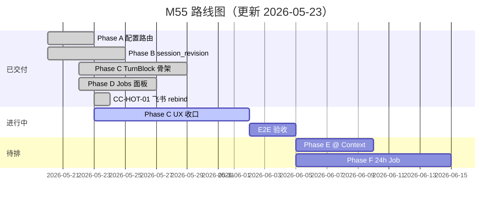

# M55 — Chat × Channel × Cursor 对标 — 开发计划

> **版本**：2026-05-23 | **状态**：🚧 Phase A–D 已交付；UX 收口与 Phase E/F 待排  
> **方案**：[55-chat-channel-cursor-solution.md](./55-chat-channel-cursor-solution.md)  
> **蓝图**：[m55-chat-channel-enterprise-blueprint.md](../guides/m55-chat-channel-enterprise-blueprint.md)  
> **进度真相**：[execution-plan.md §迭代 CC](../guides/execution-plan.md) · **EP**：EP-CC-M55  
> **近期 changelog**：[M55 Phase A–D Review](../changelog/2026-05-23-M55-Phase-ABCD-Review-Fixes.md) · [飞书 Rebind + UX Backlog](../changelog/2026-05-23-M55-Feishu-Rebind-UX-Backlog.md)

---

## 1. 模块定位

在 **不破坏现有架构红线** 前提下，完成三件事：

1. **长任务**：Sync Turn 与 Durable Job 分流，消除「24h 任务 × 5m 超时」类别错误。
2. **Channel↔Web 同步**：`session_revision` + Channel 入站聚焦，Web 可靠镜像飞书会话。
3. **Cursor 式 Chat UX**：TurnBlock 分组、工具折叠、Background Job 面板。

**代码锚点**：

| 层 | 现有 | M55 扩展 |
|----|------|----------|
| biz | `channel_config_helpers.go` · `channel_peer_session.go` | 长任务路由、`UpdateSessionID` stale rebind |
| service | `channel_ingress*.go` · `trpc_turn.go` · `chat_jobs.go` | 路由、revision bump、Jobs 聚合 |
| event | `envelope.go` · `session_revision.go` | `session_revision` / `source` |
| web/chat | `TurnBlock.vue` · `groupMessagesByTurn.ts` | TurnBlock · 增量 sync · Jobs 面板 |

---

## 2. 现状评估（2026-05-23 更新）

| 项 | 状态 | 说明 |
|----|------|------|
| Channel Phase E（ACK/Job/IM Preview） | ✅ | [17-channel-development.md §10](./17-channel-development.md#10-长任务异步执行phase-e) |
| 长任务 preset + auto 关键词路由 | ✅ | `channelLongTaskPresets.ts` · `ShouldRunAsync` |
| `session_revision` 增量 sync | ✅ | API + WS + `useChatInboundSync` |
| Web TurnBlock + ToolStrip | ✅ | 默认开启；Team Session 仍走平铺 |
| Background Job 面板 | ✅ | `ChatBackgroundJobsPanel` + `GET /v1/chat/jobs` |
| 飞书 peer bind stale rebind | ✅ | CC-HOT-01 · [changelog](../changelog/2026-05-23-M55-Feishu-Rebind-UX-Backlog.md) |
| UserBubble 来源徽标 | ⏳ | 仅有 TurnBlock 顶栏「来自飞书」 |
| 思考/ReAct 互斥 UX | 📋 | 空「思考过程」、双 ToolStrip · CC-C-UX-* |
| M55 E2E 手工验收 | ⏳ | SYNC-01/02 · UI-01/02 · JOB-01 |
| 24h Durable Job | 📋 | async 看门 ~2h |
| TurnExecutor 抽象 | 📋 | P-4 可维护性债 |

---

## 3. 路线图

---

## 4. 分阶段任务

### Phase A — 配置与路由（P0）— ✅ 已交付

| ID | 任务 | 状态 | 验收 |
|----|------|------|------|
| CC-A-01 | 飞书长任务 preset + 前端一键应用 | ✅ | `feishu_long_analysis` 等 |
| CC-A-02 | `execution_mode=auto` 关键词 → async | ✅ | 单测覆盖 |
| CC-A-03 | 超时错误文案区分 sync vs async | ✅ | `channel_ingress_errors.go` |
| CC-A-04 | 运维 Runbook | ⏳ | E2E 文档扩展 |

---

### Phase B — Session Sync 协议（P0）— ✅ 已交付（E2E ⏳）

| ID | 任务 | 状态 | 验收 |
|----|------|------|------|
| CC-B-01 | `sessions.session_revision` + bump | ✅ | Turn 完成 +1 |
| CC-B-02 | Envelope 携带 `session_revision` | ✅ | terminal envelope |
| CC-B-03 | `ListSessionMessages?after_revision=` | ✅ | service 测试 |
| CC-B-04 | 选中 Session 强制 Session WS | ✅ | |
| CC-B-05 | revision debounced hydrate + replay 门控 | ✅ | `wsReplaying` |
| CC-B-06 | Envelope `source=channel` + 入站 focus | ✅ | |
| CC-B-07 | UserBubble 来源徽标 | 📋 | §5.1 蓝图 |

---

### Phase C — TurnBlock UI（P0）— 🚧 骨架 ✅ · UX 债 📋

| ID | 任务 | 状态 | 验收 |
|----|------|------|------|
| CC-C-01 | `TurnBlock` + `ToolStrip` | ✅ | 仍用 `ChatMessageRow` 子组件 |
| CC-C-02 | ToolStrip 默认折叠 | ✅ | |
| CC-C-03 | `groupMessagesByTurn` + 单测 | ✅ | 缺 feishu 115 条 fixture |
| CC-C-04 | 滚动锚定最后一轮正文 | ✅ | |
| CC-C-05 | 虚拟列表 benchmark | ⏳ | M55-UI-01 |
| CC-C-06 | rAF 批处理 + completion 增量 | ⏳ | `messageStoreBatch` 有 rAF；completion 仍全量 hydrate |
| CC-C-07 | Session 顶栏 sync 诊断 | 📋 | |
| **CC-C-UX-01** | 思考/ReAct 互斥；空 reasoning 不展示 | 📋 | 截图：空「思考过程」 |
| **CC-C-UX-02** | 流式「正在思考…」单行态 | 📋 | |
| **CC-C-UX-03** | 双 ToolStrip 去重/合并 | 📋 | 截图：两条工具摘要 |
| **CC-C-UX-04** | `TurnAssistantBubble` 拆分 | 📋 | |

---

### Phase D — Background Job 面板（P1）— ✅ 已交付

| ID | 任务 | 状态 | 验收 |
|----|------|------|------|
| CC-D-01 | `GET /v1/chat/jobs` | ✅ | JOIN 无 N+1 |
| CC-D-02 | Web Jobs 侧栏 | ✅ | WS refresh |
| CC-D-03 | Graph execution 深链 | ✅ | |
| CC-D-04 | 飞书完成通知 Session 深链 | 🟡 | Eb 部分已有 |
| CC-D-05 | Job 与 TurnBlock 时间线联动 | 📋 | Artifact 行 |

---

### Phase E — Context & Apply（P2）— 📋 未启动

| ID | 任务 | 状态 |
|----|------|------|
| CC-E-01 | Composer `@` 引用 | 📋 |
| CC-E-02 | 上下文清单抽屉 | 📋 |
| CC-E-03 | diff Apply 卡片 | 📋 |
| CC-E-04 | Reasoning 侧栏模式 | 📋 |

---

### Phase F — 24h Durable Job（P2）— 📋 未启动

| ID | 任务 | 状态 |
|----|------|------|
| CC-F-01 | Worker deadline 24h | 📋 |
| CC-F-02 | Graph checkpoint resume | 📋 |
| CC-F-03 | IM 进度百分比 | 📋 |
| CC-F-04 | 取消 / 重试 Job API | 📋 |
| CC-F-05 | async 白名单 | 📋 |

---

### 热修复 — Channel 入站（P0）— ✅

| ID | 任务 | 状态 | 说明 |
|----|------|------|------|
| CC-HOT-01 | Stale peer bind 自动 rebind | ✅ | `ensureChannelSession` 校验 + `UpdateSessionID` |
| CC-HOT-02 | 删 Session 时清理 peer bind | 📋 | 可选；读路径已自愈 |

---

### 横切 — TurnExecutor（P3）— 📋

| ID | 任务 | 状态 |
|----|------|------|
| CHAT-R2-03 | 抽 `TurnExecutor` | 📋 | Agent/Team 公共骨架 |

---

## 5. 优先级与排期（更新）

| 优先级 | 阶段 | 理由 |
|--------|------|------|
| **P0 当前** | CC-C-UX-* + CC-E2E-01 | 截图 UX 问题；M55 手工验收 |
| **P1** | CC-B-07 · CC-C-05/06/07 · CC-HOT-02 | M55 收口 |
| **P2** | E + F + CHAT-R2-03 | Cursor 完整对标 + 24h |
| **P3** | CC-C-08 · CC-D-05 · CC-E-04 | polish |

---

## 6. 已解决问题索引

见 [changelog · 已解决问题](../changelog/2026-05-23-M55-Feishu-Rebind-UX-Backlog.md#已解决问题)（H-01 … H-08）。

---

## 7. 风险与依赖

| 风险 | 缓解 |
|------|------|
| TurnBlock 与 ReAct/reasoning 双轨 UI | CC-C-UX-01 互斥规则 |
| 失败重试产生多 TurnBlock | CC-C-UX-03 merge 或产品层合并展示 |
| `session_revision` 漂移 | bump 仅在 Turn 成功收口；单测 |
| 24h Worker | Phase F 独立 sprint |

---

## 8. 相关文档

| 文档 | 更新时机 |
|------|----------|
| [m55-chat-channel-enterprise-blueprint.md](../guides/m55-chat-channel-enterprise-blueprint.md) | §12 后期优化 |
| [1-chat-development.md](./1-chat-development.md) | Phase 9 M55 状态 |
| [17-channel-development.md](./17-channel-development.md) | D7 peer rebind |
| [execution-plan.md](../guides/execution-plan.md) | 迭代 CC 任务板 |
