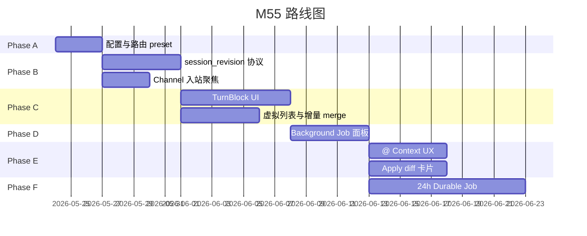

# M55 — Chat × Channel × Cursor 对标 — 开发计划

> **版本**：2026-05-23 | **状态**：📋 规划（根因分析已完成，待排期实施）  
> **方案**：[55-chat-channel-cursor-solution.md](./55-chat-channel-cursor-solution.md)  
> **进度真相**：[execution-plan.md §迭代 CC](../guides/execution-plan.md) · **EP**：EP-CC-M55

---

## 1. 模块定位

在 **不破坏现有架构红线** 前提下，完成三件事：

1. **长任务**：Sync Turn 与 Durable Job 分流，消除「24h 任务 × 5m 超时」类别错误。
2. **Channel↔Web 同步**：`session_revision` + Channel 入站聚焦，Web 可靠镜像飞书会话。
3. **Cursor 式 Chat UX**：TurnBlock 分组、工具折叠、Background Job 面板。

**代码锚点（规划）**：

| 层 | 现有 | M55 扩展 |
|----|------|----------|
| biz | `channel_config_helpers.go` | 长任务路由规则、`SessionRevision` |
| service | `channel_ingress*.go` · `trpc_turn.go` | 路由决策、revision bump |
| event | `envelope.go` | `session_revision` / `channel_inbound` meta |
| channel/preview | `TurnPreviewCoordinator` | 与 Web TurnBlock 顺序契约 |
| web/chat | `ChatMessagePanel` · `mergeSessionMessages` | TurnBlock · 增量 sync |

---

## 2. 现状评估

| 项 | 状态 | 说明 |
|----|------|------|
| Channel Phase E（ACK/Job/IM Preview） | ✅ | [17-channel-development.md §10](./17-channel-development.md#10-长任务异步执行phase-e) |
| `turn_timeout_sec` / async Graph | ✅ | 需 **路由策略** 与 **运维 preset** 落地 |
| Follow-up Queue（Cursor 对齐） | ✅ | [1-chat-development.md](./1-chat-development.md) |
| IM transcript 顺序 | ✅ | 正文→工具→正文 |
| Web TurnBlock | ❌ | 平铺 message 行 |
| `session_revision` 增量 sync | ❌ | 全量 list + WS patch |
| Channel 入站 Web 自动聚焦 | ❌ | 用户须手动选 feishu session |
| Background Job 面板 | ❌ | Job 表有，Web 无 |
| 24h Durable Job | ❌ | async 看门 ~2h |

---

## 3. 路线图

---

## 4. 分阶段任务

### Phase A — 配置与路由（P0，~3 天）

> **目标**：在 **不改架构** 下，让 ≤15min 长任务可配置成功；明确 async 入口。

| ID | 任务 | 优先级 | 状态 | 验收 |
|----|------|--------|------|------|
| CC-A-01 | 飞书 Channel **长任务 preset** 文档化 + 前端一键应用 | P0 | 📋 | `feishu_long_analysis`：`turn_timeout_sec=900` 等 |
| CC-A-02 | 路由启发式：`execution_mode=auto` 关键词 → async | P0 | 📋 | 「分析/研报/全量/24h」→ 拒绝纯 sync |
| CC-A-03 | 超时错误文案区分：sync 上限 vs 应走 async | P1 | 📋 | 飞书出站提示「请使用后台任务」 |
| CC-A-04 | 运维 Runbook：FlowLog 查 `chat.turn.timeout` | P1 | 📋 | [guides/channel-im-preview-e2e.md](../guides/channel-im-preview-e2e.md) 扩展 |

**依赖**：Channel Phase E ✅

---

### Phase B — Session Sync 协议（P0，~1 周）

> **目标**：Web 打开 Session 后 **5s 内** 与飞书 Turn 一致。

| ID | 任务 | 优先级 | 状态 | 验收 |
|----|------|--------|------|------|
| CC-B-01 | `sessions.session_revision` 或 turn 计数 derived | P0 | 📋 | Turn 完成 monotonic +1 |
| CC-B-02 | Envelope 携带 `session_revision` | P0 | 📋 | `runner_completion` 等 |
| CC-B-03 | `ListSessionMessages?after_revision=` 增量 API | P0 | 📋 | 减少全量 list |
| CC-B-04 | Web：选中 Session 强制 Session WS | P0 | 📋 | `useChatWorkspace.bindSessionView` |
| CC-B-05 | Web：`session_revision` 触发 debounced hydrate | P0 | 📋 | M55-SYNC-01/02 |
| CC-B-06 | Channel 入站 Envelope `source=channel` + peer | P1 | 📋 | 同 Agent 自动 focus session |
| CC-B-07 | Session 列表 Channel 图标 + `feishu:` 过滤 | P1 | 📋 | 降低选错 Session |

**依赖**：Message 51 · Session 10

**设计输出**：更新 [51a 后端消息机制.md](./51a%20后端消息机制.md) §session_revision · [51b 前端消息机制.md](./51b%20前端消息机制.md) §增量同步

---

### Phase C — TurnBlock UI（P0，~1.5 周）

> **目标**：Cursor 式一轮容器；工具默认折叠；100+ 条流畅。

| ID | 任务 | 优先级 | 状态 | 验收 |
|----|------|--------|------|------|
| CC-C-01 | `TurnBlock` 组件：User / ToolStrip / Assistant | P0 | 📋 | 与 IM transcript 顺序一致 |
| CC-C-02 | `ToolStrip` 默认折叠 + 摘要「N tools · Xs」 | P0 | 📋 | M55-UI-02 |
| CC-C-03 | `mergeSessionMessages` → `groupMessagesByTurn` | P0 | 📋 | 单测覆盖 feishu 115 条 fixture |
| CC-C-04 | 滚动锚点：最后一轮 **正文**，非绝对 bottom | P0 | 📋 | 修复 tool spam 在底部 |
| CC-C-05 | 虚拟列表阈值策略（长 Session 默认 virtual） | P1 | 📋 | M55-UI-01 |
| CC-C-06 | WS tool patch rAF 批处理 + 禁止 completion 全量 replace | P1 | 📋 | 无 UI freeze |
| CC-C-07 | Session 顶栏 sync 诊断：`N msgs · WS · rev` | P2 | 📋 | 运维可见 |

**依赖**：Phase B（增量 sync 减轻 merge 压力）

**设计输出**：更新 [51b 前端消息机制.md](./51b%20前端消息机制.md) §TurnBlock · [frontend-pages.md](./frontend-pages.md) Chat 区

---

### Phase D — Background Job 面板（P1，~1 周）

> **目标**：async / 长任务有独立观测壳，类似 Cursor Background Agent。

| ID | 任务 | 优先级 | 状态 | 验收 |
|----|------|--------|------|------|
| CC-D-01 | `GET /v1/channels/jobs` 或复用 session job 列表 | P1 | 📋 | 按 session/agent 筛选 |
| CC-D-02 | Web `/chat` Job 侧栏或 Session 内 Job 条 | P1 | 📋 | 状态 running/done/failed |
| CC-D-03 | Job 详情：进度、Graph execution 深链 | P1 | 📋 | 链到 Graph Run 页 |
| CC-D-04 | 飞书完成通知带 Session 深链（已有 Eb） | P2 | 📋 | Web 一键打开 |

**依赖**：Channel `channel_turn_job` ✅ · Graph execution ✅

---

### Phase E — Context & Apply（P2，~1 周）

> **目标**：Cursor 式 @ 引用与 diff Apply。

| ID | 任务 | 优先级 | 状态 | 验收 |
|----|------|--------|------|------|
| CC-E-01 | Composer `@` 引用 UX（文件/知识库） | P2 | 📋 | 规格见 [1 chat.md](./1%20chat.md) 扩展 |
| CC-E-02 | 上下文清单抽屉（本轮注入列表） | P2 | 📋 | |
| CC-E-03 | `structured_patch` / diff 结果 **Apply** 按钮 | P2 | 📋 | 对接 [23 tools-fragment-edit.md](./23%20tools-fragment-edit.md) |
| CC-E-04 | Reasoning 侧栏模式（可选） | P3 | 📋 | 产品定稿 |

---

### Phase F — 24h Durable Job（P2，~2 周）

> **目标**：小时~24h 任务不依赖 Turn Context 超时。

| ID | 任务 | 优先级 | 状态 | 验收 |
|----|------|--------|------|------|
| CC-F-01 | Worker 级 deadline（24h）替代 asyncWatch 2h | P2 | 📋 | Job 可跨进程续跑 |
| CC-F-02 | Graph checkpoint resume on worker restart | P2 | 📋 | |
| CC-F-03 | IM 进度：百分比 + 预计剩余 | P2 | 📋 | Card 字段 |
| CC-F-04 | 取消 / 重试 Job API | P2 | 📋 | |
| CC-F-05 | 关键词路由 + 管理员强制 async 白名单 | P1 | 📋 | 与 CC-A-02 合并验收 |

---

## 5. 优先级与排期建议

| 优先级 | 阶段 | 理由 |
|--------|------|------|
| **P0 本周** | A + B | 立刻减少 5m 误杀；Web 可见飞书消息 |
| **P0 下周** | C | 解决「只有工具没有正文」体验 |
| **P1** | D | async 长任务可观测 |
| **P2** | E + F | Cursor 完整对标 + 24h |

**与 execution-plan 关系**：迭代 CC 任务板见 [execution-plan.md](../guides/execution-plan.md)；不与 M53 Graph 执行收敛抢 P0（可并行：CC 以前端+协议为主）。

---

## 6. 风险与依赖

| 风险 | 缓解 |
|------|------|
| `session_revision` 与现有 message id 不一致 | 以 turn_index 或 max(created_at) 派生，单测锁定 |
| TurnBlock 重构影响 Team member 流 | member 消息保留独立行或嵌套 TurnBlock |
| async Graph 未配置 | Phase A preset + 管理端 wizard |
| 24h Worker 资源 | 独立 queue + 并发上限 + 取消 |

---

## 7. 相关文档

| 文档 | 更新时机 |
|------|----------|
| [55-chat-channel-cursor-solution.md](./55-chat-channel-cursor-solution.md) | 方案变更 |
| [1-chat-development.md](./1-chat-development.md) | Phase C/E 启动时 |
| [17-channel-development.md](./17-channel-development.md) | Phase A/F 启动时 |
| [message-development.md](./message-development.md) | Phase B 启动时 |
| [frontend-pages.md](./frontend-pages.md) | Phase C/D 启动时 |
| [docs/README.md](../README.md) §5.2 | 索引已链入 M55 |
