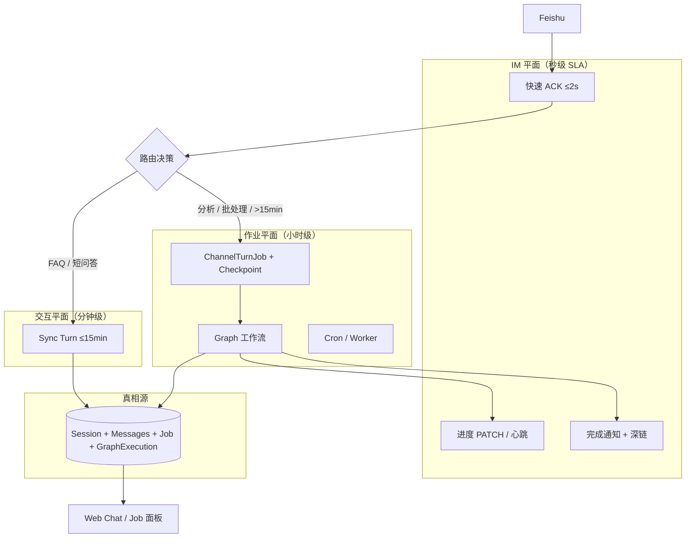
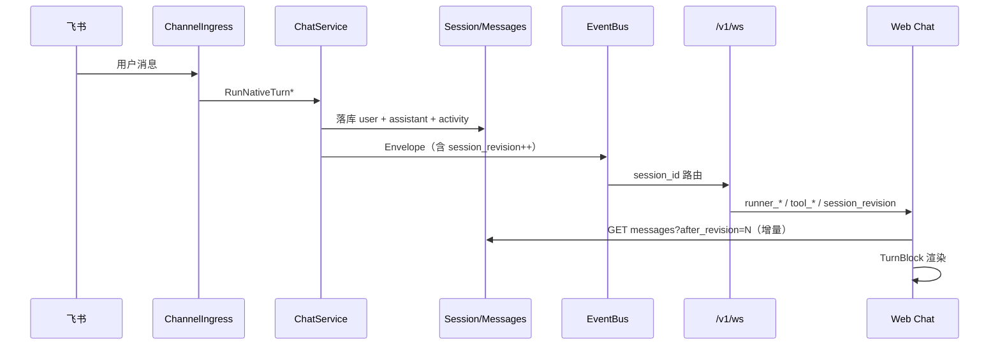

# M55 — Chat × Channel × Cursor 对标整体方案

> **版本**：2026-05-23  
> **读者**：产品、架构、全栈  
> **关联**：[55-chat-channel-cursor-development.md](./55-chat-channel-cursor-development.md) · [1 chat.md](./1%20chat.md) · [17 channel.md](./17%20channel.md) · [17-channel-agent-team-integration.md](./17-channel-agent-team-integration.md) · [51 消息机制.md](./51%20消息机制.md) · [0 系统框图.md](./0%20系统框图.md)  
> **背景**：飞书长任务 5 分钟超时失败；Channel 会话消息在 Web Chat 不可见或体验异常；需以 Cursor 为参照统一 Chat 产品形态。

---

## 1. 问题陈述

### 1.1 现象 A — 长任务 5 分钟失败

飞书用户下发「需 24 小时」的分析类指令后：

1. 收到 ACK：「收到，正在处理…」
2. 约 5 分钟后失败：`CHAT_AGENT` / `响应超时，请稍后重试 (5m0s)`
3. 出站：「任务执行失败，请稍后重试。」

**本质**：用户期望 **小时级批处理 Job**；系统执行的是 **分钟级同步 Turn**（默认 `DefaultTurnTimeout = 5m`）。

### 1.2 现象 B — Web 看不到飞书消息

飞书侧 Agent 正常回复；Web Chat 打开同一 Agent 的 `feishu:` Session 时：

- 工具卡片可见，但用户指令 / 助手正文「像不存在」
- 长会话（100+ 条）页面卡顿、滚动异常

**本质**：数据层多数已落库（Channel 与 Web 共用 Session）；失败主要在 **Web 观测平面**（Session 亲和、同步协议、Turn 呈现、性能）。

---

## 2. Cursor 对话界面 — 需求与设计解析

Cursor 不是「聊天 App」，而是 **IDE 内嵌 Agent 工作区**。以下维度是 Arenea 对标的权威参照。

### 2.1 双模式：Chat vs Composer / Agent

| 模式 | 用户目标 | UX 特征 |
|------|----------|---------|
| **Chat** | 解释、问答、小改动 | 侧边栏、短回复、低侵入 |
| **Composer / Agent** | 多步任务、改多文件 | 全宽、步骤清单、可后台 |

**设计原则**：**对话 Turn** 与 **后台 Job** 是两种产品壳，不应混在同一超时模型里。

### 2.2 上下文模型

- `@file` / `@folder` / `@codebase` / `@docs` 显式注入
- **Context 用量条**（token %）始终可见
- 用户清楚「本轮 Agent 能看见什么」

### 2.3 工具调用呈现

- 工具 = **可折叠块**，默认收起或单行摘要
- 主视觉 = **Assistant 自然语言 + diff / 产物**
- 终端 / log 在块内滚动，**不撑满时间线**

### 2.4 流式与响应性

- Token 增量渲染，禁止全量 replace
- 生成中 **Stop**；Stop 后保留已生成部分
- **Follow-up Queue**：运行中可继续输入，排队而非阻塞

### 2.5 长任务 / Background Agent

- 长任务 **脱离当前 Turn 超时**
- 独立 **Background 面板**：状态、日志、完成通知
- 用户可继续编辑，Agent 在后台跑

### 2.6 产物导向

- 代码变更 = **inline diff** + **Apply / Reject**
- Checkpoint 可回滚

### 2.7 布局信息层次（示意）

```
┌─────────────────────────────────────────┐
│ Context: @files  68% ctx    [Stop]      │  ← 状态栏
├─────────────────────────────────────────┤
│ [User] 请重构 auth 模块                  │
│ [Assistant] 好的，我将…                  │  ← 主对话
│   ▶ Ran terminal (3)  ▶ Read file (2)    │  ← 工具折叠条
│   ```diff … ```  [Apply]                │  ← 产物
├─────────────────────────────────────────┤
│ [输入框]  @  附件  模型  Enter发送        │
└─────────────────────────────────────────┘
```

---

## 3. Aranea 现状对照

| 维度 | Cursor | Aranea 现状 | 差距 |
|------|--------|-------------|------|
| 双壳 Chat/Job | Chat + Background Agent | 单一 Chat 时间线；Channel async 有 Job 表但 Web 无 Job 面板 | **高** |
| Turn 分组 | 一轮 = User→Tools→Assistant 容器 | user / assistant / tool activity **平铺独立行** | **高** |
| 工具默认折叠 | 折叠条 + 展开详情 | 工具独立 `ChatExecutionCard` 行，多工具淹没正文 | **高** |
| Context @ | @file 等 first-class | ctx % 有；无 @ 引用 UX | 中 |
| Follow-up Queue | 运行中连续发送 | ✅ `enqueue_message` 已对齐 | 低 |
| 长任务 | Background，无 Turn 超时 | Sync Turn 5m 默认；async Graph 看门 ~2h | **高** |
| Channel→Web | N/A（单客户端） | 共用 Session DB；Web **被动 pull + 可选 WS** | **高** |
| Apply diff | Apply 按钮 | 工具结果 JSON/MD，无 Apply | 中 |
| 虚拟列表 | 长会话流畅 | 阈值与 merge 策略曾导致卡顿 | 中（部分已优化） |

**代码锚点（现状）**：

| 能力 | 位置 |
|------|------|
| Turn 超时 5m | `internal/agent/choice_stream.go` · `internal/service/trpc_turn.go` |
| Channel 长任务配置 | `internal/biz/channel_config_helpers.go` · [17 channel.md §8](./17%20channel.md#8-长任务场景飞书-channel) |
| async Graph | `internal/service/channel_ingress_async.go` |
| IM Preview transcript | `internal/channel/preview/` · [17 channel.design.md §12.9](./17%20channel.design.md#129-im-preview-投影turnpreviewcoordinator2026-05-23) |
| Web 消息列表 | `web/src/components/chat/ChatMessagePanel.vue` · `ChatMessageRow.vue` |
| WS 同步 | `useChatInboundSync.ts` · `useChatStreamManager.ts` · `mergeSessionMessages.ts` |

---

## 4. 整体架构方案

### 4.1 双平面执行模型（解决长任务超时）



**路由规则（产品）**：

| 场景 | 执行模式 | Channel 配置 |
|------|----------|--------------|
| FAQ、单轮工具 | `sync` | 默认 `turn_timeout_sec` |
| 多工具分析（≤15min） | `sync` | `turn_timeout_sec: 600–900`，`streaming_enabled: true` |
| Team 流水线 | `sync` | `progress_mode=steps`，`im_render_mode=transcript` |
| 小时级 / 批处理 | `async` | `execution_mode=async` + `async_graph_id` |
| 24h 级 | **Durable Job**（Phase F） | 独立 Worker deadline + Checkpoint |

**Sync Turn 硬上限**：产品封顶 **15 分钟**；超过必须走 Job 平面（拒绝 silent 5m 失败）。

### 4.2 Channel ↔ Web 统一 Session Sync（解决飞书消息不可见）



**协议缺口（待 M55 实现）**：

| 机制 | 现状 | 目标 |
|------|------|------|
| `session_revision` | 无单调版本 | Turn 完成 +1；Web 增量拉取 |
| Channel 入站聚焦 | 无 | Envelope `source=channel` → 同 Agent 自动选中 Session |
| Turn 分组 | 平铺 message 行 | `TurnBlock`：User → Tools（折叠）→ Assistant |
| WS 连接策略 | Session + 全局 hub 重叠 | 选中 Session **必须** Session WS；hub 仅通知 |
| 完成同步 | 全量 replace 风险 | **增量 merge** + 虚拟列表 |

**运维验证（不改代码即可做）**：

1. Web 选中与渠道路由 **同一 Agent**
2. Session 标题以 **`feishu:`** 开头
3. `GET /v1/sessions/{id}/messages` 确认 `role=user` 存在
4. 若 API 有数据 UI 无 → **呈现/性能问题**，非 Channel 入站失败

### 4.3 Cursor 式 Chat UI — TurnBlock 模型

**目标结构**（一轮对话一个容器）：

```
TurnBlock #N
├── UserBubble          ← 飞书/Web 用户文本
├── ToolStrip (collapsed) ← 「▶ 3 tools · 12.4s」
│   └── ToolDetail[]    ← 展开后 ChatExecutionCard
├── AssistantBubble     ← 正文 + reasoning 折叠
└── Artifacts[]         ← diff / 文件 / 链接（Phase E）
```

与 Channel **IM Preview transcript**（正文→工具→正文）**顺序对齐**，消除「IM 有、Web 像没有」的认知分裂。

---

## 5. 根因 → 对策映射

### 5.1 长任务 5m 超时

| 根因 | 对策 | 阶段 |
|------|------|------|
| 24h 任务走 Sync Turn | 路由规则 → `async` / Durable Job | B / F |
| 默认 5m 未配置 | Channel `turn_timeout_sec` + 文档 preset | A |
| 无进度感知 | `streaming_enabled` + IM transcript + heartbeat | A（已有 Phase E） |
| async 看门 2h | Worker 级 deadline + Graph checkpoint 续跑 | F |

### 5.2 Web 看不到飞书消息

| 根因 | 对策 | 阶段 |
|------|------|------|
| 选错 Agent/Session | Session 列表 Channel 标记 + 深链 | B |
| 被动 pull、WS 未连 | `session_revision` + 选中 Session 强制 WS | B |
| 工具行淹没正文 | TurnBlock UI | C |
| 100+ 条卡顿 | 虚拟列表 + rAF batch + 增量 merge | C |
| 无双平面 Job 视图 | Background Job 面板 | D |

---

## 6. 与现有模块的关系

| 模块 | M55 依赖 / 扩展 |
|------|-----------------|
| **Channel Phase E** | ACK、Job 表、IM Preview、async Graph — **配置与路由策略补全** |
| **Message/WS 51** | 新增 `session_revision` Envelope；Channel 入站 meta |
| **Chat 1** | TurnBlock 组件、滚动锚点、Follow-up 已对齐 |
| **Graph 36** | 长任务 async 执行体；24h Checkpoint |
| **Session 10** | `session_revision` 字段或 derived |
| **Monitor 18** | Job 面板可复用 FlowLog / Runs |

**架构红线不变**（见 [docs/README.md](../README.md)）：

- `internal/biz` 不 import `trpc-agent-go`
- 实时主通道 `/v1/ws`
- Channel 与 Web 共用 Session 落库，Web 为观测端

---

## 7. 验收标准（系统级）

| ID | 场景 | 验收 |
|----|------|------|
| M55-LT-01 | 飞书下发 10min 内可完成的多工具任务 | 配置 `turn_timeout_sec=900` 后成功；IM transcript 可见进度 |
| M55-LT-02 | 飞书下发「全量分析」类指令 | 自动或配置走 `async`；ACK + Job ID；不触发 5m 超时 |
| M55-SYNC-01 | 飞书 Turn 进行中，Web 打开同 Session | 5s 内看到 user 消息 + running 状态 |
| M55-SYNC-02 | 飞书 Turn 完成，Web 已打开 | 增量出现 assistant 正文，无需手动刷新 |
| M55-UI-01 | 100+ 消息 Session | 滚动流畅；最后一轮 user/assistant 可见；工具默认折叠 |
| M55-UI-02 | Turn 内 20+ 工具调用 | ToolStrip 折叠；展开后卡片正常 |

---

## 8. 文档索引

| 文档 | 用途 |
|------|------|
| [55-chat-channel-cursor-development.md](./55-chat-channel-cursor-development.md) | 分阶段任务与排期 |
| [execution-plan.md §迭代 CC](../guides/execution-plan.md) | 执行计划任务板 |
| [17 channel.md §8](./17%20channel.md#8-长任务场景飞书-channel) | Channel 长任务配置规格 |
| [17-channel-agent-team-integration.md](./17-channel-agent-team-integration.md) | Channel × Web 业务集成 |
| [1-chat-development.md](./1-chat-development.md) | Chat 模块差距（Cursor 对齐节） |
| [message-development.md](./message-development.md) | WS / session_revision 协议 |
