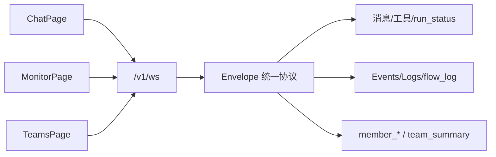

# 前端页面与功能梳理

> **版本**：2026-05-20 | **状态**：基于 `web/src` 代码梳理  
> **技术栈**：Vue 3 · Quasar · Pinia · TypeScript · Vue Router · vue-i18n  
> **编码规范**：[guides/frontend-guide.md](../guides/frontend-guide.md) · **UX**：[frontend/UX.md](../frontend/UX.md) · **架构**：[frontend/vue-design/vue-design.md](../frontend/vue-design/vue-design.md)

---

## 1. 文档定位

本文描述 **Admin 控制台**（`web/`）已实现的页面、路由、侧栏导航、域模块（`features` / `stores` / `components`）与主要用户能力，供产品、AI 开发与前后端联调对照。

**不包含**：`pkg/trpc-agent-go` 内文档站点、OpenClaw 自带 UI。

---

## 2. 应用骨架

### 2.1 布局

| 布局 | 路径 | 说明 |
|------|------|------|
| `BlankLayout` | `/login` | 登录页全屏，无侧栏 |
| `MainLayout` | `/` 下全部业务页 | 顶栏（主题/语言/用户）+ 可折叠侧栏 + `<router-view>` |

侧栏菜单定义：`web/src/config/sideNav.ts`（i18n 键 `menu.*`）。

### 2.2 鉴权

- 路由 `meta.requiresAuth: true`（`MainLayout` 子路由）需登录；`meta.public: true` 仅登录页。
- `stores/auth.ts`：登录态、登出；未登录跳转 `/login`。
- HTTP：`services/axiosHandler` + Kratos proto 生成客户端（`services/kratos/**`）。

### 2.3 目录约定（摘要）

| 目录 | 职责 |
|------|------|
| `pages/*Page.vue` | 路由页面：布局 + 组合 composable/store |
| `components/<域>/**` | 展示组件（props/emits，不直连 API） |
| `features/<域>/api.ts` | HTTP 门面（`create*Service()` / `kratosApi`） |
| `features/<域>/useXxxPage.ts` | 单页编排（Evaluation、Knowledge、A2A 等） |
| `features/<域>/types.ts`、`mappers.ts` | 类型与 DTO 映射 |
| `stores/<域>/index.ts` | Pinia：状态 + actions |
| `services/index.ts` | 导出各 proto `create*Service` |

---

## 3. 侧栏导航与路由总表

### 3.1 导航分组（`sideNav.ts`）

| 分组 i18n | 菜单项 | 路由 | 页面组件 |
|-----------|--------|------|----------|
| **主工作区** `menu.groupMain` | 概览 | `/overview` | `OverviewPage` |
| | 用量事件 | `/usage/events` | `UsageEventsPage` |
| | 对话 | `/chat` | `ChatPage` |
| | 会话 | `/sessions` | `SessionsPage` |
| | 记忆中心 | `/memory` | `MemoryCenterPage` |
| **实体编排** `menu.groupEntities` | Agent | `/agents` | `AgentsPage` |
| | Agent 分类 | `/settings/agent-categories` | `AgentCategoriesPage` |
| | Team | `/team` | `TeamsPage` |
| | Graph | `/graphs` | `GraphsPage` |
| **注册表** `menu.groupRegistry` | 模型 | `/models` | `ResourceManagerPage` |
| | Channel | `/channels` | `ChannelsPage` |
| | MCP | `/mcp-servers` | `McpServersPage` |
| | Skill | `/skills` | `SkillsPage` |
| | Plugin | `/plugins` | `PluginsPage` |
| | Plugin 运行记录 | `/plugins/runs` | `PluginRunsPage` |
| | Hook | `/hooks` | `HooksPage` |
| | Hook 投递队列 | `/hooks/deliveries` | `HookDeliveriesPage` |
| | 知识库 | `/knowledge` | `KnowledgePage` |
| | 制品 | `/artifacts` | `ArtifactsPage` |
| | 评估 | `/evaluation` | `EvaluationPage` |
| | A2A | `/a2a` | `A2APage` |
| | Tools | `/tools` | `ToolsPage` |
| | 定时任务 | `/cron` | `CronTasksPage` |
| | 定时执行记录 | `/cron/runs` | `CronRunsPage` |
| **运维** `menu.groupOps` | 监控 | `/monitor/logs` | `MonitorPage` |
| | 生态市场 | `/shop` | `EcosystemPage` |
| | 系统设置 | `/settings` | `SystemSettingsPage` |

### 3.2 未在侧栏、但有路由的页面

| 路由 | name | 页面 | 入口 |
|------|------|------|------|
| `/login` | `login` | `LoginPage` | 未登录重定向 |
| `/agents/:id/settings` | `agent-settings` | `AgentSettingsPage` | Agent 卡片/列表「设置」 |
| `/sessions/:sessionId` | `session-detail` | `SessionDetailPage` | 会话列表行点击 |
| `/graphs/new` | `graph-editor-new` | `GraphEditorPage` | Graph 列表「新增」 |
| `/graphs/:id` | `graph-editor` | `GraphEditorPage` | Graph 卡片 |
| `/graphs/:id/run/:execId` | `graph-run` | `GraphRunPage` | 执行后跳转 |
| `/teams/:teamId/runs/:runId/observatory` | `team-run-observatory` | `TeamRunObservatoryPage` | Team 运行记录 |
| `/teams/:teamId/orchestrate` | `team-orchestrate` | `TeamOrchestratePage` | Team 编排画布 |
| `/skills/runs` | `skill-runs` | `SkillRunsPage` | Skill 页链接（若有） |
| `/tools/runs` | `tool-runs` | `ToolRunsPage` | Tools 页「调用记录」 |
| `/tools/audits` | `tool-audits` | `ToolAuditsPage` | Tools 页「调用审计」 |
| `/plugins/runs` | `plugin-runs` | `PluginRunsPage` | Plugins 页「运行记录」 |
| `/hooks/deliveries` | `hook-deliveries` | `HookDeliveriesPage` | Hooks 页「投递队列」 |
| `/mcp` | — | redirect → `/mcp-servers` | 兼容旧路径 |
| `/dev/theme-preview` | `theme-preview` | `ThemePreviewPage` | 仅 DEV 模式 |

---

## 4. 页面功能说明（按域）

### 4.1 认证与系统

#### 登录 `/login`

- 后端健康检测、账号密码登录（Admin API）。
- 主题随 Quasar Dark；成功后进入 `/overview`。

#### 系统设置 `/settings`

- 工作区根目录、工作目录、**全平台月预算**（`SystemSetting.global_monthly_micro_usd`，保存时同步 `usage_quotas` global/global）。
- **Knowledge Embedder 默认**（`system_settings.knowledge_embed_*`）：provider / base_url / model / dim；API Key 仅存库不回显。env `KRATOS_KNOWLEDGE_EMBED_*` 优先。
- **评估 LLM 默认**（`system_settings.eval_sim_*` / `eval_judge_*`）：UserSim 与 LLM-as-Judge 模型；表单默认 Sim `openai` / `gpt-4o-mini`；env `KRATOS_EVAL_*` 优先。详见 [33 evaluation.md §3.4](./33%20evaluation.md)。
- 页面直连 `features/system-settings/api`（无独立 store）。

---

### 4.2 运营与用量

#### 概览 `/overview`（监控 Dashboard）

> 需求 / 设计 / 开发计划：[18 monitor-dashboard.md](./18%20monitor-dashboard.md) · [design](./18%20monitor-dashboard.design.md) · [development](./18-monitor-dashboard-development.md)

- **模型消耗看板**：时间范围、Provider/模型/状态筛选；趋势粒度 **按天 / 按小时**（`granularity=hour`）。
- 指标卡（含 **月预算使用率**，有 `usage_quotas` 时展示）、**ECharts 趋势**（`UsageTrendChart`）、**模型/Provider 占比**（`UsageBreakdownCharts`）、Top 模型/Agent、异常列表；**Runner 条**（`OverviewRunnerMetrics`）；**运维快捷入口**（`OverviewMonitorQuickLinks`）。
- **「查看明细」**跳转 `/usage/events`（携带当前 `range`）。
- **统计口径**：概览/排行/配额已用额仅计 `chat_turn` + `team_member`（不含 `team_turn`）；详见 `29 token.md` §3.6。
- 数据：`features/usage/api` + `UsageMetricCards` 等组件。
- 写入真相源：`trpc_turn` → `recordTurnUsage`（非 `recordChatIngressUsage` 默认路径）。

#### 用量事件 `/usage/events`

- **只读明细**：`model_token_usage_events` 逐条记录（一次模型调用）。
- **列**：时间、来源 `usage_kind`、Provider、模型、Agent、Session、Tokens、费用 `total_cost_micro_usd`、延迟、状态、错误摘要。
- **筛选**：范围、Provider、模型、Agent ID、**Team ID**、**来源 `usage_kind`**、状态（`success` 含历史 `ok`；`error` 含 failed/timeout 等异常）。
- **说明**：明细含 `team_turn`（整轮对账行）；概览聚合已排除，避免与 `team_member` 重复计费。
- **导出**：`GET /v1/usage/events/export` → CSV 下载。
- **数据 API**：`GET /v1/usage/events`（`features/usage/api.ts`）。
- **来源**：`usage_kind` 含 `chat_turn`、`team_member`（Team 成员 step，parallel 模式按事件流 `agent_key` 回写）、`team_turn`（整轮聚合）等。
- **费用**：`model_pricing_rules` 优先，否则 Provider 模型 `config_json` 单价；须在 `/models` 配置否则 `total_cost_micro_usd=0` 且配额 SUM 无效。

#### 用量配额（按 Agent，无独立菜单）

- **作用域**：`scope_type=agent`；单 Agent Chat 与 **Team 会话**（启用成员逐一检查）在 Turn 前 `CheckQuota` 拦截超限。
- **配置入口（唯一）**：`AgentSettingsPage` → **权限** Tab → `AgentUsageQuotaPanel`（月预算 USD、周期、**预算告警比例**、检查/保存）→ `usage_quotas` + `budget_alerts`。
- **已弃用 UI**：Agent Tab 的 `budget_monthly_cents` 仅保留库字段兼容，不在界面编辑；请使用权限 Tab 配额。
- **定价配置**：Provider/模型管理（`/models`）维护单价 → `model_pricing_rules`；不在用量事件页配置。
- API：`features/usage/quotaApi.ts`、`useAgentUsageQuota.ts`。
- 旧路由 `/usage/quotas` 重定向至 `/agents`（书签兼容）。

#### 监控 `/monitor/logs`

单页 **6 Tab**（`MonitorPage`）：

| Tab | 功能 |
|-----|------|
| **Usage** | Runner 指标（`MonitorRunnerMetrics`）+ 跳转概览/明细（`MonitorUsageDashboardLink`）；完整大盘在 `/overview` |
| **Alerts** | 告警规则、Webhook/Channel、冷却 |
| **Audit** | 审计日志表 |
| **Events** | 实时/持久化 Monitor 事件 |
| **Traces** | LLM 调用 Trace 列表；详情含流程 Tab、瀑布图、Span 树、JSONL 导出 |
| **Logs** | **流程日志**（`flow_log`，默认连接）+ **进程日志**（`log`，`server.monitor.process_log_enabled`）；`LogStreamPanel` 共享单 WS |

相关：`features/monitor/*`（含 `useLogStreamHub`）、`components/monitor/*`（`LogStreamPanel`、`FlowLogStream`、`ProcessLogStream`、`TraceWaterfall`、`FlowTracePanel` 等）。

---

### 4.3 对话与会话（核心）

#### 对话 `/chat`

主工作台，组件树以 `ChatWorkspaceShell` 为根：

| 区域 | 组件/能力 |
|------|-----------|
| 左侧 | `ChatEntitySidebar`：Agent/Team 列表、分类树、拖拽排序 |
| 中间 | `ChatMessagePanel`：消息流、Reasoning 折叠、**ReAct 步骤卡**（含 ACTION 内嵌工具卡；`reactToolLinkIndex` 去重独立 tool 行）、**A2UI 组件树预览**（`a2ui` + `userAction` 回传）、工具调用卡片、流式输出 |
| 输入 | 多模态附件、对话模式、Provider/Model 选择、发送/停止 |
| 状态 | `run_status` WS、`awaiting_user` 回复、**Follow-up Queue**（待发送列表 + 编辑/取消；后端 `message_queued` 通知，前端连续发送 UX 待 Phase 1.5）、replay 横幅 |
| 右侧 | 会话制品面板（`ChatSessionArtifactsPanel`） |

**实时通道**：`/v1/ws` + Envelope（`features/chat/ws-transport.ts`、`useEnvelopeStream.ts`）；编排集中在 `features/chat/composables/useChatWorkspace.ts`（约 1500 行，后续宜继续拆分）。

**Store**：`stores/chat/index.ts`（选中 Agent/会话等）。

#### 会话列表 `/sessions`

- 筛选：关键词、owner 类型、状态、上下文占用。
- 摘要卡、表格、选中详情、归档。
- **批量治理（待实现）**：行删除、批量选择、按保留天数归档/删除；详见 [10 session.md §7.2](./10%20session.md#72-历史列表页)。
- 跳转：`/sessions/:id` 或 Chat 继续会话。

#### 会话详情 `/sessions/:sessionId`

- Tab：消息时间线、Turns、元数据。
- 操作：归档/恢复、跳转 Chat。

#### 记忆中心 `/memory`

五 Tab 聚合 L0–L4 可观测与配置入口：

| Tab | 功能 |
|-----|------|
| 总览 | 记忆层级、待办动作 |
| 知识库 | 事实检索（L4 相关） |
| 会话记忆 | 按会话浏览 |
| 图谱与进化 | 进化/图谱占位与面板 |
| 设置 | Agent 级记忆开关与状态 |

组件：`features/memory/Memory*.vue`；Store：`stores/memory`。

---

### 4.4 Agent 与 Team

#### Agent 列表 `/agents`

- 卡片/表格视图、分类/Provider/状态筛选、收藏、分页。
- 新建 Agent（`AgentCreateDialog`）：支持 **LLM Agent** / **A2A 远程代理** 两种类型（后者见 [2 agents-create.md](./2%20agents-create.md) §9）。
- 列表徽章：`A2A ↗`（远程代理）、`A2A ↙`（LLM 且已启用 Endpoint）。
- 删除、**复制 Agent**（`DuplicateAgent`）、复制 Key、跳转设置页。
- Store：`stores/agents`；编排：`features/agents/useAgentsPage.ts`。

#### Agent 设置 `/agents/:id/settings`

多 Tab 页（`AgentSettingsPage` 页壳 + `pages/agent-settings/*Tab.vue`：Agent / 记忆 / Skill 等）：

| Tab | 功能 |
|-----|------|
| Agent | 系统提示模式、Provider/Model、**规划模式**（`planner_kind` / `planner_config_json`，`AgentPlannerSection`；空 kind 三态说明）、能力/工具、头像 |
| 记忆 | L0–L4 与 MemoryService 相关配置 |
| 文件 | Agent 提示文件；**AI 编辑**（`EditPromptFileByAI`） |
| 权限 | **用量配额**（月度 USD 上限 + 周期检查）；其余权限 PRD 待补 |
| Skill | 绑定 Skill |
| 进化 | 自进化相关 |
| 钩子 | `AgentHooksPanel` / Callback |
| **A2A** | LLM：Endpoint（AgentCard、capabilities、暴露开关）；Proxy：远程 URL 与只读 Card（[5 agent-setting.md](./5%20agent-setting.md) §10） |
| 用户实例 | 多实例配置 |

子面板：`AgentToolOverridesPanel`、`AgentFilesPanel` 等；Store：`useAgentDetailStore`。

#### Agent 分类 `/settings/agent-categories`

- 行业/部门分类树，供 Agent 创建与 Chat 侧栏过滤。

#### Team `/team`

- Team 卡片网格：模式、成员、状态筛选。
- 新建/编辑（`TeamEditorDialog`）、复制 Key、**运行记录**（`TeamRunsDialog`）、删除。
- 与 Chat Team 会话、WS `member_*` / `team_summary` 事件配合。
- Store：`stores/teams`。

#### Team Run Observatory `/teams/:teamId/runs/:runId/observatory`

- 实时步骤时间线、成员事件（M53）
- **双 Kanban Tab**（M54，详见 [54-hermes-kanban.md §4](./54-hermes-kanban.md#4-aranea-ui-规格当前--目标)）：
  - **任务看板**：`GraphTaskKanban` — 5 列；WS `graph_task_status`；admin 拖拽 unblock/approve
  - **Agent 工作看板**：`OrchestrationKanban` — 卡片内收/做/交；与 Graph focus 联动
- `GraphTaskDetailDrawer`：详情/评论/事件/日志/运行（依赖 Tab → HK-FE-05）

---

### 4.5 Graph 工作流

#### Graph 列表 `/graphs`

- 卡片：节点/边数量、DAG/检查点标记；进入编辑器或执行。

#### Graph 编辑器 `/graphs/new`、`/graphs/:id`

- Vue Flow 画布：`GraphEditorCanvas`、`GraphNodePalette`、`GraphPropertyPanel`。
- **模板**：`GraphTemplatePicker` → `createGraphFromTemplate`（含用户模板 `user:{graphId}`）。
- **校验**：保存后 `validateGraph` → `GraphValidationPanel`（点击跳转节点）。
- **布局**：节点坐标持久化于 `metadata.layout`。
- **高级**：节点属性「高级策略」（重试/缓存/Mapper）；Graph 属性显示版本号。
- **资产**：工具栏 ⋮ 菜单 — 导出/导入 JSON、版本历史（`GraphVersionPanel`）、保存为用户模板。
- 节点类型：Function、Agent、Router、LLM、Tool、HITL 等（与后端 Graph builder 对齐）。
- 保存定义、发起执行（Run 对话框）。

#### Graph 运行 `/graphs/:id/run/:execId`

- **实时观测**：`useGraphExecutionStream` → 画布节点 running/completed/failed 高亮。
- **Inspector**：`GraphRunInspector` 三 Tab — 监控 | 检查点 | 任务。
  - **监控**：`GraphRunSidebar`（ExecutionSummary + 步骤时间线 + 连接状态）。
  - **检查点**：`GraphCheckpointPanel` + `GraphTimeTravelPanel`（快照 / EditState / Resume）。
  - **任务**：`GraphTaskKanban`（WS `graph_task_status` 实时更新，列：待处理/执行中/待审核/已完成/异常）→ `GraphTaskDetailDrawer`（claim/submit/review/unblock + 评论/日志/事件）；详见 [M54 Hermes Kanban](./54-hermes-kanban.md)。
- **HITL**：`GraphHitlDialog`（approve/dismiss + lineage/checkpoint/resume_map）。
- 只读画布（`readOnly`）。

Store：`stores/graph`（含 validate/template/checkpoint/task actions）；API：`features/graph/api.ts`；Runtime：`features/graph/runtime/` · Tasks：`features/graph/tasks/`。

---

### 4.6 注册表：模型、渠道、MCP、Skill、Plugin、Hook

#### 模型 `/models`

- `ResourceManagerPage` + `meta.resource: llm-provider-models`。
- Provider 列表、模型行、启用/禁用、趋势对话框、密钥与能力分类。

#### Channel `/channels`

- 渠道 CRUD：飞书/钉钉/企微等类型、Webhook、凭据引用、绑定 Agent。
- `ChannelEditorDialog`、`ChannelCatalogPicker`。

#### MCP `/mcp-servers`

- MCP Server CRUD：传输、OAuth、超时、**重连状态 chip**（与 Monitor 事件联动）。
- `McpServerFormDialog`、`McpServerItem`。

#### Skill `/skills`

- Skill 列表、启用、统计条、ZIP 导入（`SkillUploadPlaceholder` + 导入任务轮询）。
- `/skills/runs`：调用记录表。

#### Plugin `/plugins` · `/plugins/runs`

- 9 内置 Plugin 表：类型、Callback、Scope、排序、启用、JSON 配置。
- 详情抽屉：Agent 绑定（global / agent_id）、运行统计。
- 运行记录页：对接 `ListPluginRuns`（plugin/agent/callback/status 筛选）。

#### Hook `/hooks`

- Callback 规则 CRUD：`CallbackEditor`（phase/agent/动作）。
- 与 Runner Hook / Plugin 链配合。

---

### 4.7 知识、制品、评估、A2A

#### 知识库 `/knowledge`

- 集合列表 + 文档面板 + 语义检索测试。
- Embedder 配置面板；文档入库（含 WS 进度 `useKnowledgeIngestWs`）。
- Rerank 选项（`use_rerank` / `rerank_candidates`）与后端 KN-01 对齐。
- 编排：`useKnowledgePage.ts`；Store：`stores/knowledge`。

#### 制品 `/artifacts`

- 按 Session 筛选、上传、预览/下载/删除。
- Chat 侧通过 `artifact` store 与消息附件联动。

#### 评估 `/evaluation`

- 数据集 CRUD、上传用例、启动 Eval Run（`metrics` / `num_runs` / `use_user_simulation`）、查看运行列表。
- **趋势与 A/B**：`EvaluationAnalyticsPanel` — Agent 趋势表、`GetAgentEvalTrend`；多选 Run → `compareEvalRuns`。
- 用例结果对话框：**人工标注**、**导出 CSV/JSON**（`exportRunResults.ts`）。
- 编排：`useEvaluationPage.ts`；Store：`stores/evaluation`（部分页面亦直连 `features/evaluation/api`）。

#### A2A `/a2a`

**定位**：工作区级 A2A **注册表 / 运维** 页；per-Agent 的 Endpoint / Proxy 配置在 Agent 设置 A2A Tab。

四 Tab + 远程注册：

| Tab | 功能 |
|-----|------|
| 发现 | AgentCard 列表（本地 + 远程 registry 合并；workspace/capability 筛选） |
| 远程注册 | 注册/预览/删除远程 Agent（api_key / bearer / mTLS） |
| 审计 | Invoke 审计记录 |
| Invoke | 测试调用目标 Agent（可选 workspace，Admin 工作区策略） |

公开 Endpoint URL（LLM Agent 启用 AgentCard 后）：`/v1/a2a/public/{agent_id}`（A2A 协议：一元或 SSE 流式，非 WebSocket）。

联邦网关：`GET /v1/a2a/gateway/discover`（local + remote，可选 `check_health`）。

编排：`useA2APage.ts`；组件：`A2ARemoteAgentPanel.vue` 等；mapper 单测：`features/a2a/__tests__/mappers.spec.ts`。

#### Gateway 出站 Webhook（API-only）

**无管理页**。通过 REST 管理运行终态回调配置：

| 方法 | 路径 |
|------|------|
| POST | `/v1/gateway/webhooks` |
| GET | `/v1/gateway/webhooks` |
| PUT | `/v1/gateway/webhooks/{id}` |
| DELETE | `/v1/gateway/webhooks/{id}` |

`PUT` 时 `enabled` 为 optional：未传则保留原值。触发事件：`run.completed` / `run.failed` / `run.cancelled`（HMAC-SHA256 签名）。详见 [35 gateway.md](./35%20gateway.md)。

---

### 4.8 Tools 与 Cron

#### Tools `/tools`

- Tool 目录：分类、风险级、启用、Schema 编辑、TestTool。
- Agent 级 Override 在 Agent 设置页；全局「调用记录」→ `/tools/runs`。

#### Tool 调用记录 `/tools/runs`

- 筛选与表格：`ToolRunsTable`。

#### Tool 调用审计 `/tools/audits`

- **结构化审计**：追溯谁在何时调用了什么工具，默认保留 90 天。
- **筛选**：tool_key、agent_id、user_id、status（success / error / blocked / timeout 等）。
- **数据**：`tool_invocation_audit` 表；API `GET /v1/tools/audits`。
- **组件**：`ToolAuditsFilters`（筛选栏）+ `ToolAuditsTable`（审计表格）+ `ToolHeroSection`（页头）。
- **编排**：`features/tools/useToolAuditsPage.ts`；Store：`stores/tools`（`loadToolAudits` action）。
- **入口**：Tools 页「调用审计」链接。

#### 定时任务 `/cron`

- Cron 任务 CRUD：cron 表达式、绑定 Agent、启用、最近执行摘要。

#### Cron 执行记录 `/cron/runs`

- 历史执行列表与状态。

Store：`stores/cron`；API：`features/cron/api.ts`。

---

### 4.9 生态市场

#### 生态市场 `/shop`

- 产品列表、搜索、发布（`publishEcosystemProduct`）、安装（`installEcosystemProduct`）。
- 编排：`useEcosystemPage.ts`；Store：`stores/ecosystem`。

---

## 5. Pinia Store 与 Feature 模块对照

| Store (`stores/`) | Feature API (`features/`) | 主要页面 |
|-------------------|---------------------------|----------|
| `app` | — | 全局 UI 状态 |
| `auth` | `admin` | Login |
| `chat` | `chat` | Chat |
| `session` | `session` | Sessions、SessionDetail |
| `agents` + `agents/detail` | `agents` | Agents、AgentSettings |
| `teams` | `teams` | Teams、Chat(Team) |
| `graph` | `graph` | Graphs、Editor、Run |
| `memory` | `memory` | MemoryCenter |
| `monitor` | `monitor` | Monitor |
| `usage` | `usage` | Overview、UsageEvents；配额在 Agent 设置「权限」Tab |
| `platform` | `platform` | ResourceManager(models) |
| `channels` | `channels` | Channels |
| `mcp` | `mcp` | McpServers |
| `skills` | `skills` | Skills、SkillRuns |
| `plugins` | `plugins` | Plugins |
| `hooks` | `hooks` | Hooks |
| `tools` | `tools` | Tools、ToolRuns |
| `cron` | `cron` | CronTasks、CronRuns |
| `knowledge` | `knowledge` | Knowledge |
| `artifact` | `artifact` | Artifacts、Chat 附件 |
| `evaluation` | `evaluation` | Evaluation |
| `a2a` | `a2a` | A2A |
| `avatar` | `avatar` | Agent 头像选择器 |
| `system-settings` | `system-settings` | SystemSettings |
| `heartbeat` | `heartbeat` | 后台心跳（布局级） |
| `orchestration` | `orchestration` | TeamRunObservatory、TeamOrchestrate、Chat 后台任务 |
| `admin` | `admin` | Login（鉴权 store） |
| `ecosystem` | `ecosystem` | Ecosystem |
| — | `event` | Monitor Events（页内直连 API，无独立 Store） |

---

## 6. 实时通信与 Monitor 数据流

- Chat/Team：**主实时通道**为 WebSocket，非 SSE（与后端文档口径一致）。
- Monitor Logs：二级 Tab **流程** / **进程**；`flow_log` 始终可用；进程 log 由 `server.monitor.process_log_enabled` 控制，切到进程 Tab 自动恢复接收。
- Traces：usage 元数据 `metadata_json.spans` + 详情瀑布图（`TraceWaterfall.vue`）。

---

## 7. 国际化与主题

- i18n：`web/src/locales/`（`zh-CN`、`en-US`）；侧栏与部分系统页使用 `menu.*`、`settingsPage.*` 键。
- 主题：Quasar Dark + `css/theme/` CSS 变量；`MainLayout` 顶栏切换昼夜。
- 部分业务页文案仍为硬编码中文（Chat 工具卡片、Reasoning 等，见 [1-chat-development.md](./1-chat-development.md) CHAT-06）。

---

## 8. 成熟度与已知缺口

| 维度 | 评价 | 说明 |
|------|------|------|
| 路由覆盖 | **完整** | 核心平台能力均有入口 |
| 分层规范 | **中等** | Evaluation/Ecosystem/SystemSettings 等页仍直连 `features/*/api`；`AgentSettingsPage` 体量偏大 |
| 组件拆分 | **中等** | Knowledge/Evaluation/A2A 已 page-to-components；Chat workspace 仍集中在大 composable |
| 单测 | **偏弱** | mapper/flow 有单测；多数页面无 E2E |
| Store 策略 | **混合** | 新模块多 store + composable；老页部分 page 直连 API |
| UX 安全 | **良好** | 破坏性操作（删除/回滚/清除/终止）均有二次确认；表单验证覆盖核心对话框；编辑器关闭检测未保存变更 |
| 国际化 | **中等** | 核心 Chat/Agent/Session 已 i18n；Monitor/Hooks/ResourceManager 部分标签已中文化，仍有零星硬编码 |

**未单独成页的能力**（通过弹窗或其它页嵌入）：Skill 导入任务、Plugin 配置编辑、Agent 高级对话框、Monitor Trace 详情抽屉等。

### 8.1 UX 改进记录（2026-05-28）

| 类别 | 改进项 |
|------|--------|
| 破坏性操作保护 | Team/Graph/节点/凭据/版本回滚/取消执行/终止 Run/清除日志/风险级别修改 — 全部增加确认对话框 |
| 表单验证 | Evaluation/Ecosystem/Hooks/AlertRules/Agent 保存/A2A 保存 — 增加前端校验 + 按钮禁用 |
| 编辑器保护 | Tool 编辑器、Skill 编辑器关闭时检测未保存变更并确认 |
| Chat 体验 | IME 防误触、发送按钮空输入禁用、草稿保存、WS 连接状态指示、附件文件名加宽+tooltip、思考指示器动画、反馈按钮选中态、ReasoningPeek 单击展开 |
| Agent 设置 | 加载失败显示错误页+重试、收藏只 patch 单字段、保存仅模型变更时校验、返回按钮命名路由、模型选择器移除 hide-selected |
| Graph | 节点删除级联确认、Router 分支标签、任务详情非全屏、时间回溯滑块、看板拖拽提示、属性面板全局设置入口 |
| Orchestration | HITL 拒绝/终止拆分为两个按钮、终止按钮改 negative 色+确认、Timeline 移除 RPC 暴露 |
| 国际化 | TraceList/FlowLogExport/HooksPage/ResourceManager/SessionDetail — 英文标签中文化 |
| 数据展示 | Session 消息 Markdown 渲染、Knowledge 搜索 score 2 位小数、Cron 立即执行 loading |
| 死代码清理 | 删除 ChatToolCallCard、ToolDetailDialog、ToolEditorForm |

---

## 9. 关联文档

| 文档 | 用途 |
|------|------|
| [guides/frontend-guide.md](../guides/frontend-guide.md) | 前端编码红线与分层 |
| [frontend/vue-design/vue-design.md](../frontend/vue-design/vue-design.md) | 详细架构与迁移剧本 |
| [1-chat-development.md](./1-chat-development.md) | Chat/WS 需求与验收 |
| [18-monitor-development.md](./18-monitor-development.md) | Monitor 运维六 Tab |
| [18-monitor-dashboard-development.md](./18-monitor-dashboard-development.md) | 概览 Dashboard `/overview` |
| [guides/execution-plan.md](../guides/execution-plan.md) | 迭代进度真相源 |

---

## 10. 代码索引（快速定位）

| 类型 | 路径 |
|------|------|
| 路由表 | `web/src/router/routes.ts` |
| 侧栏 | `web/src/config/sideNav.ts` |
| 页面 | `web/src/pages/*.vue` |
| 展示组件 | `web/src/components/<域>/` |
| Feature | `web/src/features/<域>/` |
| Store 导出 | `web/src/stores/index.ts` |
| HTTP 客户端 | `web/src/services/index.ts` |
