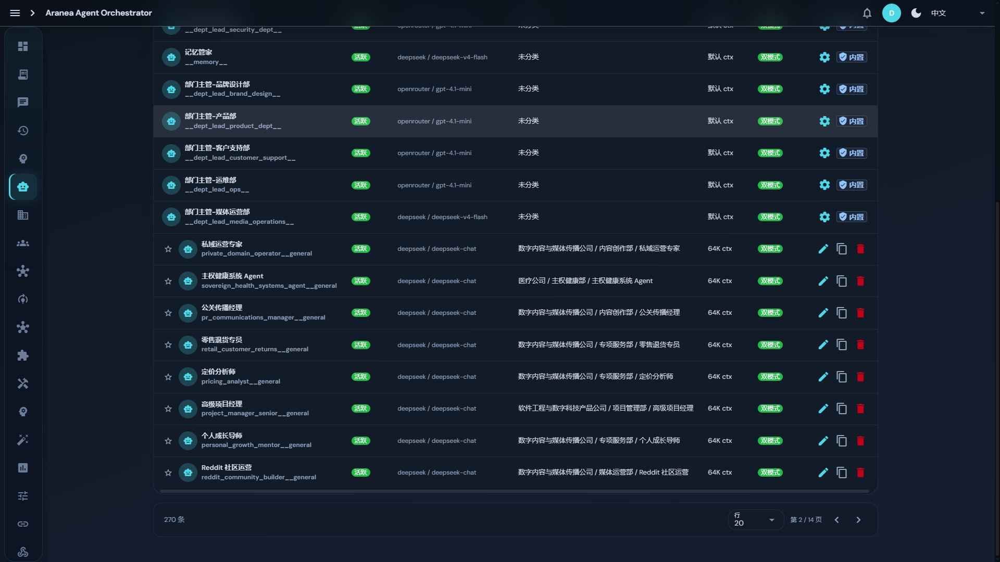
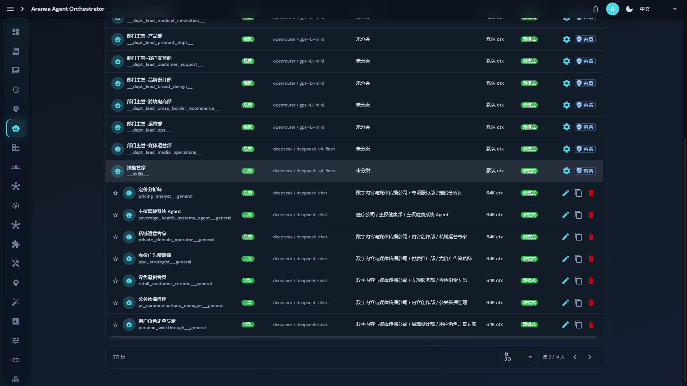
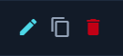
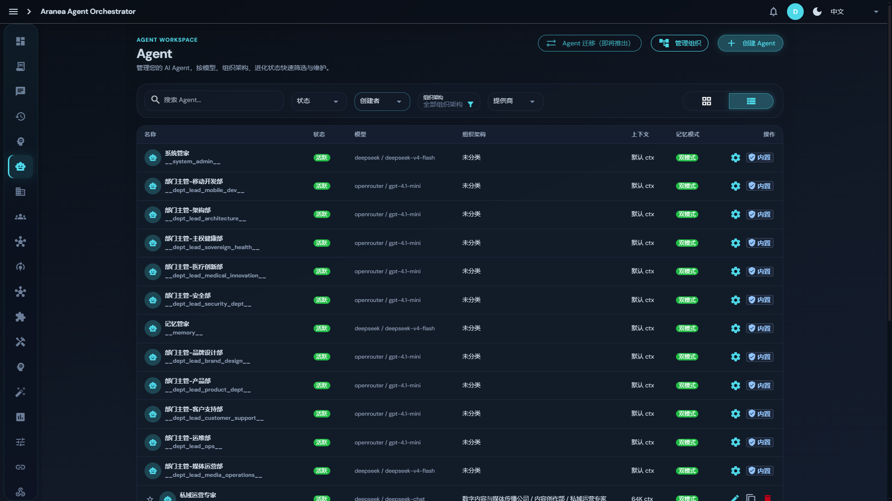
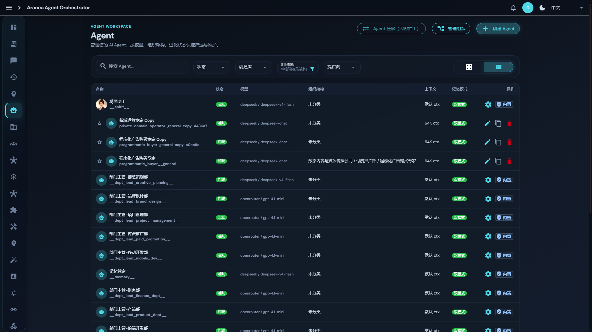
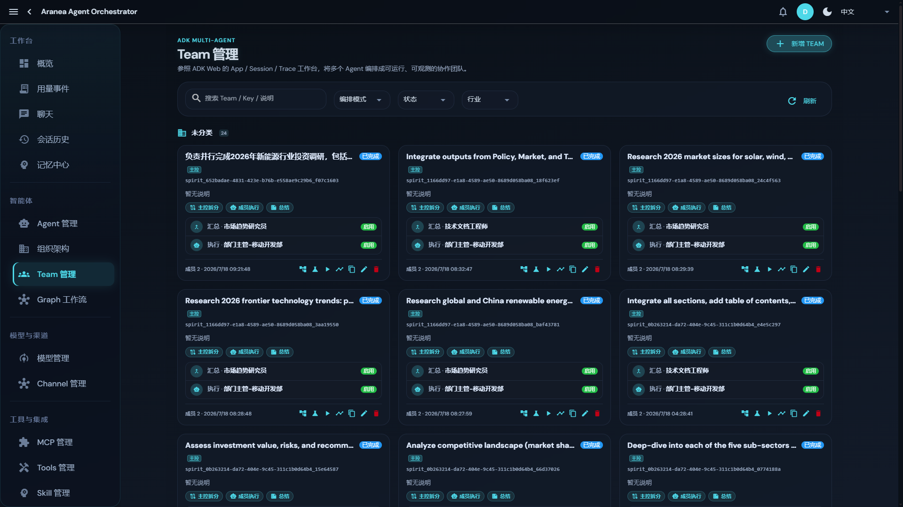
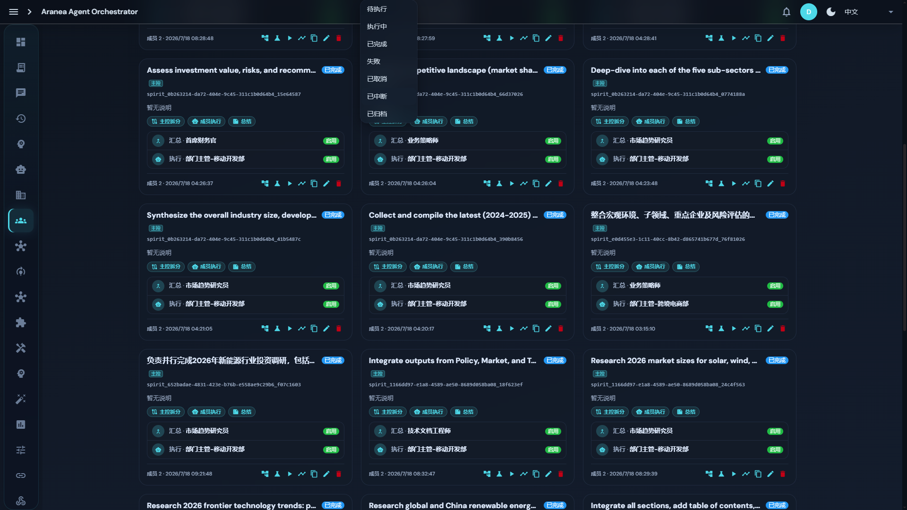
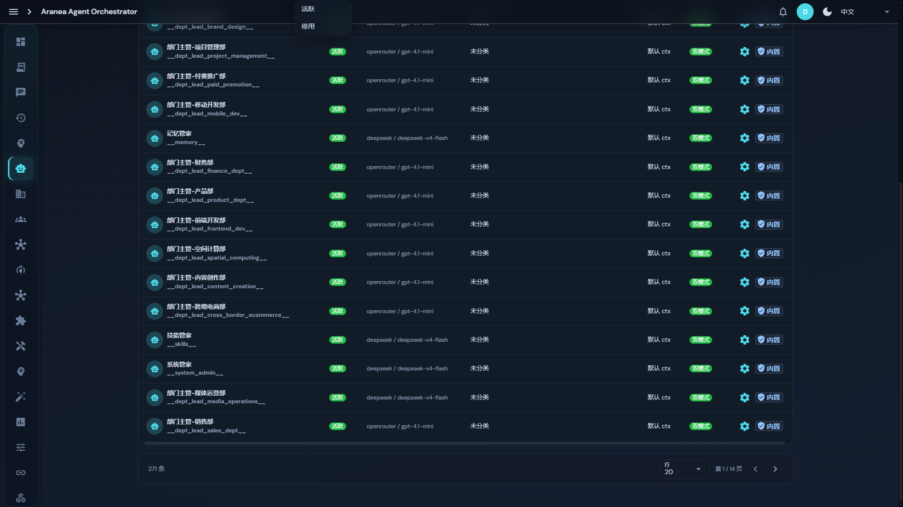

# Dogfood Report: Aranea-Agents 管理后台 — Agent 管理页面

| Field | Value |
|-------|-------|
| **Date** | 2026-07-18 |
| **App URL** | http://localhost:9001/ |
| **Session** | aranea-admin |
| **Scope** | Agent 管理页面（各 table 页的 UI 排版与表格按钮功能） |

## Summary

| Severity | Count |
|----------|-------|
| Critical | 0 |
| High | 0 |
| Medium | 3 |
| Low | 4 |
| Revoked | 1 |
| **Total** | **8** |

> 撤销说明：
> 1. 初稿中「Agent 列表页卡死」经 Playwright 交叉验证为自动化工具（integrated_browser WebView）自身问题，非应用 Bug，已撤销。
> 2. ISSUE-008（keyword=null 警告）经源码核查为 dev server 陈旧 bundle 产物，当前代码 `stores/agents/index.ts:22` 已初始化 `ref('')`，全量刷新后不再复现，降级为观察项。

## Issues

### ISSUE-001: 克隆 Agent 无任何确认与反馈，静默创建副本

| Field | Value |
|-------|-------|
| **Severity** | medium |
| **Category** | ux |
| **URL** | http://localhost:9001/#/agents |
| **Repro Video** | N/A |

**Description**
在 Agent 表格视图中点击行内「克隆」（content_copy 图标）按钮后，系统立即静默创建副本：`POST /v1/agents/{id}/duplicate` 直接发起，列表总数从 270 变为 271，页面数据刷新（当前页内容跳变）。全程没有确认对话框、没有 loading、没有 toast 成功提示，也没有自动定位到新创建的副本行。用户无法感知克隆是否成功，也不知道副本叫什么、在哪里。对比之下，「删除」操作有确认对话框（见 agent-clone-dialog.png），克隆的风险反馈明显不对称。

**Repro Steps**
1. 打开 http://localhost:9001/#/agents 表格视图，翻到第 2 页
   
2. 点击「私域运营专家」行的克隆（content_copy）图标
3. **Observe:** 网络面板出现 `POST .../duplicate` 200，列表静默刷新，左下角总数从「270 条」变为「271 条」，无任何 toast/dialog
   

---

### ISSUE-002: 表格图标按钮缺少 aria-label / title，无可访问性与悬停提示

| Field | Value |
|-------|-------|
| **Severity** | medium |
| **Category** | accessibility / ux |
| **URL** | http://localhost:9001/#/agents |
| **Repro Video** | N/A |

**Description**
Agent 表格行内所有操作按钮（编辑 edit、克隆 content_copy、删除 delete、内置行的设置 settings）经 DOM 核查均无 `aria-label` 和 `title` 属性（实测返回均为 null）。悬停时没有任何 tooltip 说明按钮用途；屏幕阅读器只能朗读 Material 图标的英文名称（如 "content_copy"）。新用户难以猜测克隆与编辑图标的功能差异。

**Repro Steps**
1. 打开 http://localhost:9001/#/agents 表格视图第 2 页（非内置 Agent 行）
   
2. 将鼠标悬停在行内任意图标按钮上，或用 DevTools 检查按钮属性
3. **Observe:** 无 tooltip 弹出；DOM 中按钮 `aria-label`/`title` 均为 null
   

---

### ISSUE-003: 页面描述宣称支持「进化状态」筛选，实际筛选栏无此选项

| Field | Value |
|-------|-------|
| **Severity** | low |
| **Category** | content / ux |
| **URL** | http://localhost:9001/#/agents |
| **Repro Video** | N/A |

**Description**
Agent 管理页副标题为「管理您的 AI Agent，按模型、组织架构、进化状态快速筛选与维护。」，但筛选栏实际只有「状态 / 创建者 / 组织架构 / 提供商」四个筛选项，没有「进化状态」筛选。文案与功能不一致，易误导用户寻找不存在的功能。

**Repro Steps**
1. 打开 http://localhost:9001/#/agents
   
2. **Observe:** 副标题提到「进化状态」筛选，但筛选栏中不存在该选项
   

---

### ISSUE-004: 分页状态不同步 URL，刷新后丢失页码

| Field | Value |
|-------|-------|
| **Severity** | low |
| **Category** | ux |
| **URL** | http://localhost:9001/#/agents |
| **Repro Video** | N/A |

**Description**
Agent 列表翻到第 2 页后 URL 仍为 `#/agents`（页码、每页行数、搜索词、筛选条件均不写入 URL）。实测 `location.reload()` 后列表回到「第 1 / 14 页」，之前所在页码丢失，用户需重新翻页；也无法通过链接分享特定分页状态。

**Repro Steps**
1. 打开 http://localhost:9001/#/agents 表格视图，翻到第 2 页（底部显示「第 2 / 14 页」，URL 不变）
   
2. 按 F5 刷新页面
3. **Observe:** 列表回到「第 1 / 14 页」，之前所在页码丢失
   

---

### ISSUE-005: 「组织架构」筛选控件样式与其他筛选下拉不一致

| Field | Value |
|-------|-------|
| **Severity** | low |
| **Category** | visual |
| **URL** | http://localhost:9001/#/agents |
| **Repro Video** | N/A |

**Description**
筛选栏中「状态 / 创建者 / 提供商」均为标准下拉框样式（圆角边框 + 下拉箭头），而「组织架构」显示为两行文本（标签「组织架构」+ 值「全部组织架构」+ 漏斗 filter_alt 图标），无统一边框，视觉上与相邻控件不对齐、风格突兀。

**Repro Steps**
1. 打开 http://localhost:9001/#/agents
   
2. **Observe:** 筛选栏中「组织架构」控件为双行文本 + 漏斗图标，与其他单线下拉框不一致
   

---

### ISSUE-006: Quasar Select 下拉菜单在页面滚动后不关闭，脱离锚点钳位到视口顶部

| Field | Value |
|-------|-------|
| **Severity** | medium |
| **Category** | visual / ux |
| **URL** | http://localhost:9001/#/team 、 http://localhost:9001/#/agents |
| **Repro Video** | N/A |

**Description**
Team 管理页与 Agent 管理页的主滚动容器均为 `window`（已实测核查，唯一独立滚动容器是侧栏 `.app-sidebar__scroll`）。打开任一 Quasar Select 筛选下拉（如「状态」）后滚动页面，菜单**不随滚动关闭**（Quasar 默认行为应在滚动时关闭），也不跟随锚点，而是被钳位到视口顶部（`top=0`）、高度被裁剪，漂浮在与锚点完全脱离的位置。例如 Team 页：菜单初始 `top=233`（紧贴「状态」下拉），`window.scrollTo(0, 800)` 后菜单仍打开且 `top=0`；Agents 页同样复现（`top=239` → 滚动 600 后 `top=0`、高度裁到 75px）。用户滚动后会看到一个悬空的选项列表，无法判断属于哪个筛选控件。疑似应用布局未使用 Quasar 标准滚动容器，导致 q-menu 的滚动关闭/重定位逻辑失效。

**Repro Steps**
1. 打开 http://localhost:9001/#/team（页面在顶部）
   
2. 点击筛选栏的「状态」下拉，菜单正常在其下方打开（top≈233）
3. 向下滚动页面（如滚动 800px）
4. **Observe:** 菜单未关闭，漂浮在视口顶部，与「状态」下拉完全脱离
   
5. Agents 页同样复现
   

---

### ISSUE-007: 操作列混入非操作元素，「内置」徽章占据操作列

| Field | Value |
|-------|-------|
| **Severity** | low |
| **Category** | visual / ux |
| **URL** | http://localhost:9001/#/agents |
| **Repro Video** | N/A |

**Description**
表格「操作」列对内置 Agent 同时显示设置齿轮链接和「内置」状态徽章。「内置」是属性标识而非操作，放在「操作」列语义不符；且内置徽章旁边无 tooltip 说明。非内置 Agent 行则显示 3 个纯图标按钮（编辑/克隆/删除），同一列两种内容形态差异大。建议将「内置」徽章移至「状态」列或名称列，操作列保持纯操作语义。

**Repro Steps**
1. 打开 http://localhost:9001/#/agents 表格视图
   
2. **Observe:** 第 1 页内置 Agent 操作列为「齿轮 + 内置徽章」，第 2 页普通 Agent 为「编辑/克隆/删除图标」，列内容形态不统一
   

---

### ISSUE-008: Console 持续报 Vue prop 类型警告（keyword 传 null）— 已降级：dev server 陈旧 bundle

| Field | Value |
|-------|-------|
| **Severity** | low（观察项） |
| **Category** | console |
| **URL** | http://localhost:9001/#/agents |
| **Repro Video** | N/A |

**Description**
测试初期（12:59 会话）Console 反复输出 Vue 警告：`[Vue warn]: Invalid prop: type check failed for prop "keyword". Expected String with value "null", got Null`，组件为 `<AgentsListSection>`，初始加载触发 3 次、后续数据刷新每次 2 次（console-2026-07-18T12-59-47-301Z.log 留存证据）。但源码核查显示 `stores/agents/index.ts:22` 为 `const keyword = ref('')`，全项目无任何路径将 keyword 置为 null；且 13:07 全量刷新后警告不再复现（翻页、重新导航均不再触发）。结论：警告来自 dev server 在会话早期提供的**陈旧 bundle**（该模块此前可能为 `ref(null)`），当前代码已无此问题。残留真实观察项：WebSocket 心跳探测告警 `ws://localhost:9001/v1/ws?session_id=*&probe=1 failed`（`useServerHeartbeat.ts:258`）每次页面加载仍出现 1 条，建议心跳探测失败降级为 debug 或静默重试。

**Repro Steps**
1. （陈旧 bundle 状态下）打开 http://localhost:9001/#/agents 并打开浏览器 Console
2. **Observe:** 持续输出 `Invalid prop: keyword` 警告（当前 bundle 已不可复现）

---

## 附：其余表格页面核查结论

| 页面 | 结论 |
|------|------|
| Agent 管理（grid + table） | 上述 ISSUE-001~005、007、008；grid 视图排版正常 |
| Team 管理 | ISSUE-006（滚动后菜单脱离锚点）；卡片网格排版正常，筛选/分页可用 |
| 用量事件（#/usage/events） | 排版正常，筛选栏（范围/Provider/模型/Agent ID/Team ID/来源/状态 + 重置/查询/删除记录/导出 CSV）功能可用；轻微建议：「延迟(MS)」列原始毫秒值（如 267005）可读性差，建议格式化为 `4m27s` 或 `267.0s` |
| 删除确认 | 删除 Agent 有确认对话框（二次确认），符合预期（agent-clone-dialog.png） |
