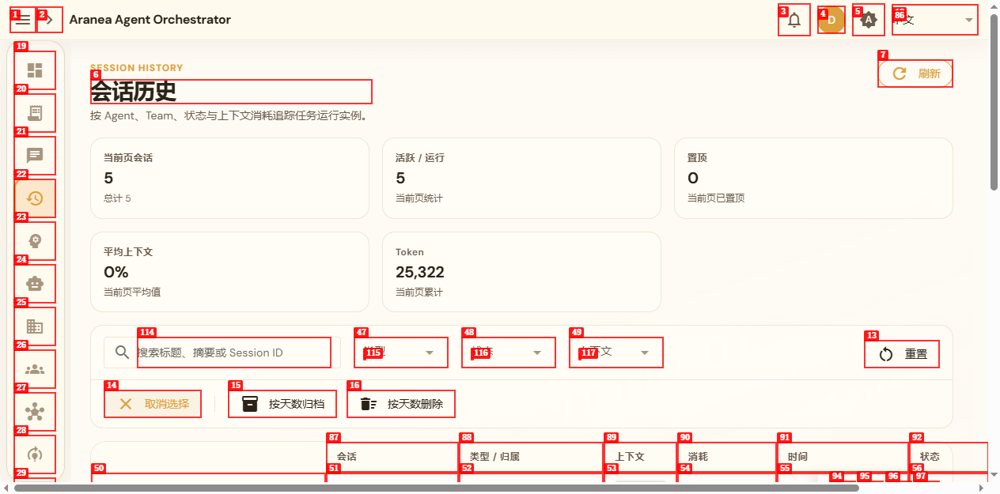
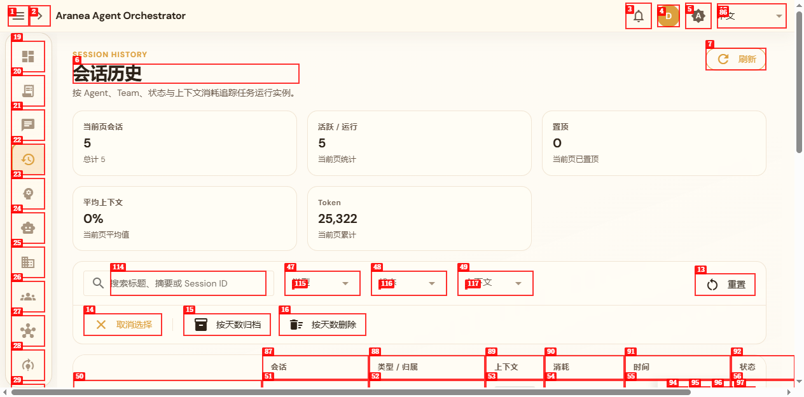
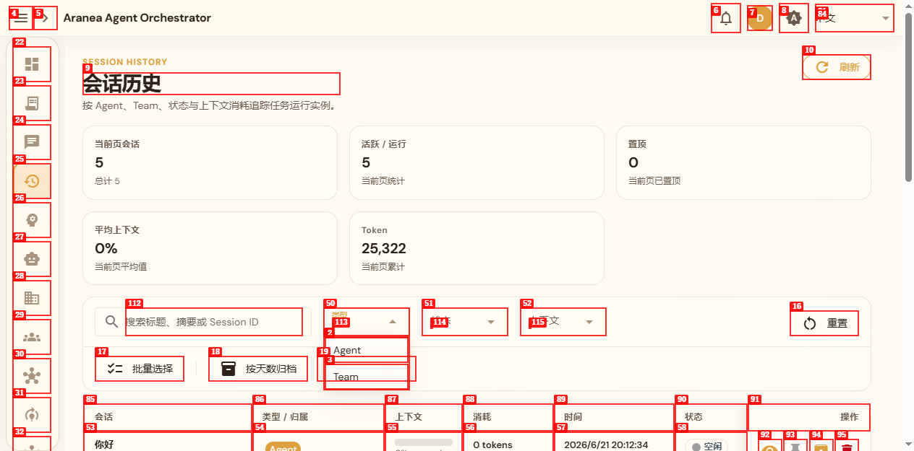
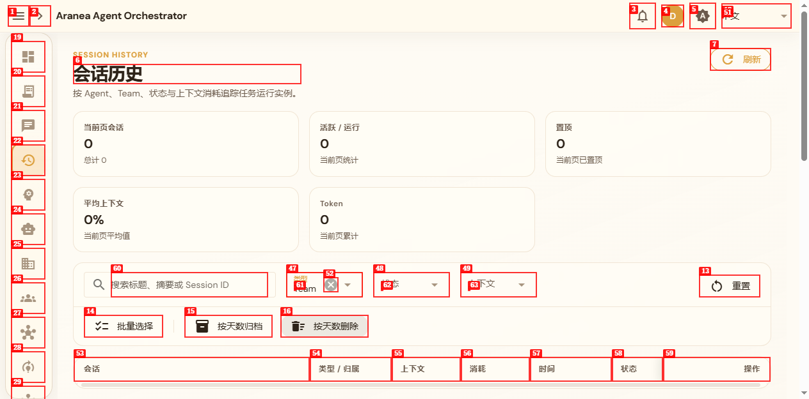
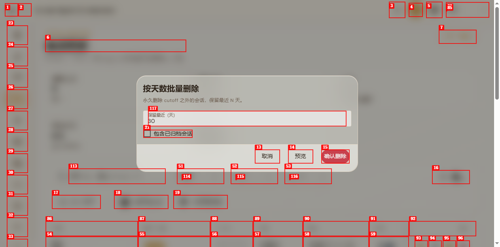
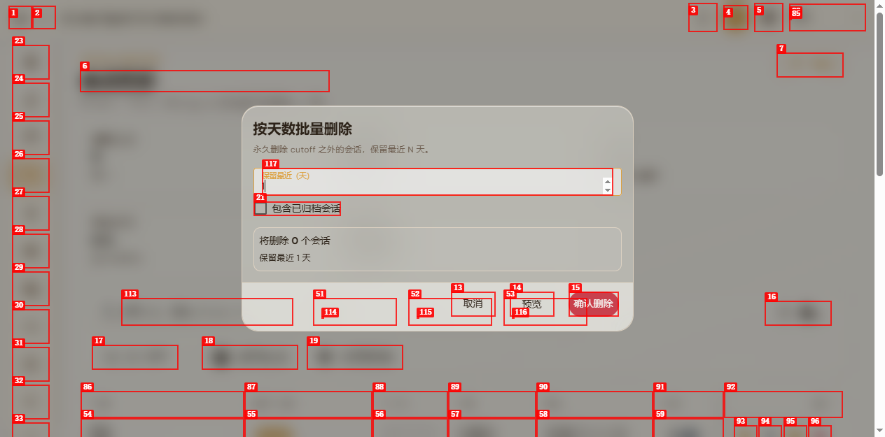
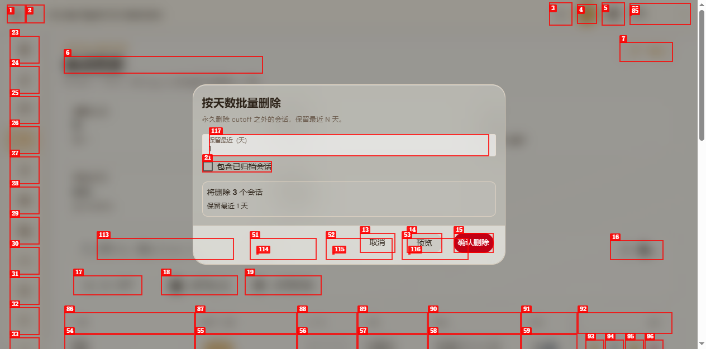

# Dogfood Report: Aranea Agent Orchestrator - 会话历史页面

| Field | Value |
|-------|-------|
| **Date** | 2026-06-21 |
| **App URL** | http://localhost:9001/sessions |
| **Session** | sessions-qa |
| **Scope** | 会话历史页面（Session History）所有功能按钮与显示 UI |

## Summary

| Severity | Count |
|----------|-------|
| Critical | 0 |
| High | 2 |
| Medium | 3 |
| Low | 1 |
| **Total** | **6** |

## Issues

### ISSUE-001: 批量选择模式缺少可视选择控件

| Field | Value |
|-------|-------|
| **Severity** | High |
| **Category** | ux / functional |
| **URL** | http://localhost:9001/sessions |
| **Repro Video** | N/A |

**Description**

点击工具栏“批量选择”按钮后，表格进入批量选择模式（按钮文案变为“取消选择”），但每一行左侧只显示 Session ID 文本，未出现复选框或其他选择指示器。用户无法判断哪些行已被选中，也无法确认批量选择功能是否真正生效。

**Repro Steps**

1. 打开“会话历史”页面
   

2. 点击工具栏“批量选择”按钮
   

3. 观察表格首列：仅显示 Session ID 文本，无复选框或选中态
   

4. 点击某行首列的 Session ID 单元格，无任何选中反馈
   

---

### ISSUE-002: 会话标题链接点击无响应

| Field | Value |
|-------|-------|
| **Severity** | High |
| **Category** | functional |
| **URL** | http://localhost:9001/sessions |
| **Repro Video** | N/A |

**Description**

表格中“会话”列的标题（如“你好 b5faa165-...”）以链接形式渲染，点击后期望进入会话详情或聊天页面，但实际无任何跳转或页面变化。链接点击后，同一行的操作按钮数量还会从 4 个减少到 2 个，显示状态不一致。

**Repro Steps**

1. 在“会话历史”页面找到第一行“你好 b5faa165-...”
   

2. 点击该行“会话”列的链接
   

3. 页面未发生跳转，仍停留在会话列表
   

4. 同时观察到第一行操作按钮数量减少（从 link+3 buttons 变为 link+1 button）
   

---

### ISSUE-003: 行操作按钮无标签且首行与其他行不一致

| Field | Value |
|-------|-------|
| **Severity** | Medium |
| **Category** | accessibility / ux |
| **URL** | http://localhost:9001/sessions |
| **Repro Video** | N/A |

**Description**

表格每行“操作”列包含多个按钮，但所有按钮均无文本标签，也无 aria-label/tooltip，屏幕阅读器用户无法识别其功能。此外，第一行“操作”列的元素结构与其他行不同：第一行为 link + generic + button + button，其他行为 link + button + button + button，显示不一致。

**Repro Steps**

1. 打开“会话历史”页面
   

2. 对比第一行与其他行的“操作”列：第一行存在额外的 generic 元素
   

3. 点击第一行操作区后，generic 元素变为 button，但第二行及以下始终为 link+3 buttons
   

---

### ISSUE-004: 筛选结果为空时缺少空状态提示

| Field | Value |
|-------|-------|
| **Severity** | Medium |
| **Category** | ux |
| **URL** | http://localhost:9001/sessions |
| **Repro Video** | N/A |

**Description**

使用“类型”筛选器选择“Team”后，表格中所有行被过滤掉，但页面未显示任何空状态提示（如“未找到匹配的会话”）。用户无法区分是网络加载中、无数据还是筛选条件过于严格。

**Repro Steps**

1. 打开“会话历史”页面
   

2. 点击“类型”筛选器，选择“Team”
   

3. 表格变为空白，仅保留表头，无空状态提示
   

---

### ISSUE-005: 按天数删除/归档的确认按钮未说明禁用原因

| Field | Value |
|-------|-------|
| **Severity** | Medium |
| **Category** | ux |
| **URL** | http://localhost:9001/sessions |
| **Repro Video** | N/A |

**Description**

打开“按天数删除”或“按天数归档”对话框后，“确认删除”/“确认归档”按钮默认处于禁用状态。用户无法直接得知禁用原因——实际上需要先点击“预览”按钮计算可删除/归档的会话后，确认按钮才会启用。界面缺少提示文本或引导，容易造成困惑。

**Repro Steps**

1. 打开“会话历史”页面，点击“按天数删除”
   

2. 观察“确认删除”按钮默认禁用，无提示说明原因
   

3. 将“保留最近（天）”改为 1，点击“预览”后确认按钮才启用
   
   

---

### ISSUE-006: 页面顶部的英文标题与整体中文界面不一致

| Field | Value |
|-------|-------|
| **Severity** | Low |
| **Category** | content |
| **URL** | http://localhost:9001/sessions |
| **Repro Video** | N/A |

**Description**

页面主要内容区上方存在静态文本“SESSION HISTORY”，而页面标题、按钮、表头均为中文。该英文标签在中文界面中显得突兀，建议统一为“会话历史”或移除。

**Repro Steps**

1. 打开“会话历史”页面
2. 在标题“会话历史”上方可看到“SESSION HISTORY”英文文本
   （见完整页面快照：screenshots/qa-initial.png 及 filter-type-options.png 中的 StaticText "SESSION HISTORY"）

---
