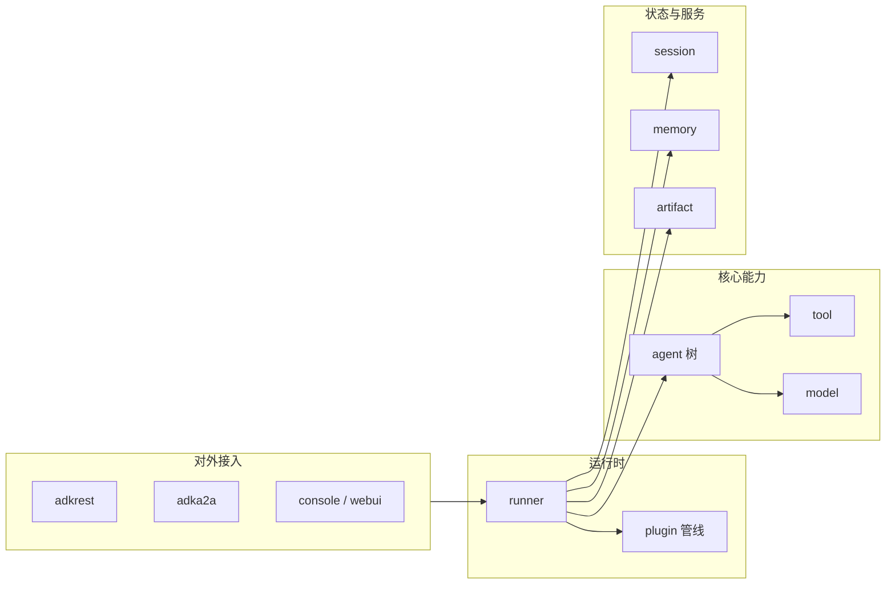

# Agent Development Kit（ADK）Go 版 — 中文说明

[](LICENSE)

本仓库是 Google **Agent Development Kit** 的 **Go** 实现（模块路径：`google.golang.org/adk`）。它将常见的软件工程实践（模块化、可测试、可部署）套用到 AI Agent 的开发上，适合构建从简单对话到多 Agent 编排的云原生应用。实现上以对 Gemini 系列优化为主，但设计上**模型无关、部署方式无关**，也可与其它框架组合使用。

---

## 核心特性（简要）

- **惯用 Go**：接口与并发模型贴合 Go 生态。
- **代码优先**：Agent、工具与编排逻辑用 Go 直接表达，便于测试与版本管理。
- **丰富工具生态**：内置多种 Tool，也支持函数封装、MCP、Skills 等扩展方式。
- **多 Agent 编排**：通过子 Agent 树、工作流 Agent（串行/并行/循环）等组合复杂系统。
- **多种对外形态**：控制台、REST、A2A、Web UI 等，便于本地调试与生产接入。
- **可观测性**：与 OpenTelemetry 等集成，REST 侧提供调试与追踪相关能力。

官方文档与更多语言版本见：[ADK 文档](https://google.github.io/adk-docs/)、[示例仓库](https://github.com/google/adk-go/tree/main/examples)、以及 Python/Java/Web 等姊妹项目（见根目录 [README.md](README.md)）。

---

## 目录与职责概览

以下为仓库**顶层**常用包与目录的职责说明（`internal/` 为库内部实现，一般不对外承诺稳定 ABI）。

| 路径 | 作用 |
|------|------|
| **`agent/`** | Agent 抽象与构造入口：`llmagent`（LLM 驱动）、`workflowagents/*`（串行/并行/循环）、`remoteagent`（通过 A2A 连接远端 Agent）等。 |
| **`runner/`** | Agent **运行时**：会话驱动、与插件管线配合的执行循环。 |
| **`session/`** | **会话**与状态：内存实现、数据库存储、`vertexai` 等与云上会话相关的适配。 |
| **`memory/`** | 跨会话的 **Memory** 服务抽象与实现（如内存后端）。 |
| **`artifact/`** | 会话内 **产物**（Artifacts）的读写；含 **GCS** 等存储实现。 |
| **`model/`** | **大模型接入**：如 `gemini`、`apigee` 等封装，统一为 Agent 使用的模型接口。 |
| **`tool/`** | **工具**体系：`functiontool`、`geminitool`、`mcptoolset`、`skilltoolset`、加载记忆/产物等辅助工具。 |
| **`server/`** | **对外协议**：`adkrest`（REST API）、`adka2a`（A2A 协议服务端）。 |
| **`cmd/launcher/`** | **启动器**：`console`、`web`（含 WebUI、REST、A2A、触发器等子模块）、`full` / `prod` 等组合方式。 |
| **`cmd/adkgo/`** | **`adkgo` CLI**：辅助部署与测试（如 Cloud Run、Vertex AI Agent Engine 等子命令，随版本演进）。 |
| **`plugin/`** | 运行期**插件**：日志、重试与反思、函数调用修改等扩展点。 |
| **`telemetry/`** | 遥测配置与集成相关代码。 |
| **`examples/`** | **示例程序**：quickstart、REST、A2A、Web、工作流、MCP、Skills、Vertex、遥测等。 |
| **`internal/`** | 内部 LLM 管线、上下文、可配置一致性测试（含 **replay**）、HTTP 录制等实现细节。 |

**说明**：`internal/httprr` 采用单独许可证，见该目录下的 [LICENSE](internal/httprr/LICENSE)。

---

## 架构层面的理解

可以从下至上理解一条典型调用链：



**设计上的要点：**

1. **职责分离**：`agent` 描述「做什么」，`runner` 描述「怎么按会话跑起来」，`server/*` 描述「用什么协议对外暴露」；会话、记忆、产物由独立服务接口承载，便于替换为云上实现。
2. **可组合性**：LLM Agent 与子 Agent、工作流 Agent、远端 Agent 可在同一棵树里组合，便于做多步编排与委派。
3. **扩展面清晰**：Tool、Plugin、Session/Memory/Artifact 后端均可插拔；MCP 与 Skills 等面向「把外部能力接进来」。
4. **可观测与调试**：Telemetry 与 REST 侧调试能力有助于在生产环境排查问题（具体端点以代码与文档为准）。

**评测与质量保证（从代码结构推断）：**

- **Eval 相关 HTTP 路由**：`server/adkrest` 中注册了 Eval API 的路由占位，当前处理函数仍为未实现桩（`Unimplemented`），正式评测流水线需以官方后续版本或自建方案为准。
- **一致性 / 回放测试**：`internal/configurable/conformance` 等机制用于在开发与 CI 中固定行为，大量测试依赖 **httprr** 类录制，有利于回归与重构。
- **单测覆盖**：各包下均有较完整的 `_test.go` 与 `testdata`，可作为阅读行为与边界的参考。

整体上，架构偏向**库 + 可选服务端 + 启动器**：业务代码主要依赖 `agent`、`runner`、`tool`、`model` 等；部署时再接 `server` 与 `cmd/launcher` 或自建 HTTP 入口。

---

## 安装与依赖

**环境**：`go.mod` 要求 **Go 1.25+**（以仓库内 `go.mod` 为准）。

在模块中引入：

```bash
go get google.golang.org/adk
```

主要外部依赖包括：`google.golang.org/genai`、GCP 相关 SDK、`a2a-go`、Gorilla Mux、OpenTelemetry、Cobra（CLI）等，完整列表见 [go.mod](go.mod)。

---

## 使用方法

### 1. 最小示例思路（与官方 quickstart 一致）

1. 使用 `model/gemini` 等创建模型实例（常需环境变量 **`GOOGLE_API_KEY`**）。
2. 使用 `llmagent.New` 等构造 Agent，挂载 `tool`。
3. 使用 `agent.NewSingleLoader(a)` 填入 `launcher.Config`。
4. 使用 **`full.NewLauncher()`** 解析 `os.Args` 并运行（支持 console / rest / a2a / webui 等多种子命令）。

示例入口可参考：[examples/quickstart/main.go](examples/quickstart/main.go)。

### 2. 启动器：`full` 与 `prod`

- **`full.NewLauncher()`**：开发体验最全，包含 **控制台、REST、A2A、Web UI**，以及 Pub/Sub、Eventarc 等触发器相关子启动器（见 `cmd/launcher/full/full.go`）。
- **`prod.NewLauncher()`**：仅保留偏生产场景的 **REST API + A2A**，不含 console 与 ADK Web UI（见 `cmd/launcher/prod/prod.go`）。

在示例中常通过子命令区分模式，例如在本仓库根目录执行（需已配置 API Key 等）：

```bash
go run ./examples/quickstart/main.go help
```

具体子命令与参数以 **`l.CommandLineSyntax()`** 或 `help` 输出为准（与 [examples/README.md](examples/README.md) 描述一致）。

### 3. `adkgo` 命令行

`cmd/adkgo` 提供 **`adkgo`**，用于部署与测试 Agent 应用（通过 Cobra 子命令扩展，例如 Cloud Run、Agent Engine 等）。构建方式示例：

```bash
go build -o adkgo ./cmd/adkgo
./adkgo --help
```

实际子命令以当前仓库实现为准。

### 4. 其它示例目录（`examples/`）

| 目录 | 大致内容 |
|------|-----------|
| `quickstart` | 入门：Gemini + Google Search 工具 + Launcher |
| `rest` | 以 REST 方式暴露 |
| `a2a` | A2A 协议示例 |
| `web` | Web + 多 Agent 示例 |
| `workflowagents/*` | 串行 / 并行 / 循环 工作流 |
| `tools/*` | 多工具、加载记忆、加载产物等 |
| `mcp` | MCP ToolSet |
| `skills` | Skills 目录与加载 |
| `toolconfirmation` | 工具调用确认流 |
| `telemetry` | 遥测配置示例 |
| `vertexai/*` | Vertex / 推理引擎等相关示例 |

更复杂的端到端样例可参考官方 **[google/adk-samples](https://github.com/google/adk-samples)**（与本仓库 `examples` 定位不同，见 examples README）。

---

## 许可证

项目默认以 **Apache 2.0** 授权，详见 [LICENSE](LICENSE)；`internal/httprr` 例外，见该目录许可证文件。

---

## 文档维护说明

本文为基于当前仓库结构的**中文导读**，便于快速建立全景；细节 API 以 [pkg.go.dev 上的 `google.golang.org/adk`](https://pkg.go.dev/google.golang.org/adk) 与 [官方 ADK 文档](https://google.github.io/adk-docs/) 为准。若上游行为变更，请以英文 README 与代码为准并酌情更新本文件。
