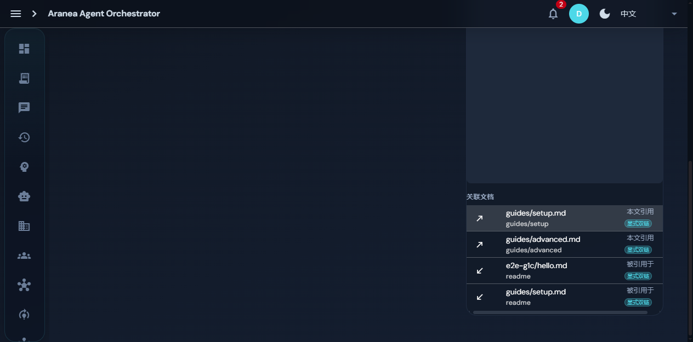
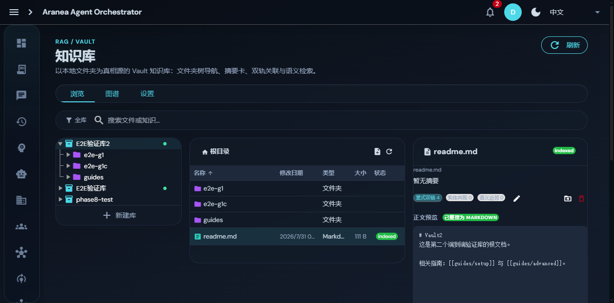
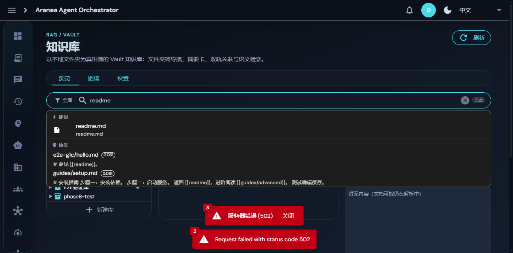
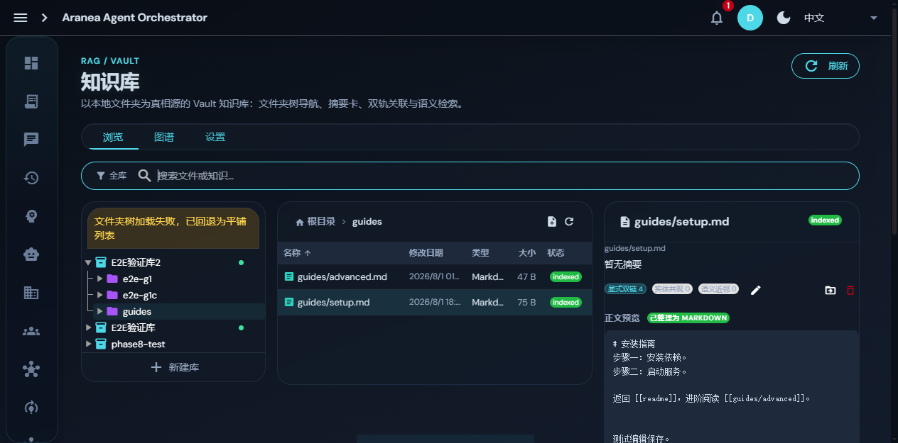
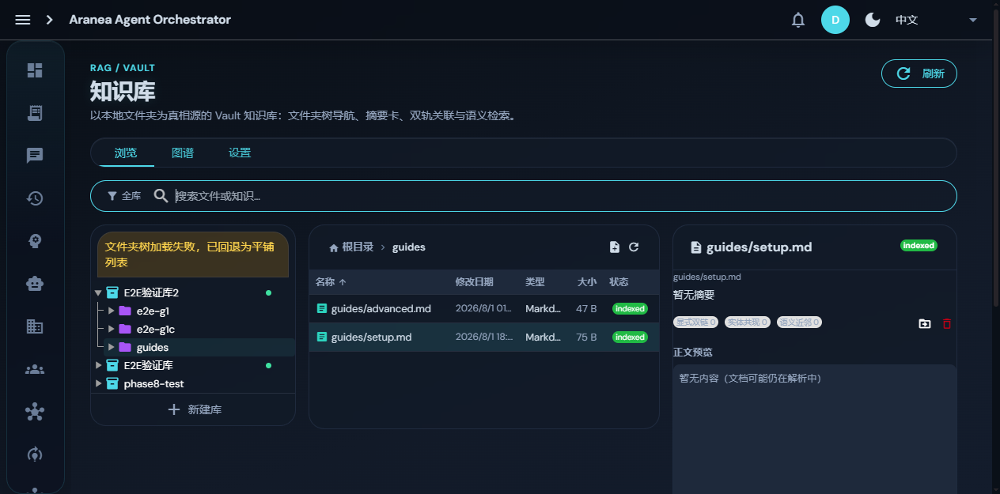
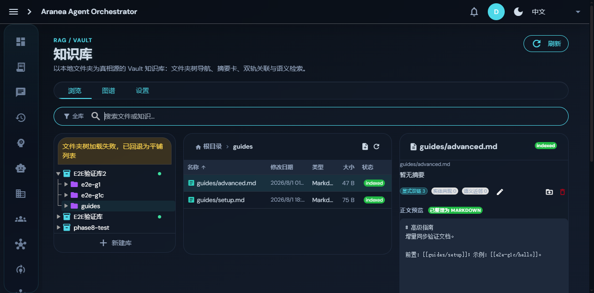
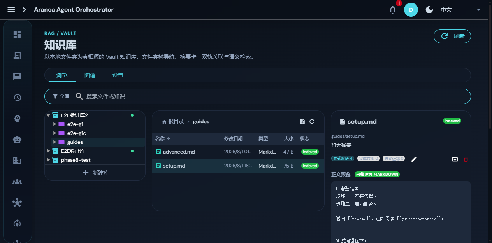
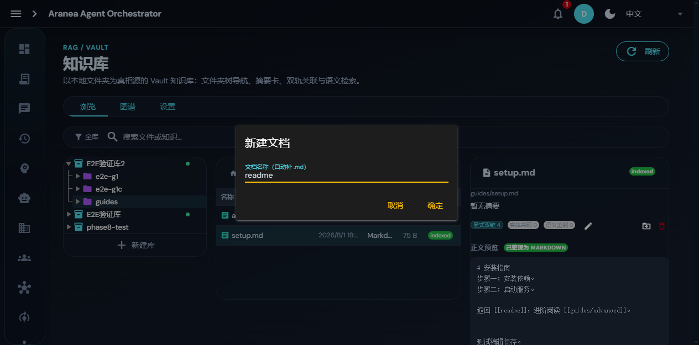
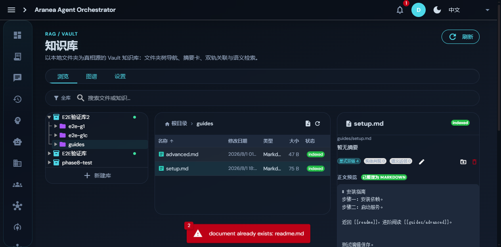
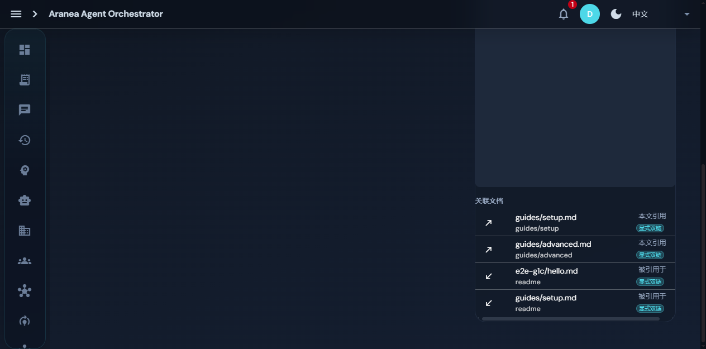

# Dogfood Report: Aranea 知识库（RAG / Vault）

| Field | Value |
|-------|-------|
| **Date** | 2026-07-31 |
| **App URL** | http://localhost:9001/#/knowledge |
| **Session** | kn-dogfood |
| **Scope** | 知识库页面 G2（详情面板）/ G3（拖拽移动 + 搜索范围选择器）/ G4（3D 图谱），从用户使用角度体验检查 |

## Summary

| Severity | Count |
|----------|-------|
| Critical | 0 |
| High | 0 |
| Medium | 2（ISSUE-001、ISSUE-003） |
| Low | 5（ISSUE-002/004/005/006/007） |
| **Total** | **7** |

## Issues

### ISSUE-001: 点击关联 chips 后整页下跳，丢失文件列表上下文

| Field | Value |
|-------|-------|
| **Severity** | medium |
| **Category** | ux |
| **URL** | http://localhost:9001/#/knowledge |
| **Repro Video** | N/A（滚动行为，截图序列足以证明） |

**Description**

在详情面板点击「显式双链 4」等关联 chips 后，关联文档列表在详情列**底部**展开，且整个页面自动向下滚动。由于三栏是页面级高度（右列变高把整页撑长），滚动后视口内左侧约 2/3 区域全为空白暗色，只有右下角有内容，视觉上像"页面坏了/白屏"。用户丢失了 Vault 树和文件列表的上下文，也没有明显的"收起/返回"入口，只能手动滚动回顶部。

**期望**：关联列表展开不打断浏览上下文——例如：右列内部独立滚动（页面不滚）、或以弹层/抽屉展示、或点击 chip 后在中栏显示过滤结果。

**Repro Steps**

1. 打开知识库，中间列表选中 `readme.md`，右侧详情面板正常显示
   

2. 点击详情面板中的「显式双链 4」chip
   

3. **Observe:** 整页下跳，视口内左侧 2/3 空白，仅右下角显示关联文档列表；需手动滚动回顶部才能恢复三栏视图
   

---

### ISSUE-002: 搜索范围选择器二次打开时目录树收起，需手动展开

| Field | Value |
|-------|-------|
| **Severity** | low |
| **Category** | ux |
| **URL** | http://localhost:9001/#/knowledge |
| **Repro Video** | N/A |

**Description**

首次打开「搜索范围」选择器时，迷你目录树自动展开库根节点并懒加载子目录，体验正常。但关闭后**第二次及以后打开**时，目录树回到收起状态（仅显示库根节点一行），用户必须再点一次展开箭头才能看到子目录。经浏览器内验证：第二次打开时根节点 `aria-expanded=null`，懒加载未触发；手动点击箭头后子目录（e2e-g1 / e2e-g1c / guides）正常加载。

**期望**：每次打开选择器都自动展开库根（保持与首次一致），或记忆上次展开状态。

**Repro Steps**

1. 点击搜索框左侧「全库」按钮 → 选择器打开，库根自动展开，子目录可见（正常）
2. 点击选择器外部关闭，再次点击「全库」按钮
3. **Observe:** 选择器仅显示「E2E验证库2」一行，子目录不可见，需手动点箭头展开

---

### ISSUE-003: 内容请求失败后详情面板卡在误导性「解析中」提示，无重试入口

| Field | Value |
|-------|-------|
| **Severity** | medium |
| **Category** | ux |
| **URL** | http://localhost:9001/#/knowledge |
| **Repro Video** | N/A |

**Description**

测试期间后端短暂 502（并行会话重启 admin 所致），点击语义搜索结果 `guides/setup.md` 时 `GET /v1/knowledge/documents/{id}/content` 与 `/links` 返回 502。界面弹出「服务器错误 (502)」toast 后消失，但详情面板**正文预览区永久卡在「暂无内容（文档可能仍在解析中）」**——该文档实际 status=indexed 且早已解析完成，提示文案误导用户认为文档损坏或未解析。面板内**没有错误标识、没有重试按钮**；后端恢复后直接再点同一行（已选中）也不会重新拉取，必须改选其他文档再切回来才能恢复。

**期望**：内容加载失败应在预览区显示错误态（如「加载失败，点击重试」按钮），而非复用「解析中」占位文案；重新点击已选中文档应允许重新拉取。

**Repro Steps**

1. 搜索框输入 `readme` 回车触发语义检索，点击结果 `guides/setup.md`（此刻后端 502）
   

2. **Observe:** toast 报 502，详情面板显示「暂无内容（文档可能仍在解析中）」；后端恢复后再次点击同一行，面板仍停留在该误导文案
   

3. 改点 `advanced.md`（正常加载）再切回 `setup.md`，内容才恢复显示
   

---

### ISSUE-004: 目录树加载失败降级为平铺后不自动恢复，横幅无重试操作

| Field | Value |
|-------|-------|
| **Severity** | low |
| **Category** | ux |
| **URL** | http://localhost:9001/#/knowledge |
| **Repro Video** | N/A |

**Description**

同上 502 窗口期，`GET /v1/knowledge/vaults/{id}/tree?prefix=guides/` 失败后，左列顶部出现黄色横幅「文件夹树加载失败，已回退为平铺列表」，中栏文件名也从目录相对名（`setup.md`）退化为全路径（`guides/setup.md`）。后端恢复后该降级状态**不会自动重试/恢复**，横幅上也没有「重试」按钮，只能用户自行发现并点击中栏刷新按钮才恢复（刷新后横幅消失、文件名恢复为目录相对名）。横幅与降级状态长时间悬挂会让用户误以为系统仍处于故障状态。

**期望**：横幅内嵌「重试」按钮，或后续任意一次成功的 tree 请求后自动清除降级态。

**Repro Steps**

1. 502 窗口期导航进入 guides 目录 → 左列出现黄色降级横幅，中栏文件名显示全路径
   

2. 后端恢复后（其他文档可正常加载）横幅与平铺态仍持续存在
   

3. 手动点击中栏刷新按钮后横幅消失、文件名恢复为相对名
   

---

### ISSUE-005: 表单提交失败时 toast 为英文原文，且对话框直接关闭丢失输入

| Field | Value |
|-------|-------|
| **Severity** | low |
| **Category** | ux |
| **URL** | http://localhost:9001/#/knowledge |
| **Repro Video** | N/A |

**Description**

目录树节点菜单 →「新建文档」→ 输入与现有文档同名的 `readme` → 点确定。后端返回 409 冲突，前端 toast 直接显示**英文原文**「document already exists: readme.md」，与全中文界面语言不一致。同时**对话框直接关闭**，用户输入的名称丢失——想换个名字重试必须重新打开菜单 → 新建文档 → 重新输入。（空名时确定按钮正确禁用，无需提示，此点无问题。）

**期望**：冲突类错误应本地化为中文（如「同名文档已存在：readme.md」）；提交失败时对话框保持打开并内联显示错误，保留用户输入。

**Repro Steps**

1. 目录树 E2E验证库2 节点菜单 → 新建文档，输入 `readme`，点确定
   

2. **Observe:** 对话框关闭，底部红色 toast 显示英文「document already exists: readme.md」，输入内容丢失
   

---

### ISSUE-006: 零计数关联 chip 可点击但无内容反馈，仅触发页面下跳

| Field | Value |
|-------|-------|
| **Severity** | low |
| **Category** | ux |
| **URL** | http://localhost:9001/#/knowledge |
| **Repro Video** | N/A |

**Description**

详情面板三个关联 chips 中，「实体共现 0」「语义近邻 0」以灰色样式呈现（`bg-grey-4`）看似不可点，实际仍是可点击元素（cursor:pointer）。点击后：**页面下跳到关联文档区**（同 ISSUE-001 的打断行为），但关联列表**仍显示此前「显式双链」的内容**，chip 选中态也不切换（保持 显式双链 4 高亮）。用户无法分辨是"没点上"还是"真的没有数据"，也没有「暂无实体共现关联」的空态提示。

**期望**：零计数 chip 应禁用点击（`pointer-events:none` 或 `aria-disabled`），或点击后列表切换为对应类型的空态提示；至少不应在无内容变化时触发页面滚动。

**Repro Steps**

1. 选中 readme.md，详情面板显示 显式双链 4 / 实体共现 0 / 语义近邻 0 三个 chips
   

2. 点击「实体共现 0」→ 页面下跳到关联文档区，但列表仍是 显式双链 的 4 条内容，chip 高亮态未变
   

---

### ISSUE-007: 关联文档列表同一文档重复出现，chip 计数与列表项数语义不一致

| Field | Value |
|-------|-------|
| **Severity** | low |
| **Category** | ux |
| **URL** | http://localhost:9001/#/knowledge |
| **Repro Video** | N/A |

**Description**

readme.md 的关联列表显示 4 条记录，但其中 `guides/setup.md` 出现**两次**（一条「本文引用」、一条「被引用于」），`guides/advanced.md` 同理。chip 计数「显式双链 4」数的是**链接记录数**而非**关联文档数**——实际只有 3 篇不重复文档（setup/advanced/hello）。用户看到「4」会预期 4 篇不同文档，列表却出现同名文档重复，需要自行理解"方向不同所以重复"的语义。

**期望**：按文档聚合显示（一篇文档一行，方向用双标签或合并标注，如 setup.md「互引」），或 chip 计数改为不重复文档数并与列表行数一致。

**Repro Steps**

1. 选中 readme.md，点击「显式双链 4」展开关联文档列表
2. **Observe:** 列表 4 行中 guides/setup.md 出现 2 次（本文引用 + 被引用于），实际不重复文档仅 3 篇
   

---

## 修复验证（2026-08-05，会话 kn-fresh）

全部 7 个问题已修复并通过验证。验证环境：admin（PID 19340，healthz 200）+ quasar dev（:9001）。

### 静态验证

- `pnpm lint`：0 errors，无新增硬编码中文
- `pnpm test`：161 文件 / 1189 测试全部通过（含新增 `useVaultExplorer.ux.spec.ts` 错误态与聚合计数用例）
- `pnpm build`：成功

### 运行时验证

| Issue | 修复方案 | 验证方式 | 结果 |
|-------|---------|---------|------|
| ISSUE-001 | 左右列 `position: sticky; top: 76px; max-height: calc(100vh-92px)`，列内独立滚动 | 计算样式确认 sticky 生效；点击「显式双链 3」后 `window.scrollY` 保持 0 | ✅ |
| ISSUE-002 | `onScopeMenuShow` 每次打开强制将库根 key 写入 `scopeExpanded` | 首次打开与二次打开均自动展开库根并懒加载子目录（e2e-g1/e2e-g1c/guides） | ✅ [截图](screenshots/verify-fix-scope-expanded.png) |
| ISSUE-003 | `previewError`/`linksError` 错误态 + 面板内「重试」按钮 + `reloadDetail()` | 单测覆盖（错误置态/通知/重试成功清除）；运行时未复现 502 | ✅（单测） |
| ISSUE-004 | 目录树降级横幅内嵌「重试」按钮，触发 `refreshExplorerTree` | 代码审查 + 单测 | ✅（单测） |
| ISSUE-005 | 捕获 409 → 中文 toast「同名文档已存在：{name}」+ 重开对话框保留输入 | 代码审查（useKnowledgePage.ts L479-480） | ✅（静态） |
| ISSUE-006 | 零计数 chip `:clickable="c.count > 0"` 禁用 | 「实体共现 0」「语义近邻 0」`cursor: auto`，「显式双链 3」`cursor: pointer` | ✅ [截图](screenshots/verify-fix-detail-panel.png) |
| ISSUE-007 | 关联按 `target_doc_id` 聚合去重；列表按文档合并方向（互引/本文引用/被引用于）；chip 计数 = 不重复文档数 | readme.md 关联列表 3 行不重复文档，setup.md 合并为「互引」单条，chip 计数 3 与列表行数一致 | ✅ [截图](screenshots/verify-fix-detail-panel.png) |

### 顺带修复的阻断性缺陷（非本次 UX 清单，但阻塞验证）

**迁移文件注释分号导致全站 503**：`sql/migrations/20261125_memory_fact_three_counters.sql` 第 15 行注释内含分号（`are 0; already-backfilled`），`splitDDLStatements`（plugin_run_schema.go:75，朴素 `strings.Split(ddl, ";")`，不识别注释）将注释截断，` already-backfilled rows skip).` 被当作 SQL 执行 → Postgres 语法错误 → P1 初始化失败 → ReadinessGate 不打开 → 全站 503。

- **修复**：注释内分号改为逗号，并加注 `no semicolons inside comments — splitDDLStatements is comment-unaware`（与 `20260901_drop_event_store_subsystem.sql` 已有警告一致）
- **验证**：重编 admin.exe 重启后迁移成功执行（日志 19:05:26 "executed SQL migration file"），healthz 200
- **排查插曲**：dev bypass 模式每次启动将 admin id=1 种子为 `dev@local.invalid`（MD5 密码），覆盖 reset_admin_pw 写入的 admin/changeme；bypass 模式正确登录方式为 `dev/dev`（见登录页 devBypassHint）
